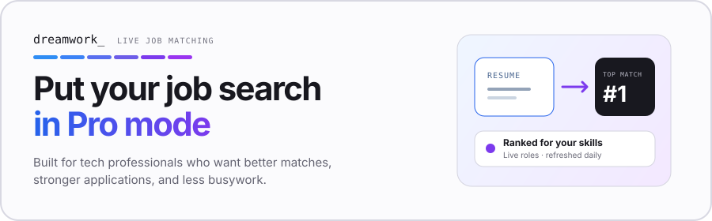

<a href="https://www.dreamworkhq.com/?utm_source=github&utm_medium=readme_cta&utm_campaign=gh-senior-swe">
  <picture>
    <source media="(prefers-color-scheme: dark)" srcset="./static/img/banner-dark.svg">
    <source media="(prefers-color-scheme: light)" srcset="./static/img/banner-light.svg">
    
  </picture>
</a>

<h1 align="center">Senior Software Engineer Jobs</h1>

Senior, staff, principal, and lead software engineering roles in the United States. No management, junior, new-grad, or internship listings.

  
  

  <a href="https://www.dreamworkhq.com/?utm_source=github&utm_medium=readme_cta&utm_campaign=gh-senior-swe">
    <picture>
      <source media="(prefers-color-scheme: dark)" srcset="./static/img/btn-matches-dark.svg">
      <source media="(prefers-color-scheme: light)" srcset="./static/img/btn-matches-light.svg">
      
    </picture>
  </a>

  <a href="https://www.dreamworkhq.com/?utm_source=github&utm_medium=link_row&utm_campaign=gh-senior-swe">dreamworkhq.com</a>
  ·
  <a href="https://www.dreamworkhq.com/blog?utm_source=github&utm_medium=link_row&utm_campaign=gh-senior-swe">Blog</a>
  ·
  <a href="https://www.dreamworkhq.com/research?utm_source=github&utm_medium=link_row&utm_campaign=gh-senior-swe">Hiring research</a>
  ·
  <a href="../../issues">Report a listing</a>

Star this repo and new roles land in your GitHub feed every day. Listings come from [Dreamwork](https://www.dreamworkhq.com/?utm_source=github&utm_medium=readme_cta&utm_campaign=gh-senior-swe), which crawls 400,000+ jobs directly from company career pages.

Last updated: **2026-07-25**. Showing the **600** most recently indexed roles, curated from **3,000+** open listings on Dreamwork. Salary shows when the posting discloses it. Click a role to see details and apply.

- [Senior](#senior-279) · 279 roles
- [Staff and lead](#staff-and-lead-213) · 213 roles
- [Principal](#principal-108) · 108 roles

<!-- TABLE_START (auto-generated: do not edit by hand; edits are overwritten daily) -->

### Senior (279)

| Company | Role | Location | Pay | Added |
| --- | --- | --- | --- | --- |
| **[SpaceX](https://www.dreamworkhq.com/c/spacex.com?utm_source=github&utm_campaign=gh-senior-swe)** | [Sr. Full Stack Engineer, Employee Experience](https://www.dreamworkhq.com/job/b7c43a11-3f64-4e86-8194-cc95316a47fe?utm_source=github&utm_campaign=gh-senior-swe) | Hawthorne, CA | $165K–$230K | 0d |
| **[Gemini](https://www.dreamworkhq.com/c/gemini.com?utm_source=github&utm_campaign=gh-senior-swe)** | [Senior Software Engineer, Tooling (Product)](https://www.dreamworkhq.com/job/40633ce4-3fe6-4c19-be5b-924295175e14?utm_source=github&utm_campaign=gh-senior-swe) | New York, New York (Hybrid) | $140K–$200K | 0d |
| **[Gemini](https://www.dreamworkhq.com/c/gemini.com?utm_source=github&utm_campaign=gh-senior-swe)** | [Senior Data Engineer](https://www.dreamworkhq.com/job/3f5e9c13-1e88-4ab2-9332-fa4a2c8ecbdd?utm_source=github&utm_campaign=gh-senior-swe) | Remote (New York, New York; Miami, Florida; Rem…) | $126K–$180K | 0d |
| **[xAI](https://www.dreamworkhq.com/c/x.ai?utm_source=github&utm_campaign=gh-senior-swe)** | [Software Engineer - Platform Infrastructure (Rust, C++)](https://www.dreamworkhq.com/job/656e1c7a-351c-474c-a1a1-8a75bd8f79b6?utm_source=github&utm_campaign=gh-senior-swe) | Palo Alto, CA | $180K–$440K | 0d |
| **[Tulip](https://www.dreamworkhq.com/c/tulip.co?utm_source=github&utm_campaign=gh-senior-swe)** | [Senior Site Reliability Engineer](https://www.dreamworkhq.com/job/c2aab549-c949-4647-9989-d93ef457bc45?utm_source=github&utm_campaign=gh-senior-swe) | Somerville, MA (Hybrid) | $160K–$200K | 0d |
| **[xAI](https://www.dreamworkhq.com/c/x.ai?utm_source=github&utm_campaign=gh-senior-swe)** | [ML Infrastructure Engineer](https://www.dreamworkhq.com/job/dab325d9-1315-4ea3-b998-c445a0c6d546?utm_source=github&utm_campaign=gh-senior-swe) | Palo Alto, California, United States | $180K–$440K | 0d |
| **[Tulip](https://www.dreamworkhq.com/c/tulip.co?utm_source=github&utm_campaign=gh-senior-swe)** | [Lead DevOps Engineer](https://www.dreamworkhq.com/job/38f28e32-1a9b-48f7-81a5-7cb189332fd0?utm_source=github&utm_campaign=gh-senior-swe) | Somerville, MA (Hybrid) | $150K–$190K | 0d |
| **[Hadrian](https://www.dreamworkhq.com/c/hadrian.co?utm_source=github&utm_campaign=gh-senior-swe)** | [Machine Learning Engineer - Vision](https://www.dreamworkhq.com/job/6f2a5b09-63e5-43ec-9733-d91ffb66c226?utm_source=github&utm_campaign=gh-senior-swe) | Los Angeles, CA | $160K–$250K | 0d |
| **[Hadrian](https://www.dreamworkhq.com/c/hadrian.co?utm_source=github&utm_campaign=gh-senior-swe)** | [Machine Learning Engineer - Multimodal](https://www.dreamworkhq.com/job/e3a6dacb-1da6-4a0b-9db7-61a1b44ca805?utm_source=github&utm_campaign=gh-senior-swe) | Los Angeles, CA | $160K–$250K | 0d |
| **[Hadrian](https://www.dreamworkhq.com/c/hadrian.co?utm_source=github&utm_campaign=gh-senior-swe)** | [Machine Learning Engineer - LLMs](https://www.dreamworkhq.com/job/2199c8b5-0514-4b55-b023-2eb93ca58cf5?utm_source=github&utm_campaign=gh-senior-swe) | Los Angeles, CA | $160K–$250K | 0d |
| **[Loft Orbital](https://www.dreamworkhq.com/c/loftorbital.com?utm_source=github&utm_campaign=gh-senior-swe)** | [Site Reliability Engineer (Network)](https://www.dreamworkhq.com/job/a1e5b455-c6fd-44e3-a3a3-20b510ed8c47?utm_source=github&utm_campaign=gh-senior-swe) | San Francisco, CA (Hybrid) | $157K–$239K | 0d |
| **[FanDuel](https://www.dreamworkhq.com/c/fanduel.com?utm_source=github&utm_campaign=gh-senior-swe)** | [Senior Data Engineer](https://www.dreamworkhq.com/job/8b812019-f8a7-4492-9e6b-085b7a4a0212?utm_source=github&utm_campaign=gh-senior-swe) | Atlanta, Georgia, United States (Hybrid) | $138K–$182K | 0d |
| **[FanDuel](https://www.dreamworkhq.com/c/fanduel.com?utm_source=github&utm_campaign=gh-senior-swe)** | [Senior Data Engineer](https://www.dreamworkhq.com/job/d22afbe6-cf09-4041-8ddf-add0c6a98de1?utm_source=github&utm_campaign=gh-senior-swe) | New York City (Hybrid) | $138K–$182K | 0d |
| **[Ensco](https://www.dreamworkhq.com/c/ensco.com?utm_source=github&utm_campaign=gh-senior-swe)** | [Software Engineer III](https://www.dreamworkhq.com/job/b78a174f-0d2f-4385-b6a4-e0c8b91c2d97?utm_source=github&utm_campaign=gh-senior-swe) | Endicott, New York, United States | $74K–$110K | 0d |
| **[Roblox](https://www.dreamworkhq.com/c/roblox.com?utm_source=github&utm_campaign=gh-senior-swe)** | [Senior Software Engineer, Machine Learning (Communication Safety)](https://www.dreamworkhq.com/job/3f998c9b-bf79-4224-944b-edf8276fece3?utm_source=github&utm_campaign=gh-senior-swe) | San Mateo, CA, United States | $260K–$313K | 0d |
| **[Cotality](https://www.dreamworkhq.com/c/cotality.com?utm_source=github&utm_campaign=gh-senior-swe)** | [Senior Software Engineer](https://www.dreamworkhq.com/job/71528c0f-fca0-498e-9f04-52eaeab13096?utm_source=github&utm_campaign=gh-senior-swe) | Dallas, TX (Hybrid) | $112K–$165K | 0d |
| **[Cotality](https://www.dreamworkhq.com/c/cotality.com?utm_source=github&utm_campaign=gh-senior-swe)** | [Senior Professional Software Engineer (Python)](https://www.dreamworkhq.com/job/5a351fa7-bc88-47a1-9728-4d5de0621ee6?utm_source=github&utm_campaign=gh-senior-swe) | Irvine, CA (Hybrid) | $129K–$165K | 0d |
| **[Provectus](https://www.dreamworkhq.com/c/provectus.ai?utm_source=github&utm_campaign=gh-senior-swe)** | [Senior Forward Deployed AI Engineer (GenAI, AWS)](https://www.dreamworkhq.com/job/b1db23a5-9d65-49a3-aa05-144cb770337b?utm_source=github&utm_campaign=gh-senior-swe) | New Jersey (Hybrid) |  | 0d |
| **[DigitalOcean](https://www.dreamworkhq.com/c/digitalocean.com?utm_source=github&utm_campaign=gh-senior-swe)** | [Senior Software Engineer I - AI Inference Data Plane](https://www.dreamworkhq.com/job/709528bb-4af0-4ab6-9cb1-edfe2af682a8?utm_source=github&utm_campaign=gh-senior-swe) | Remote (San Francisco) | $139K–$174K | 0d |
| **[DigitalOcean](https://www.dreamworkhq.com/c/digitalocean.com?utm_source=github&utm_campaign=gh-senior-swe)** | [Senior Software Engineer I - AI Inference Data Plane](https://www.dreamworkhq.com/job/f8923c7c-b833-4eb0-b2bd-3db3d2caa1b8?utm_source=github&utm_campaign=gh-senior-swe) | Remote (Austin) | $139K–$174K | 0d |
| **[Vistra](https://www.dreamworkhq.com/c/vistracorp.com?utm_source=github&utm_campaign=gh-senior-swe)** | [Lead Data Engineer](https://www.dreamworkhq.com/job/06223fda-e8c7-42ff-ada3-8d8ace7f5542?utm_source=github&utm_campaign=gh-senior-swe) | Irving, Texas |  | 0d |
| **[Tbkbank](https://www.dreamworkhq.com/c/tbkbank.com?utm_source=github&utm_campaign=gh-senior-swe)** | [Senior DevOps Engineer - AWS, Kubernetes, Cloud Infra - Intelligence - …](https://www.dreamworkhq.com/job/2d298bdd-e38b-4acd-b4f7-dbff4a243ada?utm_source=github&utm_campaign=gh-senior-swe) | Remote (Remote - United States) | $151K–$234K | 0d |
| **[Tbkbank](https://www.dreamworkhq.com/c/tbkbank.com?utm_source=github&utm_campaign=gh-senior-swe)** | [Senior DevOps Engineer - DATA specialty AND MSSQL Server Admin Migratio…](https://www.dreamworkhq.com/job/ce46c3eb-b534-46d9-99f4-5eb5bf2f3dbe?utm_source=github&utm_campaign=gh-senior-swe) | Remote (Remote - United States) | $151K–$234K | 0d |
| **[Cognex](https://www.dreamworkhq.com/c/cognex.com?utm_source=github&utm_campaign=gh-senior-swe)** | [Senior Software Engineer (Full Stack)](https://www.dreamworkhq.com/job/57ee2c06-f015-44de-bbef-d93111ab6bb6?utm_source=github&utm_campaign=gh-senior-swe) | Natick, Massachusetts (Hybrid) | $130K–$170K | 0d |
| **[Cognex](https://www.dreamworkhq.com/c/cognex.com?utm_source=github&utm_campaign=gh-senior-swe)** | [Senior Frontend Software Engineer (Full Stack Exposure)](https://www.dreamworkhq.com/job/c8873d17-e484-410f-8662-e76916ea0d23?utm_source=github&utm_campaign=gh-senior-swe) | Natick, Massachusetts (Hybrid) | $130K–$180K | 0d |
| **[Cognex](https://www.dreamworkhq.com/c/cognex.com?utm_source=github&utm_campaign=gh-senior-swe)** | [Senior Machine Learning Engineer](https://www.dreamworkhq.com/job/3c783a18-4d03-4eb3-b293-8f32d4446617?utm_source=github&utm_campaign=gh-senior-swe) | Natick, Massachusetts (Hybrid) | $115K–$225K | 0d |
| **[Grifin](https://www.dreamworkhq.com/c/grifin.com?utm_source=github&utm_campaign=gh-senior-swe)** | [Senior Software Engineer](https://www.dreamworkhq.com/job/ca532176-92f9-4246-9c77-898194611ef7?utm_source=github&utm_campaign=gh-senior-swe) | Remote (Remote (United States)) |  | 0d |
| **[Linus Health](https://www.dreamworkhq.com/c/linushealth.com?utm_source=github&utm_campaign=gh-senior-swe)** | [Senior Full Stack Engineer(React, Node.JS)](https://www.dreamworkhq.com/job/1a2658fd-2594-4995-8dc5-35c4ee6d9d52?utm_source=github&utm_campaign=gh-senior-swe) | Remote (Remote (Boston, MA, US)) | $155K–$175K | 0d |
| **[Freedomconsulting](https://www.dreamworkhq.com/c/freedomtech.com?utm_source=github&utm_campaign=gh-senior-swe)** | [SQL Software Developer 736](https://www.dreamworkhq.com/job/b00253cb-21c8-477e-89d7-f7fd7b454244?utm_source=github&utm_campaign=gh-senior-swe) | Annapolis Junction, MD | $260K–$265K | 0d |
| **[Freedomconsulting](https://www.dreamworkhq.com/c/freedomtech.com?utm_source=github&utm_campaign=gh-senior-swe)** | [Full Stack Software Developer 735](https://www.dreamworkhq.com/job/c6303841-6af6-45f3-b80b-73e67ddeabbc?utm_source=github&utm_campaign=gh-senior-swe) | Annapolis Junction, MD | $200K–$265K | 0d |
| **[Metron](https://www.dreamworkhq.com/c/metron.net?utm_source=github&utm_campaign=gh-senior-swe)** | [Autonomous Systems Software Engineer](https://www.dreamworkhq.com/job/f4923fe0-8578-45e3-a8d6-97491ff766f5?utm_source=github&utm_campaign=gh-senior-swe) | Reston, VA |  | 0d |
| **[Asana](https://www.dreamworkhq.com/c/asana.com?utm_source=github&utm_campaign=gh-senior-swe)** | [Software Engineer, AI Developer Experience](https://www.dreamworkhq.com/job/426d5bb6-2f45-4cdb-ae72-eb7b7bd387bf?utm_source=github&utm_campaign=gh-senior-swe) | New York City (Hybrid) | $171K–$190K | 0d |
| **[Jensenhughes](https://www.dreamworkhq.com/c/jensenhughes.com?utm_source=github&utm_campaign=gh-senior-swe)** | [Senior Microsoft Platform Engineer](https://www.dreamworkhq.com/job/2ca12136-a6f0-4985-9ec1-b328ba51e07b?utm_source=github&utm_campaign=gh-senior-swe) | Remote (Remote - United States) | $126K–$140K | 0d |
| **[Nordson](https://www.dreamworkhq.com/c/nordson.com?utm_source=github&utm_campaign=gh-senior-swe)** | [Senior Software Engineer](https://www.dreamworkhq.com/job/a1dd7980-f1f2-4c21-9b53-ab308af86ac0?utm_source=github&utm_campaign=gh-senior-swe) | USA - California - Carlsbad | $130K–$180K | 0d |
| **[Northstrat](https://www.dreamworkhq.com/c/northstrat.com?utm_source=github&utm_campaign=gh-senior-swe)** | [Frontend Software Engineer](https://www.dreamworkhq.com/job/49fceaf9-a9e8-4c57-9a38-1d5c54b02798?utm_source=github&utm_campaign=gh-senior-swe) | Columbia, Maryland, United States (Hybrid) |  | 0d |
| **[Northstrat](https://www.dreamworkhq.com/c/northstrat.com?utm_source=github&utm_campaign=gh-senior-swe)** | [Frontend Software Engineer](https://www.dreamworkhq.com/job/6e1de748-ba74-4c12-b59d-e45f6f65a95f?utm_source=github&utm_campaign=gh-senior-swe) | San Antonio, Texas, United States (Hybrid) |  | 0d |
| **[Bloomerang](https://www.dreamworkhq.com/c/bloomerang.com?utm_source=github&utm_campaign=gh-senior-swe)** | [Sr. Software Engineer (Platform + AI)](https://www.dreamworkhq.com/job/bf513f35-f875-4b26-988b-88dbd4808488?utm_source=github&utm_campaign=gh-senior-swe) | Remote (Remote, US) | $115K–$191K | 0d |
| **[Benchling](https://www.dreamworkhq.com/c/benchling.com?utm_source=github&utm_campaign=gh-senior-swe)** | [Software Engineer, Backend (Release Engineering)](https://www.dreamworkhq.com/job/80d5a2b5-b165-4d23-911f-56fdead1e7a7?utm_source=github&utm_campaign=gh-senior-swe) | San Francisco, CA (Hybrid) | $148K–$200K | 0d |
| **[Extreme Networks](https://www.dreamworkhq.com/c/extremenetworks.com?utm_source=github&utm_campaign=gh-senior-swe)** | [Senior Machine Learning Engineer (10187)](https://www.dreamworkhq.com/job/5a4c9dd6-855e-450e-b7e9-3842fa0f0b7c?utm_source=github&utm_campaign=gh-senior-swe) | Washington, United States | $170K | 0d |
| **[AgentSync](https://www.dreamworkhq.com/c/agentsync.com.au?utm_source=github&utm_campaign=gh-senior-swe)** | [Senior Frontend Engineer](https://www.dreamworkhq.com/job/1f03baaf-2830-4579-8c30-841e2356a97f?utm_source=github&utm_campaign=gh-senior-swe) | Denver, CO (Hybrid) | $160K–$185K | 0d |
| **[Centric Software](https://www.dreamworkhq.com/c/centrictechnology.com?utm_source=github&utm_campaign=gh-senior-swe)** | [Senior Software Engineer](https://www.dreamworkhq.com/job/e688a8b8-1dae-412a-adca-62d60de8ed6b?utm_source=github&utm_campaign=gh-senior-swe) | Remote (Campbell, CA) | $125K–$160K | 0d |
| **[Kunai](https://www.dreamworkhq.com/c/kunai.com?utm_source=github&utm_campaign=gh-senior-swe)** | [Senior SDET (Software Development Engineer in Test)](https://www.dreamworkhq.com/job/947c27f4-102b-4093-ae21-0b7f316c1aa3?utm_source=github&utm_campaign=gh-senior-swe) | Remote (Remote - United States) |  | 0d |
| **[AMD](https://www.dreamworkhq.com/c/amd.com?utm_source=github&utm_campaign=gh-senior-swe)** | [AI Research Infrastructure Engineer](https://www.dreamworkhq.com/job/a1306adb-bd8e-413e-9122-dc4f5bab2811?utm_source=github&utm_campaign=gh-senior-swe) | Austin, Texas, United States |  | 0d |
| **[AMD](https://www.dreamworkhq.com/c/amd.com?utm_source=github&utm_campaign=gh-senior-swe)** | [System Design Engineer - AI Cluster Software Engineer](https://www.dreamworkhq.com/job/089859c1-7da9-4832-9dcb-ef52aefb9262?utm_source=github&utm_campaign=gh-senior-swe) | Santa Clara, California, United States (Hybrid) |  | 0d |
| **[Fa Essf Saasfaprod1](https://www.dreamworkhq.com/c/brkenergy.com?utm_source=github&utm_campaign=gh-senior-swe)** | [Software Engineer 3/Sr Software Engineer](https://www.dreamworkhq.com/job/b940a87f-acb1-41d6-9acd-02bd2f8142cf?utm_source=github&utm_campaign=gh-senior-swe) | Des Moines, IA, United States | $102K–$137K | 0d |
| **[G2i](https://www.dreamworkhq.com/c/g2i.co?utm_source=github&utm_campaign=gh-senior-swe)** | [Senior Data Engineer](https://www.dreamworkhq.com/job/c2bf3ddf-9a3c-48bf-b772-d166de2e6f8a?utm_source=github&utm_campaign=gh-senior-swe) | Remote (USA) |  | 0d |
| **[Checkr](https://www.dreamworkhq.com/c/checkr.com?utm_source=github&utm_campaign=gh-senior-swe)** | [Senior Software Engineer (Python), Mortgage](https://www.dreamworkhq.com/job/e1cc4cd6-b2a9-42b6-8f85-df0cc6d434ae?utm_source=github&utm_campaign=gh-senior-swe) | San Francisco, California, United States | $185K–$218K | 0d |
| **[Broadcom](https://www.dreamworkhq.com/c/broadcom.com?utm_source=github&utm_campaign=gh-senior-swe)** | [R&D Software Engineer](https://www.dreamworkhq.com/job/32b9b046-e8db-47a8-abd9-ffcfca98e17e?utm_source=github&utm_campaign=gh-senior-swe) | USA-CA - Promontory B (Hybrid) | $122K–$195K | 0d |
| **[HPE](https://www.dreamworkhq.com/c/hpe.com?utm_source=github&utm_campaign=gh-senior-swe)** | [SAP Developer/Engineer](https://www.dreamworkhq.com/job/39e37e98-66b8-4b67-84bb-5569e53efef4?utm_source=github&utm_campaign=gh-senior-swe) | Spring, Texas, United States of America | $106K–$243K | 0d |
| **[Kemper](https://www.dreamworkhq.com/c/kemper-amps.com?utm_source=github&utm_campaign=gh-senior-swe)** | [Senior Data Engineer](https://www.dreamworkhq.com/job/208d118a-330e-4048-996f-68e92dc6b77c?utm_source=github&utm_campaign=gh-senior-swe) | Chicago, Illinois (Hybrid) | $99K–$165K | 0d |
| **[Skydio](https://www.dreamworkhq.com/c/skydio.com?utm_source=github&utm_campaign=gh-senior-swe)** | [Senior Software Engineer, Streaming](https://www.dreamworkhq.com/job/bb464be5-a0f0-42b3-b9d4-232ce562c5d5?utm_source=github&utm_campaign=gh-senior-swe) | San Mateo, California, United States (Hybrid) | $200K–$240K | 0d |
| **[Grvty](https://www.dreamworkhq.com/c/grvty.com?utm_source=github&utm_campaign=gh-senior-swe)** | [Senior Software Engineer](https://www.dreamworkhq.com/job/a16c452b-46ae-473b-ae8f-8a2e47aa33d3?utm_source=github&utm_campaign=gh-senior-swe) | Remote (Chantilly, Virginia, United States) | $200K–$270K | 0d |
| **[Grvty](https://www.dreamworkhq.com/c/grvty.com?utm_source=github&utm_campaign=gh-senior-swe)** | [Software Engineer](https://www.dreamworkhq.com/job/54e56800-252f-43fe-8097-790838195a41?utm_source=github&utm_campaign=gh-senior-swe) | Remote (Chantilly, Virginia, United States) | $175K–$270K | 0d |
| **[Oura](https://www.dreamworkhq.com/c/ouraring.com?utm_source=github&utm_campaign=gh-senior-swe)** | [Senior Data Engineer - Finance](https://www.dreamworkhq.com/job/7cecba20-054d-4649-9762-4f442a3809ca?utm_source=github&utm_campaign=gh-senior-swe) | Hybrid - San Francisco, California (Hybrid) | $173K–$203K | 0d |
| **[Perficient](https://www.dreamworkhq.com/c/perficient.com?utm_source=github&utm_campaign=gh-senior-swe)** | [Senior AI Ops & Incident/Site Reliability Engineer](https://www.dreamworkhq.com/job/ee5d3b55-6faa-4a6d-afbf-a3010ade73af?utm_source=github&utm_campaign=gh-senior-swe) | AUSTIN, TX, United States (Hybrid) | $94K–$171K | 0d |
| **[Perficient](https://www.dreamworkhq.com/c/perficient.com?utm_source=github&utm_campaign=gh-senior-swe)** | [Senior AI Ops & Incident/Site Reliability Engineer](https://www.dreamworkhq.com/job/d7622995-1b1a-4ec6-a56f-ce707b5a78d0?utm_source=github&utm_campaign=gh-senior-swe) | BOSTON, MA, United States (Hybrid) | $94K–$171K | 0d |
| **[Torcrobotics](https://www.dreamworkhq.com/c/torc.ai?utm_source=github&utm_campaign=gh-senior-swe)** | [Senior, Machine Learning Engineer - 3D Perception](https://www.dreamworkhq.com/job/74ee274d-0bdc-4923-9b42-267e22e280e7?utm_source=github&utm_campaign=gh-senior-swe) | Remote (Remote, U.S, Ann Arbor, MI, Fort Worth,…) | $177K–$213K | 0d |
| **[Match Group](https://www.dreamworkhq.com/c/mtch.com?utm_source=github&utm_campaign=gh-senior-swe)** | [Software Engineer III](https://www.dreamworkhq.com/job/75ffb76a-c3c0-41e7-b924-f48fd6402953?utm_source=github&utm_campaign=gh-senior-swe) | Dallas, Texas (Hybrid) | $100K–$120K | 0d |
| **[Match Group](https://www.dreamworkhq.com/c/mtch.com?utm_source=github&utm_campaign=gh-senior-swe)** | [Sr. Software Engineer, MarTech](https://www.dreamworkhq.com/job/7635d060-1107-49c4-b13a-84bce8dd52ba?utm_source=github&utm_campaign=gh-senior-swe) | Palo Alto, California (Hybrid) | $180K–$215K | 0d |
| **[Veralto](https://www.dreamworkhq.com/c/veralto.com?utm_source=github&utm_campaign=gh-senior-swe)** | [Embedded Software Engineer III (onsite Loveland, Colorado)](https://www.dreamworkhq.com/job/6e9e4f4a-3431-4b35-81fc-5273ab0660a4?utm_source=github&utm_campaign=gh-senior-swe) | Loveland, Colorado, United States | $126K–$143K | 0d |
| **[EVERSANA1](https://www.dreamworkhq.com/c/eversana.com?utm_source=github&utm_campaign=gh-senior-swe)** | [Sr. Full Stack Engineer - Waltz Health](https://www.dreamworkhq.com/job/7e3b1d49-2600-4498-9755-386c91af969c?utm_source=github&utm_campaign=gh-senior-swe) | Chicago, IL, United States (Hybrid) | $120K–$150K | 0d |
| **[DocuSign](https://www.dreamworkhq.com/c/docusign.com?utm_source=github&utm_campaign=gh-senior-swe)** | [Senior Software Engineer](https://www.dreamworkhq.com/job/46eb8424-e278-4a63-a7a4-c8edd1ba113d?utm_source=github&utm_campaign=gh-senior-swe) | San Francisco, California, United States (Hybrid) | $165K–$266K | 0d |
| **[Beaconai](https://www.dreamworkhq.com/c/beaconai.com?utm_source=github&utm_campaign=gh-senior-swe)** | [Lead Software Engineer, Frontend/Web App](https://www.dreamworkhq.com/job/711ec9c8-f082-41be-a80e-59ed29251edd?utm_source=github&utm_campaign=gh-senior-swe) | San Carlos - Hybrid (Hybrid) | $185K–$260K | 0d |
| **[Applied](https://www.dreamworkhq.com/c/applied.co?utm_source=github&utm_campaign=gh-senior-swe)** | [Senior Software Engineer - Maps Infrastructure](https://www.dreamworkhq.com/job/4b0f89bf-f226-455a-99c6-7ffd1eb246f4?utm_source=github&utm_campaign=gh-senior-swe) | Sunnyvale | $153K–$222K | 0d |
| **[Applied](https://www.dreamworkhq.com/c/applied.co?utm_source=github&utm_campaign=gh-senior-swe)** | [Senior Software Engineer](https://www.dreamworkhq.com/job/aefe7226-621a-4784-abff-916a210060df?utm_source=github&utm_campaign=gh-senior-swe) | Sunnyvale | $153K–$222K | 0d |
| **[DocuSign](https://www.dreamworkhq.com/c/docusign.com?utm_source=github&utm_campaign=gh-senior-swe)** | [Senior Software Engineer](https://www.dreamworkhq.com/job/3220d084-29f0-41dd-9cf5-8fb5a94172fb?utm_source=github&utm_campaign=gh-senior-swe) | San Francisco, CA, US (Hybrid) | $165K–$266K | 0d |
| **[Fuseenergy](https://www.dreamworkhq.com/c/fuseenergy.com?utm_source=github&utm_campaign=gh-senior-swe)** | [Embedded Software Engineer (Remote)](https://www.dreamworkhq.com/job/063b32d1-1885-4863-9c5c-014cf7c59a73?utm_source=github&utm_campaign=gh-senior-swe) | Remote (United States) |  | 0d |
| **[ZoomInfo](https://www.dreamworkhq.com/c/zoominfo.com?utm_source=github&utm_campaign=gh-senior-swe)** | [Senior Software Engineer - Chorus](https://www.dreamworkhq.com/job/d0a5a587-d06b-45a2-b811-3487743d5984?utm_source=github&utm_campaign=gh-senior-swe) | Bethesda, Maryland, United States; Vancouve… (Hybrid) | $140K–$220K | 0d |
| **[Dish Network](https://www.dreamworkhq.com/c/dish.com?utm_source=github&utm_campaign=gh-senior-swe)** | [Senior Engineer-Software Quality](https://www.dreamworkhq.com/job/63ef0e06-2a74-44ae-9f7a-1c2dfd7b7428?utm_source=github&utm_campaign=gh-senior-swe) | Englewood, Colorado, United States | $144K | 0d |
| **[Dish Network](https://www.dreamworkhq.com/c/dish.com?utm_source=github&utm_campaign=gh-senior-swe)** | [Senior Agentic AI Engineer](https://www.dreamworkhq.com/job/9216bcab-30f1-46a0-aabc-d7aa248c820c?utm_source=github&utm_campaign=gh-senior-swe) | San Mateo, California, United States (Hybrid) | $134K–$182K | 0d |
| **Workday** | [Analytics Sr Software Engineer (US Federal)](https://www.dreamworkhq.com/job/3babbd8a-cd96-4084-8b24-1eb23a747264?utm_source=github&utm_campaign=gh-senior-swe) | USA.VA.Reston | $152K–$227K | 0d |
| **[Northrop Grumman](https://www.dreamworkhq.com/c/northropgrumman.com?utm_source=github&utm_campaign=gh-senior-swe)** | [Software Engineer/Principal Software Engineer – DevSecOps](https://www.dreamworkhq.com/job/61a812c0-45e6-45e4-b680-68dc381e73ae?utm_source=github&utm_campaign=gh-senior-swe) | United States-California-San Diego (Hybrid) | $92K–$171K | 0d |
| **[Gdit](https://www.dreamworkhq.com/c/gdit.com?utm_source=github&utm_campaign=gh-senior-swe)** | [Power Platform Developer & Task Lead](https://www.dreamworkhq.com/job/051ac113-94c6-4cb0-b0a7-5fb6a1a23afb?utm_source=github&utm_campaign=gh-senior-swe) | USA FL MacDill AFB | $111K–$150K | 0d |
| **[Gdit](https://www.dreamworkhq.com/c/gdit.com?utm_source=github&utm_campaign=gh-senior-swe)** | [ServiceNow Developer - TS/SCI with Polygraph](https://www.dreamworkhq.com/job/c977fba5-c2b9-4972-973d-e4d512f7e7f8?utm_source=github&utm_campaign=gh-senior-swe) | USA VA Chantilly | $196K–$265K | 0d |
| **[Gdit](https://www.dreamworkhq.com/c/gdit.com?utm_source=github&utm_campaign=gh-senior-swe)** | [Software Integration Engineer 2](https://www.dreamworkhq.com/job/f2fa6c0f-5375-4c66-b6a7-931a3107e825?utm_source=github&utm_campaign=gh-senior-swe) | USA MD Annapolis Junction | $151K–$205K | 0d |
| **[Gdit](https://www.dreamworkhq.com/c/gdit.com?utm_source=github&utm_campaign=gh-senior-swe)** | [AI Engineer - ICAM](https://www.dreamworkhq.com/job/a43eb70b-25be-45c6-9a53-41a72d54c3ea?utm_source=github&utm_campaign=gh-senior-swe) | Remote (Any Location / Remote) | $146K–$198K | 0d |
| **[Booz Allen Hamilton](https://www.dreamworkhq.com/c/boozallen.com?utm_source=github&utm_campaign=gh-senior-swe)** | [DevOps Engineer, Senior](https://www.dreamworkhq.com/job/bcfe3267-2347-4e8c-aca9-8fbc28ee0946?utm_source=github&utm_campaign=gh-senior-swe) | Chantilly, VA (Hybrid) | $78K–$176K | 0d |
| **[CACI](https://www.dreamworkhq.com/c/caci.com?utm_source=github&utm_campaign=gh-senior-swe)** | [Software Developer – Full-Stack / Systems Integration](https://www.dreamworkhq.com/job/eb612cdc-cdcc-4869-9f06-cea6406c40da?utm_source=github&utm_campaign=gh-senior-swe) | Fairfax, VA, US | $113K–$238K | 0d |
| **[Motorola Solutions](https://www.dreamworkhq.com/c/motorolasolutions.com?utm_source=github&utm_campaign=gh-senior-swe)** | [Senior Embedded Software Engineer](https://www.dreamworkhq.com/job/7dada8da-4bad-4766-90eb-7493ffad6064?utm_source=github&utm_campaign=gh-senior-swe) | Melville, NY (Hybrid) | $130K–$160K | 0d |
| **[Hellofresh](https://www.dreamworkhq.com/c/hellofresh.com?utm_source=github&utm_campaign=gh-senior-swe)** | [Senior Infrastructure Engineer \[INTELLIGENT PLATFORMS\]](https://www.dreamworkhq.com/job/3137d210-27a0-48e3-b944-fdb4266ebfe1?utm_source=github&utm_campaign=gh-senior-swe) | Irving, TX, United States; Newark, NJ, Unit… (Hybrid) | $120K–$130K | 0d |
| **[Blue Origin](https://www.dreamworkhq.com/c/blueorigin.com?utm_source=github&utm_campaign=gh-senior-swe)** | [Senior Wireless Software Engineer - MAC Layer - TeraWave](https://www.dreamworkhq.com/job/bbe3f0e0-e1ea-4022-8bba-d94bfaffc0bb?utm_source=github&utm_campaign=gh-senior-swe) | Greater Seattle Area | $249K–$348K | 0d |
| **[General Motors](https://www.dreamworkhq.com/c/generalmotors.com?utm_source=github&utm_campaign=gh-senior-swe)** | [Software Scrum Lead - Transmission](https://www.dreamworkhq.com/job/40b2ea07-89cb-4381-93e5-f930b34aa110?utm_source=github&utm_campaign=gh-senior-swe) | Milford, Michigan, United States of America (Hybrid) |  | 0d |
| **[General Motors](https://www.dreamworkhq.com/c/generalmotors.com?utm_source=github&utm_campaign=gh-senior-swe)** | [Sr. Infrastructure System Quality Assurance Engineer](https://www.dreamworkhq.com/job/3f470afb-a470-4921-97e6-ca8001a9121a?utm_source=github&utm_campaign=gh-senior-swe) | Milford, Michigan, United States of America (Hybrid) |  | 0d |
| **[General Motors](https://www.dreamworkhq.com/c/generalmotors.com?utm_source=github&utm_campaign=gh-senior-swe)** | [Senior Software Engineer](https://www.dreamworkhq.com/job/a6424b7a-e46a-4d31-8307-f7cef324a89e?utm_source=github&utm_campaign=gh-senior-swe) | Mountain View, California, United States of… (Hybrid) | $239K–$269K | 0d |
| **[General Motors](https://www.dreamworkhq.com/c/generalmotors.com?utm_source=github&utm_campaign=gh-senior-swe)** | [Embedded Software Control Systems Engineer](https://www.dreamworkhq.com/job/2ec0dc5e-c5ba-4c2e-9f2f-011ea66e7c5e?utm_source=github&utm_campaign=gh-senior-swe) | Milford, Michigan, United States of America (Hybrid) |  | 0d |
| **[Veeva](https://www.dreamworkhq.com/c/veeva.com?utm_source=github&utm_campaign=gh-senior-swe)** | [Senior Frontend Engineer - Ostro](https://www.dreamworkhq.com/job/f84a3467-6417-43dc-be8e-e3e631d03643?utm_source=github&utm_campaign=gh-senior-swe) | Remote (Massachusetts - Boston) | $110K–$270K | 0d |
| **[Reddit](https://www.dreamworkhq.com/c/reddit.com?utm_source=github&utm_campaign=gh-senior-swe)** | [Senior Machine Learning Engineer, ML Efficiency](https://www.dreamworkhq.com/job/38b8daa9-f92a-4d86-86ea-3a79511a9522?utm_source=github&utm_campaign=gh-senior-swe) | Remote (Remote - United States) | $217K–$303K | 0d |
| **[Shield AI](https://www.dreamworkhq.com/c/shield.ai?utm_source=github&utm_campaign=gh-senior-swe)** | [Senior Engineer, AI Engineering (R5459)](https://www.dreamworkhq.com/job/207b10fa-2c99-4b89-8316-f0707e6b32b9?utm_source=github&utm_campaign=gh-senior-swe) | United States | $160K–$290K | 0d |
| **[Shield AI](https://www.dreamworkhq.com/c/shield.ai?utm_source=github&utm_campaign=gh-senior-swe)** | [Senior Engineer, AI Engineering (R5450)](https://www.dreamworkhq.com/job/1d5edd0f-34a5-41ff-a40f-1bd88ecd8541?utm_source=github&utm_campaign=gh-senior-swe) | United States | $160K–$240K | 0d |
| **[Block](https://www.dreamworkhq.com/c/block.xyz?utm_source=github&utm_campaign=gh-senior-swe)** | [Senior iOS Engineer, Neighborhoods](https://www.dreamworkhq.com/job/4f2199c2-983a-4763-8bf9-1c6bb9ce6d56?utm_source=github&utm_campaign=gh-senior-swe) | Bay Area, CA, United States of America (Hybrid) | $218K–$327K | 0d |
| **[Cvshealth](https://www.dreamworkhq.com/c/cvshealth.com?utm_source=github&utm_campaign=gh-senior-swe)** | [Senior Data Engineer](https://www.dreamworkhq.com/job/ee467763-7250-4f6e-8983-0bdc74ce9c59?utm_source=github&utm_campaign=gh-senior-swe) | Remote (GA - Work from home) | $83K–$167K | 0d |
| **[Cvshealth](https://www.dreamworkhq.com/c/cvshealth.com?utm_source=github&utm_campaign=gh-senior-swe)** | [Sr. Data Engineer](https://www.dreamworkhq.com/job/e3fc456b-4887-4af0-b719-39665271195f?utm_source=github&utm_campaign=gh-senior-swe) | Remote (WA - Work from home) | $102K–$204K | 0d |
| **[HPE](https://www.dreamworkhq.com/c/hpe.com?utm_source=github&utm_campaign=gh-senior-swe)** | [Software Engineer III - RIS Test](https://www.dreamworkhq.com/job/46566f0c-02ee-4516-98fd-62580ea5f51a?utm_source=github&utm_campaign=gh-senior-swe) | Westford, Massachusetts, United States of A… | $121K–$229K | 0d |
| **[HPE](https://www.dreamworkhq.com/c/hpe.com?utm_source=github&utm_campaign=gh-senior-swe)** | [Senior Software Engineer](https://www.dreamworkhq.com/job/4c8d72d3-5440-44d7-b1d4-4465b2d273e4?utm_source=github&utm_campaign=gh-senior-swe) | San Jose, California, United States of Amer… (Hybrid) | $137K–$277K | 0d |
| **[DXC Technology](https://www.dreamworkhq.com/c/dxc.com?utm_source=github&utm_campaign=gh-senior-swe)** | [Sr Analyst I Software Engineering](https://www.dreamworkhq.com/job/a2263a56-b5ce-4adc-b39e-6f2427b5b3a9?utm_source=github&utm_campaign=gh-senior-swe) | IND - TN - CHENNAI (Hybrid) |  | 0d |
| **[DXC Technology](https://www.dreamworkhq.com/c/dxc.com?utm_source=github&utm_campaign=gh-senior-swe)** | [Databricks Platform Engineer (AWS) (Evergreen) (Open)](https://www.dreamworkhq.com/job/bb515c11-1550-4006-a697-beba6ec01285?utm_source=github&utm_campaign=gh-senior-swe) | Remote (USA - VA - ANY CITY) | $115K–$214K | 0d |
| **[Finastra](https://www.dreamworkhq.com/c/finastra.com?utm_source=github&utm_campaign=gh-senior-swe)** | [Senior DevOps Engineer, LaserPro](https://www.dreamworkhq.com/job/6c27845d-60e8-4649-865e-892d5d9d109b?utm_source=github&utm_campaign=gh-senior-swe) | Atlanta (Hybrid) |  | 0d |
| **[Finastra](https://www.dreamworkhq.com/c/finastra.com?utm_source=github&utm_campaign=gh-senior-swe)** | [Senior AI Engineer](https://www.dreamworkhq.com/job/7031bffb-bb72-4ae4-a21f-041aa04fc047?utm_source=github&utm_campaign=gh-senior-swe) | Atlanta (Hybrid) |  | 0d |
| **[Guidewire](https://www.dreamworkhq.com/c/guidewire.com?utm_source=github&utm_campaign=gh-senior-swe)** | [Software Engineer III - Cloud Data Platform](https://www.dreamworkhq.com/job/c28a74b9-4932-41f0-b5b1-1e2a7e6730d8?utm_source=github&utm_campaign=gh-senior-swe) | United States - San Mateo, CA | $124K–$210K | 0d |
| **[Affirm](https://www.dreamworkhq.com/c/affirm.com?utm_source=github&utm_campaign=gh-senior-swe)** | [Senior Software Engineer, Backend (PBA - Growth)](https://www.dreamworkhq.com/job/9cb0e980-c6a8-4ea7-a3aa-160058080b94?utm_source=github&utm_campaign=gh-senior-swe) | Remote (Remote US) | $173K–$233K | 0d |
| **[Flyzipline](https://www.dreamworkhq.com/c/zipline.com?utm_source=github&utm_campaign=gh-senior-swe)** | [Senior Software Engineer - Marketplace](https://www.dreamworkhq.com/job/921c7cd9-7891-483c-ab8b-7ef3a3abbeec?utm_source=github&utm_campaign=gh-senior-swe) | South San Francisco, California, USA (Hybrid) | $180K–$270K | 0d |
| **[Nvidia](https://www.dreamworkhq.com/c/nvidia.com?utm_source=github&utm_campaign=gh-senior-swe)** | [Senior Software Engineer - GPU Local AI Platforms](https://www.dreamworkhq.com/job/5c51d444-fea2-4b25-971c-5adab67b7df4?utm_source=github&utm_campaign=gh-senior-swe) | US, CA, Santa Clara | $224K–$431K | 0d |
| **[Nvidia](https://www.dreamworkhq.com/c/nvidia.com?utm_source=github&utm_campaign=gh-senior-swe)** | [Senior Software Engineer, Linux Platform](https://www.dreamworkhq.com/job/18a548e3-e24f-4302-ba3e-eecc32a9ca73?utm_source=github&utm_campaign=gh-senior-swe) | Remote (US, CA, Remote) | $168K–$270K | 0d |
| **[Nvidia](https://www.dreamworkhq.com/c/nvidia.com?utm_source=github&utm_campaign=gh-senior-swe)** | [Senior Engineer, Build and DevOps - ADI](https://www.dreamworkhq.com/job/7963851a-7d8b-4bea-82ca-205325b9af89?utm_source=github&utm_campaign=gh-senior-swe) | Remote (US, NY, Remote) | $184K–$357K | 0d |
| **[Nvidia](https://www.dreamworkhq.com/c/nvidia.com?utm_source=github&utm_campaign=gh-senior-swe)** | [Senior DevOps Engineer, GeForce NOW](https://www.dreamworkhq.com/job/5263b0c3-c141-4085-a31c-6e8af52081e0?utm_source=github&utm_campaign=gh-senior-swe) | US, CA, Santa Clara | $148K–$276K | 0d |
| **[Nvidia](https://www.dreamworkhq.com/c/nvidia.com?utm_source=github&utm_campaign=gh-senior-swe)** | [Software Engineer, Linux Graphics](https://www.dreamworkhq.com/job/b6a5ff10-d29f-4203-ada6-53da86ad5e20?utm_source=github&utm_campaign=gh-senior-swe) | US, CA, Santa Clara | $116K–$190K | 0d |
| **[OpenAI](https://www.dreamworkhq.com/c/openai.com?utm_source=github&utm_campaign=gh-senior-swe)** | [Applied AI Engineer, GTM Growth Engineering](https://www.dreamworkhq.com/job/c477033f-b2f5-4a1b-8a9e-e311c69f44af?utm_source=github&utm_campaign=gh-senior-swe) | San Francisco | $230K–$385K | 0d |
| **[Ingram Micro](https://www.dreamworkhq.com/c/ingrammicro.com?utm_source=github&utm_campaign=gh-senior-swe)** | [Senior Agentic AI Engineer](https://www.dreamworkhq.com/job/4a449cdd-bfe1-4f15-8732-a11d0ac1cd8a?utm_source=github&utm_campaign=gh-senior-swe) | Irvine, CA, United States of America | $112K–$191K | 0d |
| **[Fivetran](https://www.dreamworkhq.com/c/fivetran.com?utm_source=github&utm_campaign=gh-senior-swe)** | [Software Engineer III](https://www.dreamworkhq.com/job/99a78891-e06a-435c-b460-bbbdded0b518?utm_source=github&utm_campaign=gh-senior-swe) | Oakland, California, United States, AMER (Hybrid) | $175K–$210K | 0d |
| **[Amplify](https://www.dreamworkhq.com/c/amplify.com?utm_source=github&utm_campaign=gh-senior-swe)** | [Senior Software Engineer](https://www.dreamworkhq.com/job/119e4b8d-1337-4f2c-a9d7-d8ef45b24d18?utm_source=github&utm_campaign=gh-senior-swe) | Remote (Remote - United States) | $130K–$150K | 0d |
| **[Risk Solutions](https://www.dreamworkhq.com/c/risk.lexisnexis.com?utm_source=github&utm_campaign=gh-senior-swe)** | [Senior Software Engineer II](https://www.dreamworkhq.com/job/0d5af2aa-f8f8-442a-b1f3-a8c0c506ff9e?utm_source=github&utm_campaign=gh-senior-swe) | Georgia | $95K–$159K | 0d |
| **[Invesco](https://www.dreamworkhq.com/c/invesco.com?utm_source=github&utm_campaign=gh-senior-swe)** | [Senior Data Engineer](https://www.dreamworkhq.com/job/79210dbc-9e0e-438e-937e-6c63b578a3bd?utm_source=github&utm_campaign=gh-senior-swe) | Atlanta, Georgia (Hybrid) |  | 0d |
| **[I2xisys](https://www.dreamworkhq.com/c/i2xisys.com?utm_source=github&utm_campaign=gh-senior-swe)** | [HPC Software Engineer](https://www.dreamworkhq.com/job/511e103f-a414-400c-a6a9-bd2103427216?utm_source=github&utm_campaign=gh-senior-swe) | Schriever AFB, CO, US | $130K–$150K | 0d |
| **[Tesla](https://www.dreamworkhq.com/c/tesla.com?utm_source=github&utm_campaign=gh-senior-swe)** | [Sr. Wireless Linux Kernel Software Engineer](https://www.dreamworkhq.com/job/3b0e5a8d-764d-4292-b747-d40278f46b72?utm_source=github&utm_campaign=gh-senior-swe) | Palo Alto, California | $168K–$300K | 0d |
| **[Samsara](https://www.dreamworkhq.com/c/samsara.com?utm_source=github&utm_campaign=gh-senior-swe)** | [Sr. Software Engineer II, AI Platform](https://www.dreamworkhq.com/job/b50726c8-fb72-47c3-bafe-26d167515307?utm_source=github&utm_campaign=gh-senior-swe) | Remote (Remote - SF Bay Area) | $131K–$198K | 0d |
| **[Samsara](https://www.dreamworkhq.com/c/samsara.com?utm_source=github&utm_campaign=gh-senior-swe)** | [Senior Software Engineer II - Web Experience](https://www.dreamworkhq.com/job/337ca865-d40f-4e54-9cb1-a64ed637953f?utm_source=github&utm_campaign=gh-senior-swe) | Remote (Remote - US) | $155K–$260K | 0d |
| **[Nasdaq](https://www.dreamworkhq.com/c/nasdaq.com?utm_source=github&utm_campaign=gh-senior-swe)** | [AI / DevOps Engineer – Agentic Systems & Automation](https://www.dreamworkhq.com/job/3e8bc2c1-6a18-4941-ae4c-9580cb89a9dd?utm_source=github&utm_campaign=gh-senior-swe) | USA - New York City - New York (Hybrid) | $139K–$243K | 0d |
| **[Boydgroup](https://www.dreamworkhq.com/c/boydgroup.com?utm_source=github&utm_campaign=gh-senior-swe)** | [Senior Platform Engineer](https://www.dreamworkhq.com/job/fcaa8b00-99b5-4ba1-af02-a99062a75c2b?utm_source=github&utm_campaign=gh-senior-swe) | Corporate Office - 000800 | $130K–$150K | 0d |
| **[Healthcare](https://www.dreamworkhq.com/c/healthcare.com?utm_source=github&utm_campaign=gh-senior-swe)** | [Senior 3D Software Engineer](https://www.dreamworkhq.com/job/1e3558ae-3d7a-419e-89b4-b97e0716d5c2?utm_source=github&utm_campaign=gh-senior-swe) | Remote (US, Minnesota, Eagan) | $106K–$146K | 0d |
| **[Rocket Lab](https://www.dreamworkhq.com/c/rocketlabusa.com?utm_source=github&utm_campaign=gh-senior-swe)** | [Senior Flight Software Engineer II - Secret Clearance](https://www.dreamworkhq.com/job/a5c65adb-20dd-4090-8734-12c9f2cd23be?utm_source=github&utm_campaign=gh-senior-swe) | Long Beach, CA | $143K–$214K | 0d |
| **[Rocket Lab](https://www.dreamworkhq.com/c/rocketlabusa.com?utm_source=github&utm_campaign=gh-senior-swe)** | [Senior Flight Software Engineer I - Secret Clearance](https://www.dreamworkhq.com/job/15aaccf8-fd54-49d4-bb94-26eec73b9947?utm_source=github&utm_campaign=gh-senior-swe) | Long Beach, CA | $124K–$171K | 0d |
| **[Stripe](https://www.dreamworkhq.com/c/stripe.com?utm_source=github&utm_campaign=gh-senior-swe)** | [Backend Engineer, Credit Decisions](https://www.dreamworkhq.com/job/33e1da4d-f715-4962-8826-0f15d643484e?utm_source=github&utm_campaign=gh-senior-swe) | Chicago, IL (Hybrid) | $173K–$260K | 0d |
| **[Nisource](https://www.dreamworkhq.com/c/nisource.com?utm_source=github&utm_campaign=gh-senior-swe)** | [Sr Cloud Engineer](https://www.dreamworkhq.com/job/361dc6bb-7e36-4259-ad4c-7cc167061273?utm_source=github&utm_campaign=gh-senior-swe) | Columbus OH - Arena District (Hybrid) | $114K–$170K | 0d |
| **[OpenAI](https://www.dreamworkhq.com/c/openai.com?utm_source=github&utm_campaign=gh-senior-swe)** | [Data Engineer, CPU & Storage](https://www.dreamworkhq.com/job/147b179d-6707-49d4-8ebc-06ad7285a240?utm_source=github&utm_campaign=gh-senior-swe) | San Francisco | $293K–$385K | 0d |
| **[Boeing](https://www.dreamworkhq.com/c/boeing.com?utm_source=github&utm_campaign=gh-senior-swe)** | [Experienced Software Quality Engineer](https://www.dreamworkhq.com/job/a3d9a3c0-84f2-472d-8614-d4bfa7eff990?utm_source=github&utm_campaign=gh-senior-swe) | USA - Seal Beach, CA | $107K–$145K | 0d |
| **[Samsara](https://www.dreamworkhq.com/c/samsara.com?utm_source=github&utm_campaign=gh-senior-swe)** | [Senior Software Engineer II](https://www.dreamworkhq.com/job/067a8be2-3168-4229-bedf-0806b27bf431?utm_source=github&utm_campaign=gh-senior-swe) | Remote (Remote - US) | $155K–$260K | 0d |
| **[American Express](https://www.dreamworkhq.com/c/americanexpress.com?utm_source=github&utm_campaign=gh-senior-swe)** | [Sr Software Engineer I - Java - Digital Payments](https://www.dreamworkhq.com/job/5f1068a9-38b2-4e16-827c-678fbf65bc23?utm_source=github&utm_campaign=gh-senior-swe) | Phoenix, AZ, United States (Hybrid) | $123K–$215K | 0d |
| **[Extraspace](https://www.dreamworkhq.com/c/extraspace.com?utm_source=github&utm_campaign=gh-senior-swe)** | [Sr. AI Engineer](https://www.dreamworkhq.com/job/a1f47cbe-325d-4a7a-ace4-88e656e07807?utm_source=github&utm_campaign=gh-senior-swe) | Salt Lake City, UT, United States (Hybrid) |  | 0d |
| **[Mgmresorts](https://www.dreamworkhq.com/c/mgmresorts.com?utm_source=github&utm_campaign=gh-senior-swe)** | [Lead Data Engineer](https://www.dreamworkhq.com/job/6dfd628d-864f-4581-b1e5-4ee95079a9ae?utm_source=github&utm_campaign=gh-senior-swe) | Office - US, Las Vegas, NV 6770 Edmond St | $122K–$162K | 0d |
| **[Neuberger Berman](https://www.dreamworkhq.com/c/nb.com?utm_source=github&utm_campaign=gh-senior-swe)** | [Senior Developer I - Data Engineer](https://www.dreamworkhq.com/job/266574f3-99bc-4102-b13d-7e90a7c43600?utm_source=github&utm_campaign=gh-senior-swe) | New York, NY (Hybrid) | $130K–$170K | 0d |
| **[Neuberger Berman](https://www.dreamworkhq.com/c/nb.com?utm_source=github&utm_campaign=gh-senior-swe)** | [Senior Developer I - Equities Investment Technology](https://www.dreamworkhq.com/job/95eb2897-b92d-434f-beef-0fd62965d749?utm_source=github&utm_campaign=gh-senior-swe) | New York, NY (Hybrid) | $130K–$170K | 0d |
| **[Neuberger Berman](https://www.dreamworkhq.com/c/nb.com?utm_source=github&utm_campaign=gh-senior-swe)** | [Full Stack Developer III - Private Markets Applications](https://www.dreamworkhq.com/job/c79857b2-4d64-4fda-bb40-fb5dcf717d12?utm_source=github&utm_campaign=gh-senior-swe) | New York, NY (Hybrid) | $110K–$135K | 0d |
| **[Neuberger Berman](https://www.dreamworkhq.com/c/nb.com?utm_source=github&utm_campaign=gh-senior-swe)** | [Observability Platform Engineer](https://www.dreamworkhq.com/job/c5dedc4c-5418-4a62-9301-a0e97b875d58?utm_source=github&utm_campaign=gh-senior-swe) | New York, NY (Hybrid) | $120K–$150K | 0d |
| **[Neuberger Berman](https://www.dreamworkhq.com/c/nb.com?utm_source=github&utm_campaign=gh-senior-swe)** | [Senior Developer - AI Software Engineer](https://www.dreamworkhq.com/job/717116c9-e316-47f5-ae4b-b9fd8066a60c?utm_source=github&utm_campaign=gh-senior-swe) | New York, NY (Hybrid) | $130K–$170K | 0d |
| **[Neuberger Berman](https://www.dreamworkhq.com/c/nb.com?utm_source=github&utm_campaign=gh-senior-swe)** | [Senior Developer I - Full Stack C# Developer (Private Wealth Technology)](https://www.dreamworkhq.com/job/741be4f2-ee94-4811-82c6-67a272624944?utm_source=github&utm_campaign=gh-senior-swe) | New York, NY (Hybrid) | $110K–$150K | 0d |
| **[Neuberger Berman](https://www.dreamworkhq.com/c/nb.com?utm_source=github&utm_campaign=gh-senior-swe)** | [Senior Developer II - Full Stack C#, Private Wealth Technology](https://www.dreamworkhq.com/job/6a2dc7d1-63fa-4523-b221-15c28c079555?utm_source=github&utm_campaign=gh-senior-swe) | New York, NY (Hybrid) | $130K–$180K | 0d |
| **[Sands](https://www.dreamworkhq.com/c/sands.com?utm_source=github&utm_campaign=gh-senior-swe)** | [Lead Software Engineer](https://www.dreamworkhq.com/job/429eedca-4efb-4d7a-85b7-a12619ad320e?utm_source=github&utm_campaign=gh-senior-swe) | Dallas, Texas |  | 0d |
| **[Sands](https://www.dreamworkhq.com/c/sands.com?utm_source=github&utm_campaign=gh-senior-swe)** | [Senior Site Reliability Engineer](https://www.dreamworkhq.com/job/672f73d9-8f61-4e31-9139-cb10b633a1ed?utm_source=github&utm_campaign=gh-senior-swe) | Dallas, Texas |  | 0d |
| **[Sands](https://www.dreamworkhq.com/c/sands.com?utm_source=github&utm_campaign=gh-senior-swe)** | [Sr Software Development Engineer in Test - AI-First Development](https://www.dreamworkhq.com/job/8d5a5dee-5cef-40f1-a850-b7a1b44a8b58?utm_source=github&utm_campaign=gh-senior-swe) | Remote (Remote, United States) |  | 0d |
| **[Sands](https://www.dreamworkhq.com/c/sands.com?utm_source=github&utm_campaign=gh-senior-swe)** | [Sr Software Engineer - AI-First Development](https://www.dreamworkhq.com/job/2538da47-347a-42e9-9e68-9609e57948c4?utm_source=github&utm_campaign=gh-senior-swe) | Remote (Remote, United States) |  | 0d |
| **[Accenture Federal Services](https://www.dreamworkhq.com/c/accenturefederal.com?utm_source=github&utm_campaign=gh-senior-swe)** | [Senior Full Stack Developer](https://www.dreamworkhq.com/job/bd87a385-f66e-472e-bf30-b6e772e4b568?utm_source=github&utm_campaign=gh-senior-swe) | Chantilly, VA | $91K–$185K | 0d |
| **[Lateral US](https://www.dreamworkhq.com/c/lateral.io?utm_source=github&utm_campaign=gh-senior-swe)** | [Site Reliability Engineer Lead](https://www.dreamworkhq.com/job/a8f0c9c7-3de5-43aa-914f-cc1b7c2a6445?utm_source=github&utm_campaign=gh-senior-swe) | Plano |  | 0d |
| **[Lateral US](https://www.dreamworkhq.com/c/lateral.io?utm_source=github&utm_campaign=gh-senior-swe)** | [Software Engineer III](https://www.dreamworkhq.com/job/26d76754-d189-4a2f-9ba5-6603963c4722?utm_source=github&utm_campaign=gh-senior-swe) | Charlotte | $103K–$180K | 0d |
| **[IDEXX](https://www.dreamworkhq.com/c/idexx.com?utm_source=github&utm_campaign=gh-senior-swe)** | [Senior Software Developer](https://www.dreamworkhq.com/job/178cf4ee-3a05-481c-a746-d2cf003bb308?utm_source=github&utm_campaign=gh-senior-swe) | Virtual United States (Hybrid) | $120K | 0d |
| **[Hudsonmanpower](https://www.dreamworkhq.com/c/hudsonmanpower.com?utm_source=github&utm_campaign=gh-senior-swe)** | [Python Developer – Apache Flink](https://www.dreamworkhq.com/job/3829996b-1994-4cee-9f61-be058553bdf9?utm_source=github&utm_campaign=gh-senior-swe) | Chicago, Illinois, United States (Hybrid) | $83K–$94K | 0d |
| **[External Global](https://www.dreamworkhq.com/c/globalexternal.com?utm_source=github&utm_campaign=gh-senior-swe)** | [Senior UI/UX Developer](https://www.dreamworkhq.com/job/2d1775f1-72b7-431a-b554-b4fec97fba7c?utm_source=github&utm_campaign=gh-senior-swe) | Remote (USA Work at Home) | $92K–$100K | 0d |
| **[Red Hat](https://www.dreamworkhq.com/c/redhat.com?utm_source=github&utm_campaign=gh-senior-swe)** | [Senior Software Engineer](https://www.dreamworkhq.com/job/88b5cee2-82cb-4a1f-be9a-a58d853b41ad?utm_source=github&utm_campaign=gh-senior-swe) | Raleigh (Hybrid) | $157K–$196K | 0d |
| **[LMI](https://www.dreamworkhq.com/c/lmi.org?utm_source=github&utm_campaign=gh-senior-swe)** | [Senior Solution Architect and M&S Developer](https://www.dreamworkhq.com/job/f243f9a9-46be-4a7d-8c17-3ab69bc24eb3?utm_source=github&utm_campaign=gh-senior-swe) | Tysons, VA, US (Hybrid) |  | 0d |
| **[Anduril](https://www.dreamworkhq.com/c/anduril.com?utm_source=github&utm_campaign=gh-senior-swe)** | [Firmware Engineer](https://www.dreamworkhq.com/job/766dcf12-9ac0-4c8c-b214-10c4a76fd31e?utm_source=github&utm_campaign=gh-senior-swe) | Lexington, Massachusetts, United States | $166K–$220K | 0d |
| **[Photon](https://www.dreamworkhq.com/c/photon.com?utm_source=github&utm_campaign=gh-senior-swe)** | [Senior Backend Developer/Lead – Notification Hub (Onsite) \| US](https://www.dreamworkhq.com/job/8d6d58a7-026a-4175-afd8-74d4d630d99b?utm_source=github&utm_campaign=gh-senior-swe) | United States | $48K–$168K | 0d |
| **[Photon](https://www.dreamworkhq.com/c/photon.com?utm_source=github&utm_campaign=gh-senior-swe)** | [Sr Developer - Java API - Jersey City](https://www.dreamworkhq.com/job/900b288b-d90d-4459-9c00-4518cc38be12?utm_source=github&utm_campaign=gh-senior-swe) | United States | $44K–$154K | 0d |
| **[Photon](https://www.dreamworkhq.com/c/photon.com?utm_source=github&utm_campaign=gh-senior-swe)** | [Data Engineer - Las Vegas, USA](https://www.dreamworkhq.com/job/92429e21-329f-4976-853e-6eea04262bda?utm_source=github&utm_campaign=gh-senior-swe) | United States | $33K–$118K | 0d |
| **[Icfexternal](https://www.dreamworkhq.com/c/icf.com?utm_source=github&utm_campaign=gh-senior-swe)** | [Senior Appian Plugin Developer- Remote](https://www.dreamworkhq.com/job/02b492f1-862d-4c69-8cb2-84dc87b734fb?utm_source=github&utm_campaign=gh-senior-swe) | Reston, VA (Hybrid) | $99K–$168K | 0d |
| **[Mckesson](https://www.dreamworkhq.com/c/mckesson.com?utm_source=github&utm_campaign=gh-senior-swe)** | [DevOps Engineer](https://www.dreamworkhq.com/job/58750159-f29b-42c7-b8bb-ae312f8f7967?utm_source=github&utm_campaign=gh-senior-swe) | Remote (Irving, TX, USA - 6555 North State High…) | $106K–$177K | 0d |
| **[QRG](https://www.dreamworkhq.com/c/garnethill.com?utm_source=github&utm_campaign=gh-senior-swe)** | [Sr Software Engineer](https://www.dreamworkhq.com/job/c66ccd8e-a758-4df7-bd83-5ba265e3715b?utm_source=github&utm_campaign=gh-senior-swe) | Remote (Pennsylvania Remote) |  | 0d |
| **[C.H. Robinson](https://www.dreamworkhq.com/c/chrobinson.com?utm_source=github&utm_campaign=gh-senior-swe)** | [Senior Software Engineer](https://www.dreamworkhq.com/job/bb68c486-36b8-4a2b-8bc1-dc79714c430e?utm_source=github&utm_campaign=gh-senior-swe) | Remote (Minnesota Remote) | $113K–$254K | 0d |
| **[Intuitive](https://www.dreamworkhq.com/c/intuitive.com?utm_source=github&utm_campaign=gh-senior-swe)** | [Senior Embedded Software Engineer - Audio](https://www.dreamworkhq.com/job/ae7fc072-4443-446e-96af-7dd664d98f9d?utm_source=github&utm_campaign=gh-senior-swe) | Sunnyvale, CA, United States (Hybrid) | $189K–$271K | 0d |
| **[Intuitive](https://www.dreamworkhq.com/c/intuitive.com?utm_source=github&utm_campaign=gh-senior-swe)** | [Senior Embedded Software Engineer - Frameworks](https://www.dreamworkhq.com/job/51a9849a-3995-43a1-99c2-ab4c09ce84a0?utm_source=github&utm_campaign=gh-senior-swe) | Sunnyvale, CA, United States (Hybrid) | $189K–$271K | 0d |
| **[Boeing](https://www.dreamworkhq.com/c/boeing.com?utm_source=github&utm_campaign=gh-senior-swe)** | [Software Process Engineer (Experienced or Senior)](https://www.dreamworkhq.com/job/4e2ed90e-de51-4542-add8-727568c753e8?utm_source=github&utm_campaign=gh-senior-swe) | USA - El Segundo, CA | $127K–$214K | 0d |
| **[Fiserv](https://www.dreamworkhq.com/c/fiserv.com?utm_source=github&utm_campaign=gh-senior-swe)** | [Software Development Engineering - Advisor II](https://www.dreamworkhq.com/job/686b8330-6aac-491f-8986-aad75fc44af4?utm_source=github&utm_campaign=gh-senior-swe) | Jacksonville, Florida |  | 0d |
| **[Cisco](https://www.dreamworkhq.com/c/cisco.com?utm_source=github&utm_campaign=gh-senior-swe)** | [Site Reliability Engineer - Networking](https://www.dreamworkhq.com/job/dc9f8aaf-5db7-4ff3-ab77-7ae71f49237b?utm_source=github&utm_campaign=gh-senior-swe) | Remote (San Francisco, California, US) | $165K–$241K | 0d |
| **[Cisco](https://www.dreamworkhq.com/c/cisco.com?utm_source=github&utm_campaign=gh-senior-swe)** | [Test Automation Engineer - Acacia (Onsite)](https://www.dreamworkhq.com/job/fa20a644-eca9-4abd-9b0b-dd6b7c1a128e?utm_source=github&utm_campaign=gh-senior-swe) | Maynard, Massachusetts, US | $147K–$215K | 0d |
| **[LinkedIn](https://www.dreamworkhq.com/c/linkedin.com?utm_source=github&utm_campaign=gh-senior-swe)** | [Sr. iOS Software Engineer](https://www.dreamworkhq.com/job/9ff63d42-70c2-4af0-a869-61291a62109c?utm_source=github&utm_campaign=gh-senior-swe) | Mountain View, CA, United States (Hybrid) | $129K–$212K | 0d |
| **[Clarivate](https://www.dreamworkhq.com/c/clarivate.com?utm_source=github&utm_campaign=gh-senior-swe)** | [Lead DBA/Developer](https://www.dreamworkhq.com/job/f5ac6751-ebcf-4419-becf-34e5e2af9fc0?utm_source=github&utm_campaign=gh-senior-swe) | R166-Alexandria (Hybrid) |  | 0d |
| **[Cookchildrens](https://www.dreamworkhq.com/c/cookchildrens.org?utm_source=github&utm_campaign=gh-senior-swe)** | [Senior ServiceNow Systems Developer](https://www.dreamworkhq.com/job/6defde1f-e968-4a4f-aceb-1bb2ba53a35b?utm_source=github&utm_campaign=gh-senior-swe) | Remote (Remote - TX) |  | 0d |
| **[Availity](https://www.dreamworkhq.com/c/availity.com?utm_source=github&utm_campaign=gh-senior-swe)** | [DevOps Engineer IV](https://www.dreamworkhq.com/job/c7e294f9-b8cc-4c51-bd86-5f31f14eac80?utm_source=github&utm_campaign=gh-senior-swe) | Remote (Remote - United States) |  | 0d |
| **[Zoom](https://www.dreamworkhq.com/c/zoom.us?utm_source=github&utm_campaign=gh-senior-swe)** | [Machine learning Engineer - Agentic Retrieval](https://www.dreamworkhq.com/job/a6e4ede8-b050-42a7-9fb1-a87097395618?utm_source=github&utm_campaign=gh-senior-swe) | Seattle (WA) (Hybrid) | $152K–$332K | 0d |
| **[RELX](https://www.dreamworkhq.com/c/relx.com?utm_source=github&utm_campaign=gh-senior-swe)** | [Senior Software Engineer II](https://www.dreamworkhq.com/job/f4ee063b-eae7-4d9f-b158-02ab49df56d8?utm_source=github&utm_campaign=gh-senior-swe) | Georgia | $95K–$159K | 0d |
| **[Humana](https://www.dreamworkhq.com/c/humana.com?utm_source=github&utm_campaign=gh-senior-swe)** | [Lead Cloud & Data Platform Engineer](https://www.dreamworkhq.com/job/4000f820-525a-4c64-9e53-330d1ae558b1?utm_source=github&utm_campaign=gh-senior-swe) | Remote (Remote Kentucky) | $129K–$178K | 0d |
| **[Fiserv](https://www.dreamworkhq.com/c/fiserv.com?utm_source=github&utm_campaign=gh-senior-swe)** | [AI - Software Engineering - Sr Advisor II](https://www.dreamworkhq.com/job/fcd17672-c6ca-4fd5-8bf4-62d292e50252?utm_source=github&utm_campaign=gh-senior-swe) | King of Prussia, Pennsylvania |  | 0d |
| **[Captivation](https://www.dreamworkhq.com/c/captivation.com?utm_source=github&utm_campaign=gh-senior-swe)** | [DevOps Engineer - Kubernetes/Terraform/AWS/Python/Jenkins](https://www.dreamworkhq.com/job/d6802291-8d6a-4d76-a3d1-8cb872d6a4ab?utm_source=github&utm_campaign=gh-senior-swe) | Annapolis Junction, MD - Hybrid (Hybrid) | $130K–$270K | 0d |
| **[GE Vernova](https://www.dreamworkhq.com/c/gevernova.com?utm_source=github&utm_campaign=gh-senior-swe)** | [Senior Software Engineer & Scientist – Virtual Sensing and Decentralize…](https://www.dreamworkhq.com/job/ecf2a969-9e39-4b25-a661-2bb07cd4b1d5?utm_source=github&utm_campaign=gh-senior-swe) | West Melbourne (Hybrid) | $98K–$164K | 0d |
| **[Scires](https://www.dreamworkhq.com/c/scires.com?utm_source=github&utm_campaign=gh-senior-swe)** | [Sr Software Engineer](https://www.dreamworkhq.com/job/2ecba10d-4ceb-481c-ac95-bf25f8a7a090?utm_source=github&utm_campaign=gh-senior-swe) | Orlando, FL, US |  | 0d |
| **[Entarian](https://www.dreamworkhq.com/c/entarian.com?utm_source=github&utm_campaign=gh-senior-swe)** | [Platform Engineer (Containers / Middleware)](https://www.dreamworkhq.com/job/408c1ba9-49a5-49b1-a06e-7f6b6e1c4c96?utm_source=github&utm_campaign=gh-senior-swe) | Denver, CO, US (Hybrid) | $120K–$150K | 0d |
| **[Mastercard](https://www.dreamworkhq.com/c/mastercard.com?utm_source=github&utm_campaign=gh-senior-swe)** | [Senior AI Engineer](https://www.dreamworkhq.com/job/4b6479d0-41f8-4d2a-b403-fd8e916b7d16?utm_source=github&utm_campaign=gh-senior-swe) | O'Fallon, Missouri (Hybrid) | $115K–$184K | 0d |
| **[BorgWarner](https://www.dreamworkhq.com/c/borgwarner.com?utm_source=github&utm_campaign=gh-senior-swe)** | [Senior Software Engineer](https://www.dreamworkhq.com/job/c739ffcb-ff1b-484c-8e27-639c273324df?utm_source=github&utm_campaign=gh-senior-swe) | Auburn Hills - Michigan - USA (Hybrid) | $101K–$142K | 0d |
| **[Philips](https://www.dreamworkhq.com/c/philips.com?utm_source=github&utm_campaign=gh-senior-swe)** | [Senior Data Quality & Active Learning AI Engineer (Plymouth)](https://www.dreamworkhq.com/job/0ceed80d-38c7-472c-a01f-77a190bac240?utm_source=github&utm_campaign=gh-senior-swe) | Plymouth, Minnesota, United States | $156K–$187K | 0d |
| **[Capital One](https://www.dreamworkhq.com/c/capitalone.com?utm_source=github&utm_campaign=gh-senior-swe)** | [Senior Lead Software Engineer, Full Stack (Global Payment Network)](https://www.dreamworkhq.com/job/e9d7c919-1517-4ad1-a573-64a75be327b1?utm_source=github&utm_campaign=gh-senior-swe) | Houston, TX | $209K–$239K | 0d |
| **[Smirnov Labs](https://www.dreamworkhq.com/c/smirnovlabs.com?utm_source=github&utm_campaign=gh-senior-swe)** | [Senior Full-Stack Engineer — Vue.js + Ruby on Rails](https://www.dreamworkhq.com/job/bcb2df6d-5a8c-42e7-bc03-187b2ce19610?utm_source=github&utm_campaign=gh-senior-swe) | Remote (Europe) |  | 0d |
| **[Nebius](https://www.dreamworkhq.com/c/nebius.com?utm_source=github&utm_campaign=gh-senior-swe)** | [Senior Machine Learning Engineer, LLM Inference Optimization](https://www.dreamworkhq.com/job/73e23afe-177d-4ecc-88db-400e8f6485dd?utm_source=github&utm_campaign=gh-senior-swe) | Remote (Palo Alto, California, United States) | $195K–$262K | 0d |
| **[Tremco CPG Inc.](https://www.dreamworkhq.com/c/tremco.com?utm_source=github&utm_campaign=gh-senior-swe)** | [Senior SAP CPI/CI and S/4HANA ABAP Developer](https://www.dreamworkhq.com/job/ab24a4ec-a0dc-4f8a-9920-4ff826871d62?utm_source=github&utm_campaign=gh-senior-swe) | Remote (Beachwood, OH, United States) | $105K–$125K | 0d |
| **[Intuitive](https://www.dreamworkhq.com/c/intuitive.com?utm_source=github&utm_campaign=gh-senior-swe)** | [Sr. Mobile App Developer](https://www.dreamworkhq.com/job/993cb442-5699-43d0-9909-3be94ae78cac?utm_source=github&utm_campaign=gh-senior-swe) | Sunnyvale, CA, United States (Hybrid) | $180K–$259K | 0d |
| **[Intuitive](https://www.dreamworkhq.com/c/intuitive.com?utm_source=github&utm_campaign=gh-senior-swe)** | [Senior Software Engineer, Platform](https://www.dreamworkhq.com/job/9f825219-fcad-4c65-ad86-04c60e909952?utm_source=github&utm_campaign=gh-senior-swe) | Sunnyvale, CA, United States | $189K–$271K | 0d |
| **[Intuitive](https://www.dreamworkhq.com/c/intuitive.com?utm_source=github&utm_campaign=gh-senior-swe)** | [Senior Embedded Software Engineer - Future Forward](https://www.dreamworkhq.com/job/580a9b36-4c3e-4726-a50d-f881aa3a5e86?utm_source=github&utm_campaign=gh-senior-swe) | Sunnyvale, CA, United States | $189K–$271K | 0d |
| **Urbancompass** | [Senior Software Engineer II - Streaming and Durability](https://www.dreamworkhq.com/job/30f74e85-618a-446c-9ff2-045372de05df?utm_source=github&utm_campaign=gh-senior-swe) | Manhattan, New York, United States | $176K–$196K | 0d |
| **Urbancompass** | [Senior Software Engineer II - Streaming and Durability](https://www.dreamworkhq.com/job/d842b4e7-97af-4ae0-875e-32ea5c5edf50?utm_source=github&utm_campaign=gh-senior-swe) | Boston, Massachusetts, United States | $176K–$196K | 0d |
| **Urbancompass** | [Senior Software Engineer II](https://www.dreamworkhq.com/job/040a6143-89e0-467a-a3f8-49e664b872cf?utm_source=github&utm_campaign=gh-senior-swe) | Aventura; Boston; New York City; Seattle | $177K–$196K | 0d |
| **Urbancompass** | [Senior Software Engineer II - Streaming and Durability](https://www.dreamworkhq.com/job/5b8f1206-ff2b-4f60-8803-27380a06c091?utm_source=github&utm_campaign=gh-senior-swe) | Aventura, Florida, United States | $176K–$196K | 0d |
| **Urbancompass** | [Senior Software Engineer II- Streaming and Durability](https://www.dreamworkhq.com/job/b74a4025-ab53-4e62-82db-4fe66f23c8a3?utm_source=github&utm_campaign=gh-senior-swe) | Seattle, Washington, United States | $176K–$196K | 0d |
| **Urbancompass** | [Senior Software Engineer](https://www.dreamworkhq.com/job/2935b15b-439e-4ab2-aff3-f4dff153d80c?utm_source=github&utm_campaign=gh-senior-swe) | New York | $176K–$196K | 0d |
| **Urbancompass** | [Senior Software Engineer](https://www.dreamworkhq.com/job/78909735-0db0-4f60-b29c-1fbd990ce84b?utm_source=github&utm_campaign=gh-senior-swe) | Seattle | $176K–$196K | 0d |
| **Urbancompass** | [Senior Software Engineer](https://www.dreamworkhq.com/job/c6d9822d-c98f-4f01-8e57-ea401b6dc8fb?utm_source=github&utm_campaign=gh-senior-swe) | Aventura | $176K–$196K | 0d |
| **Urbancompass** | [Senior Software Engineer](https://www.dreamworkhq.com/job/4c76b764-3ab6-4adf-b0bc-9f3e368fc40c?utm_source=github&utm_campaign=gh-senior-swe) | Boston | $176K–$196K | 0d |
| **Urbancompass** | [Senior Software Engineer](https://www.dreamworkhq.com/job/8a6baf87-5e5d-4d68-8bd0-afd1ec3ba52c?utm_source=github&utm_campaign=gh-senior-swe) | New York City | $176K–$196K | 0d |
| **Urbancompass** | [Senior Software Engineer I](https://www.dreamworkhq.com/job/49bfeb51-5c92-44c7-a4a1-948f4714ce5e?utm_source=github&utm_campaign=gh-senior-swe) | Aventura; Boston; New York City; Seattle | $150K–$166K | 0d |
| **[Walmart](https://www.dreamworkhq.com/c/walmart.com?utm_source=github&utm_campaign=gh-senior-swe)** | [Software Engineer III](https://www.dreamworkhq.com/job/fc6ca57c-299c-44b2-b351-33e37ecfa0a1?utm_source=github&utm_campaign=gh-senior-swe) | Bentonville, AR |  | 0d |
| **[Walmart](https://www.dreamworkhq.com/c/walmart.com?utm_source=github&utm_campaign=gh-senior-swe)** | [Senior, Software Engineer](https://www.dreamworkhq.com/job/61abb47c-c0e7-4386-a0da-af154fb149c4?utm_source=github&utm_campaign=gh-senior-swe) | Bentonville, AR | $90K–$180K | 0d |
| **[Walmart](https://www.dreamworkhq.com/c/walmart.com?utm_source=github&utm_campaign=gh-senior-swe)** | [(USA) Senior, Software Engineer](https://www.dreamworkhq.com/job/fb015ada-144b-4d39-93a6-d41543717f8f?utm_source=github&utm_campaign=gh-senior-swe) | (USA) BELLEVUE SKYLINE OFFICE WA BELLEVUE H… | $108K–$216K | 0d |
| **[Walmart](https://www.dreamworkhq.com/c/walmart.com?utm_source=github&utm_campaign=gh-senior-swe)** | [Senior, Software Engineer - Back End](https://www.dreamworkhq.com/job/240e84ae-3cc4-45b4-bfea-974ed77ee142?utm_source=github&utm_campaign=gh-senior-swe) | (USA) Crossman Respect Building CA SUNNYVAL… (Hybrid) | $117K–$234K | 0d |
| **[Walmart](https://www.dreamworkhq.com/c/walmart.com?utm_source=github&utm_campaign=gh-senior-swe)** | [Software Engineer III](https://www.dreamworkhq.com/job/d73ed723-7502-44c3-85b6-70b27dc86ddf?utm_source=github&utm_campaign=gh-senior-swe) | (USA) J STREET OFFICE SPACE AR BENTONVILLE … (Hybrid) | $90K–$180K | 0d |
| **[Walmart](https://www.dreamworkhq.com/c/walmart.com?utm_source=github&utm_campaign=gh-senior-swe)** | [Data Engineer III](https://www.dreamworkhq.com/job/5d2f39ab-ea75-46d2-98f0-b3e88d2f114c?utm_source=github&utm_campaign=gh-senior-swe) | Bentonville, AR | $90K–$180K | 0d |
| **[Walmart](https://www.dreamworkhq.com/c/walmart.com?utm_source=github&utm_campaign=gh-senior-swe)** | [(USA) Senior, Software Engineer](https://www.dreamworkhq.com/job/5fefb5aa-daed-4850-a4d3-96279b819145?utm_source=github&utm_campaign=gh-senior-swe) | (USA) Crossman Excellence Building CA SUNNY… | $117K–$234K | 0d |
| **[Apogeeusa](https://www.dreamworkhq.com/c/apogeeusa.com?utm_source=github&utm_campaign=gh-senior-swe)** | [Software Engineer](https://www.dreamworkhq.com/job/72390ef5-6518-4029-a178-959764e5b85a?utm_source=github&utm_campaign=gh-senior-swe) | Offutt AFB, NE, US (Hybrid) |  | 0d |
| **[Axon](https://www.dreamworkhq.com/c/axon.com?utm_source=github&utm_campaign=gh-senior-swe)** | [Sr. Site Reliability Engineer I](https://www.dreamworkhq.com/job/def2696d-226e-4c78-aabd-6b5ddf81db4c?utm_source=github&utm_campaign=gh-senior-swe) | Boston, Massachusetts, United States (Hybrid) |  | 0d |
| **[Axon](https://www.dreamworkhq.com/c/axon.com?utm_source=github&utm_campaign=gh-senior-swe)** | [Sr. Site Reliability Engineer I](https://www.dreamworkhq.com/job/3f8ace6c-4381-4aad-a0cc-75de3192a1cd?utm_source=github&utm_campaign=gh-senior-swe) | Seattle, Washington, United States (Hybrid) | $134K–$215K | 0d |
| **[Markon](https://www.dreamworkhq.com/c/markon.com?utm_source=github&utm_campaign=gh-senior-swe)** | [Software Development Engineer](https://www.dreamworkhq.com/job/9884ca7c-016c-40d8-8d96-bc53ccd83079?utm_source=github&utm_campaign=gh-senior-swe) | Arlington, VA, US (Hybrid) | $120K–$200K | 0d |
| **[Steampunk](https://www.dreamworkhq.com/c/steampunk.com?utm_source=github&utm_campaign=gh-senior-swe)** | [Senior Full Stack Developer](https://www.dreamworkhq.com/job/c811d792-3cdd-4181-8ed4-aec526bdc27c?utm_source=github&utm_campaign=gh-senior-swe) | McLean, VA, US | $100K–$185K | 0d |
| **[Steampunk](https://www.dreamworkhq.com/c/steampunk.com?utm_source=github&utm_campaign=gh-senior-swe)** | [Cloud Engineer](https://www.dreamworkhq.com/job/f118f238-e6ec-471d-bb86-2154a4eaf6a6?utm_source=github&utm_campaign=gh-senior-swe) | McLean, VA, US | $100K–$175K | 0d |
| **[Steampunk](https://www.dreamworkhq.com/c/steampunk.com?utm_source=github&utm_campaign=gh-senior-swe)** | [Senior Cloud Engineer](https://www.dreamworkhq.com/job/863ba350-f9b5-4634-8ec9-60f50306e4cf?utm_source=github&utm_campaign=gh-senior-swe) | McLean, VA, US | $130K–$180K | 0d |
| **[RELX](https://www.dreamworkhq.com/c/relx.com?utm_source=github&utm_campaign=gh-senior-swe)** | [Senior Site Reliability Engineer II](https://www.dreamworkhq.com/job/2e59f595-7d9b-4e31-8e0d-b7d6541a3a99?utm_source=github&utm_campaign=gh-senior-swe) | Remote (Remote - USA - Nationwide) | $105K–$175K | 0d |
| **[HealthEdge](https://www.dreamworkhq.com/c/healthedge.com?utm_source=github&utm_campaign=gh-senior-swe)** | [Software Development Engineer in Test (SDET)](https://www.dreamworkhq.com/job/366bb5e3-7e5f-4625-973e-d132f00ba8e7?utm_source=github&utm_campaign=gh-senior-swe) | Remote (Remote, US) | $96K–$103K | 0d |
| **[Mayo US](https://www.dreamworkhq.com/c/design.mayoclinic.org?utm_source=github&utm_campaign=gh-senior-swe)** | [Senior IT Systems Engineer – Developer Enablement](https://www.dreamworkhq.com/job/01bf41ca-6fe2-449d-9bba-0c5d75b7a099?utm_source=github&utm_campaign=gh-senior-swe) | Rochester, MN, United States (Hybrid) | $102K–$150K | 0d |
| **[Mortenson](https://www.dreamworkhq.com/c/mortenson.com?utm_source=github&utm_campaign=gh-senior-swe)** | [Senior DevOps Engineer - Oracle Cloud Platforms](https://www.dreamworkhq.com/job/a7f93133-ae4c-4ce3-ad00-436b29197fa7?utm_source=github&utm_campaign=gh-senior-swe) | Minneapolis, MN, United States (Hybrid) | $110K–$166K | 0d |
| **[Blackstone](https://www.dreamworkhq.com/c/blackstone.com?utm_source=github&utm_campaign=gh-senior-swe)** | [Site Reliability Engineer - Data, Cloud & Developer Experience](https://www.dreamworkhq.com/job/b6793bff-5457-4909-8263-1bca55ff687f?utm_source=github&utm_campaign=gh-senior-swe) | New York 601 Lex | $140K–$225K | 0d |
| **[Workiva](https://www.dreamworkhq.com/c/workiva.com?utm_source=github&utm_campaign=gh-senior-swe)** | [Sr. Software Development Engineer in Test](https://www.dreamworkhq.com/job/f3d32ab6-5305-4b08-be1e-646330958678?utm_source=github&utm_campaign=gh-senior-swe) | Remote (USA - Remote) | $111K–$178K | 0d |
| **[Oldnational](https://www.dreamworkhq.com/c/oldnational.com?utm_source=github&utm_campaign=gh-senior-swe)** | [Application Developer III](https://www.dreamworkhq.com/job/3f46bff2-6232-4a97-8ad7-e072a6971a2c?utm_source=github&utm_campaign=gh-senior-swe) | Lake Elmo, MN, US | $98K–$199K | 0d |
| **[Caris Life Sciences](https://www.dreamworkhq.com/c/carisls.com?utm_source=github&utm_campaign=gh-senior-swe)** | [Senior DevOps Engineer (EKS/Kubernetes)](https://www.dreamworkhq.com/job/e5786aaf-99d5-42a5-be21-0c3644fa284c?utm_source=github&utm_campaign=gh-senior-swe) | Remote (Remote - US) | $122K–$148K | 0d |
| **[Manitowoc](https://www.dreamworkhq.com/c/manitowoc.com?utm_source=github&utm_campaign=gh-senior-swe)** | [Embedded Software Engineer](https://www.dreamworkhq.com/job/fad04316-bdfd-46fd-a158-e77d3ad73934?utm_source=github&utm_campaign=gh-senior-swe) | Shady Grove, PA, United States |  | 0d |
| **[Leidos](https://www.dreamworkhq.com/c/leidos.com?utm_source=github&utm_campaign=gh-senior-swe)** | [ServiceNow Software Designer](https://www.dreamworkhq.com/job/277061eb-1ee7-4034-a43c-c3dfcb186b01?utm_source=github&utm_campaign=gh-senior-swe) | Chantilly, VA | $108K–$195K | 0d |
| **[Framatome](https://www.dreamworkhq.com/c/framatome.com?utm_source=github&utm_campaign=gh-senior-swe)** | [Software Engineer - Robotic Autonomy and Perception](https://www.dreamworkhq.com/job/06589f3e-ed12-49ad-b46b-e056f0c9ba88?utm_source=github&utm_campaign=gh-senior-swe) | Lynchburg, VA, US | $85K–$116K | 0d |
| **[Rocket Companies](https://www.dreamworkhq.com/c/rocketcompanies.com?utm_source=github&utm_campaign=gh-senior-swe)** | [Senior Software Engineer (Agentic AI Applications)](https://www.dreamworkhq.com/job/e0dacbbe-cf2a-4ce0-81e5-5251b1772a60?utm_source=github&utm_campaign=gh-senior-swe) | Detroit, MI |  | 0d |
| **[Veeva](https://www.dreamworkhq.com/c/veeva.com?utm_source=github&utm_campaign=gh-senior-swe)** | [Senior Software Engineer - Ostro](https://www.dreamworkhq.com/job/131e15c0-65a3-4aea-969e-30048a24d9e9?utm_source=github&utm_campaign=gh-senior-swe) | Remote (Massachusetts - Boston) | $110K–$270K | 0d |
| **[Axon](https://www.dreamworkhq.com/c/axon.com?utm_source=github&utm_campaign=gh-senior-swe)** | [Senior Software Engineer II (TASER Data Science)](https://www.dreamworkhq.com/job/2d5ed7e8-8558-4fea-8f89-f6446eadf836?utm_source=github&utm_campaign=gh-senior-swe) | Scottsdale, Arizona, United States (Hybrid) |  | 0d |
| **[Axon](https://www.dreamworkhq.com/c/axon.com?utm_source=github&utm_campaign=gh-senior-swe)** | [Senior Software Engineer II (TASER Data Science)](https://www.dreamworkhq.com/job/e062d16a-5b40-43b2-aa22-1ab0bd5177b3?utm_source=github&utm_campaign=gh-senior-swe) | Washington, United States (Hybrid) | $149K–$238K | 0d |
| **[MPCCareers](https://www.dreamworkhq.com/c/mpc-careers.com?utm_source=github&utm_campaign=gh-senior-swe)** | [Senior Software Engineer](https://www.dreamworkhq.com/job/05a0fdce-0ceb-4695-a014-e99f56c30c9a?utm_source=github&utm_campaign=gh-senior-swe) | San Antonio, Texas |  | 0d |
| **[NBCUniversal](https://www.dreamworkhq.com/c/nbcuniversal.com?utm_source=github&utm_campaign=gh-senior-swe)** | [Full Stack Developer, NBC News](https://www.dreamworkhq.com/job/ea61a3e8-c5d1-4c8b-bca2-4f3dfaee4251?utm_source=github&utm_campaign=gh-senior-swe) | New York, NEW YORK, United States (Hybrid) | $120K–$150K | 0d |
| **[NBCUniversal](https://www.dreamworkhq.com/c/nbcuniversal.com?utm_source=github&utm_campaign=gh-senior-swe)** | [Senior DevOps Engineer](https://www.dreamworkhq.com/job/d0492108-5f23-45da-9ebd-e1f95fb654dc?utm_source=github&utm_campaign=gh-senior-swe) | Remote (New York, NEW YORK, United States) | $110K–$135K | 0d |
| **[Opendoor](https://www.dreamworkhq.com/c/opendoor.com?utm_source=github&utm_campaign=gh-senior-swe)** | [Lead AI Engineer](https://www.dreamworkhq.com/job/e43c92eb-4870-4254-b99e-756daa33fd21?utm_source=github&utm_campaign=gh-senior-swe) | Texas | $140K–$160K | 0d |
| **[Crusoe](https://www.dreamworkhq.com/c/crusoe.ai?utm_source=github&utm_campaign=gh-senior-swe)** | [Senior Software Engineer, Developer Experience](https://www.dreamworkhq.com/job/fc6fd58f-41e5-432f-ae6f-43aa51b43c79?utm_source=github&utm_campaign=gh-senior-swe) | San Francisco, CA - US | $172K–$209K | 0d |
| **[Crusoe](https://www.dreamworkhq.com/c/crusoe.ai?utm_source=github&utm_campaign=gh-senior-swe)** | [Senior Software Engineer, Streaming](https://www.dreamworkhq.com/job/59b39097-87ec-44f0-91d5-97185f86bfba?utm_source=github&utm_campaign=gh-senior-swe) | San Francisco, CA - US | $209K–$253K | 0d |
| **[Metrostarsystems](https://www.dreamworkhq.com/c/metrostar.com?utm_source=github&utm_campaign=gh-senior-swe)** | [Sr. AI/ML Engineer II (6707)](https://www.dreamworkhq.com/job/bce389bc-4bc4-4bd2-9136-541e2e849ee7?utm_source=github&utm_campaign=gh-senior-swe) | Reston, VA | $212K–$248K | 0d |
| **[Metrostarsystems](https://www.dreamworkhq.com/c/metrostar.com?utm_source=github&utm_campaign=gh-senior-swe)** | [Sr. Full Stack Developer I (6739)](https://www.dreamworkhq.com/job/490976c9-d241-4bed-a5b0-8e0948b661a9?utm_source=github&utm_campaign=gh-senior-swe) | Remote | $124K–$147K | 0d |
| **[Metrostarsystems](https://www.dreamworkhq.com/c/metrostar.com?utm_source=github&utm_campaign=gh-senior-swe)** | [Sr. AI/ML Engineer II (6707)](https://www.dreamworkhq.com/job/a7930d06-699d-4bc6-ab14-d6ffb0a56802?utm_source=github&utm_campaign=gh-senior-swe) | Tysons Corner, VA | $212K–$248K | 0d |
| **[Metrostarsystems](https://www.dreamworkhq.com/c/metrostar.com?utm_source=github&utm_campaign=gh-senior-swe)** | [Sr. Platform Engineer III (6730)](https://www.dreamworkhq.com/job/004949fa-8889-4499-b943-b6247e1dae4e?utm_source=github&utm_campaign=gh-senior-swe) | Washington, DC | $184K–$285K | 0d |
| **[Metrostarsystems](https://www.dreamworkhq.com/c/metrostar.com?utm_source=github&utm_campaign=gh-senior-swe)** | [Sr. Cloud Engineer I (6496)](https://www.dreamworkhq.com/job/d3304a86-0dcd-43b6-944c-3461f207d15e?utm_source=github&utm_campaign=gh-senior-swe) | Washington, DC (Hybrid) | $128K–$151K | 0d |
| **[Metrostarsystems](https://www.dreamworkhq.com/c/metrostar.com?utm_source=github&utm_campaign=gh-senior-swe)** | [Sr. AI/ML Engineer II (6707)](https://www.dreamworkhq.com/job/3e97c8a0-21eb-4bff-9b7a-fc5688e334e9?utm_source=github&utm_campaign=gh-senior-swe) | Herndon, VA | $212K–$248K | 0d |
| **[Google](https://www.dreamworkhq.com/c/google.com?utm_source=github&utm_campaign=gh-senior-swe)** | [Software Engineer III, AI and Infrastructure, gVisor](https://www.dreamworkhq.com/job/1fd93dd8-5902-4897-8877-23385b2b89b4?utm_source=github&utm_campaign=gh-senior-swe) | Sunnyvale, CA, USA, Kirkland, WA, USA (Hybrid) | $147K–$211K | 0d |
| **[Google](https://www.dreamworkhq.com/c/google.com?utm_source=github&utm_campaign=gh-senior-swe)** | [Software Engineer III, Mobile, iOS, XR](https://www.dreamworkhq.com/job/be2682a3-55db-45b7-869f-1aa8e6ebcebe?utm_source=github&utm_campaign=gh-senior-swe) | San Jose, CA, USA, Seattle, WA, USA, San Fr… (Hybrid) | $147K–$211K | 0d |
| **[Block](https://www.dreamworkhq.com/c/block.xyz?utm_source=github&utm_campaign=gh-senior-swe)** | [Senior Software Engineer, Ledgering](https://www.dreamworkhq.com/job/c6573733-ad34-4355-b2a2-2a2719a79827?utm_source=github&utm_campaign=gh-senior-swe) | Remote (Bay Area, CA, United States of America) | $218K–$327K | 0d |
| **[Block](https://www.dreamworkhq.com/c/block.xyz?utm_source=github&utm_campaign=gh-senior-swe)** | [Senior Software Engineer, Ledgering](https://www.dreamworkhq.com/job/0a57f4e2-253e-4006-8225-9ad8880364d0?utm_source=github&utm_campaign=gh-senior-swe) | Remote (New York, NY, United States of America) | $218K–$327K | 0d |
| **[Shield AI](https://www.dreamworkhq.com/c/shield.ai?utm_source=github&utm_campaign=gh-senior-swe)** | [Senior Software Engineer, Autonomous Pilot Integration – Expeditionary …](https://www.dreamworkhq.com/job/de5612ea-eed2-453a-a5f0-8aad18a9c99c?utm_source=github&utm_campaign=gh-senior-swe) | Washington, DC | $163K–$245K | 0d |
| **[Shield AI](https://www.dreamworkhq.com/c/shield.ai?utm_source=github&utm_campaign=gh-senior-swe)** | [Senior Software Engineer, Autonomous Pilot Integration – Weapons (R5427)](https://www.dreamworkhq.com/job/3c095f63-face-4430-b1da-fa5216eb643e?utm_source=github&utm_campaign=gh-senior-swe) | Washington, DC | $163K–$245K | 0d |
| **[Shield AI](https://www.dreamworkhq.com/c/shield.ai?utm_source=github&utm_campaign=gh-senior-swe)** | [Senior Software Engineer, Autonomous Pilot Integration – Emerging Domai…](https://www.dreamworkhq.com/job/68cc2183-a0ab-45e6-b12f-c1700d6a8406?utm_source=github&utm_campaign=gh-senior-swe) | Washington, DC | $163K–$245K | 0d |
| **[Athene](https://www.dreamworkhq.com/c/athene.com?utm_source=github&utm_campaign=gh-senior-swe)** | [Enterprise Software Administrator III](https://www.dreamworkhq.com/job/04113b2c-b3e6-407d-b29f-87aa542e86f5?utm_source=github&utm_campaign=gh-senior-swe) | West Des Moines, Iowa | $121K | 0d |
| **[Zoox](https://www.dreamworkhq.com/c/zoox.com?utm_source=github&utm_campaign=gh-senior-swe)** | [Software Development Engineer in Test, Machine Learning](https://www.dreamworkhq.com/job/faed239a-3f3e-4a3b-954b-c2f19a9b203e?utm_source=github&utm_campaign=gh-senior-swe) | Foster City, CA | $180K–$225K | 0d |
| **[AbbVie](https://www.dreamworkhq.com/c/abbvie.com?utm_source=github&utm_campaign=gh-senior-swe)** | [Marketing Automation Platform Engineer](https://www.dreamworkhq.com/job/0062570a-384b-4fc2-8e17-c005c96370d1?utm_source=github&utm_campaign=gh-senior-swe) | Mettawa, IL, United States (Hybrid) | $85K–$162K | 0d |
| **[Spotify](https://www.dreamworkhq.com/c/spotify.com?utm_source=github&utm_campaign=gh-senior-swe)** | [Senior Machine Learning Engineer, Surfaces Moments](https://www.dreamworkhq.com/job/ede05bcd-576b-4b57-9c4e-3bfbb8ff6e97?utm_source=github&utm_campaign=gh-senior-swe) | Remote (New York, NY) | $184K–$263K | 0d |
| **[Zoox](https://www.dreamworkhq.com/c/zoox.com?utm_source=github&utm_campaign=gh-senior-swe)** | [Machine Learning Engineer - ML Agents and Planning](https://www.dreamworkhq.com/job/dcce86c6-5c6f-4da2-b9df-29a9e8f9ae43?utm_source=github&utm_campaign=gh-senior-swe) | Foster City, CA | $189K–$270K | 0d |
| **[Spotify](https://www.dreamworkhq.com/c/spotify.com?utm_source=github&utm_campaign=gh-senior-swe)** | [Backend Engineer - Advertising](https://www.dreamworkhq.com/job/f05180b6-ff46-4cc6-8f00-f24a91ea96d5?utm_source=github&utm_campaign=gh-senior-swe) | New York, NY (Hybrid) | $133K–$190K | 0d |
| **[Loenbro](https://www.dreamworkhq.com/c/loenbro.com?utm_source=github&utm_campaign=gh-senior-swe)** | [Senior AI Engineer](https://www.dreamworkhq.com/job/bcde130c-d162-46d5-be2b-0b336cddf4f9?utm_source=github&utm_campaign=gh-senior-swe) | Centennial, CO; Westminster, CO (Hybrid) | $130K–$150K | 1d |
| **[Fanatics Collectibles](https://www.dreamworkhq.com/c/fanaticscollect.com?utm_source=github&utm_campaign=gh-senior-swe)** | [Senior iOS Engineer (Instant Rips)](https://www.dreamworkhq.com/job/dd48da9e-13a1-4bff-aa39-3bc833228833?utm_source=github&utm_campaign=gh-senior-swe) | Los Angeles, CA, United States; New York, N… (Hybrid) | $145K–$217K | 1d |
| **[Pingidentity](https://www.dreamworkhq.com/c/pingidentity.com?utm_source=github&utm_campaign=gh-senior-swe)** | [Senior Software Engineer](https://www.dreamworkhq.com/job/ff095e8a-12e2-47e2-b21e-f5944ea17734?utm_source=github&utm_campaign=gh-senior-swe) | Remote (USA - Remote) | $110K–$137K | 1d |
| **[Pingidentity](https://www.dreamworkhq.com/c/pingidentity.com?utm_source=github&utm_campaign=gh-senior-swe)** | [Senior Software Engineer - Identity for AI Platform Engineering](https://www.dreamworkhq.com/job/da83b1d8-27d0-45f7-9360-853edfd219f5?utm_source=github&utm_campaign=gh-senior-swe) | USA - Austin, TX (Hybrid) | $110K–$120K | 1d |
| **[Pingidentity](https://www.dreamworkhq.com/c/pingidentity.com?utm_source=github&utm_campaign=gh-senior-swe)** | [Senior Software Engineer](https://www.dreamworkhq.com/job/ac203db1-bbc5-422a-aab1-1c8110f97460?utm_source=github&utm_campaign=gh-senior-swe) | USA - Austin, TX (Hybrid) | $110K–$120K | 1d |
| **[Pingidentity](https://www.dreamworkhq.com/c/pingidentity.com?utm_source=github&utm_campaign=gh-senior-swe)** | [Senior Software Engineer — PingOne Platform Administration & Security](https://www.dreamworkhq.com/job/ae42eeab-fdb6-4d04-818e-e92df9ee5d8a?utm_source=github&utm_campaign=gh-senior-swe) | Remote (USA - Austin, TX) | $110K–$138K | 1d |
| **[Highmark Health](https://www.dreamworkhq.com/c/highmark.com?utm_source=github&utm_campaign=gh-senior-swe)** | [Pega Software Engineer](https://www.dreamworkhq.com/job/7a19be81-5927-4ad2-94b8-9b15afe99dee?utm_source=github&utm_campaign=gh-senior-swe) | Remote (PA, Working at Home - Pennsylvania) | $86K | 1d |
| **[ZoomInfo](https://www.dreamworkhq.com/c/zoominfo.com?utm_source=github&utm_campaign=gh-senior-swe)** | [Software Engineer III - PA 177](https://www.dreamworkhq.com/job/6251f7ef-f3ab-420a-a66f-5db1e59f3392?utm_source=github&utm_campaign=gh-senior-swe) | Bethesda, Maryland, United States (Hybrid) | $112K–$176K | 1d |
| **[ZoomInfo](https://www.dreamworkhq.com/c/zoominfo.com?utm_source=github&utm_campaign=gh-senior-swe)** | [Software Engineer III - PA085](https://www.dreamworkhq.com/job/543966aa-5ea3-445d-b709-6abc2c279314?utm_source=github&utm_campaign=gh-senior-swe) | Waltham, Massachusetts, United States (Hybrid) | $112K–$176K | 1d |
| **[ZoomInfo](https://www.dreamworkhq.com/c/zoominfo.com?utm_source=github&utm_campaign=gh-senior-swe)** | [Software Engineer III](https://www.dreamworkhq.com/job/76c5f2e6-7b57-4663-8195-eaea5f1c4a3e?utm_source=github&utm_campaign=gh-senior-swe) | Waltham, Massachusetts, United States (Hybrid) | $112K–$176K | 1d |
| **[Google](https://www.dreamworkhq.com/c/google.com?utm_source=github&utm_campaign=gh-senior-swe)** | [Software Engineer III, Engineering Productivity](https://www.dreamworkhq.com/job/9166ad96-fe8f-4652-ab98-3ee58fd42a01?utm_source=github&utm_campaign=gh-senior-swe) | Mountain View, CA, USA | $147K–$211K | 1d |
| **[Elevance Health](https://www.dreamworkhq.com/c/elevancehealth.com?utm_source=github&utm_campaign=gh-senior-swe)** | [Business Intelligence Developer Senior](https://www.dreamworkhq.com/job/2d6af41b-3fd2-4b05-a154-0b1c65c6dc2c?utm_source=github&utm_campaign=gh-senior-swe) | VA-RICHMOND, 2015 STAPLES MILL RD, (Hybrid) | $102K–$152K | 1d |
| **[Elevance Health](https://www.dreamworkhq.com/c/elevancehealth.com?utm_source=github&utm_campaign=gh-senior-swe)** | [Gen AI Engineer III](https://www.dreamworkhq.com/job/4860344b-1389-4a49-a85f-8c1b59371e52?utm_source=github&utm_campaign=gh-senior-swe) | GA-ATLANTA, 740 W PEACHTREE ST NW (Hybrid) |  | 1d |
| **[Elevance Health](https://www.dreamworkhq.com/c/elevancehealth.com?utm_source=github&utm_campaign=gh-senior-swe)** | [Senior Data Engineer](https://www.dreamworkhq.com/job/055cdc5f-b735-406b-b458-01e0bdcbc95b?utm_source=github&utm_campaign=gh-senior-swe) | IN-INDIANAPOLIS, 220 VIRGINIA AVE (Hybrid) | $127K–$229K | 1d |
| **[Cssmerge](https://www.dreamworkhq.com/c/cssmerge.app?utm_source=github&utm_campaign=gh-senior-swe)** | [Senior Backend Software Engineer](https://www.dreamworkhq.com/job/5ad07e2f-b7b9-42dc-b0d0-2c9ea0e804d4?utm_source=github&utm_campaign=gh-senior-swe) | Los Angeles, CA | $167K–$230K | 1d |
| **[Google](https://www.dreamworkhq.com/c/google.com?utm_source=github&utm_campaign=gh-senior-swe)** | [Software Engineer, On-Device Machine Learning](https://www.dreamworkhq.com/job/bf0c0cb5-3e5e-471f-8d72-098328d81c18?utm_source=github&utm_campaign=gh-senior-swe) | Sunnyvale, CA, USA | $147K–$211K | 1d |
| **[Northerntrust](https://www.dreamworkhq.com/c/northerntrust.com?utm_source=github&utm_campaign=gh-senior-swe)** | [Senior Analyst, Software Engineering (Application Support & Development)](https://www.dreamworkhq.com/job/9c0bc067-554e-4ee4-83df-410b5ddaa1ec?utm_source=github&utm_campaign=gh-senior-swe) | Chicago, IL | $74K–$118K | 1d |
| **[MTB](https://www.dreamworkhq.com/c/mtb.com?utm_source=github&utm_campaign=gh-senior-swe)** | [Senior Cloud Data Engineer](https://www.dreamworkhq.com/job/be97a103-38de-4436-99cd-25a9f4a01221?utm_source=github&utm_campaign=gh-senior-swe) | Buffalo, NY (Hybrid) | $116K–$194K | 1d |
| **[Costar](https://www.dreamworkhq.com/c/costargroup.com?utm_source=github&utm_campaign=gh-senior-swe)** | [Matterport - Senior Software Engineer](https://www.dreamworkhq.com/job/eb8c5824-e612-4331-a631-9d9d1167f21e?utm_source=github&utm_campaign=gh-senior-swe) | Sunnyvale (Hybrid) | $177K–$211K | 1d |
| **[Costar](https://www.dreamworkhq.com/c/costargroup.com?utm_source=github&utm_campaign=gh-senior-swe)** | [Senior Machine Learning R&D Engineer – Matterport](https://www.dreamworkhq.com/job/e305eabb-c6ad-4b21-9d57-0320bf844b78?utm_source=github&utm_campaign=gh-senior-swe) | Sunnyvale | $270K–$334K | 1d |
| **[Globusmedical](https://www.dreamworkhq.com/c/globusmedical.com?utm_source=github&utm_campaign=gh-senior-swe)** | [Senior Software Engineer](https://www.dreamworkhq.com/job/3f75e51f-27a7-4a0c-b719-36f03f292e84?utm_source=github&utm_campaign=gh-senior-swe) | San Diego, CA |  | 1d |
| **[Globusmedical](https://www.dreamworkhq.com/c/globusmedical.com?utm_source=github&utm_campaign=gh-senior-swe)** | [Senior Software Engineer](https://www.dreamworkhq.com/job/fe52211a-6010-42b7-8ab6-a0013cf4656f?utm_source=github&utm_campaign=gh-senior-swe) | Audubon, PA |  | 1d |
| **[PayPal](https://www.dreamworkhq.com/c/paypal.com?utm_source=github&utm_campaign=gh-senior-swe)** | [Sr Software Engineer](https://www.dreamworkhq.com/job/0e153d5b-ec82-4286-a39c-89fe35b4d53c?utm_source=github&utm_campaign=gh-senior-swe) | San Jose, California, United States of Amer… (Hybrid) | $170K–$244K | 1d |
| **[PayPal](https://www.dreamworkhq.com/c/paypal.com?utm_source=github&utm_campaign=gh-senior-swe)** | [Sr Software Engineer](https://www.dreamworkhq.com/job/fcf51a9a-5327-40d6-8223-6ce767340c5b?utm_source=github&utm_campaign=gh-senior-swe) | New York City, New York, United States of A… (Hybrid) | $161K–$271K | 1d |
| **[Maxar](https://www.dreamworkhq.com/c/maxar.com?utm_source=github&utm_campaign=gh-senior-swe)** | [Manual Software Test Engineer (TS/SCI)](https://www.dreamworkhq.com/job/169d53fb-2019-47eb-b6df-98af7f3b7e49?utm_source=github&utm_campaign=gh-senior-swe) | Herndon, VA | $120K–$176K | 1d |
| **[CoreWeave](https://www.dreamworkhq.com/c/coreweave.com?utm_source=github&utm_campaign=gh-senior-swe)** | [Senior Software Engineer, Infrastructure Engineering](https://www.dreamworkhq.com/job/770c17ca-835b-4ad8-ba4a-8a311cd9ca05?utm_source=github&utm_campaign=gh-senior-swe) | Livingston, NJ / New York, NY / Sunnyvale, … (Hybrid) | $153K–$242K | 1d |
| **[CoreWeave](https://www.dreamworkhq.com/c/coreweave.com?utm_source=github&utm_campaign=gh-senior-swe)** | [Senior Software Engineer- Billing Product](https://www.dreamworkhq.com/job/8200e67d-81be-4779-a1a2-5cba87c775df?utm_source=github&utm_campaign=gh-senior-swe) | New York, NY / Bellevue, WA (Hybrid) | $182K–$242K | 1d |
| **[Nakupuna](https://www.dreamworkhq.com/c/nakupuna.com?utm_source=github&utm_campaign=gh-senior-swe)** | [Software Developer III](https://www.dreamworkhq.com/job/500e574a-9910-4412-9dbb-7137563cbb10?utm_source=github&utm_campaign=gh-senior-swe) | Arlington, VA, US (Hybrid) | $105K–$160K | 1d |
| **[Nakupuna](https://www.dreamworkhq.com/c/nakupuna.com?utm_source=github&utm_campaign=gh-senior-swe)** | [Software Developer IV](https://www.dreamworkhq.com/job/f98075fa-4da5-495c-a017-9995c20e0bcc?utm_source=github&utm_campaign=gh-senior-swe) | Arlington, VA, US (Hybrid) | $125K–$187K | 1d |
| **[Rocket Lab](https://www.dreamworkhq.com/c/rocketlabusa.com?utm_source=github&utm_campaign=gh-senior-swe)** | [Senior Ground Software Engineer I](https://www.dreamworkhq.com/job/ea2d3e1b-5e21-409c-8e12-d2776bcb9a8a?utm_source=github&utm_campaign=gh-senior-swe) | Long Beach, CA | $130K–$198K | 1d |

### Staff and lead (213)

| Company | Role | Location | Pay | Added |
| --- | --- | --- | --- | --- |
| **[Gemini](https://www.dreamworkhq.com/c/gemini.com?utm_source=github&utm_campaign=gh-senior-swe)** | [Staff Software Engineer, Tooling (Product)](https://www.dreamworkhq.com/job/6382c602-23f2-4b78-bdbf-36bc2ea86390?utm_source=github&utm_campaign=gh-senior-swe) | New York, New York (Hybrid) | $168K–$240K | 0d |
| **[Bill.com](https://www.dreamworkhq.com/c/bill.com?utm_source=github&utm_campaign=gh-senior-swe)** | [CXO AI Engineer](https://www.dreamworkhq.com/job/4664f3dd-5d1f-4977-a6d3-49beeeb5e8bd?utm_source=github&utm_campaign=gh-senior-swe) | Remote (United States) | $117K–$147K | 0d |
| **[Alarm.com](https://www.dreamworkhq.com/c/alarm.com?utm_source=github&utm_campaign=gh-senior-swe)** | [Staff Software Engineer](https://www.dreamworkhq.com/job/34f60284-4195-469b-b916-ed6e61d9e3bd?utm_source=github&utm_campaign=gh-senior-swe) | Boston, Massachusetts | $144K–$169K | 0d |
| **[MLabs](https://www.dreamworkhq.com/c/mlabs.city?utm_source=github&utm_campaign=gh-senior-swe)** | [Staff Full Stack Engineer](https://www.dreamworkhq.com/job/09f8c703-6535-4810-b8fd-d4672dd103b6?utm_source=github&utm_campaign=gh-senior-swe) | New York, New York, United States (Hybrid) | $200K–$250K | 0d |
| **[Hasbro](https://www.dreamworkhq.com/c/hasbropulse.com?utm_source=github&utm_campaign=gh-senior-swe)** | [Lead Software Development Engineer](https://www.dreamworkhq.com/job/508c6b35-ff78-4f18-a2f1-d6759c53a41f?utm_source=github&utm_campaign=gh-senior-swe) | United States | $159K–$238K | 0d |
| **[Vistra](https://www.dreamworkhq.com/c/vistracorp.com?utm_source=github&utm_campaign=gh-senior-swe)** | [Lead Developer - Python , Gen AI](https://www.dreamworkhq.com/job/8b7fc3cd-a758-4d25-9410-ba127b101d15?utm_source=github&utm_campaign=gh-senior-swe) | Irving, Texas (Hybrid) |  | 0d |
| **[Vistra](https://www.dreamworkhq.com/c/vistracorp.com?utm_source=github&utm_campaign=gh-senior-swe)** | [Lead Developer, Technology Services](https://www.dreamworkhq.com/job/a10be8c5-c49c-4e58-ab8e-caa9c225542e?utm_source=github&utm_campaign=gh-senior-swe) | Irving, Texas |  | 0d |
| **[Tbkbank](https://www.dreamworkhq.com/c/tbkbank.com?utm_source=github&utm_campaign=gh-senior-swe)** | [Lead or Staff Software Engineer (Remote) - Ruby, C# or F# preferred](https://www.dreamworkhq.com/job/daa7fde7-8396-4056-938e-efe92333c8cc?utm_source=github&utm_campaign=gh-senior-swe) | Remote (Remote - United States) | $206K–$330K | 0d |
| **[Linus Health](https://www.dreamworkhq.com/c/linushealth.com?utm_source=github&utm_campaign=gh-senior-swe)** | [Staff Software Engineer - Full Stack - (React, Node)](https://www.dreamworkhq.com/job/411951c0-41f9-45e6-825f-ab9ea080f8ed?utm_source=github&utm_campaign=gh-senior-swe) | Remote (Remote (Boston, MA, US)) | $185K–$215K | 0d |
| **[Motional](https://www.dreamworkhq.com/c/motional.com?utm_source=github&utm_campaign=gh-senior-swe)** | [Staff Software Engineer - AI Data Engine](https://www.dreamworkhq.com/job/770efc76-9891-40fd-bf99-9c5223670d4e?utm_source=github&utm_campaign=gh-senior-swe) | Remote (Boston, Massachusetts, United States; L…) | $172K–$229K | 0d |
| **[Instacart](https://www.dreamworkhq.com/c/instacart.com?utm_source=github&utm_campaign=gh-senior-swe)** | [Staff Software Engineer, Bazel & Go](https://www.dreamworkhq.com/job/24974ec8-f03b-420a-9a8b-ee4f9bbbe648?utm_source=github&utm_campaign=gh-senior-swe) | Remote (United States - Remote) | $265K–$280K | 0d |
| **[Coupang](https://www.dreamworkhq.com/c/coupang.com?utm_source=github&utm_campaign=gh-senior-swe)** | [Staff Software Engineer (Coupang Media Group) \[L6\]](https://www.dreamworkhq.com/job/5e0b0086-5395-4511-b8d7-5238b8b94904?utm_source=github&utm_campaign=gh-senior-swe) | Seattle, USA |  | 0d |
| **[Benchling](https://www.dreamworkhq.com/c/benchling.com?utm_source=github&utm_campaign=gh-senior-swe)** | [Software Engineer, Applications (App Foundations) (High Seniority)](https://www.dreamworkhq.com/job/b28d77ed-a198-43c4-a9ec-f7ded12b0744?utm_source=github&utm_campaign=gh-senior-swe) | San Francisco, CA (Hybrid) |  | 0d |
| **[Benchling](https://www.dreamworkhq.com/c/benchling.com?utm_source=github&utm_campaign=gh-senior-swe)** | [Software Engineer, Applications (Scientific Development Solutions) (Hig…](https://www.dreamworkhq.com/job/6b997652-5424-4509-9c27-b50aa2a31faa?utm_source=github&utm_campaign=gh-senior-swe) | San Francisco, CA (Hybrid) |  | 0d |
| **[Materialize](https://www.dreamworkhq.com/c/materialize.com?utm_source=github&utm_campaign=gh-senior-swe)** | [Senior / Staff Software Engineer (Database)](https://www.dreamworkhq.com/job/a47ee257-2a12-4b7d-8188-fdb9b3f826fe?utm_source=github&utm_campaign=gh-senior-swe) | New York | $200K–$230K | 0d |
| **[Netflix](https://www.dreamworkhq.com/c/netflix.com?utm_source=github&utm_campaign=gh-senior-swe)** | [Software Engineer 5 – Infrastructure Management](https://www.dreamworkhq.com/job/0befec71-538f-4ed9-b429-6324767b2c50?utm_source=github&utm_campaign=gh-senior-swe) | Los Gatos | $388K–$619K | 0d |
| **[Vanta](https://www.dreamworkhq.com/c/vanta.com?utm_source=github&utm_campaign=gh-senior-swe)** | [Staff Software Engineer, GRC](https://www.dreamworkhq.com/job/e2e8183b-e08a-4cab-b2da-1a65a702b6b8?utm_source=github&utm_campaign=gh-senior-swe) | Remote (Remote U.S.) | $260K–$306K | 0d |
| **[Checkr](https://www.dreamworkhq.com/c/checkr.com?utm_source=github&utm_campaign=gh-senior-swe)** | [Staff Data Engineer](https://www.dreamworkhq.com/job/8df8d9c8-792d-4b51-9b11-8898b3897f6a?utm_source=github&utm_campaign=gh-senior-swe) | Denver, Colorado, United States; San Franci… | $224K–$264K | 0d |
| **[Match Group](https://www.dreamworkhq.com/c/mtch.com?utm_source=github&utm_campaign=gh-senior-swe)** | [Staff Software Engineer, MarTech](https://www.dreamworkhq.com/job/f7323ee1-6452-4863-bb51-2ceb78e96696?utm_source=github&utm_campaign=gh-senior-swe) | Palo Alto, California (Hybrid) | $225K–$250K | 0d |
| **[ServiceTitan](https://www.dreamworkhq.com/c/servicetitan.com?utm_source=github&utm_campaign=gh-senior-swe)** | [Staff Software Engineer](https://www.dreamworkhq.com/job/40525f7e-ea7c-4abb-80e3-df0b829d044a?utm_source=github&utm_campaign=gh-senior-swe) | Remote (US Remote) | $198K–$297K | 0d |
| **[Match Group](https://www.dreamworkhq.com/c/mtch.com?utm_source=github&utm_campaign=gh-senior-swe)** | [Founding Full Stack Engineer, AI Incubation](https://www.dreamworkhq.com/job/2dbad17a-20b8-4702-b2d3-8e6107df9b0b?utm_source=github&utm_campaign=gh-senior-swe) | Los Angeles, California (Hybrid) | $300K–$325K | 0d |
| **[Troweprice](https://www.dreamworkhq.com/c/troweprice.com?utm_source=github&utm_campaign=gh-senior-swe)** | [Lead AI Engineer (Mobile Technology)](https://www.dreamworkhq.com/job/f56fea3c-bd1e-4f45-a834-85c7adda34b0?utm_source=github&utm_campaign=gh-senior-swe) | Owings Mills, MD (Hybrid) | $145K–$247K | 0d |
| **[Northrop Grumman](https://www.dreamworkhq.com/c/northropgrumman.com?utm_source=github&utm_campaign=gh-senior-swe)** | [Infrastructure Product Owner (DevOps) – Level 4](https://www.dreamworkhq.com/job/e584aecf-879e-4bfb-8e28-488fa37d65dd?utm_source=github&utm_campaign=gh-senior-swe) | United States-Colorado-Aurora (Hybrid) | $136K–$213K | 0d |
| **[Northrop Grumman](https://www.dreamworkhq.com/c/northropgrumman.com?utm_source=github&utm_campaign=gh-senior-swe)** | [Sentinel Staff Software Engineer-19158](https://www.dreamworkhq.com/job/4b99301b-3254-4066-87e8-86b03011bfd1?utm_source=github&utm_campaign=gh-senior-swe) | United States-Utah-Roy | $153K–$229K | 0d |
| **[Northrop Grumman](https://www.dreamworkhq.com/c/northropgrumman.com?utm_source=github&utm_campaign=gh-senior-swe)** | [Staff Software Engineer](https://www.dreamworkhq.com/job/9f3a57bc-57b9-43ce-9b25-2ff1080aff6a?utm_source=github&utm_campaign=gh-senior-swe) | United States-Alabama-Huntsville | $169K–$254K | 0d |
| **[Northrop Grumman](https://www.dreamworkhq.com/c/northropgrumman.com?utm_source=github&utm_campaign=gh-senior-swe)** | [Sentinel Deputy Chief Software Engineer - 18979](https://www.dreamworkhq.com/job/4e957129-da03-437e-8940-7cf2d624c1e4?utm_source=github&utm_campaign=gh-senior-swe) | United States-Utah-Roy | $183K–$318K | 0d |
| **[Northrop Grumman](https://www.dreamworkhq.com/c/northropgrumman.com?utm_source=github&utm_campaign=gh-senior-swe)** | [Infrastructure Product Owner (DevOps) - Level 5 (Evergreen)](https://www.dreamworkhq.com/job/f8c242d3-7475-4f53-95da-111c4e9dcb64?utm_source=github&utm_campaign=gh-senior-swe) | United States-Colorado-Aurora (Hybrid) | $169K–$266K | 0d |
| **[Visa](https://www.dreamworkhq.com/c/visa.com?utm_source=github&utm_campaign=gh-senior-swe)** | [Lead Software Engineer](https://www.dreamworkhq.com/job/e12457e3-1a00-468d-a36b-82a80ee3744e?utm_source=github&utm_campaign=gh-senior-swe) | US - Bellevue, WA (Hybrid) | $173K–$277K | 0d |
| **[General Motors](https://www.dreamworkhq.com/c/generalmotors.com?utm_source=github&utm_campaign=gh-senior-swe)** | [Lead Software Controls Engineer - Transmission](https://www.dreamworkhq.com/job/eec8540f-9b76-4902-a1f2-ee13350e5c7c?utm_source=github&utm_campaign=gh-senior-swe) | Milford, Michigan, United States of America (Hybrid) |  | 0d |
| **[Anthropic](https://www.dreamworkhq.com/c/anthropic.com?utm_source=github&utm_campaign=gh-senior-swe)** | [Staff Software Engineer, Code RL](https://www.dreamworkhq.com/job/4d37799b-0731-4904-9fbb-320ab0b46cf4?utm_source=github&utm_campaign=gh-senior-swe) | San Francisco, CA \| New York City, NY \| S… | $405K–$625K | 0d |
| **[Block](https://www.dreamworkhq.com/c/block.xyz?utm_source=github&utm_campaign=gh-senior-swe)** | [Staff iOS Engineer, Neighborhoods](https://www.dreamworkhq.com/job/4fd4bafd-be3e-4ac4-8a82-9140c1252748?utm_source=github&utm_campaign=gh-senior-swe) | Bay Area, CA, United States of America (Hybrid) | $264K–$395K | 0d |
| **[Cvshealth](https://www.dreamworkhq.com/c/cvshealth.com?utm_source=github&utm_campaign=gh-senior-swe)** | [Staff Software Development Engineer - Customer Reporting (Lead Full Sta…](https://www.dreamworkhq.com/job/d4f50b97-15b7-4ad5-b482-5e8a1819674a?utm_source=github&utm_campaign=gh-senior-swe) | TX - Richardson (Hybrid) | $118K–$261K | 0d |
| **[Nvidia](https://www.dreamworkhq.com/c/nvidia.com?utm_source=github&utm_campaign=gh-senior-swe)** | [System Software Engineering Lead](https://www.dreamworkhq.com/job/2b0c4d59-b815-47e4-9897-55abaeff7659?utm_source=github&utm_campaign=gh-senior-swe) | US, CA, Santa Clara | $184K–$357K | 0d |
| **[Anthropic](https://www.dreamworkhq.com/c/anthropic.com?utm_source=github&utm_campaign=gh-senior-swe)** | [Staff Software Engineer, Environments Infrastructure](https://www.dreamworkhq.com/job/d9716a53-c723-41d8-8005-b21cf628419e?utm_source=github&utm_campaign=gh-senior-swe) | San Francisco, CA \| New York City, NY | $405K–$605K | 0d |
| **[Trinityhealth](https://www.dreamworkhq.com/c/trinity-health.org?utm_source=github&utm_campaign=gh-senior-swe)** | [Database Engineer IV (Lead)](https://www.dreamworkhq.com/job/fe2d2daf-18af-4391-aa9f-f523822459c1?utm_source=github&utm_campaign=gh-senior-swe) | THIHA - Information Systems (Hybrid) |  | 0d |
| **[Tesla](https://www.dreamworkhq.com/c/tesla.com?utm_source=github&utm_campaign=gh-senior-swe)** | [Staff Manufacturing Test Software Development Engineer, Optimus](https://www.dreamworkhq.com/job/13a4209d-30c1-44a4-bbe5-8867cecf2b5e?utm_source=github&utm_campaign=gh-senior-swe) | Austin, Texas |  | 0d |
| **[Tesla](https://www.dreamworkhq.com/c/tesla.com?utm_source=github&utm_campaign=gh-senior-swe)** | [Staff Manufacturing Test Software Development Engineer, Optimus](https://www.dreamworkhq.com/job/1dd5c266-b207-45b0-80cf-f6b6769fc5c8?utm_source=github&utm_campaign=gh-senior-swe) | Palo Alto, California | $168K–$360K | 0d |
| **[Photon](https://www.dreamworkhq.com/c/photon.com?utm_source=github&utm_campaign=gh-senior-swe)** | [Backend Developer - Database - USA](https://www.dreamworkhq.com/job/7286c0f6-aa0a-46c1-a33d-26e9cf11c08b?utm_source=github&utm_campaign=gh-senior-swe) | United States | $44K–$154K | 0d |
| **[ServiceNow](https://www.dreamworkhq.com/c/servicenow.com?utm_source=github&utm_campaign=gh-senior-swe)** | [Senior Staff Software Engineer](https://www.dreamworkhq.com/job/c0fb5ae5-14e7-4d90-862e-8de20b353b46?utm_source=github&utm_campaign=gh-senior-swe) | Remote (San Diego, California, United States) | $172K–$301K | 0d |
| **[Availity](https://www.dreamworkhq.com/c/availity.com?utm_source=github&utm_campaign=gh-senior-swe)** | [DevOps Engineer V](https://www.dreamworkhq.com/job/f7cdf7c2-03b6-4ec7-8403-852fe4c0284c?utm_source=github&utm_campaign=gh-senior-swe) | Remote (Remote - United States) |  | 0d |
| **[Databricks](https://www.dreamworkhq.com/c/databricks.com?utm_source=github&utm_campaign=gh-senior-swe)** | [Staff Software Engineer- Foundation Model Inference](https://www.dreamworkhq.com/job/38c2f1c6-b603-4f3e-ad1b-782b321b1e81?utm_source=github&utm_campaign=gh-senior-swe) | San Francisco, California | $190K–$265K | 0d |
| **[Intuitive](https://www.dreamworkhq.com/c/intuitive.com?utm_source=github&utm_campaign=gh-senior-swe)** | [Staff Software Engineer, Data](https://www.dreamworkhq.com/job/b03ecb82-d00a-454a-bea0-09e0dfaf17e1?utm_source=github&utm_campaign=gh-senior-swe) | Sunnyvale, CA, United States | $224K–$322K | 0d |
| **[Walmart](https://www.dreamworkhq.com/c/walmart.com?utm_source=github&utm_campaign=gh-senior-swe)** | [Staff Software Engineer](https://www.dreamworkhq.com/job/e6b81739-4e9a-403d-b67d-0f889d19ba38?utm_source=github&utm_campaign=gh-senior-swe) | Bentonville, AR | $110K–$220K | 0d |
| **[Walmart](https://www.dreamworkhq.com/c/walmart.com?utm_source=github&utm_campaign=gh-senior-swe)** | [(USA) Staff, Software Engineer](https://www.dreamworkhq.com/job/1f6aaf43-bc68-4403-92be-f818a7b99efd?utm_source=github&utm_campaign=gh-senior-swe) | (USA) Crossman Excellence Building CA SUNNY… | $143K–$286K | 0d |
| **[Google](https://www.dreamworkhq.com/c/google.com?utm_source=github&utm_campaign=gh-senior-swe)** | [Software Engineer III](https://www.dreamworkhq.com/job/8ea1b4bf-cde2-46c9-905a-fb75ba3f54fd?utm_source=github&utm_campaign=gh-senior-swe) | Madison, WI, USA | $147K–$211K | 0d |
| **[Google](https://www.dreamworkhq.com/c/google.com?utm_source=github&utm_campaign=gh-senior-swe)** | [Staff Software Engineer, XR Graphics (iOS/Metal)](https://www.dreamworkhq.com/job/0f598640-f322-4909-9e4d-c1b4d590978e?utm_source=github&utm_campaign=gh-senior-swe) | San Jose, CA, USA | $207K–$301K | 0d |
| **[Uscareers Bruker](https://www.dreamworkhq.com/c/bruker.com?utm_source=github&utm_campaign=gh-senior-swe)** | [Software Development Engineer IV - Algorithms and Scientific Data](https://www.dreamworkhq.com/job/fc1af34b-efdc-4c53-9ffb-a3e1a510a489?utm_source=github&utm_campaign=gh-senior-swe) | Santa Barbara, CA, US (Hybrid) | $119K–$190K | 0d |
| **[Uscareers Bruker](https://www.dreamworkhq.com/c/bruker.com?utm_source=github&utm_campaign=gh-senior-swe)** | [Software Development Engineer IV - Windows Instrumentation and Automati…](https://www.dreamworkhq.com/job/683e18ec-0ee2-4934-baf5-04aa15d3a71c?utm_source=github&utm_campaign=gh-senior-swe) | Santa Barbara, CA, US (Hybrid) | $119K–$190K | 0d |
| **[Fifththird](https://www.dreamworkhq.com/c/53.com?utm_source=github&utm_campaign=gh-senior-swe)** | [Lead Software Engineer, Agentic Engineering](https://www.dreamworkhq.com/job/145565bc-4d03-4c0f-88b8-6a0f374fa99d?utm_source=github&utm_campaign=gh-senior-swe) | Farmington Hills, MI (Hybrid) |  | 0d |
| **[Fifththird](https://www.dreamworkhq.com/c/53.com?utm_source=github&utm_campaign=gh-senior-swe)** | [Lead Innovation Software Engineer](https://www.dreamworkhq.com/job/6bbba2e4-72ee-4c81-8781-1c11943927a2?utm_source=github&utm_campaign=gh-senior-swe) | Remote (Virtual - Ohio) | $82K–$173K | 0d |
| **[Cloudera](https://www.dreamworkhq.com/c/cloudera.com?utm_source=github&utm_campaign=gh-senior-swe)** | [Staff Software Engineer - Trino](https://www.dreamworkhq.com/job/92fcf068-a171-4559-9f56-39cb1e285f02?utm_source=github&utm_campaign=gh-senior-swe) | Remote (US-California-Remote) | $184K–$230K | 0d |
| **[Rocket Companies](https://www.dreamworkhq.com/c/rocketcompanies.com?utm_source=github&utm_campaign=gh-senior-swe)** | [Staff Software Engineer](https://www.dreamworkhq.com/job/b1472209-8e2b-4286-86bc-76b748089024?utm_source=github&utm_campaign=gh-senior-swe) | Remote (Remote - Michigan) | $149K–$318K | 0d |
| **[Riot Games](https://www.dreamworkhq.com/c/riotgames.com?utm_source=github&utm_campaign=gh-senior-swe)** | [Staff Software Engineer - Esports Platforms](https://www.dreamworkhq.com/job/eaa2a4e5-ccba-4345-94de-9f18bbe28793?utm_source=github&utm_campaign=gh-senior-swe) | Los Angeles, USA | $193K–$269K | 0d |
| **[Crusoe](https://www.dreamworkhq.com/c/crusoe.ai?utm_source=github&utm_campaign=gh-senior-swe)** | [Staff Software Engineer (Cloud Infrastructure)](https://www.dreamworkhq.com/job/011ed512-b8c5-44a5-896c-8d1427848a3c?utm_source=github&utm_campaign=gh-senior-swe) | San Francisco, CA - US | $215K–$260K | 0d |
| **[Sprinter Health](https://www.dreamworkhq.com/c/sprinterhealth.com?utm_source=github&utm_campaign=gh-senior-swe)** | [Machine Learning Engineer (Staff)](https://www.dreamworkhq.com/job/efd24d85-e8a8-4aa6-ad66-0e886579d822?utm_source=github&utm_campaign=gh-senior-swe) | San Francisco, CA (Hybrid) | $220K–$270K | 0d |
| **[Equinix](https://www.dreamworkhq.com/c/equinix.com?utm_source=github&utm_campaign=gh-senior-swe)** | [DevOps Engineer](https://www.dreamworkhq.com/job/a0ec103c-2e9b-4427-9ff6-7f72c2273f05?utm_source=github&utm_campaign=gh-senior-swe) | Dallas Infomart Office DAI (Hybrid) | $118K–$176K | 0d |
| **[Block](https://www.dreamworkhq.com/c/block.xyz?utm_source=github&utm_campaign=gh-senior-swe)** | [Senior Software Engineer, Data Enablement](https://www.dreamworkhq.com/job/b39bedcd-f08a-40be-97ec-9980c37dc8b4?utm_source=github&utm_campaign=gh-senior-swe) | Remote (Bay Area, CA, United States of America) | $218K–$327K | 0d |
| **[Shield AI](https://www.dreamworkhq.com/c/shield.ai?utm_source=github&utm_campaign=gh-senior-swe)** | [Staff Software Engineer, Autonomous Pilot Integration – Emerging Domain…](https://www.dreamworkhq.com/job/836aacdd-34e0-4773-acc8-30d09e006752?utm_source=github&utm_campaign=gh-senior-swe) | Washington, DC | $195K–$293K | 0d |
| **[Shield AI](https://www.dreamworkhq.com/c/shield.ai?utm_source=github&utm_campaign=gh-senior-swe)** | [Staff Software Engineer, Autonomous Pilot Integration – Weapons (R5400)](https://www.dreamworkhq.com/job/68b92a5f-3bfe-42fc-83df-33ad9d12e2ee?utm_source=github&utm_campaign=gh-senior-swe) | Washington, DC | $195K–$293K | 0d |
| **[Shield AI](https://www.dreamworkhq.com/c/shield.ai?utm_source=github&utm_campaign=gh-senior-swe)** | [Staff Software Engineer, Autonomous Pilot Integration – Expeditionary (…](https://www.dreamworkhq.com/job/708afc8f-9f3b-4fdc-a29a-17d9890ea05c?utm_source=github&utm_campaign=gh-senior-swe) | Washington, DC (Hybrid) | $195K–$293K | 0d |
| **[Shield AI](https://www.dreamworkhq.com/c/shield.ai?utm_source=github&utm_campaign=gh-senior-swe)** | [Staff Engineer, HMS DevOps/DevEx (R5447)](https://www.dreamworkhq.com/job/783a1d17-c925-49fa-b0b8-fbb7680b21e9?utm_source=github&utm_campaign=gh-senior-swe) | Washington, DC | $150K–$220K | 0d |
| **[Shield AI](https://www.dreamworkhq.com/c/shield.ai?utm_source=github&utm_campaign=gh-senior-swe)** | [Senior Staff Software Engineer, Autonomous Pilot Integration – Emerging…](https://www.dreamworkhq.com/job/f3915e9b-2955-4bd8-92a2-e86739866dfc?utm_source=github&utm_campaign=gh-senior-swe) | Washington, DC | $234K–$351K | 0d |
| **[Shield AI](https://www.dreamworkhq.com/c/shield.ai?utm_source=github&utm_campaign=gh-senior-swe)** | [Senior Staff Software Engineer, Autonomous Pilot Integration – Weapons …](https://www.dreamworkhq.com/job/1da196ab-aee4-4bf2-86a4-e626fc28d285?utm_source=github&utm_campaign=gh-senior-swe) | Washington, DC | $234K–$351K | 0d |
| **[Domestic](https://www.dreamworkhq.com/c/domesticworkers.org?utm_source=github&utm_campaign=gh-senior-swe)** | [Staff Android Engineer](https://www.dreamworkhq.com/job/955b4a43-810b-48d1-950d-df32f4025098?utm_source=github&utm_campaign=gh-senior-swe) | New York, New York, USA (Hybrid) | $143K–$205K | 0d |
| **[Pingidentity](https://www.dreamworkhq.com/c/pingidentity.com?utm_source=github&utm_campaign=gh-senior-swe)** | [Senior Staff Software Engineer](https://www.dreamworkhq.com/job/1bceece8-1771-4d12-bc7c-310540479716?utm_source=github&utm_campaign=gh-senior-swe) | USA - Austin, TX (Hybrid) | $151K–$185K | 1d |
| **[Affirm](https://www.dreamworkhq.com/c/affirm.com?utm_source=github&utm_campaign=gh-senior-swe)** | [Staff Software Engineer, Backend (Marketplace/App Experience)](https://www.dreamworkhq.com/job/2201a4c3-c10e-4956-8f4d-eb90ecb29639?utm_source=github&utm_campaign=gh-senior-swe) | Remote (Remote US) | $230K–$290K | 1d |
| **[Affirm](https://www.dreamworkhq.com/c/affirm.com?utm_source=github&utm_campaign=gh-senior-swe)** | [Staff Software Engineer, Backend (Ledger Engineering)](https://www.dreamworkhq.com/job/d018beda-85c6-4f5f-8bcf-054fa0b93165?utm_source=github&utm_campaign=gh-senior-swe) | Remote (Remote US) | $204K–$264K | 1d |
| **[Early Warning](https://www.dreamworkhq.com/c/earlywarning.com?utm_source=github&utm_campaign=gh-senior-swe)** | [Staff Engineer - Platform Engineering](https://www.dreamworkhq.com/job/0a2ef55b-2f27-46e4-8780-96c8b3e6a232?utm_source=github&utm_campaign=gh-senior-swe) | Scottsdale (Hybrid) | $145K–$186K | 1d |
| **[Google](https://www.dreamworkhq.com/c/google.com?utm_source=github&utm_campaign=gh-senior-swe)** | [Staff Software Engineer, Agentic Data and Evals](https://www.dreamworkhq.com/job/f40dd878-0eb6-4b77-88c6-86ab0aecdb28?utm_source=github&utm_campaign=gh-senior-swe) | Sunnyvale, CA, USA | $207K–$301K | 1d |
| **[PayPal](https://www.dreamworkhq.com/c/paypal.com?utm_source=github&utm_campaign=gh-senior-swe)** | [Staff Data Engineer](https://www.dreamworkhq.com/job/66fc12a8-5c44-43c8-9fcf-359780143068?utm_source=github&utm_campaign=gh-senior-swe) | San Jose, California, United States of Amer… (Hybrid) | $228K–$301K | 1d |
| **[CoreWeave](https://www.dreamworkhq.com/c/coreweave.com?utm_source=github&utm_campaign=gh-senior-swe)** | [Staff Software Engineer, Data Infrastructure Services](https://www.dreamworkhq.com/job/c226aba3-503f-4a6f-b7cd-22d3b70e774b?utm_source=github&utm_campaign=gh-senior-swe) | Sunnyvale, CA / Bellevue, WA (Hybrid) | $207K–$275K | 1d |
| **[GE Vernova](https://www.dreamworkhq.com/c/gevernova.com?utm_source=github&utm_campaign=gh-senior-swe)** | [Senior Staff Software Engineer - Full Stack Developer](https://www.dreamworkhq.com/job/351bc7de-ac95-4ac4-9874-904448e19bd9?utm_source=github&utm_campaign=gh-senior-swe) | Greenville | $113K–$189K | 1d |
| **[Harvey AI](https://www.dreamworkhq.com/c/harvey.ai?utm_source=github&utm_campaign=gh-senior-swe)** | [Staff Software Engineer, Model Infrastructure](https://www.dreamworkhq.com/job/a4fff4e5-1ad7-47ef-bd5d-0fdb960cb27c?utm_source=github&utm_campaign=gh-senior-swe) | San Francisco | $236K–$290K | 1d |
| **[Anthropic](https://www.dreamworkhq.com/c/anthropic.com?utm_source=github&utm_campaign=gh-senior-swe)** | [Staff Software Engineer, Growth](https://www.dreamworkhq.com/job/8bfbe74b-999a-4f3e-a355-69784b4e007b?utm_source=github&utm_campaign=gh-senior-swe) | San Francisco, CA \| New York City, NY \| S… | $320K–$405K | 1d |
| **[Anthropic](https://www.dreamworkhq.com/c/anthropic.com?utm_source=github&utm_campaign=gh-senior-swe)** | [Staff+ Software Engineer, Claude Science](https://www.dreamworkhq.com/job/3218fe29-d09a-47d8-b380-6a7f4a2510f3?utm_source=github&utm_campaign=gh-senior-swe) | San Francisco, CA | $405K–$485K | 1d |
| **[Anthropic](https://www.dreamworkhq.com/c/anthropic.com?utm_source=github&utm_campaign=gh-senior-swe)** | [Staff+ Software Engineer, Enterprise AI Products](https://www.dreamworkhq.com/job/4069b9a0-c87b-400f-830e-205888af758c?utm_source=github&utm_campaign=gh-senior-swe) | San Francisco, CA \| New York City, NY | $405K–$485K | 1d |
| **[Anthropic](https://www.dreamworkhq.com/c/anthropic.com?utm_source=github&utm_campaign=gh-senior-swe)** | [Staff Software Engineer, GTM Systems](https://www.dreamworkhq.com/job/803317bc-223c-496d-baeb-cf60e2517199?utm_source=github&utm_campaign=gh-senior-swe) | San Francisco, CA | $320K–$405K | 1d |
| **[Twilio](https://www.dreamworkhq.com/c/twilio.com?utm_source=github&utm_campaign=gh-senior-swe)** | [Staff Software Engineer](https://www.dreamworkhq.com/job/f442fa8a-6870-49bc-b5b2-3e00d4292572?utm_source=github&utm_campaign=gh-senior-swe) | Remote (Remote - US) |  | 1d |
| **[Anduril](https://www.dreamworkhq.com/c/anduril.com?utm_source=github&utm_campaign=gh-senior-swe)** | [Staff CAD Platform Engineer (NX / Teamcenter)](https://www.dreamworkhq.com/job/7243493b-198c-4398-969f-6a762bfc3b5b?utm_source=github&utm_campaign=gh-senior-swe) | Costa Mesa, California, United States; Sant… | $191K–$253K | 1d |
| **[Okta](https://www.dreamworkhq.com/c/okta.com?utm_source=github&utm_campaign=gh-senior-swe)** | [Staff Software Engineer, Core Infrastructure](https://www.dreamworkhq.com/job/64c2b84c-1751-483a-86c5-b58e6b340992?utm_source=github&utm_campaign=gh-senior-swe) | San Francisco, California (Hybrid) | $194K–$267K | 1d |
| **[Zscaler](https://www.dreamworkhq.com/c/zscaler.com?utm_source=github&utm_campaign=gh-senior-swe)** | [Sr. Staff Software Engineer (Full-Stack)](https://www.dreamworkhq.com/job/d0744ffa-1be1-4edb-b462-0a39298a55e6?utm_source=github&utm_campaign=gh-senior-swe) | San Jose, California, USA (Hybrid) | $158K–$225K | 1d |
| **[Waymo](https://www.dreamworkhq.com/c/waymo.com?utm_source=github&utm_campaign=gh-senior-swe)** | [Staff Machine Learning Engineer - Vision-Language Foundation Models](https://www.dreamworkhq.com/job/7562cdb8-1453-40c0-8716-eb263540a899?utm_source=github&utm_campaign=gh-senior-swe) | Mountain View, California, United States (Hybrid) | $251K–$310K | 1d |
| **[Airbnb](https://www.dreamworkhq.com/c/airbnb.com?utm_source=github&utm_campaign=gh-senior-swe)** | [Staff Backend Engineer, Host Serving and Access](https://www.dreamworkhq.com/job/3123bbd1-f0bc-4999-8b9d-0478f7a052d4?utm_source=github&utm_campaign=gh-senior-swe) | Remote (Remote - USA) | $212K–$265K | 1d |
| **[Airbnb](https://www.dreamworkhq.com/c/airbnb.com?utm_source=github&utm_campaign=gh-senior-swe)** | [Staff Backend Engineer - Ads Platform](https://www.dreamworkhq.com/job/7b9f1d7b-6226-401f-a28d-74e92a0f7a7a?utm_source=github&utm_campaign=gh-senior-swe) | Remote (Remote - USA) | $212K–$265K | 1d |
| **[Celonis](https://www.dreamworkhq.com/c/celonis.com?utm_source=github&utm_campaign=gh-senior-swe)** | [Staff Software Engineer](https://www.dreamworkhq.com/job/54f92f52-dbf8-4606-a68e-3ea43608419c?utm_source=github&utm_campaign=gh-senior-swe) | New York, US, New York (Hybrid) | $194K–$260K | 1d |
| **[Celonis](https://www.dreamworkhq.com/c/celonis.com?utm_source=github&utm_campaign=gh-senior-swe)** | [Staff Software Engineer](https://www.dreamworkhq.com/job/d6d500a3-6c44-49df-b834-4a8aae24de09?utm_source=github&utm_campaign=gh-senior-swe) | Redwood City, US, California (Hybrid) | $212K–$285K | 1d |
| **[ServiceNow](https://www.dreamworkhq.com/c/servicenow.com?utm_source=github&utm_campaign=gh-senior-swe)** | [Staff Machine Learning Engineer, Agentic App Platform](https://www.dreamworkhq.com/job/ce9fa8d1-281a-4cb3-ac56-7e8f727241ea?utm_source=github&utm_campaign=gh-senior-swe) | Mountain View, CALIFORNIA, United States | $176K–$308K | 1d |
| **[ServiceNow](https://www.dreamworkhq.com/c/servicenow.com?utm_source=github&utm_campaign=gh-senior-swe)** | [Staff Machine Learning Engineer, Agentic Application](https://www.dreamworkhq.com/job/96536a68-2756-4640-83f8-10243de6b44d?utm_source=github&utm_campaign=gh-senior-swe) | Mountain View, CALIFORNIA, United States | $176K–$308K | 1d |
| **[ServiceNow](https://www.dreamworkhq.com/c/servicenow.com?utm_source=github&utm_campaign=gh-senior-swe)** | [Senior Staff Machine Learning Engineer, Agentic Application](https://www.dreamworkhq.com/job/aa0a9868-d92a-4c87-b80e-6a22a826135a?utm_source=github&utm_campaign=gh-senior-swe) | Mountain View, CALIFORNIA, United States | $201K–$352K | 1d |
| **[ServiceNow](https://www.dreamworkhq.com/c/servicenow.com?utm_source=github&utm_campaign=gh-senior-swe)** | [Staff Machine Learning Engineer, Agentic App Platform - Moveworks](https://www.dreamworkhq.com/job/0a97ce51-48f2-427a-9a6c-fc07207c9517?utm_source=github&utm_campaign=gh-senior-swe) | Mountain View, CALIFORNIA, United States | $176K–$308K | 1d |
| **[ServiceNow](https://www.dreamworkhq.com/c/servicenow.com?utm_source=github&utm_campaign=gh-senior-swe)** | [Staff Machine Learning Engineer, Agentic AI Systems - Moveworks](https://www.dreamworkhq.com/job/02b8af5b-446c-4e30-9077-b61dabbf0de9?utm_source=github&utm_campaign=gh-senior-swe) | Mountain View, CALIFORNIA, United States (Hybrid) |  | 1d |
| **[Hrhelp](https://www.dreamworkhq.com/c/netsuite.com?utm_source=github&utm_campaign=gh-senior-swe)** | [Network Developer 3](https://www.dreamworkhq.com/job/7323291f-8381-4f17-8481-658575e94777?utm_source=github&utm_campaign=gh-senior-swe) | Seattle, WA, United States | $87K–$178K | 1d |
| **[Oracle](https://www.dreamworkhq.com/c/oracle.com?utm_source=github&utm_campaign=gh-senior-swe)** | [Network Developer 3](https://www.dreamworkhq.com/job/6473c6eb-6bc6-4b1b-bfcb-c5b4232e3e4e?utm_source=github&utm_campaign=gh-senior-swe) | Seattle, WA, United States | $87K–$178K | 1d |
| **[AMD](https://www.dreamworkhq.com/c/amd.com?utm_source=github&utm_campaign=gh-senior-swe)** | [Staff Software Development Engineer: GPU, Computer Vision, AI/ML Ops](https://www.dreamworkhq.com/job/a5359cc1-3cab-420f-bacd-0ce330d6b0e1?utm_source=github&utm_campaign=gh-senior-swe) | Santa Clara, California, United States |  | 1d |
| **[LinkedIn](https://www.dreamworkhq.com/c/linkedin.com?utm_source=github&utm_campaign=gh-senior-swe)** | [Staff AI Engineer](https://www.dreamworkhq.com/job/0d8f2840-c260-4485-a3de-44e0c3ad1e96?utm_source=github&utm_campaign=gh-senior-swe) | Sunnyvale, CA, United States (Hybrid) | $170K–$277K | 1d |
| **[Micron](https://www.dreamworkhq.com/c/micron.com?utm_source=github&utm_campaign=gh-senior-swe)** | [Staff Machine Learning Engineer](https://www.dreamworkhq.com/job/3d15673b-ae59-40f6-80fd-526eff379075?utm_source=github&utm_campaign=gh-senior-swe) | Boise, ID - Main Site |  | 1d |
| **[Pnc](https://www.dreamworkhq.com/c/pnc.com?utm_source=github&utm_campaign=gh-senior-swe)** | [Software Engineer Lead - Full Stack Java, API](https://www.dreamworkhq.com/job/7b22c676-0904-47a8-9eeb-b15ae8db5898?utm_source=github&utm_campaign=gh-senior-swe) | Two PNC Plaza (PA374) | $86K–$158K | 1d |
| **[HPE](https://www.dreamworkhq.com/c/hpe.com?utm_source=github&utm_campaign=gh-senior-swe)** | [Software Engineer, Packet Forwarding Software](https://www.dreamworkhq.com/job/17f579ac-d42b-4627-ada4-79ba4b275a2b?utm_source=github&utm_campaign=gh-senior-swe) | Sunnyvale, California, United States of Ame… (Hybrid) | $121K–$243K | 1d |
| **[Gilead](https://www.dreamworkhq.com/c/gilead.com?utm_source=github&utm_campaign=gh-senior-swe)** | [Senior Staff Software Engineer, Research Systems](https://www.dreamworkhq.com/job/6d83bff0-b321-422e-bbbd-8c88344b7228?utm_source=github&utm_campaign=gh-senior-swe) | United States - California - Foster City | $147K–$190K | 1d |
| **[Walmart](https://www.dreamworkhq.com/c/walmart.com?utm_source=github&utm_campaign=gh-senior-swe)** | [(USA) Staff, Software Engineer](https://www.dreamworkhq.com/job/7876ac01-f797-40c8-9e96-a27cfa37ecd3?utm_source=github&utm_campaign=gh-senior-swe) | (USA) Crossman Respect Building CA SUNNYVAL… | $143K–$286K | 1d |
| **[Leidos](https://www.dreamworkhq.com/c/leidos.com?utm_source=github&utm_campaign=gh-senior-swe)** | [Network Software Engineer Lead](https://www.dreamworkhq.com/job/8fbb538a-2125-4fd6-a416-5124ad8c35f1?utm_source=github&utm_campaign=gh-senior-swe) | Shiloh, IL | $108K–$195K | 1d |
| **[Fiserv](https://www.dreamworkhq.com/c/fiserv.com?utm_source=github&utm_campaign=gh-senior-swe)** | [Software Development & Architecture Lead](https://www.dreamworkhq.com/job/16ffadc7-459f-427c-9d9a-2de6a0135ed2?utm_source=github&utm_campaign=gh-senior-swe) | Alpharetta, Georgia |  | 1d |
| **[Salesforce](https://www.dreamworkhq.com/c/salesforce.com?utm_source=github&utm_campaign=gh-senior-swe)** | [Lead Software Engineer, Workday Finance Integrations](https://www.dreamworkhq.com/job/d8112064-2c9b-4ebc-ae7c-c245597e215b?utm_source=github&utm_campaign=gh-senior-swe) | Texas - Dallas | $173K–$260K | 1d |
| **[Northrop Grumman](https://www.dreamworkhq.com/c/northropgrumman.com?utm_source=github&utm_campaign=gh-senior-swe)** | [Sr. Staff Software Architect-Guidance Systems Integration-14255](https://www.dreamworkhq.com/job/dea960a2-388c-489a-bf3c-9ec73d2bd6fb?utm_source=github&utm_campaign=gh-senior-swe) | United States-Utah-Roy | $163K–$244K | 1d |
| **[Cisco](https://www.dreamworkhq.com/c/cisco.com?utm_source=github&utm_campaign=gh-senior-swe)** | [Software Engineering Technical Leader](https://www.dreamworkhq.com/job/9b4f3c47-0b32-400d-8731-73a5911d1568?utm_source=github&utm_campaign=gh-senior-swe) | Remote (Boxborough, Massachusetts, US) | $164K–$235K | 1d |
| **[Collectorsuniverse](https://www.dreamworkhq.com/c/collectorsuniverse.com?utm_source=github&utm_campaign=gh-senior-swe)** | [Staff Data Engineer](https://www.dreamworkhq.com/job/5e1e61d9-019c-4044-8444-de685b4773d5?utm_source=github&utm_campaign=gh-senior-swe) | Remote (US Remote - Los Angeles-Long Beach-Anah…) | $165K–$250K | 1d |
| **[JPMorgan Chase](https://www.dreamworkhq.com/c/careers.jpmorgan.com?utm_source=github&utm_campaign=gh-senior-swe)** | [Lead Software Engineer](https://www.dreamworkhq.com/job/d3c71304-b809-4d4a-9128-4eb3f050b7e6?utm_source=github&utm_campaign=gh-senior-swe) | Columbus, OH, United States |  | 1d |
| **[Google](https://www.dreamworkhq.com/c/google.com?utm_source=github&utm_campaign=gh-senior-swe)** | [Senior Staff Software Engineer, Borglet](https://www.dreamworkhq.com/job/ddd715d7-15cd-41d5-b7d8-3dcb3269bbe0?utm_source=github&utm_campaign=gh-senior-swe) | Sunnyvale, CA, USA | $262K–$365K | 1d |
| **[Booz Allen Hamilton](https://www.dreamworkhq.com/c/boozallen.com?utm_source=github&utm_campaign=gh-senior-swe)** | [Data Engineer, Lead](https://www.dreamworkhq.com/job/6b584b38-685e-43bd-8406-90e1969adc0f?utm_source=github&utm_campaign=gh-senior-swe) | Washington, DC (Hybrid) | $78K–$176K | 1d |
| **[Walmart](https://www.dreamworkhq.com/c/walmart.com?utm_source=github&utm_campaign=gh-senior-swe)** | [(USA) Staff, Software Engineer](https://www.dreamworkhq.com/job/bd9ea19f-3935-4da3-af20-763320d01aed?utm_source=github&utm_campaign=gh-senior-swe) | (USA) Crossman Service Building CA SUNNYVAL… (Hybrid) | $143K–$286K | 1d |
| **[General Motors](https://www.dreamworkhq.com/c/generalmotors.com?utm_source=github&utm_campaign=gh-senior-swe)** | [Staff Software Engineer](https://www.dreamworkhq.com/job/c4e42e03-c812-40cc-b00b-3d593b58ff5b?utm_source=github&utm_campaign=gh-senior-swe) | Austin, Texas, United States of America (Hybrid) |  | 1d |
| **[JPMorgan Chase](https://www.dreamworkhq.com/c/careers.jpmorgan.com?utm_source=github&utm_campaign=gh-senior-swe)** | [AWS Cloud Lead Infrastructure Engineer - Technical Solutions Engineering](https://www.dreamworkhq.com/job/9ec34951-bcd7-4ab1-b817-7e557c4c2e03?utm_source=github&utm_campaign=gh-senior-swe) | Palo Alto, CA, United States | $143K–$185K | 1d |
| **[ServiceNow](https://www.dreamworkhq.com/c/servicenow.com?utm_source=github&utm_campaign=gh-senior-swe)** | [Staff DevOps Engineer](https://www.dreamworkhq.com/job/5546fd1e-55d8-4640-9ce9-2d49b3741bba?utm_source=github&utm_campaign=gh-senior-swe) | Chicago, Illionois, United States (Hybrid) | $132K–$230K | 1d |
| **[ServiceNow](https://www.dreamworkhq.com/c/servicenow.com?utm_source=github&utm_campaign=gh-senior-swe)** | [Staff DevOps Engineer](https://www.dreamworkhq.com/job/3679cff1-0bbf-49f7-b562-e23f490c00e4?utm_source=github&utm_campaign=gh-senior-swe) | Deerfield, Illinois, United States (Hybrid) | $132K–$230K | 1d |
| **[Google](https://www.dreamworkhq.com/c/google.com?utm_source=github&utm_campaign=gh-senior-swe)** | [Backend Staff Software Engineer, Consumer Colab, Cloud AI](https://www.dreamworkhq.com/job/3fa35225-1ec0-40fc-97d3-f59e5fa0d40d?utm_source=github&utm_campaign=gh-senior-swe) | Kirkland, WA, USA | $207K–$301K | 1d |
| **[Dish Network](https://www.dreamworkhq.com/c/dish.com?utm_source=github&utm_campaign=gh-senior-swe)** | [Staff Systems Developer](https://www.dreamworkhq.com/job/910e6649-5eda-4c0e-b558-97fd5bebe716?utm_source=github&utm_campaign=gh-senior-swe) | New York, New York, United States | $126K–$181K | 1d |
| **[RenesasElectronics](https://www.dreamworkhq.com/c/renesas.com?utm_source=github&utm_campaign=gh-senior-swe)** | [Staff Firmware Engineer](https://www.dreamworkhq.com/job/76f78ba7-449a-4540-8011-97cc29958da4?utm_source=github&utm_campaign=gh-senior-swe) | Austin, TEXAS, United States |  | 1d |
| **[GE Vernova](https://www.dreamworkhq.com/c/gevernova.com?utm_source=github&utm_campaign=gh-senior-swe)** | [Staff Software Engineer - Electricity Markets](https://www.dreamworkhq.com/job/f9f242d5-96f2-4a0a-b5b6-86ed5f2b54ce?utm_source=github&utm_campaign=gh-senior-swe) | Remote | $132K–$198K | 1d |
| **[Jj](https://www.dreamworkhq.com/c/jnj.com?utm_source=github&utm_campaign=gh-senior-swe)** | [Staff AI/ML Software Engr, Navigation](https://www.dreamworkhq.com/job/a5768065-f408-499f-a910-96b0faa62306?utm_source=github&utm_campaign=gh-senior-swe) | Boston, Massachusetts, United States of Ame… (Hybrid) | $109K–$175K | 1d |
| **[ServiceNow](https://www.dreamworkhq.com/c/servicenow.com?utm_source=github&utm_campaign=gh-senior-swe)** | [Staff Software Engineer - Forecast Engine](https://www.dreamworkhq.com/job/d5a9d7a0-b8f7-40ac-bca9-bb557716e303?utm_source=github&utm_campaign=gh-senior-swe) | Remote (Santa Clara, California, United States) | $167K–$291K | 1d |
| **[ServiceNow](https://www.dreamworkhq.com/c/servicenow.com?utm_source=github&utm_campaign=gh-senior-swe)** | [Staff ServiceNow Developer](https://www.dreamworkhq.com/job/4b00b189-94a3-4fdc-bd76-52e9ada9fb73?utm_source=github&utm_campaign=gh-senior-swe) | Chicago, Illinois, United States (Hybrid) | $150K–$262K | 1d |
| **[Capital One](https://www.dreamworkhq.com/c/capitalone.com?utm_source=github&utm_campaign=gh-senior-swe)** | [Lead Software Engineer, Full Stack (Enterprise Platforms Technology)](https://www.dreamworkhq.com/job/231cabd8-61a7-4467-abd4-26f5f5223bce?utm_source=github&utm_campaign=gh-senior-swe) | Plano, TX | $179K–$205K | 1d |
| **[Google](https://www.dreamworkhq.com/c/google.com?utm_source=github&utm_campaign=gh-senior-swe)** | [Power Generation and Infrastructure Engineer](https://www.dreamworkhq.com/job/7d674a6f-341a-4829-a7a6-0a8ff799a5d6?utm_source=github&utm_campaign=gh-senior-swe) | Reston, VA, USA, Austin, TX, USA, Moncks Co… | $171K–$248K | 1d |
| **[Google](https://www.dreamworkhq.com/c/google.com?utm_source=github&utm_campaign=gh-senior-swe)** | [Staff Software Engineer, Photos Storytelling](https://www.dreamworkhq.com/job/da8f7320-89f2-4624-be79-34a4da280855?utm_source=github&utm_campaign=gh-senior-swe) | Mountain View, CA, USA | $207K–$301K | 1d |
| **[JPMorgan Chase](https://www.dreamworkhq.com/c/careers.jpmorgan.com?utm_source=github&utm_campaign=gh-senior-swe)** | [Lead Software Engineer-Security and Privileged Access](https://www.dreamworkhq.com/job/cf71b1ba-19fa-4a32-8d0e-409a4fee6be8?utm_source=github&utm_campaign=gh-senior-swe) | Plano, TX, United States |  | 1d |
| **[Ford](https://www.dreamworkhq.com/c/ford.com?utm_source=github&utm_campaign=gh-senior-swe)** | [Powertrain Controls Supervisor - Propulsion Controls Software](https://www.dreamworkhq.com/job/cde02b89-9a4e-4332-9280-c6207ea21c0b?utm_source=github&utm_campaign=gh-senior-swe) | Dearborn, MI, United States (Hybrid) | $133K–$251K | 1d |
| **[Ford](https://www.dreamworkhq.com/c/ford.com?utm_source=github&utm_campaign=gh-senior-swe)** | [Powertrain Controls Supervisor - Engine Controls Software](https://www.dreamworkhq.com/job/fb7c9df6-8fc7-40fc-a9b6-404d3d0d3c1e?utm_source=github&utm_campaign=gh-senior-swe) | Dearborn, MI, United States (Hybrid) | $133K–$251K | 1d |
| **[Google](https://www.dreamworkhq.com/c/google.com?utm_source=github&utm_campaign=gh-senior-swe)** | [Staff Software Engineering, YouTube ML Efficiency](https://www.dreamworkhq.com/job/388cccf1-ce73-4875-bb7d-8c8957f64291?utm_source=github&utm_campaign=gh-senior-swe) | San Bruno, CA, USA | $207K–$301K | 1d |
| **[Google](https://www.dreamworkhq.com/c/google.com?utm_source=github&utm_campaign=gh-senior-swe)** | [Staff Software Engineer, Infrastructure, Cloud Marketplace](https://www.dreamworkhq.com/job/c357eb8a-e596-404a-88aa-15539ae61524?utm_source=github&utm_campaign=gh-senior-swe) | Sunnyvale, CA, USA | $207K–$301K | 1d |
| **[Pnc](https://www.dreamworkhq.com/c/pnc.com?utm_source=github&utm_campaign=gh-senior-swe)** | [Software Engineer Lead (JAVA Lead/ Angular)/](https://www.dreamworkhq.com/job/5a0611eb-4570-42d9-937d-35a834acd2ad?utm_source=github&utm_campaign=gh-senior-swe) | PA - Pittsburgh (15222) |  | 1d |
| **[Pnc](https://www.dreamworkhq.com/c/pnc.com?utm_source=github&utm_campaign=gh-senior-swe)** | [Software Engineer Lead (Java Fullstack Development)](https://www.dreamworkhq.com/job/a0101fa5-b593-4958-bdae-acf59128d4b6?utm_source=github&utm_campaign=gh-senior-swe) | PA - Pittsburgh (15222) |  | 1d |
| **[Snap](https://www.dreamworkhq.com/c/snap.com?utm_source=github&utm_campaign=gh-senior-swe)** | [Staff Software Engineer, DevProd AI](https://www.dreamworkhq.com/job/d7e6c828-b639-43f1-a0df-9007ec8645bc?utm_source=github&utm_campaign=gh-senior-swe) | San Francisco, California | $229K–$343K | 2d |
| **[Allstate](https://www.dreamworkhq.com/c/allstatecorporation.com?utm_source=github&utm_campaign=gh-senior-swe)** | [Lead AI Cloud Platform Engineer](https://www.dreamworkhq.com/job/c58e5550-230e-43fd-a6f2-07ee149fc041?utm_source=github&utm_campaign=gh-senior-swe) | Remote (USA - IL (Remote)) | $110K–$181K | 2d |
| **[Northrop Grumman](https://www.dreamworkhq.com/c/northropgrumman.com?utm_source=github&utm_campaign=gh-senior-swe)** | [Staff DevOps Engineer](https://www.dreamworkhq.com/job/acc1b1db-d3f7-4bbb-b374-4c4dee643000?utm_source=github&utm_campaign=gh-senior-swe) | United States-Colorado-Aurora | $177K–$266K | 2d |
| **[Walmart](https://www.dreamworkhq.com/c/walmart.com?utm_source=github&utm_campaign=gh-senior-swe)** | [(USA) Staff, Software Engineer](https://www.dreamworkhq.com/job/f844938b-df71-4d00-b908-d9b61e451640?utm_source=github&utm_campaign=gh-senior-swe) | (USA) ISD Office - DGTC AR BENTONVILLE Home… | $110K–$220K | 2d |
| **[Walmart](https://www.dreamworkhq.com/c/walmart.com?utm_source=github&utm_campaign=gh-senior-swe)** | [(USA) Staff, Software Engineer](https://www.dreamworkhq.com/job/4a8a898a-8505-4d4a-aa9d-5718300de6f2?utm_source=github&utm_campaign=gh-senior-swe) | (USA) Bentonville Global Tech AR BENTONVILL… | $110K–$220K | 2d |
| **[JPMorgan Chase](https://www.dreamworkhq.com/c/careers.jpmorgan.com?utm_source=github&utm_campaign=gh-senior-swe)** | [Lead Infrastructure Engineer- Risk Remediation](https://www.dreamworkhq.com/job/d260b401-1a4f-42e4-919a-6695ae9c560c?utm_source=github&utm_campaign=gh-senior-swe) | San Francisco, CA, United States | $143K–$185K | 2d |
| **[Booz Allen Hamilton](https://www.dreamworkhq.com/c/boozallen.com?utm_source=github&utm_campaign=gh-senior-swe)** | [Site Reliability Engineer, Lead](https://www.dreamworkhq.com/job/0f3bee11-8c51-45b1-8abd-748326151735?utm_source=github&utm_campaign=gh-senior-swe) | Chantilly, VA (Hybrid) | $99K–$225K | 2d |
| **[GlobalFoundries](https://www.dreamworkhq.com/c/gf.com?utm_source=github&utm_campaign=gh-senior-swe)** | [Member of the Technical Staff Design Enablement PDK – Device Library De…](https://www.dreamworkhq.com/job/56ce1b98-7b34-45b8-b339-d4209fe4a30d?utm_source=github&utm_campaign=gh-senior-swe) | USA - New York - Malta | $98K–$176K | 2d |
| **[General Motors](https://www.dreamworkhq.com/c/generalmotors.com?utm_source=github&utm_campaign=gh-senior-swe)** | [Staff Software Engineer - Automation Library Development](https://www.dreamworkhq.com/job/b9a2d328-992a-4419-bab2-ef3589c9e485?utm_source=github&utm_campaign=gh-senior-swe) | Warren, Michigan, United States of America (Hybrid) |  | 2d |
| **[eBay](https://www.dreamworkhq.com/c/ebay.com?utm_source=github&utm_campaign=gh-senior-swe)** | [MTS 2, Software Engineer](https://www.dreamworkhq.com/job/8c39d287-0050-4ffc-a124-70463b39ac88?utm_source=github&utm_campaign=gh-senior-swe) | Austin (Hybrid) |  | 2d |
| **[HPE](https://www.dreamworkhq.com/c/hpe.com?utm_source=github&utm_campaign=gh-senior-swe)** | [Cloud Developer III - Virtualization](https://www.dreamworkhq.com/job/9eaf90c1-e201-4315-8629-2a260f502cee?utm_source=github&utm_campaign=gh-senior-swe) | Ft. Collins, Colorado, United States of Ame… (Hybrid) | $127K–$241K | 2d |
| **[HPE](https://www.dreamworkhq.com/c/hpe.com?utm_source=github&utm_campaign=gh-senior-swe)** | [Software Engineer, Networking & C/C++](https://www.dreamworkhq.com/job/a71dd15e-f7dc-40d1-93ff-550e159caa6c?utm_source=github&utm_campaign=gh-senior-swe) | Sunnyvale, California, United States of Ame… (Hybrid) | $137K–$277K | 2d |
| **[DocuSign](https://www.dreamworkhq.com/c/docusign.com?utm_source=github&utm_campaign=gh-senior-swe)** | [Sr. AI Engineer](https://www.dreamworkhq.com/job/2d53a316-0b67-4919-9600-e8c3f72b627a?utm_source=github&utm_campaign=gh-senior-swe) | San Francisco, CA, US (Hybrid) | $165K–$266K | 2d |
| **[External Global](https://www.dreamworkhq.com/c/globalexternal.com?utm_source=github&utm_campaign=gh-senior-swe)** | [Lead Full Stack Developer (React / Node.js)](https://www.dreamworkhq.com/job/762bf57b-967e-4453-826d-56077bbe5776?utm_source=github&utm_campaign=gh-senior-swe) | Remote (USA Work at Home) | $106K–$140K | 2d |
| **[Google](https://www.dreamworkhq.com/c/google.com?utm_source=github&utm_campaign=gh-senior-swe)** | [Senior Staff Software Engineer, Unified Traffic Engineering, Infrastruc…](https://www.dreamworkhq.com/job/5b3d69d2-202d-4c98-9ed9-49899d4c2d6f?utm_source=github&utm_campaign=gh-senior-swe) | Sunnyvale, CA, USA | $262K–$365K | 2d |
| **[Google](https://www.dreamworkhq.com/c/google.com?utm_source=github&utm_campaign=gh-senior-swe)** | [Senior Staff Software Engineer, AI/ML GenAI, Google Cloud AI](https://www.dreamworkhq.com/job/1e7cafb9-4219-44da-b299-946ad332afa6?utm_source=github&utm_campaign=gh-senior-swe) | Sunnyvale, CA, USA, New York, NY, USA (Hybrid) | $262K–$365K | 2d |
| **[Google](https://www.dreamworkhq.com/c/google.com?utm_source=github&utm_campaign=gh-senior-swe)** | [Staff Software Engineer, Vertex GenAI Evaluation Service](https://www.dreamworkhq.com/job/bfd4fea1-3baa-426f-a549-a9ac3fd6e9fe?utm_source=github&utm_campaign=gh-senior-swe) | Sunnyvale, CA, USA | $207K–$301K | 2d |
| **[Meta](https://www.dreamworkhq.com/c/meta.com?utm_source=github&utm_campaign=gh-senior-swe)** | [Software Engineer (Technical Leadership)](https://www.dreamworkhq.com/job/194edf2a-d4ba-4a07-9e72-2bed91747615?utm_source=github&utm_campaign=gh-senior-swe) | Sunnyvale, CA | $271K–$347K | 2d |
| **[Boeing](https://www.dreamworkhq.com/c/boeing.com?utm_source=github&utm_campaign=gh-senior-swe)** | [Lead Software Engineer, Phantom Works](https://www.dreamworkhq.com/job/73e1229a-35b1-4ad6-aeb3-0569e735b81e?utm_source=github&utm_campaign=gh-senior-swe) | USA - Berkeley, MO | $161K–$217K | 2d |
| **[Boeing](https://www.dreamworkhq.com/c/boeing.com?utm_source=github&utm_campaign=gh-senior-swe)** | [Lead Software Engineer – Embedded](https://www.dreamworkhq.com/job/5e77f6c8-ac1a-4508-ad0d-c9523b276ca2?utm_source=github&utm_campaign=gh-senior-swe) | USA - Long Beach, CA (Hybrid) | $212K–$286K | 2d |
| **[Cvshealth](https://www.dreamworkhq.com/c/cvshealth.com?utm_source=github&utm_campaign=gh-senior-swe)** | [Staff Data & AI Cloud Platform Engineer](https://www.dreamworkhq.com/job/ea81f1c0-1fec-4337-ac7d-665c1b2b0111?utm_source=github&utm_campaign=gh-senior-swe) | TX - Irving (Hybrid) | $118K–$237K | 2d |
| **[JPMorgan Chase](https://www.dreamworkhq.com/c/careers.jpmorgan.com?utm_source=github&utm_campaign=gh-senior-swe)** | [Lead Software Engineer - Java/AWS/Kafka/Streaming](https://www.dreamworkhq.com/job/a9e6ccf1-18b4-44cc-8e2c-282fc5f092c9?utm_source=github&utm_campaign=gh-senior-swe) | Plano, TX, United States | $152K–$215K | 2d |
| **[Capital One](https://www.dreamworkhq.com/c/capitalone.com?utm_source=github&utm_campaign=gh-senior-swe)** | [Lead Data Engineer](https://www.dreamworkhq.com/job/a63359de-8167-4d85-924b-d18b6f6c02db?utm_source=github&utm_campaign=gh-senior-swe) | New York, NY | $215K–$246K | 2d |
| **[GE Aerospace](https://www.dreamworkhq.com/c/geaerospace.com?utm_source=github&utm_campaign=gh-senior-swe)** | [Staff Software Engineer](https://www.dreamworkhq.com/job/266bbf75-e003-4f23-953d-7ec7fe7b005c?utm_source=github&utm_campaign=gh-senior-swe) | West Chester |  | 2d |
| **[Netflix](https://www.dreamworkhq.com/c/netflix.com?utm_source=github&utm_campaign=gh-senior-swe)** | [Software Engineering 6 - Ads Finance](https://www.dreamworkhq.com/job/1c80995c-dbec-453f-b6ef-6076d104b5ce?utm_source=github&utm_campaign=gh-senior-swe) | Los Gatos |  | 2d |
| **[Tesla](https://www.dreamworkhq.com/c/tesla.com?utm_source=github&utm_campaign=gh-senior-swe)** | [Staff Software Engineer, Maps & Navigation, Vehicle Software](https://www.dreamworkhq.com/job/3f2da5ad-6b2a-46d8-9544-b8212a259ca9?utm_source=github&utm_campaign=gh-senior-swe) | Palo Alto, California | $140K–$312K | 2d |
| **[Tesla](https://www.dreamworkhq.com/c/tesla.com?utm_source=github&utm_campaign=gh-senior-swe)** | [Staff Site Reliability Engineer, Fleetnet, Vehicle Software](https://www.dreamworkhq.com/job/028180e1-86fc-42e2-806f-dae1cca4867d?utm_source=github&utm_campaign=gh-senior-swe) | Palo Alto, California | $140K–$312K | 2d |
| **[Capital One](https://www.dreamworkhq.com/c/capitalone.com?utm_source=github&utm_campaign=gh-senior-swe)** | [Lead Software Engineer, Back End](https://www.dreamworkhq.com/job/b31964e9-302f-45af-a1e8-df9241dc19c4?utm_source=github&utm_campaign=gh-senior-swe) | Plano, TX | $179K–$205K | 2d |
| **[Flyzipline](https://www.dreamworkhq.com/c/zipline.com?utm_source=github&utm_campaign=gh-senior-swe)** | [Staff Platform Software Engineer, AI Enablement](https://www.dreamworkhq.com/job/5ea80245-9dd0-47b6-a41b-38c2d28a5ecc?utm_source=github&utm_campaign=gh-senior-swe) | South San Francisco, California, USA |  | 2d |
| **[JPMorgan Chase](https://www.dreamworkhq.com/c/careers.jpmorgan.com?utm_source=github&utm_campaign=gh-senior-swe)** | [Lead Software Engineer- Python / Pyspark / Java / BigData / Data Modern…](https://www.dreamworkhq.com/job/e0e5b07f-cd00-48f7-a426-278ca3c9502b?utm_source=github&utm_campaign=gh-senior-swe) | Jersey City, NJ, United States | $152K–$215K | 2d |
| **[JPMorgan Chase](https://www.dreamworkhq.com/c/careers.jpmorgan.com?utm_source=github&utm_campaign=gh-senior-swe)** | [Lead Infrastructure Engineer- Risk Remediation](https://www.dreamworkhq.com/job/422c819d-de8b-414a-8618-14b3a3d08c02?utm_source=github&utm_campaign=gh-senior-swe) | Seattle, WA, United States | $143K–$185K | 2d |
| **[EXL Talent Acquisition Team](https://www.dreamworkhq.com/c/exl.com?utm_source=github&utm_campaign=gh-senior-swe)** | [Agentic AI Engineer](https://www.dreamworkhq.com/job/728d3a05-ad2e-4096-9349-ed7795f2c333?utm_source=github&utm_campaign=gh-senior-swe) | Remote (United States) |  | 2d |
| **[EXL Talent Acquisition Team](https://www.dreamworkhq.com/c/exl.com?utm_source=github&utm_campaign=gh-senior-swe)** | [Lead AI Engineer – Cloud Infrastructure & Automation](https://www.dreamworkhq.com/job/1b52c7ba-56cc-4ff2-b1ad-35a10db63d58?utm_source=github&utm_campaign=gh-senior-swe) | United States (Hybrid) | $150K–$170K | 2d |
| **[Capital One](https://www.dreamworkhq.com/c/capitalone.com?utm_source=github&utm_campaign=gh-senior-swe)** | [Lead Software Engineer, Full Stack-IC](https://www.dreamworkhq.com/job/37a538b9-21e4-4f00-8175-7924a4089bb2?utm_source=github&utm_campaign=gh-senior-swe) | New York, NY | $215K–$246K | 2d |
| **[Google](https://www.dreamworkhq.com/c/google.com?utm_source=github&utm_campaign=gh-senior-swe)** | [Staff Software Engineer, Gemini Enterprise Agent Platform](https://www.dreamworkhq.com/job/4bc30d0d-fefd-4af6-822e-c6f809c16957?utm_source=github&utm_campaign=gh-senior-swe) | Sunnyvale, CA, USA | $207K–$301K | 2d |
| **[Hrhelp](https://www.dreamworkhq.com/c/netsuite.com?utm_source=github&utm_campaign=gh-senior-swe)** | [Site Reliability Engineering Architect](https://www.dreamworkhq.com/job/b2196401-636d-4148-af58-405987177e60?utm_source=github&utm_campaign=gh-senior-swe) | United States | $146K–$306K | 2d |
| **[EXL](https://www.dreamworkhq.com/c/exlservice.com?utm_source=github&utm_campaign=gh-senior-swe)** | [Lead AI Engineer – Cloud Infrastructure & Automation](https://www.dreamworkhq.com/job/2ae46673-7640-41ac-9349-c8eaadcea360?utm_source=github&utm_campaign=gh-senior-swe) | United States (Hybrid) | $150K–$170K | 2d |
| **[Google](https://www.dreamworkhq.com/c/google.com?utm_source=github&utm_campaign=gh-senior-swe)** | [Staff Software Developer, AI/ML, Safety and Security](https://www.dreamworkhq.com/job/8c76c197-f194-405e-8581-f855a1715404?utm_source=github&utm_campaign=gh-senior-swe) | Waterloo, ON, Canada, New York, NY, USA, Su… (Hybrid) | $207K–$301K | 2d |
| **[Salesforce](https://www.dreamworkhq.com/c/salesforce.com?utm_source=github&utm_campaign=gh-senior-swe)** | [Lead Software Engineer, AI Applications](https://www.dreamworkhq.com/job/88e61be4-e0a9-42df-9e09-a55ceed8bb54?utm_source=github&utm_campaign=gh-senior-swe) | California - San Francisco (Hybrid) | $173K–$260K | 2d |
| **[JPMorgan Chase](https://www.dreamworkhq.com/c/careers.jpmorgan.com?utm_source=github&utm_campaign=gh-senior-swe)** | [Lead Software Engineer - C++, FPGA, Low Latency, Electronic Trading](https://www.dreamworkhq.com/job/d073a1ef-1c87-4b90-a860-d1f383192cb2?utm_source=github&utm_campaign=gh-senior-swe) | Jersey City, NJ, United States | $152K–$215K | 2d |
| **[GE Vernova](https://www.dreamworkhq.com/c/gevernova.com?utm_source=github&utm_campaign=gh-senior-swe)** | [Senior Staff AI Engineer](https://www.dreamworkhq.com/job/338653b7-e37d-4632-8265-c5af4135bfd4?utm_source=github&utm_campaign=gh-senior-swe) | Niskayuna (Hybrid) | $128K–$213K | 2d |
| **[Google](https://www.dreamworkhq.com/c/google.com?utm_source=github&utm_campaign=gh-senior-swe)** | [Senior Staff Software Engineer, Generative AI, Search Intelligence](https://www.dreamworkhq.com/job/ca0c3976-542f-46a4-83c2-1588801af140?utm_source=github&utm_campaign=gh-senior-swe) | Mountain View, CA, USA | $262K–$365K | 2d |
| **[JPMorgan Chase](https://www.dreamworkhq.com/c/careers.jpmorgan.com?utm_source=github&utm_campaign=gh-senior-swe)** | [Lead Software Engineer - Python/React/AWS/AI](https://www.dreamworkhq.com/job/46f56393-51b5-467d-81f7-b4139a618fd9?utm_source=github&utm_campaign=gh-senior-swe) | Wilmington, DE, United States |  | 2d |
| **[Rockwell Automation](https://www.dreamworkhq.com/c/rockwellautomation.com?utm_source=github&utm_campaign=gh-senior-swe)** | [Device Integration Software System Architect](https://www.dreamworkhq.com/job/2d472ced-63b7-4a0e-95f4-658c93fac233?utm_source=github&utm_campaign=gh-senior-swe) | Milwaukee, Wisconsin, United States (Hybrid) |  | 2d |
| **[GE Vernova](https://www.dreamworkhq.com/c/gevernova.com?utm_source=github&utm_campaign=gh-senior-swe)** | [Staff Software Architect](https://www.dreamworkhq.com/job/8c7b9d58-e3bf-40df-b7c1-866443c11926?utm_source=github&utm_campaign=gh-senior-swe) | West Melbourne (Hybrid) | $122K–$184K | 2d |
| **[Capital One](https://www.dreamworkhq.com/c/capitalone.com?utm_source=github&utm_campaign=gh-senior-swe)** | [Lead Software Engineer, Full Stack (React, Java, AWS)](https://www.dreamworkhq.com/job/98645321-8f00-440c-ab29-369fa2a93df8?utm_source=github&utm_campaign=gh-senior-swe) | New York, NY | $215K–$246K | 2d |
| **[Google](https://www.dreamworkhq.com/c/google.com?utm_source=github&utm_campaign=gh-senior-swe)** | [Senior Staff Software Engineer, AI/ML](https://www.dreamworkhq.com/job/e2e0714a-3310-45d7-9f87-deed09fcb0be?utm_source=github&utm_campaign=gh-senior-swe) | Sunnyvale, CA, USA | $262K–$365K | 2d |
| **[Google](https://www.dreamworkhq.com/c/google.com?utm_source=github&utm_campaign=gh-senior-swe)** | [ML Staff Software Engineer, Trust and Safety, YouTube](https://www.dreamworkhq.com/job/dd99a0f3-a06b-4385-9165-fe7d1d5a3e0b?utm_source=github&utm_campaign=gh-senior-swe) | Mountain View, CA, USA | $207K–$301K | 2d |
| **[Google](https://www.dreamworkhq.com/c/google.com?utm_source=github&utm_campaign=gh-senior-swe)** | [Staff Software Engineer, BigQuery Machine Learning](https://www.dreamworkhq.com/job/35f6c56b-96f6-4340-aa12-10b647bd02a8?utm_source=github&utm_campaign=gh-senior-swe) | Sunnyvale, CA, USA | $207K–$301K | 2d |
| **[Google](https://www.dreamworkhq.com/c/google.com?utm_source=github&utm_campaign=gh-senior-swe)** | [Senior Staff Software Engineer, App Hub](https://www.dreamworkhq.com/job/942fd835-d590-4d6e-98fa-e3c6de7365e5?utm_source=github&utm_campaign=gh-senior-swe) | Sunnyvale, CA, USA | $262K–$365K | 2d |
| **[Oracle](https://www.dreamworkhq.com/c/oracle.com?utm_source=github&utm_campaign=gh-senior-swe)** | [Site Reliability Engineering Architect](https://www.dreamworkhq.com/job/bbddce8e-0140-46ba-abe4-645752894a39?utm_source=github&utm_campaign=gh-senior-swe) | United States | $146K–$306K | 2d |
| **[Allstate](https://www.dreamworkhq.com/c/allstatecorporation.com?utm_source=github&utm_campaign=gh-senior-swe)** | [Managing Engineer – (Software Development/Container Workloads)](https://www.dreamworkhq.com/job/4b11dbd0-6bf4-4f63-9929-16caa616549b?utm_source=github&utm_campaign=gh-senior-swe) | Remote (US - Remote) | $120K–$194K | 2d |
| **[Fortinet](https://www.dreamworkhq.com/c/fortinet.com?utm_source=github&utm_campaign=gh-senior-swe)** | [Staff Software Engineer – Cloud Platform (FortiSIEM)](https://www.dreamworkhq.com/job/f07cdbac-ba71-4069-8035-0ea3b71124c5?utm_source=github&utm_campaign=gh-senior-swe) | Santa Clara, CA, United States (Hybrid) | $179K–$219K | 3d |
| **[Lateral US](https://www.dreamworkhq.com/c/lateral.io?utm_source=github&utm_campaign=gh-senior-swe)** | [AI Full Stack Engineering Lead](https://www.dreamworkhq.com/job/b88a6677-9eb2-4d4f-82b2-25cc7c73773d?utm_source=github&utm_campaign=gh-senior-swe) | Charlotte |  | 3d |
| **[Fivetran](https://www.dreamworkhq.com/c/fivetran.com?utm_source=github&utm_campaign=gh-senior-swe)** | [Senior Staff R&D Software Engineer, Fivetran AI](https://www.dreamworkhq.com/job/1f370d5b-a660-4175-81b5-d0ed3c5a6b16?utm_source=github&utm_campaign=gh-senior-swe) | Denver, Colorado, United States, AMER (Hybrid) | $220K–$275K | 3d |
| **[Fivetran](https://www.dreamworkhq.com/c/fivetran.com?utm_source=github&utm_campaign=gh-senior-swe)** | [Senior Staff R&D Software Engineer, Fivetran AI](https://www.dreamworkhq.com/job/175ad41f-8d04-4730-9d6f-65679e8df348?utm_source=github&utm_campaign=gh-senior-swe) | USA - Austin (dbt) (Hybrid) | $220K–$275K | 3d |
| **[Fivetran](https://www.dreamworkhq.com/c/fivetran.com?utm_source=github&utm_campaign=gh-senior-swe)** | [Senior Staff R&D Software Engineer, Fivetran AI](https://www.dreamworkhq.com/job/79e2fa2f-3b6f-4e54-a17a-fde318d8fd36?utm_source=github&utm_campaign=gh-senior-swe) | Oakland, California, United States, AMER (Hybrid) | $232K–$290K | 3d |
| **[Fivetran](https://www.dreamworkhq.com/c/fivetran.com?utm_source=github&utm_campaign=gh-senior-swe)** | [Staff R&D Software Engineer, Fivetran AI](https://www.dreamworkhq.com/job/80a5c74b-01bb-4368-a8fb-0a1bbae09c7e?utm_source=github&utm_campaign=gh-senior-swe) | USA - New York (Hybrid) | $196K–$245K | 3d |
| **[Fivetran](https://www.dreamworkhq.com/c/fivetran.com?utm_source=github&utm_campaign=gh-senior-swe)** | [Staff R&D Software Engineer, Fivetran AI](https://www.dreamworkhq.com/job/ee323b68-2800-4174-afe3-8670439d5459?utm_source=github&utm_campaign=gh-senior-swe) | Denver, Colorado, United States, AMER (Hybrid) | $184K–$230K | 3d |
| **[Fivetran](https://www.dreamworkhq.com/c/fivetran.com?utm_source=github&utm_campaign=gh-senior-swe)** | [Senior Staff R&D Software Engineer, Fivetran AI](https://www.dreamworkhq.com/job/cda1bebc-fc47-4edd-8f2e-f7d0e85f9614?utm_source=github&utm_campaign=gh-senior-swe) | USA - New York (Hybrid) | $232K–$290K | 3d |
| **[Fivetran](https://www.dreamworkhq.com/c/fivetran.com?utm_source=github&utm_campaign=gh-senior-swe)** | [Senior Staff Software Engineer](https://www.dreamworkhq.com/job/65fc2c21-46fd-4d7a-8874-9a25c866d7ac?utm_source=github&utm_campaign=gh-senior-swe) | Remote (Remote, New York, United States, AMER) | $207K–$259K | 3d |
| **[Fivetran](https://www.dreamworkhq.com/c/fivetran.com?utm_source=github&utm_campaign=gh-senior-swe)** | [Staff R&D Software Engineer, Fivetran AI](https://www.dreamworkhq.com/job/ef49b5bf-c951-4284-8da3-0c0ceb97c859?utm_source=github&utm_campaign=gh-senior-swe) | Oakland, California, United States, AMER (Hybrid) | $196K–$245K | 3d |
| **[Fivetran](https://www.dreamworkhq.com/c/fivetran.com?utm_source=github&utm_campaign=gh-senior-swe)** | [Staff R&D Software Engineer, Fivetran AI](https://www.dreamworkhq.com/job/22080c80-8233-4602-8440-816d83cd6d22?utm_source=github&utm_campaign=gh-senior-swe) | USA - Austin (dbt) (Hybrid) | $184K–$230K | 3d |
| **[Snowflake](https://www.dreamworkhq.com/c/snowflake.com?utm_source=github&utm_campaign=gh-senior-swe)** | [Software Engineer](https://www.dreamworkhq.com/job/93e5fd3f-19dd-4e62-b184-551caac52b59?utm_source=github&utm_campaign=gh-senior-swe) | US-CA-Menlo Park (Hybrid) | $160K–$230K | 3d |
| **[General Motors](https://www.dreamworkhq.com/c/generalmotors.com?utm_source=github&utm_campaign=gh-senior-swe)** | [Staff ML Engineer - Embodied AI Evaluation Foundations](https://www.dreamworkhq.com/job/1d6c322c-5968-46ef-a088-7d1bc60b66b4?utm_source=github&utm_campaign=gh-senior-swe) | Remote (Sunnyvale, California, United States of…) | $189K–$301K | 3d |
| **[Okta](https://www.dreamworkhq.com/c/okta.com?utm_source=github&utm_campaign=gh-senior-swe)** | [Staff TDI Site Reliability Engineer, Okta Federal](https://www.dreamworkhq.com/job/33028dfb-d531-43c5-bd77-e60d88d5f87b?utm_source=github&utm_campaign=gh-senior-swe) | Washington, DC (Hybrid) | $174K–$239K | 3d |
| **[Okta](https://www.dreamworkhq.com/c/okta.com?utm_source=github&utm_campaign=gh-senior-swe)** | [Staff Site Reliability Engineer (FedRAMP)](https://www.dreamworkhq.com/job/c237177e-86de-4437-a529-1f96b5e6bbb6?utm_source=github&utm_campaign=gh-senior-swe) | Bellevue, Washington; Chicago, Illinois; Ne… (Hybrid) | $194K–$267K | 3d |
| **[GE Vernova](https://www.dreamworkhq.com/c/gevernova.com?utm_source=github&utm_campaign=gh-senior-swe)** | [Staff Software Engineer - Electricity Markets](https://www.dreamworkhq.com/job/8cad3d9f-6cbe-41b5-a722-ad26706b3762?utm_source=github&utm_campaign=gh-senior-swe) | Remote (Bellevue) | $152K–$228K | 3d |
| **[Boeing](https://www.dreamworkhq.com/c/boeing.com?utm_source=github&utm_campaign=gh-senior-swe)** | [Lead Site Reliability Engineer](https://www.dreamworkhq.com/job/e935d695-c092-44c9-bcba-30dd016fcf31?utm_source=github&utm_campaign=gh-senior-swe) | USA - Berkeley, MO | $198K–$268K | 3d |
| **[Sandisk](https://www.dreamworkhq.com/c/sandisk.com?utm_source=github&utm_campaign=gh-senior-swe)** | [Staff Cloud Engineer](https://www.dreamworkhq.com/job/3d8c6971-e9ba-4888-9627-d36e5c14f18a?utm_source=github&utm_campaign=gh-senior-swe) | Milpitas, CA, United States (Hybrid) | $131K–$223K | 3d |
| **[Mastercard](https://www.dreamworkhq.com/c/mastercard.com?utm_source=github&utm_campaign=gh-senior-swe)** | [Lead, Kubernetes Platform Engineer](https://www.dreamworkhq.com/job/74ac4462-c34b-4778-bfb8-c2eafce06163?utm_source=github&utm_campaign=gh-senior-swe) | O'Fallon, Missouri | $122K–$207K | 3d |
| **[JPMorgan Chase](https://www.dreamworkhq.com/c/careers.jpmorgan.com?utm_source=github&utm_campaign=gh-senior-swe)** | [Senior Lead Software Engineer - Java](https://www.dreamworkhq.com/job/7acd74a9-e515-4e72-a74e-377650494647?utm_source=github&utm_campaign=gh-senior-swe) | GA, United States |  | 3d |
| **[JPMorgan Chase](https://www.dreamworkhq.com/c/careers.jpmorgan.com?utm_source=github&utm_campaign=gh-senior-swe)** | [Lead Software Engineer - Cloud/Python](https://www.dreamworkhq.com/job/e854320b-e324-4c8a-9234-e98c44d1a85c?utm_source=github&utm_campaign=gh-senior-swe) | Houston, TX, United States |  | 3d |
| **[JPMorgan Chase](https://www.dreamworkhq.com/c/careers.jpmorgan.com?utm_source=github&utm_campaign=gh-senior-swe)** | [Lead Software Engineer - Java/Spring](https://www.dreamworkhq.com/job/8b319de9-da28-406d-83af-1204a0f6273d?utm_source=github&utm_campaign=gh-senior-swe) | Jersey City, NJ, United States | $152K–$215K | 3d |
| **[GE Vernova](https://www.dreamworkhq.com/c/gevernova.com?utm_source=github&utm_campaign=gh-senior-swe)** | [Staff Software Engineer - Electrical Power Systems](https://www.dreamworkhq.com/job/025a7cb7-2d25-44cc-b1d5-30825a284cb6?utm_source=github&utm_campaign=gh-senior-swe) | Bellevue WA US (Hybrid) | $132K–$198K | 3d |
| **[JPMorgan Chase](https://www.dreamworkhq.com/c/careers.jpmorgan.com?utm_source=github&utm_campaign=gh-senior-swe)** | [Lead Software Engineer, Cloud Platforms](https://www.dreamworkhq.com/job/2a734a82-8de1-4035-aee2-c39101463d14?utm_source=github&utm_campaign=gh-senior-swe) | Jersey City, NJ, United States | $152K–$215K | 3d |
| **[Northrop Grumman](https://www.dreamworkhq.com/c/northropgrumman.com?utm_source=github&utm_campaign=gh-senior-swe)** | [Embedded Flight Software Engineer – Level 5](https://www.dreamworkhq.com/job/8be78d95-1ae7-43d6-b026-74af07ae2bff?utm_source=github&utm_campaign=gh-senior-swe) | United States-Maryland-Linthicum (Hybrid) | $169K–$254K | 3d |
| **[Northrop Grumman](https://www.dreamworkhq.com/c/northropgrumman.com?utm_source=github&utm_campaign=gh-senior-swe)** | [Staff Test Software Engineer](https://www.dreamworkhq.com/job/5dfc70a2-e8fe-4ef1-9b90-3001658aacd6?utm_source=github&utm_campaign=gh-senior-swe) | United States-Maryland-Linthicum (Hybrid) | $169K–$254K | 3d |
| **[CACI](https://www.dreamworkhq.com/c/caci.com?utm_source=github&utm_campaign=gh-senior-swe)** | [Staff AI/ML Engineer](https://www.dreamworkhq.com/job/97b27efa-ad3a-4c9d-af75-87d90f09dc62?utm_source=github&utm_campaign=gh-senior-swe) | King of Prussia, PA, US | $108K–$228K | 3d |
| **[Cvshealth](https://www.dreamworkhq.com/c/cvshealth.com?utm_source=github&utm_campaign=gh-senior-swe)** | [Staff Software Development Engineer](https://www.dreamworkhq.com/job/8bc9a6ab-3cca-402c-8338-cafee7034795?utm_source=github&utm_campaign=gh-senior-swe) | Remote (VT - Work from home) | $118K–$237K | 3d |
| **[HPE](https://www.dreamworkhq.com/c/hpe.com?utm_source=github&utm_campaign=gh-senior-swe)** | [Systems/Software Engineer](https://www.dreamworkhq.com/job/3a87c4db-c909-41f6-8ab6-6994fab31730?utm_source=github&utm_campaign=gh-senior-swe) | Sunnyvale, California, United States of Ame… | $106K–$214K | 3d |
| **[HPE](https://www.dreamworkhq.com/c/hpe.com?utm_source=github&utm_campaign=gh-senior-swe)** | [Cloud Developer III](https://www.dreamworkhq.com/job/d892435f-3692-4128-a919-06c94b8260c6?utm_source=github&utm_campaign=gh-senior-swe) | San Jose, California, United States of Amer… (Hybrid) | $137K–$277K | 3d |

### Principal (108)

| Company | Role | Location | Pay | Added |
| --- | --- | --- | --- | --- |
| **[Gemini](https://www.dreamworkhq.com/c/gemini.com?utm_source=github&utm_campaign=gh-senior-swe)** | [Principal Software Engineer, Tooling (Product)](https://www.dreamworkhq.com/job/5ceb5b3b-f6d6-45c4-b142-f9f7ebb22bcf?utm_source=github&utm_campaign=gh-senior-swe) | New York, New York (Hybrid) | $193K–$275K | 0d |
| **[Vistra](https://www.dreamworkhq.com/c/vistracorp.com?utm_source=github&utm_campaign=gh-senior-swe)** | [Principal Devops Platform Engineer](https://www.dreamworkhq.com/job/310a0aed-04ea-41a0-bcef-eb027aeff80e?utm_source=github&utm_campaign=gh-senior-swe) | Irving, Texas |  | 0d |
| **[Vistra](https://www.dreamworkhq.com/c/vistracorp.com?utm_source=github&utm_campaign=gh-senior-swe)** | [Principal Data Engineer](https://www.dreamworkhq.com/job/fbd40355-dc86-495b-a790-f20ac1f950d6?utm_source=github&utm_campaign=gh-senior-swe) | Irving, Texas (Hybrid) |  | 0d |
| **[Northrop Grumman](https://www.dreamworkhq.com/c/northropgrumman.com?utm_source=github&utm_campaign=gh-senior-swe)** | [Principal/Sr Principal Software Engineer-18816](https://www.dreamworkhq.com/job/e1aab534-7ada-44a8-96e7-bfd09a3ed011?utm_source=github&utm_campaign=gh-senior-swe) | United States-Utah-Roy | $98K–$184K | 0d |
| **[Northrop Grumman](https://www.dreamworkhq.com/c/northropgrumman.com?utm_source=github&utm_campaign=gh-senior-swe)** | [Principal/Sr. Principal Embedded Software Engineer (Active Secret)](https://www.dreamworkhq.com/job/bd64fbbf-4b19-43c6-9905-38ffaf56f0dc?utm_source=github&utm_campaign=gh-senior-swe) | United States-California-Redondo Beach | $114K–$213K | 0d |
| **[Northrop Grumman](https://www.dreamworkhq.com/c/northropgrumman.com?utm_source=github&utm_campaign=gh-senior-swe)** | [Principal/Senior Principal Engineer Software](https://www.dreamworkhq.com/job/67d6f37d-293d-4762-942d-fc597979b2b1?utm_source=github&utm_campaign=gh-senior-swe) | United States-Florida-Melbourne | $98K–$184K | 0d |
| **[Northrop Grumman](https://www.dreamworkhq.com/c/northropgrumman.com?utm_source=github&utm_campaign=gh-senior-swe)** | [Principal AI Software Engineer](https://www.dreamworkhq.com/job/58f06258-84c5-4ac9-a53e-910dc1954667?utm_source=github&utm_campaign=gh-senior-swe) | United States-California-El Segundo | $114K–$171K | 0d |
| **[Northrop Grumman](https://www.dreamworkhq.com/c/northropgrumman.com?utm_source=github&utm_campaign=gh-senior-swe)** | [Principal Electronics Engineer – Hardware/Software Integration](https://www.dreamworkhq.com/job/105fc396-cdab-4362-a18b-7e53a970ff70?utm_source=github&utm_campaign=gh-senior-swe) | United States-Georgia-Unknown City | $104K–$155K | 0d |
| **[Northrop Grumman](https://www.dreamworkhq.com/c/northropgrumman.com?utm_source=github&utm_campaign=gh-senior-swe)** | [Software Engineer - Level 4](https://www.dreamworkhq.com/job/baa92eb3-0ffa-481f-b8c8-cec2d3b3db18?utm_source=github&utm_campaign=gh-senior-swe) | United States-Alabama-Huntsville | $136K–$204K | 0d |
| **[Gdit](https://www.dreamworkhq.com/c/gdit.com?utm_source=github&utm_campaign=gh-senior-swe)** | [DevSecOps Software Developer Sr Principal](https://www.dreamworkhq.com/job/3229cd6b-2a17-4d92-bb52-4240914f84ab?utm_source=github&utm_campaign=gh-senior-swe) | Remote (Any Location / Remote) | $130K–$155K | 0d |
| **[RTX (Raytheon)](https://www.dreamworkhq.com/c/rtx.com?utm_source=github&utm_campaign=gh-senior-swe)** | [Senior Principal Firmware Engineering Lead](https://www.dreamworkhq.com/job/b14c52f4-f0b6-41f1-8799-6fd5b1a86b6b?utm_source=github&utm_campaign=gh-senior-swe) | US-TX-MCKINNEY-513WD ~ 2501 W University Dr… (Hybrid) | $132K–$252K | 0d |
| **[RTX (Raytheon)](https://www.dreamworkhq.com/c/rtx.com?utm_source=github&utm_campaign=gh-senior-swe)** | [Principal Engineer, Software Engineering](https://www.dreamworkhq.com/job/cb1a981f-0ad7-457a-a6e3-08bb8d383bd4?utm_source=github&utm_campaign=gh-senior-swe) | US-IA-CEDAR RAPIDS-106 ~ 400 Collins Rd NE … (Hybrid) | $136K–$205K | 0d |
| **[RTX (Raytheon)](https://www.dreamworkhq.com/c/rtx.com?utm_source=github&utm_campaign=gh-senior-swe)** | [Principal Engineer, Software Engineering](https://www.dreamworkhq.com/job/a90d5da6-2822-45f9-992c-3d86e0c957fc?utm_source=github&utm_campaign=gh-senior-swe) | US-IL-ROCKFORD-P7 ~ 4747 Harrison Ave ~ PLA… (Hybrid) | $135K–$205K | 0d |
| **[RTX (Raytheon)](https://www.dreamworkhq.com/c/rtx.com?utm_source=github&utm_campaign=gh-senior-swe)** | [Principle Software Quality Assurance Engineer (Hybrid - Wilsonville, OR)](https://www.dreamworkhq.com/job/3ca76c61-b05f-4110-a934-5e7787db44ae?utm_source=github&utm_campaign=gh-senior-swe) | US-OR-WILSONVILLE-594 ~ 27300 SW Parkway Av… (Hybrid) | $108K–$205K | 0d |
| **[HubSpot](https://www.dreamworkhq.com/c/hubspot.com?utm_source=github&utm_campaign=gh-senior-swe)** | [Principal Machine Learning Engineer- AI Context](https://www.dreamworkhq.com/job/dffcd821-8997-4816-8604-cd8cf4dfb36b?utm_source=github&utm_campaign=gh-senior-swe) | Remote (Remote - USA) |  | 0d |
| **[Nisource](https://www.dreamworkhq.com/c/nisource.com?utm_source=github&utm_campaign=gh-senior-swe)** | [Principal Cloud Engineer](https://www.dreamworkhq.com/job/95b6b793-5c35-4985-a780-5f7764ba0880?utm_source=github&utm_campaign=gh-senior-swe) | Columbus OH - Arena District (Hybrid) | $133K–$200K | 0d |
| **[Mgmresorts](https://www.dreamworkhq.com/c/mgmresorts.com?utm_source=github&utm_campaign=gh-senior-swe)** | [Principal Commercial Data Engineer](https://www.dreamworkhq.com/job/c17294b6-81af-486c-aeb0-fc5f9d3327b4?utm_source=github&utm_campaign=gh-senior-swe) | Remote (Home Office - US, TX) | $126K–$168K | 0d |
| **[Sands](https://www.dreamworkhq.com/c/sands.com?utm_source=github&utm_campaign=gh-senior-swe)** | [Principal Software Engineer](https://www.dreamworkhq.com/job/a6530715-b2ab-4e17-a658-fa645b4ca1ea?utm_source=github&utm_campaign=gh-senior-swe) | Dallas, Texas |  | 0d |
| **[Sands](https://www.dreamworkhq.com/c/sands.com?utm_source=github&utm_campaign=gh-senior-swe)** | [Principal Software Engineer - AI-First Development](https://www.dreamworkhq.com/job/07b4719b-cdd4-4b3f-afcd-d8bba0f12f1b?utm_source=github&utm_campaign=gh-senior-swe) | Remote (Remote, United States) |  | 0d |
| **[Sands](https://www.dreamworkhq.com/c/sands.com?utm_source=github&utm_campaign=gh-senior-swe)** | [Principal Fullstack Data Engineer](https://www.dreamworkhq.com/job/69ff8970-4658-4440-b931-a5769191da2d?utm_source=github&utm_campaign=gh-senior-swe) | Dallas, Texas (Hybrid) |  | 0d |
| **[QRG](https://www.dreamworkhq.com/c/garnethill.com?utm_source=github&utm_campaign=gh-senior-swe)** | [Principal Software Engineer](https://www.dreamworkhq.com/job/7f1e97dd-d68f-4f2d-b3f3-de8b29cd4b61?utm_source=github&utm_campaign=gh-senior-swe) | Remote (Pennsylvania Remote) |  | 0d |
| **[Mastercard](https://www.dreamworkhq.com/c/mastercard.com?utm_source=github&utm_campaign=gh-senior-swe)** | [Principal AI Platform Engineer - AI Center of Excellence](https://www.dreamworkhq.com/job/7e107e89-975b-4ffb-812a-0e938faeedb1?utm_source=github&utm_campaign=gh-senior-swe) | Arlington, Virginia | $195K–$323K | 0d |
| **[CrowdStrike](https://www.dreamworkhq.com/c/crowdstrike.com?utm_source=github&utm_campaign=gh-senior-swe)** | [Principal Software Engineer – Sensor, Telemetry & Observability (Hybrid)](https://www.dreamworkhq.com/job/01e63702-87f7-4e9c-8f25-c68aa2e9d087?utm_source=github&utm_campaign=gh-senior-swe) | USA - Sunnyvale, CA (Hybrid) | $195K–$290K | 0d |
| **[Walmart](https://www.dreamworkhq.com/c/walmart.com?utm_source=github&utm_campaign=gh-senior-swe)** | [Distinguished, Systems and Infrastructure Engineer](https://www.dreamworkhq.com/job/9c82d32a-8c80-4169-9ee0-a4a64d60cb42?utm_source=github&utm_campaign=gh-senior-swe) | Remote (Bentonville, AR) | $130K–$260K | 0d |
| **[Sherwin Williams](https://www.dreamworkhq.com/c/sherwin-williams.com?utm_source=github&utm_campaign=gh-senior-swe)** | [Principal Software Engineer](https://www.dreamworkhq.com/job/d6df88de-3139-4ce4-a4cb-7dc162fb935e?utm_source=github&utm_campaign=gh-senior-swe) | Remote (Cleveland, OH, United States) |  | 0d |
| **[Blackstone](https://www.dreamworkhq.com/c/blackstone.com?utm_source=github&utm_campaign=gh-senior-swe)** | [Blackstone Credit & Insurance - AI Engineer, Principal](https://www.dreamworkhq.com/job/c0785fe0-cc6a-4b17-ba8d-fcf1831e1a98?utm_source=github&utm_campaign=gh-senior-swe) | San Francisco | $215K–$250K | 0d |
| **[Blackstone](https://www.dreamworkhq.com/c/blackstone.com?utm_source=github&utm_campaign=gh-senior-swe)** | [Blackstone Credit & Insurance - AI Engineer, Principal](https://www.dreamworkhq.com/job/aaecbe39-b683-4828-9c25-6bf6560ee11a?utm_source=github&utm_campaign=gh-senior-swe) | New York | $215K–$250K | 0d |
| **[Dish Network](https://www.dreamworkhq.com/c/dish.com?utm_source=github&utm_campaign=gh-senior-swe)** | [Principal Android Engineer](https://www.dreamworkhq.com/job/62db99fc-739f-4a85-a834-1c01b118eac6?utm_source=github&utm_campaign=gh-senior-swe) | Englewood, Colorado, United States | $127K–$182K | 0d |
| **[Rocket Companies](https://www.dreamworkhq.com/c/rocketcompanies.com?utm_source=github&utm_campaign=gh-senior-swe)** | [Principal Software Engineer](https://www.dreamworkhq.com/job/25754c4c-7ddb-4ce0-82a8-46321de0d6ce?utm_source=github&utm_campaign=gh-senior-swe) | Remote (Remote - Michigan) | $170K–$366K | 0d |
| **[MTB](https://www.dreamworkhq.com/c/mtb.com?utm_source=github&utm_campaign=gh-senior-swe)** | [Principal Software Engineer](https://www.dreamworkhq.com/job/ce2cd22c-33dd-490c-ba3e-d283b48cb5bb?utm_source=github&utm_campaign=gh-senior-swe) | Buffalo, NY | $179K–$189K | 1d |
| **[Solera](https://www.dreamworkhq.com/c/solera.com?utm_source=github&utm_campaign=gh-senior-swe)** | [Principal Software Engineer](https://www.dreamworkhq.com/job/94350f92-b815-414c-8a29-fc1a9d2a0ec6?utm_source=github&utm_campaign=gh-senior-swe) | Westlake, Texas |  | 1d |
| **[Epicor](https://www.dreamworkhq.com/c/epicor.com?utm_source=github&utm_campaign=gh-senior-swe)** | [Product Developer, Principal](https://www.dreamworkhq.com/job/e077309f-5a23-450a-aed5-30c44a46440f?utm_source=github&utm_campaign=gh-senior-swe) | US, Lehi (Hybrid) | $138K–$235K | 1d |
| **[Blue Shield of California](https://www.dreamworkhq.com/c/blueshieldca.com?utm_source=github&utm_campaign=gh-senior-swe)** | [Data Engineer, Principal](https://www.dreamworkhq.com/job/c536cd64-baff-4a1a-9aaf-400ee7a90f32?utm_source=github&utm_campaign=gh-senior-swe) | Oakland, CA, United States | $149K–$223K | 1d |
| **[Fivetran](https://www.dreamworkhq.com/c/fivetran.com?utm_source=github&utm_campaign=gh-senior-swe)** | [Principal Software Engineer, AI Tooling & Adoption](https://www.dreamworkhq.com/job/b913d297-e845-49bc-bd3b-f982c2e3ce16?utm_source=github&utm_campaign=gh-senior-swe) | Oakland, California, United States, AMER (Hybrid) | $226K–$282K | 1d |
| **[Hrhelp](https://www.dreamworkhq.com/c/netsuite.com?utm_source=github&utm_campaign=gh-senior-swe)** | [Principal Software Engineer – Oracle Labs & Experiences (Oracle Labs)](https://www.dreamworkhq.com/job/35d9e0ab-35ee-41e8-b7d2-5c5806fa85a9?utm_source=github&utm_campaign=gh-senior-swe) | United States | $119K–$194K | 1d |
| **[Oracle](https://www.dreamworkhq.com/c/oracle.com?utm_source=github&utm_campaign=gh-senior-swe)** | [Principal Software Engineer – Oracle Labs & Experiences (Oracle Labs)](https://www.dreamworkhq.com/job/ba09cf56-1bb4-40bb-8769-aa9d075153f6?utm_source=github&utm_campaign=gh-senior-swe) | United States | $119K–$194K | 1d |
| **[Hrhelp](https://www.dreamworkhq.com/c/netsuite.com?utm_source=github&utm_campaign=gh-senior-swe)** | [Principal Application Software Engineer](https://www.dreamworkhq.com/job/2cb75838-6d73-4965-a137-3decaf64fcf3?utm_source=github&utm_campaign=gh-senior-swe) | Austin, TX, United States |  | 1d |
| **[Hrhelp](https://www.dreamworkhq.com/c/netsuite.com?utm_source=github&utm_campaign=gh-senior-swe)** | [Principal Network Developer](https://www.dreamworkhq.com/job/8bbe57b5-e407-4932-a172-352ba276bb81?utm_source=github&utm_campaign=gh-senior-swe) | Austin, TX, United States | $109K–$223K | 1d |
| **[Hrhelp](https://www.dreamworkhq.com/c/netsuite.com?utm_source=github&utm_campaign=gh-senior-swe)** | [Principal Software Developer(hybrid)](https://www.dreamworkhq.com/job/f06e67c6-83aa-4928-97f6-2a202865ba1a?utm_source=github&utm_campaign=gh-senior-swe) | United States (Hybrid) | $94K–$224K | 1d |
| **[Oracle](https://www.dreamworkhq.com/c/oracle.com?utm_source=github&utm_campaign=gh-senior-swe)** | [Principal Application Software Engineer](https://www.dreamworkhq.com/job/bcdbbc65-f944-4d58-8da5-a35eed73e367?utm_source=github&utm_campaign=gh-senior-swe) | Austin, TX, United States |  | 1d |
| **[Oracle](https://www.dreamworkhq.com/c/oracle.com?utm_source=github&utm_campaign=gh-senior-swe)** | [Principal Network Developer](https://www.dreamworkhq.com/job/38982e04-abd9-420b-8f2b-20b9df07cdae?utm_source=github&utm_campaign=gh-senior-swe) | Austin, TX, United States | $109K–$223K | 1d |
| **[Oracle](https://www.dreamworkhq.com/c/oracle.com?utm_source=github&utm_campaign=gh-senior-swe)** | [Principal Software Developer(hybrid)](https://www.dreamworkhq.com/job/d88f9008-3445-4999-863d-4ee009a0c2c0?utm_source=github&utm_campaign=gh-senior-swe) | United States (Hybrid) | $94K–$224K | 1d |
| **[Pnc](https://www.dreamworkhq.com/c/pnc.com?utm_source=github&utm_campaign=gh-senior-swe)** | [Software Engineer Principal (Pipeline Engineering Team)](https://www.dreamworkhq.com/job/d7309da3-caf8-4182-8842-7e2290ffb584?utm_source=github&utm_campaign=gh-senior-swe) | PA - Pittsburgh (15219) | $91K–$186K | 1d |
| **[HP Inc.](https://www.dreamworkhq.com/c/hpwolf.com?utm_source=github&utm_campaign=gh-senior-swe)** | [Principal Software Systems QA Architect](https://www.dreamworkhq.com/job/3b314c1d-a57b-4f1d-ad2e-7583559647c9?utm_source=github&utm_campaign=gh-senior-swe) | Spring, Texas, United States of America (Hybrid) | $147K–$231K | 1d |
| **[Jj](https://www.dreamworkhq.com/c/jnj.com?utm_source=github&utm_campaign=gh-senior-swe)** | [Principal Data Engineer](https://www.dreamworkhq.com/job/3b45775f-56a1-4e6d-936a-48ad5322605d?utm_source=github&utm_campaign=gh-senior-swe) | Remote (New Brunswick, New Jersey, United State…) | $74K–$124K | 1d |
| **[RTX (Raytheon)](https://www.dreamworkhq.com/c/rtx.com?utm_source=github&utm_campaign=gh-senior-swe)** | [Senior Principal Software Engineer - Embedded Communications (Onsite)](https://www.dreamworkhq.com/job/371e6ed6-43e1-4382-84e0-a9ff060aa857?utm_source=github&utm_campaign=gh-senior-swe) | US-IN-FT WAYNE-150A ~ 1010 Production Rd ~ … (Hybrid) | $132K–$252K | 1d |
| **[Palo Alto Networks](https://www.dreamworkhq.com/c/paloaltonetworks.com?utm_source=github&utm_campaign=gh-senior-swe)** | [Principal Software Engineer (PAN OS Cloud Applications)](https://www.dreamworkhq.com/job/983e802e-eccf-46db-b742-284c6965fc62?utm_source=github&utm_campaign=gh-senior-swe) | Office - USA - CA - Headquarters | $147K–$238K | 1d |
| **[JPMorgan Chase](https://www.dreamworkhq.com/c/careers.jpmorgan.com?utm_source=github&utm_campaign=gh-senior-swe)** | [Principal Software Engineer - SCM Platform](https://www.dreamworkhq.com/job/16107ffc-2a8e-41a9-9466-4041aec47a7c?utm_source=github&utm_campaign=gh-senior-swe) | Houston, TX, United States |  | 1d |
| **[JPMorgan Chase](https://www.dreamworkhq.com/c/careers.jpmorgan.com?utm_source=github&utm_campaign=gh-senior-swe)** | [Principal Software Engineer - API Marketplace](https://www.dreamworkhq.com/job/2054d16a-2e8d-452d-a620-308dd68a2fcd?utm_source=github&utm_campaign=gh-senior-swe) | Seattle, WA, United States | $233K–$325K | 1d |
| **[Blue Origin](https://www.dreamworkhq.com/c/blueorigin.com?utm_source=github&utm_campaign=gh-senior-swe)** | [Sr. Principal Architect, Systems and Mission Software](https://www.dreamworkhq.com/job/0606528b-a1f8-4f2d-b86b-93e19df0cd85?utm_source=github&utm_campaign=gh-senior-swe) | Greater Seattle Area | $264K–$370K | 1d |
| **[HP Inc.](https://www.dreamworkhq.com/c/hpwolf.com?utm_source=github&utm_campaign=gh-senior-swe)** | [Principal Software Engineer, Endpoint AI Security](https://www.dreamworkhq.com/job/950831dc-9d27-48b4-b6e3-9ca1b90f5bd7?utm_source=github&utm_campaign=gh-senior-swe) | Spring, Texas, United States of America | $147K–$231K | 1d |
| **[Northrop Grumman](https://www.dreamworkhq.com/c/northropgrumman.com?utm_source=github&utm_campaign=gh-senior-swe)** | [Principal Engineer Software (Avionics)](https://www.dreamworkhq.com/job/a8923c65-b402-4f52-8fd2-dc1b0a1b32e2?utm_source=github&utm_campaign=gh-senior-swe) | United States-Florida-Melbourne | $98K–$148K | 1d |
| **[RTX (Raytheon)](https://www.dreamworkhq.com/c/rtx.com?utm_source=github&utm_campaign=gh-senior-swe)** | [Principal Software Engineer - ARINCDirect Core Platform (Onsite)](https://www.dreamworkhq.com/job/5623b103-2adb-4cc9-b574-15457058a3e3?utm_source=github&utm_campaign=gh-senior-swe) | US-MD-ANNAPOLIS-905 ~ 2551 Riva Rd ~ BLDG 9… (Hybrid) | $118K–$225K | 1d |
| **[RTX (Raytheon)](https://www.dreamworkhq.com/c/rtx.com?utm_source=github&utm_campaign=gh-senior-swe)** | [Senior Principal Software Engineer](https://www.dreamworkhq.com/job/6d726ec8-2304-4c2c-895a-e46f0c58f640?utm_source=github&utm_campaign=gh-senior-swe) | US-MA-WESTFORD-WFD7 ~ 7 Technology Park Dr … (Hybrid) | $132K–$252K | 1d |
| **[RTX (Raytheon)](https://www.dreamworkhq.com/c/rtx.com?utm_source=github&utm_campaign=gh-senior-swe)** | [Senior Principal Software Engineer (Onsite)](https://www.dreamworkhq.com/job/bbd6e702-f8b9-4bac-8920-67f220ffa735?utm_source=github&utm_campaign=gh-senior-swe) | US-MD-FULTON-8170 ~ 8170 Maple Lawn Blvd ~ … (Hybrid) | $146K–$277K | 1d |
| **[Expedia Group](https://www.dreamworkhq.com/c/expediagroup.com?utm_source=github&utm_campaign=gh-senior-swe)** | [Principal Data & AI Engineer, Reporting and Insights](https://www.dreamworkhq.com/job/a42b75c7-758f-472a-acfc-d2ed82e29f29?utm_source=github&utm_campaign=gh-senior-swe) | USA - California - San Jose | $249K–$349K | 1d |
| **[Google](https://www.dreamworkhq.com/c/google.com?utm_source=github&utm_campaign=gh-senior-swe)** | [Principal Engineer, Specialized Software](https://www.dreamworkhq.com/job/48ebb0b3-d033-4866-8780-bc74ac712324?utm_source=github&utm_campaign=gh-senior-swe) | Seattle, WA, USA, New York, NY, USA, Sunnyv… (Hybrid) | $281K–$392K | 1d |
| **[Northrop Grumman](https://www.dreamworkhq.com/c/northropgrumman.com?utm_source=github&utm_campaign=gh-senior-swe)** | [Principal / Sr. Principal DevOps Software Engineer](https://www.dreamworkhq.com/job/32c20907-0505-4d58-8198-8f752029a52c?utm_source=github&utm_campaign=gh-senior-swe) | United States-Virginia-Chantilly | $114K–$171K | 1d |
| **[RTX (Raytheon)](https://www.dreamworkhq.com/c/rtx.com?utm_source=github&utm_campaign=gh-senior-swe)** | [Principal Software Lead Engineer - Embedded Communications (ONSITE)](https://www.dreamworkhq.com/job/35bd64c8-a164-4f29-a4f8-193c8b236bec?utm_source=github&utm_campaign=gh-senior-swe) | US-IA-CEDAR RAPIDS-130 ~ 5350 C Ave NE ~ BL… | $108K–$205K | 2d |
| **[RTX (Raytheon)](https://www.dreamworkhq.com/c/rtx.com?utm_source=github&utm_campaign=gh-senior-swe)** | [Principal DevOps Tools Engineer- Marlborough, MA](https://www.dreamworkhq.com/job/50fde406-d683-4741-bcbb-94b8d423afdc?utm_source=github&utm_campaign=gh-senior-swe) | US-MA-MARLBOROUGH-MA3 ~ 1001 Boston Post Rd… (Hybrid) | $87K–$165K | 2d |
| **[HPE](https://www.dreamworkhq.com/c/hpe.com?utm_source=github&utm_campaign=gh-senior-swe)** | [Principal Software Engineer, Embedded (RIS)](https://www.dreamworkhq.com/job/46495611-669f-4ef1-a120-b3a2e4b73bdb?utm_source=github&utm_campaign=gh-senior-swe) | Sunnyvale, California, United States of Ame… (Hybrid) | $172K–$349K | 2d |
| **[GlobalFoundries](https://www.dreamworkhq.com/c/gf.com?utm_source=github&utm_campaign=gh-senior-swe)** | [Principal Field Applications Engineer – Processor IP, Software, and Cus…](https://www.dreamworkhq.com/job/27d7b2f7-a309-4930-bddb-d8128ee165bf?utm_source=github&utm_campaign=gh-senior-swe) | Remote (OFFSITE) | $130K–$227K | 2d |
| **[Synnex](https://www.dreamworkhq.com/c/synnex.com?utm_source=github&utm_campaign=gh-senior-swe)** | [Principal Firmware Engineer - AI System/OpenBMC](https://www.dreamworkhq.com/job/a330972f-7c53-4e86-90c2-cbb5c8747bbd?utm_source=github&utm_campaign=gh-senior-swe) | 2 Locations | $214K–$290K | 2d |
| **[Northrop Grumman](https://www.dreamworkhq.com/c/northropgrumman.com?utm_source=github&utm_campaign=gh-senior-swe)** | [Sr. Principal Software Development Analyst – TS Analyst Lead (26-336)](https://www.dreamworkhq.com/job/a0b8626c-073c-4d7a-9272-88f6fb4b3894?utm_source=github&utm_campaign=gh-senior-swe) | United States-Alabama-Huntsville | $136K–$204K | 2d |
| **[Northrop Grumman](https://www.dreamworkhq.com/c/northropgrumman.com?utm_source=github&utm_campaign=gh-senior-swe)** | [DevOps Engineer/ Principal DevOps Engineer](https://www.dreamworkhq.com/job/12bc5f94-574f-4d9a-a62c-53ea0cd0079d?utm_source=github&utm_campaign=gh-senior-swe) | United States-Colorado-Aurora | $92K–$171K | 2d |
| **[Northrop Grumman](https://www.dreamworkhq.com/c/northropgrumman.com?utm_source=github&utm_campaign=gh-senior-swe)** | [Sr Principal DevOps Engineer](https://www.dreamworkhq.com/job/aa7824e9-0772-415b-91d1-ce17f6711cb1?utm_source=github&utm_campaign=gh-senior-swe) | United States-Colorado-Aurora | $142K–$213K | 2d |
| **[Broadcom](https://www.dreamworkhq.com/c/broadcom.com?utm_source=github&utm_campaign=gh-senior-swe)** | [R&D Engineer Software 5](https://www.dreamworkhq.com/job/1f832ad6-2a1c-4b32-9ea7-ff8a0c1e0606?utm_source=github&utm_campaign=gh-senior-swe) | USA-CA San Jose Innovation Drive | $144K–$230K | 2d |
| **[RTX (Raytheon)](https://www.dreamworkhq.com/c/rtx.com?utm_source=github&utm_campaign=gh-senior-swe)** | [Principal Radar Backend Electronics Lead](https://www.dreamworkhq.com/job/6938c835-4f4e-4049-92c4-b2cb6261ab79?utm_source=github&utm_campaign=gh-senior-swe) | US-TX-MCKINNEY-513WH ~ 2501 W University Dr… (Hybrid) | $108K–$205K | 2d |
| **[Basspro](https://www.dreamworkhq.com/c/basspro.com?utm_source=github&utm_campaign=gh-senior-swe)** | [Principal React Developer - Onsite](https://www.dreamworkhq.com/job/cf764480-eb20-416d-98ab-96b94c96e026?utm_source=github&utm_campaign=gh-senior-swe) | Springfield, MO (Bass Pro Shops Base Camp) |  | 2d |
| **[Basspro](https://www.dreamworkhq.com/c/basspro.com?utm_source=github&utm_campaign=gh-senior-swe)** | [Principal Enterprise Architect – Platforms, DevOps, SRE, Microservices,…](https://www.dreamworkhq.com/job/0f7af871-418e-4a6f-84ce-dd225198aa3f?utm_source=github&utm_campaign=gh-senior-swe) | Springfield, MO (Bass Pro Shops Base Camp) |  | 2d |
| **[Hrhelp](https://www.dreamworkhq.com/c/netsuite.com?utm_source=github&utm_campaign=gh-senior-swe)** | [Lead Principal Platform Software Engineer](https://www.dreamworkhq.com/job/67d05c7a-c320-4b5f-acb6-a1fca7b24403?utm_source=github&utm_campaign=gh-senior-swe) | United States | $97K–$306K | 2d |
| **[BectonDickinson2](https://www.dreamworkhq.com/c/bd.com?utm_source=github&utm_campaign=gh-senior-swe)** | [Associate Principal Software Engineer](https://www.dreamworkhq.com/job/d18d4240-d5d1-4785-9dea-54b147cd5251?utm_source=github&utm_campaign=gh-senior-swe) | USA CO - Louisville | $159K–$254K | 2d |
| **[Oracle](https://www.dreamworkhq.com/c/oracle.com?utm_source=github&utm_campaign=gh-senior-swe)** | [Lead Principal Platform Software Engineer](https://www.dreamworkhq.com/job/e33b6e95-e641-4584-9e31-c3eabe52b19e?utm_source=github&utm_campaign=gh-senior-swe) | United States | $97K–$306K | 2d |
| **[Oracle](https://www.dreamworkhq.com/c/oracle.com?utm_source=github&utm_campaign=gh-senior-swe)** | [Principal Core Infrastructure Engineer](https://www.dreamworkhq.com/job/b2c23cf1-f520-448f-906f-5355047d9aa7?utm_source=github&utm_campaign=gh-senior-swe) | Nashville, TN, United States | $115K–$235K | 2d |
| **[Northrop Grumman](https://www.dreamworkhq.com/c/northropgrumman.com?utm_source=github&utm_campaign=gh-senior-swe)** | [Sr Principal Cyber Software Engineer](https://www.dreamworkhq.com/job/eb5e94c4-083a-4266-a739-0c59bb28246a?utm_source=github&utm_campaign=gh-senior-swe) | United States-Ohio-Cincinnati | $142K–$213K | 2d |
| **[Adobe](https://www.dreamworkhq.com/c/adobe.com?utm_source=github&utm_campaign=gh-senior-swe)** | [Principal Software Development Engineer, Graph](https://www.dreamworkhq.com/job/fa7f5e18-17ca-469d-82bc-c9f6e8cbb496?utm_source=github&utm_campaign=gh-senior-swe) | San Francisco (Hybrid) | $249K–$361K | 2d |
| **[Meta](https://www.dreamworkhq.com/c/meta.com?utm_source=github&utm_campaign=gh-senior-swe)** | [Software Engineer, Systems ML (Technical Leadership)](https://www.dreamworkhq.com/job/5582be87-cba6-4b41-9d1b-e9b9f1bb0663?utm_source=github&utm_campaign=gh-senior-swe) | Bellevue, WA | $219K–$301K | 2d |
| **[HPE](https://www.dreamworkhq.com/c/hpe.com?utm_source=github&utm_campaign=gh-senior-swe)** | [Principal Cloud Developer](https://www.dreamworkhq.com/job/424e348c-718c-4068-9cca-ba63bb967b5d?utm_source=github&utm_campaign=gh-senior-swe) | Andover, Massachusetts, United States of Am… (Hybrid) | $172K–$328K | 2d |
| **[Hrhelp](https://www.dreamworkhq.com/c/netsuite.com?utm_source=github&utm_campaign=gh-senior-swe)** | [Principal Core Infrastructure Engineer](https://www.dreamworkhq.com/job/6b38494a-2f7f-4477-92ec-3822f16f0897?utm_source=github&utm_campaign=gh-senior-swe) | Nashville, TN, United States |  | 2d |
| **[Northrop Grumman](https://www.dreamworkhq.com/c/northropgrumman.com?utm_source=github&utm_campaign=gh-senior-swe)** | [Sr Principal Software Engineer - AI Software](https://www.dreamworkhq.com/job/91c5ec2f-bf63-4c47-9788-fc535aa08886?utm_source=github&utm_campaign=gh-senior-swe) | United States-California-San Diego (Hybrid) | $142K–$213K | 2d |
| **[Hrhelp](https://www.dreamworkhq.com/c/netsuite.com?utm_source=github&utm_campaign=gh-senior-swe)** | [Principal Platform Software Engineer](https://www.dreamworkhq.com/job/e7915e74-39e1-4113-8fab-756ec01a8d8a?utm_source=github&utm_campaign=gh-senior-swe) | United States | $105K–$235K | 2d |
| **[Oracle](https://www.dreamworkhq.com/c/oracle.com?utm_source=github&utm_campaign=gh-senior-swe)** | [Principal Platform Software Engineer](https://www.dreamworkhq.com/job/63106d3f-935a-4c10-8943-ee51787a0175?utm_source=github&utm_campaign=gh-senior-swe) | United States | $105K–$235K | 2d |
| **[Northrop Grumman](https://www.dreamworkhq.com/c/northropgrumman.com?utm_source=github&utm_campaign=gh-senior-swe)** | [Principal / Sr. Principal AI Software Engineer](https://www.dreamworkhq.com/job/0a6cf81e-c426-4092-a20f-909d4bd6433b?utm_source=github&utm_campaign=gh-senior-swe) | 2 Locations (Hybrid) | $138K–$258K | 2d |
| **[Northrop Grumman](https://www.dreamworkhq.com/c/northropgrumman.com?utm_source=github&utm_campaign=gh-senior-swe)** | [Sr Principal Engineer Embedded Software- IPT Lead (AHT)](https://www.dreamworkhq.com/job/ae4f819a-6f3e-4213-a8fa-17c1c9aef129?utm_source=github&utm_campaign=gh-senior-swe) | United States-California-Northridge | $142K–$213K | 2d |
| **[Northrop Grumman](https://www.dreamworkhq.com/c/northropgrumman.com?utm_source=github&utm_campaign=gh-senior-swe)** | [Software Engineer / Principal Software Engineer](https://www.dreamworkhq.com/job/9b9322dd-574b-47f1-b585-3d3ac44536a5?utm_source=github&utm_campaign=gh-senior-swe) | 3 Locations | $92K–$171K | 2d |
| **[Hrhelp](https://www.dreamworkhq.com/c/netsuite.com?utm_source=github&utm_campaign=gh-senior-swe)** | [Principal Data Engineer](https://www.dreamworkhq.com/job/494fdc22-c4c5-4c32-a9fd-18415f03f4b0?utm_source=github&utm_campaign=gh-senior-swe) | Nashville, TN, United States | $115K–$235K | 2d |
| **[Hrhelp](https://www.dreamworkhq.com/c/netsuite.com?utm_source=github&utm_campaign=gh-senior-swe)** | [Principal Platform Software Engineer](https://www.dreamworkhq.com/job/8636cc0b-11a7-46fd-a5c6-08a6e4f979f9?utm_source=github&utm_campaign=gh-senior-swe) | Nashville, TN, United States |  | 2d |
| **[Hrhelp](https://www.dreamworkhq.com/c/netsuite.com?utm_source=github&utm_campaign=gh-senior-swe)** | [Principal Application Software Engineer](https://www.dreamworkhq.com/job/1dded0f5-8cfd-40eb-b46d-2693bd16188a?utm_source=github&utm_campaign=gh-senior-swe) | United States |  | 2d |
| **[Hrhelp](https://www.dreamworkhq.com/c/netsuite.com?utm_source=github&utm_campaign=gh-senior-swe)** | [Principal Software Development Engineer](https://www.dreamworkhq.com/job/ca724e75-d1a3-4015-9d36-097e9fd12f90?utm_source=github&utm_campaign=gh-senior-swe) | Seattle, WA, United States | $115K–$235K | 2d |
| **[Oracle](https://www.dreamworkhq.com/c/oracle.com?utm_source=github&utm_campaign=gh-senior-swe)** | [Principal Software Development Engineer](https://www.dreamworkhq.com/job/894c9100-60f2-4d77-9bb6-a6a949ac2bde?utm_source=github&utm_campaign=gh-senior-swe) | Seattle, WA, United States | $115K–$235K | 2d |
| **[Oracle](https://www.dreamworkhq.com/c/oracle.com?utm_source=github&utm_campaign=gh-senior-swe)** | [Principal Data Engineer](https://www.dreamworkhq.com/job/e9199ebd-631f-4098-b2f0-aba324630c7e?utm_source=github&utm_campaign=gh-senior-swe) | Nashville, TN, United States | $115K–$235K | 2d |
| **[Oracle](https://www.dreamworkhq.com/c/oracle.com?utm_source=github&utm_campaign=gh-senior-swe)** | [Principal Application Software Engineer](https://www.dreamworkhq.com/job/b2c8ef3d-327d-451a-b98d-c4dae13747d5?utm_source=github&utm_campaign=gh-senior-swe) | United States |  | 2d |
| **[Oracle](https://www.dreamworkhq.com/c/oracle.com?utm_source=github&utm_campaign=gh-senior-swe)** | [Principal Platform Software Engineer](https://www.dreamworkhq.com/job/13778e76-bcec-4223-9860-57400c03eeed?utm_source=github&utm_campaign=gh-senior-swe) | Nashville, TN, United States |  | 2d |
| **[GE Vernova](https://www.dreamworkhq.com/c/gevernova.com?utm_source=github&utm_campaign=gh-senior-swe)** | [Principal AI Software Engineer](https://www.dreamworkhq.com/job/b1518dbc-e914-4380-90c2-da1030b60022?utm_source=github&utm_campaign=gh-senior-swe) | Niskayuna (Hybrid) | $145K–$243K | 2d |
| **[The Home Depot](https://www.dreamworkhq.com/c/homedepot.com?utm_source=github&utm_campaign=gh-senior-swe)** | [Principal Embedded Software Engineer](https://www.dreamworkhq.com/job/9aa21063-bfa3-40c7-91b6-2328adcf9d42?utm_source=github&utm_campaign=gh-senior-swe) | Remote (MASSACHUSETTS - VIRTUAL - MA01) |  | 3d |
| **[Nscale](https://www.dreamworkhq.com/c/nscale.com?utm_source=github&utm_campaign=gh-senior-swe)** | [Principal Front-End Network Engineer](https://www.dreamworkhq.com/job/1aef5a40-2c0e-4ff7-bb48-15aa6bf440ba?utm_source=github&utm_campaign=gh-senior-swe) | Houston; New York; San Francisco; Seattle (Hybrid) |  | 3d |
| **[JPMorgan Chase](https://www.dreamworkhq.com/c/careers.jpmorgan.com?utm_source=github&utm_campaign=gh-senior-swe)** | [Senior Principal Software Engineer](https://www.dreamworkhq.com/job/a2259545-3612-4574-bc98-7462a13ded13?utm_source=github&utm_campaign=gh-senior-swe) | Seattle, WA, United States | $233K–$325K | 3d |
| **[JPMorgan Chase](https://www.dreamworkhq.com/c/careers.jpmorgan.com?utm_source=github&utm_campaign=gh-senior-swe)** | [Principal Software Engineer - High Performance Computing](https://www.dreamworkhq.com/job/0ea5ca9b-27ea-4585-bd5b-38485057cd56?utm_source=github&utm_campaign=gh-senior-swe) | Seattle, WA, United States | $204K–$285K | 3d |
| **[JPMorgan Chase](https://www.dreamworkhq.com/c/careers.jpmorgan.com?utm_source=github&utm_campaign=gh-senior-swe)** | [Sr Principal Software Engineer – Deposits Technology](https://www.dreamworkhq.com/job/c005df75-8173-48ff-9a15-9d1233069bb4?utm_source=github&utm_campaign=gh-senior-swe) | Columbus, OH, United States |  | 3d |
| **[Caterpillar](https://www.dreamworkhq.com/c/caterpillar.com?utm_source=github&utm_campaign=gh-senior-swe)** | [Principal Software Engineer – Physical AI, Autonomy & Data Platform Eng…](https://www.dreamworkhq.com/job/d6e30da2-2bbf-4f6e-a15c-a3a0f2ffde7e?utm_source=github&utm_campaign=gh-senior-swe) | Irving, Texas | $159K–$259K | 3d |
| **[Northrop Grumman](https://www.dreamworkhq.com/c/northropgrumman.com?utm_source=github&utm_campaign=gh-senior-swe)** | [Sentinel Principal DevOps Engineer - 16403](https://www.dreamworkhq.com/job/9f7e2aba-5168-4487-9db3-eed11eaa4fb7?utm_source=github&utm_campaign=gh-senior-swe) | United States-Nebraska-Bellevue | $98K–$163K | 3d |
| **[Northrop Grumman](https://www.dreamworkhq.com/c/northropgrumman.com?utm_source=github&utm_campaign=gh-senior-swe)** | [Sr Principal Software Engineer - Integration and Test](https://www.dreamworkhq.com/job/d75c0670-d38c-456a-9e6b-ee558aeb6d2d?utm_source=github&utm_campaign=gh-senior-swe) | United States-California-San Diego (Hybrid) | $142K–$213K | 3d |
| **[Northrop Grumman](https://www.dreamworkhq.com/c/northropgrumman.com?utm_source=github&utm_campaign=gh-senior-swe)** | [Principal / Senior Principal Engineer Software - Navigation](https://www.dreamworkhq.com/job/e450f81d-b716-4a08-903b-e72bf5ee896e?utm_source=github&utm_campaign=gh-senior-swe) | United States-Virginia-Charlottesville | $98K–$148K | 3d |
| **[HPE](https://www.dreamworkhq.com/c/hpe.com?utm_source=github&utm_campaign=gh-senior-swe)** | [Principal AI & Machine Learning Engineer, Spring, Texas, Onsite](https://www.dreamworkhq.com/job/2fa24748-9d53-47b3-a084-cff92fb6d220?utm_source=github&utm_campaign=gh-senior-swe) | Spring, Texas, United States of America | $152K–$349K | 3d |
| **[HPE](https://www.dreamworkhq.com/c/hpe.com?utm_source=github&utm_campaign=gh-senior-swe)** | [Principal Linux Kernel Developer](https://www.dreamworkhq.com/job/b792288c-c08e-4568-b1c8-12d703619995?utm_source=github&utm_campaign=gh-senior-swe) | 2 Locations (Hybrid) | $160K–$303K | 3d |
| **[General Dynamics Mission Systems](https://www.dreamworkhq.com/c/gdmissionsystems.com?utm_source=github&utm_campaign=gh-senior-swe)** | [Senior Principal Software Engineer](https://www.dreamworkhq.com/job/0a2f5725-24e6-46e4-bdf6-b6a1e41868c1?utm_source=github&utm_campaign=gh-senior-swe) | Bloomington, MN, US (Hybrid) | $202K–$213K | 3d |
| **[Pnc](https://www.dreamworkhq.com/c/pnc.com?utm_source=github&utm_campaign=gh-senior-swe)** | [Principal Software Engineer - Business Rules Engineering (BRE)](https://www.dreamworkhq.com/job/140d83b1-8bd0-43ae-9123-a6609b19b909?utm_source=github&utm_campaign=gh-senior-swe) | Two PNC Plaza (PA374) |  | 3d |
| **[JPMorgan Chase](https://www.dreamworkhq.com/c/careers.jpmorgan.com?utm_source=github&utm_campaign=gh-senior-swe)** | [Principal Software Engineer](https://www.dreamworkhq.com/job/73d5c2f6-8f30-4bee-9ece-0b38964c011b?utm_source=github&utm_campaign=gh-senior-swe) | Palo Alto, CA, United States | $204K–$285K | 3d |

<!-- TABLE_END -->

Rather not scan a table? [Dreamwork](https://www.dreamworkhq.com/?utm_source=github&utm_medium=readme_cta&utm_campaign=gh-senior-swe) matches your resume against every role in this list and can apply for you. The free tier shows all your matches.

## More daily lists

- [New Grad Software Engineer Jobs: entry-level roles for graduates](https://github.com/dreamworkhq/New-Grad-Software-Engineer-Jobs)
- [2026–2027 Tech Internships: SWE, data, security, product, and design internships](https://github.com/dreamworkhq/Tech-Internships-2027)
- [Remote Tech Jobs: fully remote engineering roles](https://github.com/dreamworkhq/Remote-Tech-Jobs)
- [Dreamwork Research, live hiring data](https://www.dreamworkhq.com/research?utm_source=github&utm_medium=readme_links&utm_campaign=gh-senior-swe)
- [How to use Dreamwork, guides and tutorials](https://www.dreamworkhq.com/how-to?utm_source=github&utm_medium=readme_links&utm_campaign=gh-senior-swe)

## FAQ

<strong>How often is this list updated?</strong>

Once a day. A GitHub Action pulls newly verified roles from Dreamwork's public API, which crawls company career pages directly (Greenhouse, Lever, Ashby, Workday, and others). Closed roles drop off automatically.

<strong>What counts as a senior software engineering role?</strong>

Roles classified senior, staff, or principal in software development, frontend, backend, full-stack, mobile, DevOps, site reliability, data engineering, ML, security, cloud, platform, infrastructure, firmware, and related disciplines. Engineering management, sales, junior, new-grad, and internship roles are excluded.

<strong>Where does the salary data come from?</strong>

From the job posting itself. Inferred salary bands are hidden. When an employer does not disclose compensation, the salary column is blank.

<strong>Earlier in your career?</strong>

Use <a href="https://github.com/dreamworkhq/New-Grad-Software-Engineer-Jobs">New Grad Software Engineer Jobs</a> for entry-level full-time roles, or <a href="https://github.com/dreamworkhq/Tech-Internships-2027">Tech Internships 2027</a> for internships.

<strong>Can Dreamwork rank these roles for my experience?</strong>

Yes. <a href="https://www.dreamworkhq.com/?utm_source=github&utm_medium=faq&utm_campaign=gh-senior-swe">Dreamwork</a> ranks every role against your resume, skills, seniority, goals, and location. Seeing your matches is free.

## How this list is built

A [GitHub Action](.github/workflows/update.yml) runs once a day. It queries Dreamwork's public listings API, filters for senior, staff, principal, and lead software engineering roles in the United States, removes duplicates, and rewrites this README. The raw snapshot lives in [`data/listings.json`](data/listings.json). Listings are crawled directly from company career pages and ATS boards (Greenhouse, Lever, Ashby, Workday, and others), so links go to real, currently open postings. Found a bad listing? [Open an issue](../../issues).
