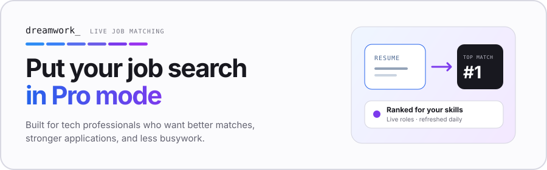

<a href="https://www.dreamworkhq.com/?utm_source=github&utm_medium=readme_cta&utm_campaign=gh-senior-swe">
  <picture>
    <source media="(prefers-color-scheme: dark)" srcset="./static/img/banner-dark.svg">
    <source media="(prefers-color-scheme: light)" srcset="./static/img/banner-light.svg">
    
  </picture>
</a>

<h1 align="center">Senior Software Engineer Jobs</h1>

Senior, staff, principal, and lead software engineering roles in the United States. No management, junior, new-grad, or internship listings.

  
  

  <a href="https://www.dreamworkhq.com/?utm_source=github&utm_medium=readme_cta&utm_campaign=gh-senior-swe">
    <picture>
      <source media="(prefers-color-scheme: dark)" srcset="./static/img/btn-matches-dark.svg">
      <source media="(prefers-color-scheme: light)" srcset="./static/img/btn-matches-light.svg">
      
    </picture>
  </a>

  <a href="https://www.dreamworkhq.com/?utm_source=github&utm_medium=link_row&utm_campaign=gh-senior-swe">dreamworkhq.com</a>
  ·
  <a href="https://www.dreamworkhq.com/blog?utm_source=github&utm_medium=link_row&utm_campaign=gh-senior-swe">Blog</a>
  ·
  <a href="https://www.dreamworkhq.com/research?utm_source=github&utm_medium=link_row&utm_campaign=gh-senior-swe">Hiring research</a>
  ·
  <a href="../../issues">Report a listing</a>

Star this repo and new roles land in your GitHub feed every day. Listings come from [Dreamwork](https://www.dreamworkhq.com/?utm_source=github&utm_medium=readme_cta&utm_campaign=gh-senior-swe), which crawls 400,000+ jobs directly from company career pages.

Last updated: **2026-10-02**. Showing the **600** most recently indexed roles, curated from **3,000+** open listings on Dreamwork. Salary shows when the posting discloses it. Click a role to see details and apply.

- [Senior](#senior-265) · 265 roles
- [Staff and lead](#staff-and-lead-199) · 199 roles
- [Principal](#principal-136) · 136 roles

<!-- TABLE_START (auto-generated: do not edit by hand; edits are overwritten daily) -->

### Senior (265)

| Company | Role | Location | Pay | Added |
| --- | --- | --- | --- | --- |
| **[Nvidia](https://www.dreamworkhq.com/c/nvidia.com?utm_source=github&utm_campaign=gh-senior-swe)** | [Senior Software Engineer, ML Loop](https://www.dreamworkhq.com/job/9011dad7-754f-42b0-bd6b-1ae6390a21b5?utm_source=github&utm_campaign=gh-senior-swe) | US, CA, Santa Clara | $168K–$270K | 0d |
| **[Steadily Insurance Agency](https://www.dreamworkhq.com/c/steadily.com?utm_source=github&utm_campaign=gh-senior-swe)** | [Senior Machine Learning Engineer](https://www.dreamworkhq.com/job/f25112be-2828-4c19-9460-f8ceb7e4dcdb?utm_source=github&utm_campaign=gh-senior-swe) | Austin, TX (Hybrid) |  | 0d |
| **[Accenture](https://www.dreamworkhq.com/c/accenture.com?utm_source=github&utm_campaign=gh-senior-swe)** | [Cúram Technical Developer](https://www.dreamworkhq.com/job/cce154ee-8ae2-4a42-8dc3-228e81b6e7a7?utm_source=github&utm_campaign=gh-senior-swe) | Raleigh, 555 Fayetteville, Corp | $63K–$219K | 0d |
| **[Anduril](https://www.dreamworkhq.com/c/anduril.com?utm_source=github&utm_campaign=gh-senior-swe)** | [Senior Firmware Engineer](https://www.dreamworkhq.com/job/d3fbf2c8-b4ce-4184-9870-6c57b51f8ccd?utm_source=github&utm_campaign=gh-senior-swe) | Waltham, Massachusetts, United States | $191K–$253K | 0d |
| **[Anduril](https://www.dreamworkhq.com/c/anduril.com?utm_source=github&utm_campaign=gh-senior-swe)** | [Senior Firmware Engineer, Space](https://www.dreamworkhq.com/job/0de518cb-2d8d-4a29-872d-6bb5ae84c8d4?utm_source=github&utm_campaign=gh-senior-swe) | Boulder, Colorado, United States | $165K–$218K | 0d |
| **[Verizon](https://www.dreamworkhq.com/c/verizon.com?utm_source=github&utm_campaign=gh-senior-swe)** | [AI Platform Engineer](https://www.dreamworkhq.com/job/854edb9f-b743-4b22-80af-cf590d13b0ab?utm_source=github&utm_campaign=gh-senior-swe) | Irving, Texas (Hybrid) | $101K–$194K | 0d |
| **[Booz Allen Hamilton](https://www.dreamworkhq.com/c/boozallen.com?utm_source=github&utm_campaign=gh-senior-swe)** | [Java Developer](https://www.dreamworkhq.com/job/69f96661-1b42-4255-8dca-8bbef3394e77?utm_source=github&utm_campaign=gh-senior-swe) | Bethesda, MD (Hybrid) | $87K–$198K | 0d |
| **[Booz Allen Hamilton](https://www.dreamworkhq.com/c/boozallen.com?utm_source=github&utm_campaign=gh-senior-swe)** | [DevOps Engineer](https://www.dreamworkhq.com/job/7e4b71d1-edc1-4b44-8a57-3a9fcaa66e37?utm_source=github&utm_campaign=gh-senior-swe) | Chantilly, VA (Hybrid) | $78K–$176K | 0d |
| **[Booz Allen Hamilton](https://www.dreamworkhq.com/c/boozallen.com?utm_source=github&utm_campaign=gh-senior-swe)** | [AI Engineer, Lead](https://www.dreamworkhq.com/job/1f441f78-4934-4a4e-8adf-25c59bb4c58b?utm_source=github&utm_campaign=gh-senior-swe) | McLean, VA (Hybrid) | $129K–$292K | 0d |
| **[Booz Allen Hamilton](https://www.dreamworkhq.com/c/boozallen.com?utm_source=github&utm_campaign=gh-senior-swe)** | [MUMPS Developer, Lead](https://www.dreamworkhq.com/job/e69b643d-55e3-4192-a790-05be6e5bd224?utm_source=github&utm_campaign=gh-senior-swe) | Melbourne, FL (Hybrid) | $87K–$198K | 0d |
| **[Gallup](https://www.dreamworkhq.com/c/gallup.com?utm_source=github&utm_campaign=gh-senior-swe)** | [Senior Software Engineer](https://www.dreamworkhq.com/job/16a10db1-e0d7-44f6-adc5-c5044d8fd8f5?utm_source=github&utm_campaign=gh-senior-swe) | San Francisco (Hybrid) | $180K–$230K | 0d |
| **[General Dynamics Mission Systems](https://www.dreamworkhq.com/c/gdmissionsystems.com?utm_source=github&utm_campaign=gh-senior-swe)** | [NC3 Sr Advanced Software Engineer](https://www.dreamworkhq.com/job/de7501d2-f57b-43cb-a2bf-57f16aa3263b?utm_source=github&utm_campaign=gh-senior-swe) | Taunton, MA, US | $157K–$175K | 0d |
| **[Ford](https://www.dreamworkhq.com/c/ford.com?utm_source=github&utm_campaign=gh-senior-swe)** | [Senior AI Engineer](https://www.dreamworkhq.com/job/27fa984d-45e4-4620-93e3-01a20f29ac24?utm_source=github&utm_campaign=gh-senior-swe) | Dearborn, MI, United States (Hybrid) | $100K–$193K | 0d |
| **[Elastic](https://www.dreamworkhq.com/c/elastic.co?utm_source=github&utm_campaign=gh-senior-swe)** | [Senior Software Engineer - Security Integrations - Prompt Engineering](https://www.dreamworkhq.com/job/18a6127e-eb21-4140-a3c1-d6b1eab9d308?utm_source=github&utm_campaign=gh-senior-swe) | Remote (United States) | $133K–$211K | 0d |
| **[Nebraskastatecareers](https://www.dreamworkhq.com/c/nebraskastatecareers.com?utm_source=github&utm_campaign=gh-senior-swe)** | [IT Applications Developer/Senior (Robotic Process Automation)](https://www.dreamworkhq.com/job/5a465a75-c19f-47ba-9966-c9310aaf5d02?utm_source=github&utm_campaign=gh-senior-swe) | Lincoln, NE | $75K | 0d |
| **[Defcon](https://www.dreamworkhq.com/c/defcon.ai?utm_source=github&utm_campaign=gh-senior-swe)** | [ML Engineer, Retrieval & Grounded Generation](https://www.dreamworkhq.com/job/947f6677-8097-48b7-8c20-944ad91c1c0e?utm_source=github&utm_campaign=gh-senior-swe) | Remote (Remote, USA) | $165K–$200K | 0d |
| **[Defcon](https://www.dreamworkhq.com/c/defcon.ai?utm_source=github&utm_campaign=gh-senior-swe)** | [Defcon Senior Data Platform Engineer](https://www.dreamworkhq.com/job/10e53b26-8825-40a1-93a8-b8a4ce6a6b65?utm_source=github&utm_campaign=gh-senior-swe) | Remote (Remote, USA) | $165K–$200K | 0d |
| **[Accenture Federal Services](https://www.dreamworkhq.com/c/accenturefederal.com?utm_source=github&utm_campaign=gh-senior-swe)** | [SAP ABAP Developer (100% onsite in St. Louis, MO)](https://www.dreamworkhq.com/job/9cb88695-003c-4070-9a0f-9b8077cd6573?utm_source=github&utm_campaign=gh-senior-swe) | St. Louis, MO | $92K–$246K | 0d |
| **[Prosync](https://www.dreamworkhq.com/c/prosync.com?utm_source=github&utm_campaign=gh-senior-swe)** | [Software Engineer III](https://www.dreamworkhq.com/job/76602f90-43d7-485c-b110-050cbdc4ab86?utm_source=github&utm_campaign=gh-senior-swe) | Annapolis Junction, Maryland, United States |  | 0d |
| **[Accenture Federal Services](https://www.dreamworkhq.com/c/accenturefederal.com?utm_source=github&utm_campaign=gh-senior-swe)** | [Data Engineer - Senior](https://www.dreamworkhq.com/job/9287415f-3c70-4c11-8930-f1028557045e?utm_source=github&utm_campaign=gh-senior-swe) | Chantilly, VA | $106K–$221K | 0d |
| **[Accenture Federal Services](https://www.dreamworkhq.com/c/accenturefederal.com?utm_source=github&utm_campaign=gh-senior-swe)** | [DevOps Engineer](https://www.dreamworkhq.com/job/40075c2d-c43d-410e-9c10-7af0fd357954?utm_source=github&utm_campaign=gh-senior-swe) | Chantilly, VA | $119K–$225K | 0d |
| **[Accenture Federal Services](https://www.dreamworkhq.com/c/accenturefederal.com?utm_source=github&utm_campaign=gh-senior-swe)** | [AI / ML Engineer](https://www.dreamworkhq.com/job/22d05094-7a04-44ef-aff3-603fc8e01e99?utm_source=github&utm_campaign=gh-senior-swe) | Arlington, VA | $103K–$196K | 0d |
| **[Capgemini](https://www.dreamworkhq.com/c/capgemini.com?utm_source=github&utm_campaign=gh-senior-swe)** | [Senior Software Engineer](https://www.dreamworkhq.com/job/96dcf92a-93fa-4fc7-ae14-0cedb8cc89d5?utm_source=github&utm_campaign=gh-senior-swe) | — | $73K–$174K | 0d |
| **[RenesasElectronics](https://www.dreamworkhq.com/c/renesas.com?utm_source=github&utm_campaign=gh-senior-swe)** | [Senior Software Engineer](https://www.dreamworkhq.com/job/8281d86c-0ffe-4dd7-93fc-45d4a284fc1b?utm_source=github&utm_campaign=gh-senior-swe) | Austin, TEXAS, United States (Hybrid) |  | 0d |
| **[Stord](https://www.dreamworkhq.com/c/stord.com?utm_source=github&utm_campaign=gh-senior-swe)** | [Software Engineer (SE/Senior/Staff)](https://www.dreamworkhq.com/job/ad3e6a2c-769e-4d29-adaa-5f6c844b6b80?utm_source=github&utm_campaign=gh-senior-swe) | ATL1 - Atlanta, GA |  | 0d |
| **[Michael Baker International](https://www.dreamworkhq.com/c/mbakerintl.com?utm_source=github&utm_campaign=gh-senior-swe)** | [Senior Software Engineer (GIS)](https://www.dreamworkhq.com/job/c0b5f8ca-db5d-4cf0-837f-43ecbb12f6b6?utm_source=github&utm_campaign=gh-senior-swe) | Remote (United States) | $130K–$150K | 0d |
| **[State Street](https://www.dreamworkhq.com/c/statestreet.com?utm_source=github&utm_campaign=gh-senior-swe)** | [Software Engineering & Development, AVP](https://www.dreamworkhq.com/job/09f66258-cbba-4265-8358-accb1f583eb8?utm_source=github&utm_campaign=gh-senior-swe) | Boston, Massachusetts (Hybrid) | $90K–$158K | 0d |
| **[ServiceNow](https://www.dreamworkhq.com/c/servicenow.com?utm_source=github&utm_campaign=gh-senior-swe)** | [Senior Software Engineer](https://www.dreamworkhq.com/job/21032635-8b9e-47fd-871e-20f3f35a619f?utm_source=github&utm_campaign=gh-senior-swe) | Santa Clara, CALIFORNIA, United States (Hybrid) | $143K–$243K | 0d |
| **[Darkwolfsolutions](https://www.dreamworkhq.com/c/darkwolf.io?utm_source=github&utm_campaign=gh-senior-swe)** | [Senior Cloud Engineer](https://www.dreamworkhq.com/job/43e893bb-bc54-4d18-bf63-229a53d5e3dc?utm_source=github&utm_campaign=gh-senior-swe) | Remote (Dark Wolf Hub Location) | $150K–$170K | 0d |
| **[Ttecdigital](https://www.dreamworkhq.com/c/ttecdigital.com?utm_source=github&utm_campaign=gh-senior-swe)** | [Senior Data Engineer - Microsoft Data & AI](https://www.dreamworkhq.com/job/d3fc9361-aa46-4207-b13f-8fec15f347d0?utm_source=github&utm_campaign=gh-senior-swe) | Remote (Austin, TX) | $155K–$175K | 0d |
| **[Coderabbit](https://www.dreamworkhq.com/c/coderabbit.ai?utm_source=github&utm_campaign=gh-senior-swe)** | [Software Engineer - Enterprise Engineering](https://www.dreamworkhq.com/job/b3a36ef4-1a8c-453b-92c1-0d0d69be9b5c?utm_source=github&utm_campaign=gh-senior-swe) | San Francisco (Hybrid) | $200K–$250K | 0d |
| **[Beyond New Horizons](https://www.dreamworkhq.com/c/bnh-jv.com?utm_source=github&utm_campaign=gh-senior-swe)** | [Sr. Platform Engineer](https://www.dreamworkhq.com/job/9dddcf89-3fbd-4165-a6c2-c05469172c38?utm_source=github&utm_campaign=gh-senior-swe) | Arnold AFB, TN, US | $100K–$150K | 0d |
| **[Beyond New Horizons](https://www.dreamworkhq.com/c/bnh-jv.com?utm_source=github&utm_campaign=gh-senior-swe)** | [MIS Business Systems Process & Data Automation Developer](https://www.dreamworkhq.com/job/11e269ea-81f4-4c27-8114-37ea43818555?utm_source=github&utm_campaign=gh-senior-swe) | Arnold AFB, TN, US | $113K–$176K | 0d |
| **[Fiserv](https://www.dreamworkhq.com/c/fiserv.com?utm_source=github&utm_campaign=gh-senior-swe)** | [Software Development Engineering – Advisor](https://www.dreamworkhq.com/job/010698af-360a-46e6-a117-620add1207ba?utm_source=github&utm_campaign=gh-senior-swe) | Milwaukee, Wisconsin |  | 0d |
| **[Leidos](https://www.dreamworkhq.com/c/leidos.com?utm_source=github&utm_campaign=gh-senior-swe)** | [Lead Software Engineer](https://www.dreamworkhq.com/job/2173da3b-0d27-4e57-85ad-c5cb1ec9697f?utm_source=github&utm_campaign=gh-senior-swe) | Albuquerque, NM | $87K–$157K | 0d |
| **[Schrödinger](https://www.dreamworkhq.com/c/schrodinger.com?utm_source=github&utm_campaign=gh-senior-swe)** | [Cloud Engineer](https://www.dreamworkhq.com/job/1b948042-af09-4a1d-bf8e-4f5fd5c5ae41?utm_source=github&utm_campaign=gh-senior-swe) | New York; Portland | $135K–$170K | 0d |
| **[Schrödinger](https://www.dreamworkhq.com/c/schrodinger.com?utm_source=github&utm_campaign=gh-senior-swe)** | [Senior Software Developer, LiveDesign Infrastructure](https://www.dreamworkhq.com/job/c05d6c6a-3b82-4440-a568-8699303d69de?utm_source=github&utm_campaign=gh-senior-swe) | New York (Hybrid) | $155K–$270K | 0d |
| **[Cti Md](https://www.dreamworkhq.com/c/cti-md.com?utm_source=github&utm_campaign=gh-senior-swe)** | [AI Engineer - SME- CLEARANCE and POLYGRAPH REQUIRED](https://www.dreamworkhq.com/job/b5df2fd2-f889-412b-a8b8-57f7f5698436?utm_source=github&utm_campaign=gh-senior-swe) | Columbia, MD | $100K–$180K | 0d |
| **[Nectar Social](https://www.dreamworkhq.com/c/nectarsocial.com?utm_source=github&utm_campaign=gh-senior-swe)** | [Founding Mobile Engineer (React Native)](https://www.dreamworkhq.com/job/d5fdd64a-9886-4e85-8131-09ff81a3b990?utm_source=github&utm_campaign=gh-senior-swe) | Remote (Remote - USA) | $200K–$400K | 0d |
| **[Intuitive](https://www.dreamworkhq.com/c/intuitive.com?utm_source=github&utm_campaign=gh-senior-swe)** | [Senior Software (Quality Engineer 4) - CoE structure](https://www.dreamworkhq.com/job/6e324aa7-8c62-483c-b68a-6d85809a215e?utm_source=github&utm_campaign=gh-senior-swe) | Sunnyvale, CA, United States (Hybrid) | $150K–$216K | 0d |
| **[Uber](https://www.dreamworkhq.com/c/uber.com?utm_source=github&utm_campaign=gh-senior-swe)** | [Sr Software Engineer - Engineer](https://www.dreamworkhq.com/job/307b66df-4d07-4a77-9918-d49a85e0687c?utm_source=github&utm_campaign=gh-senior-swe) | Sunnyvale, California (Hybrid) | $202K–$224K | 0d |
| **[Waymo](https://www.dreamworkhq.com/c/waymo.com?utm_source=github&utm_campaign=gh-senior-swe)** | [Senior Software Engineer, Chassis](https://www.dreamworkhq.com/job/a080d0f7-cc4d-43f0-b985-cf1b9375fa33?utm_source=github&utm_campaign=gh-senior-swe) | San Francisco, CA, USA; Mountain View, CA, … (Hybrid) | $213K–$263K | 0d |
| **[Wabtec](https://www.dreamworkhq.com/c/wabteccorp.com?utm_source=github&utm_campaign=gh-senior-swe)** | [Engineer, Sr Embedded Software](https://www.dreamworkhq.com/job/d7794d89-a8fb-40fe-9326-a776a873995d?utm_source=github&utm_campaign=gh-senior-swe) | Waltham, MA, United States | $95K–$130K | 0d |
| **[Conduct](https://www.dreamworkhq.com/c/conduct.com?utm_source=github&utm_campaign=gh-senior-swe)** | [ABAP AI Developer - US](https://www.dreamworkhq.com/job/16c725c6-4efe-4379-a591-f35ff5d7dd96?utm_source=github&utm_campaign=gh-senior-swe) | NYC, US |  | 0d |
| **[Pnc](https://www.dreamworkhq.com/c/pnc.com?utm_source=github&utm_campaign=gh-senior-swe)** | [Software Engineer Lead - Java/Oracle](https://www.dreamworkhq.com/job/893df825-677b-4bb8-84da-2b17f21e0324?utm_source=github&utm_campaign=gh-senior-swe) | Two PNC Plaza (PA374) | $86K–$158K | 0d |
| **[MTB](https://www.dreamworkhq.com/c/mtb.com?utm_source=github&utm_campaign=gh-senior-swe)** | [OpenShift Platform Engineer](https://www.dreamworkhq.com/job/1c1d1b51-7c9f-43e7-b414-003f559a7827?utm_source=github&utm_campaign=gh-senior-swe) | Remote (Remote, USA) | $116K–$194K | 0d |
| **[Kikoff](https://www.dreamworkhq.com/c/kikoff.com?utm_source=github&utm_campaign=gh-senior-swe)** | [Senior Fullstack Engineer - User Retention & App Ecosystem](https://www.dreamworkhq.com/job/3023d086-8e22-4cbb-b035-21f0dc0b612a?utm_source=github&utm_campaign=gh-senior-swe) | San Francisco | $244K–$292K | 0d |
| **[Peraton](https://www.dreamworkhq.com/c/peraton.com?utm_source=github&utm_campaign=gh-senior-swe)** | [Senior Full Stack Engineer](https://www.dreamworkhq.com/job/3f9fc6df-7f09-41a1-9060-68f43c64b12c?utm_source=github&utm_campaign=gh-senior-swe) | US (Hybrid) | $104K–$166K | 0d |
| **[Roblox](https://www.dreamworkhq.com/c/roblox.com?utm_source=github&utm_campaign=gh-senior-swe)** | [Senior Software Engineer, Service Mesh](https://www.dreamworkhq.com/job/8caeeb05-4ebf-4e61-8ba0-1fda94d77719?utm_source=github&utm_campaign=gh-senior-swe) | San Mateo, CA, United States (Hybrid) | $197K–$243K | 0d |
| **Urbancompass** | [Senior Software Engineer II - Frontend](https://www.dreamworkhq.com/job/1c2014b8-a49c-4032-91a7-310a4359d0f3?utm_source=github&utm_campaign=gh-senior-swe) | Boca Raton; Boston; New York City; Seattle | $176K–$196K | 0d |
| **[Towerresearchcapital](https://www.dreamworkhq.com/c/towerresearch.com?utm_source=github&utm_campaign=gh-senior-swe)** | [Research Platform Engineer](https://www.dreamworkhq.com/job/187afb73-45da-4270-998a-f92638c66e65?utm_source=github&utm_campaign=gh-senior-swe) | New York (Hybrid) | $200K–$300K | 0d |
| **[CACI](https://www.dreamworkhq.com/c/caci.com?utm_source=github&utm_campaign=gh-senior-swe)** | [Software Engineer (GIS Enterprise)](https://www.dreamworkhq.com/job/a5bf754c-2ef0-45f7-b563-aad742bd3f98?utm_source=github&utm_campaign=gh-senior-swe) | Fort Bragg, NC, US | $94K–$197K | 0d |
| **[CACI](https://www.dreamworkhq.com/c/caci.com?utm_source=github&utm_campaign=gh-senior-swe)** | [Power Platform & Copilot Studio Developer](https://www.dreamworkhq.com/job/2abd69b4-eecd-4686-9535-92f112f83a7e?utm_source=github&utm_campaign=gh-senior-swe) | Ashburn, VA, US | $90K–$190K | 0d |
| **[CACI](https://www.dreamworkhq.com/c/caci.com?utm_source=github&utm_campaign=gh-senior-swe)** | [CCARS / Document Management Software Test Engineer](https://www.dreamworkhq.com/job/d1fb01e7-7ffc-43c2-b10b-f48121878e0d?utm_source=github&utm_campaign=gh-senior-swe) | Remote (Remote (Any State)) | $90K–$190K | 0d |
| **[CACI](https://www.dreamworkhq.com/c/caci.com?utm_source=github&utm_campaign=gh-senior-swe)** | [Senior DevOps Software Engineer - Zero Trust ICAM](https://www.dreamworkhq.com/job/87ccdd59-3a37-43d3-9da1-f26146b82872?utm_source=github&utm_campaign=gh-senior-swe) | Hanover, MD, US | $132K–$290K | 0d |
| **[CACI](https://www.dreamworkhq.com/c/caci.com?utm_source=github&utm_campaign=gh-senior-swe)** | [Full Stack Developer](https://www.dreamworkhq.com/job/824bf6ee-b207-40ec-83e7-1ed454b1c980?utm_source=github&utm_campaign=gh-senior-swe) | Fort Bragg, NC, US | $86K–$180K | 0d |
| **[CACI](https://www.dreamworkhq.com/c/caci.com?utm_source=github&utm_campaign=gh-senior-swe)** | [SAP Software Test Engineer (FI/CO)](https://www.dreamworkhq.com/job/b2d7ba02-d811-409a-a243-0e827807c131?utm_source=github&utm_campaign=gh-senior-swe) | Remote (Remote (Any State)) | $75K–$158K | 0d |
| **[CACI](https://www.dreamworkhq.com/c/caci.com?utm_source=github&utm_campaign=gh-senior-swe)** | [Senior AI/ML Engineer](https://www.dreamworkhq.com/job/9bff319d-7456-4643-9912-da7f22a5d4ac?utm_source=github&utm_campaign=gh-senior-swe) | King of Prussia, PA, US | $82K–$172K | 0d |
| **[CACI](https://www.dreamworkhq.com/c/caci.com?utm_source=github&utm_campaign=gh-senior-swe)** | [Front End Software Developer-TS/SCI with Poly](https://www.dreamworkhq.com/job/3c7255cf-2787-4467-811c-c320dcd5d671?utm_source=github&utm_campaign=gh-senior-swe) | Sterling, VA, US | $73K–$149K | 0d |
| **[CACI](https://www.dreamworkhq.com/c/caci.com?utm_source=github&utm_campaign=gh-senior-swe)** | [Senior COTS Developer](https://www.dreamworkhq.com/job/5d61396f-92a9-4237-8f3c-70d4cedd39a8?utm_source=github&utm_campaign=gh-senior-swe) | St. Louis, MO, US | $105K–$231K | 0d |
| **[CACI](https://www.dreamworkhq.com/c/caci.com?utm_source=github&utm_campaign=gh-senior-swe)** | [Software Engineer - CI/CD Pipeline](https://www.dreamworkhq.com/job/9b97e71d-06fa-43ce-8055-5163035618f0?utm_source=github&utm_campaign=gh-senior-swe) | Crane, IN, US | $57K–$117K | 0d |
| **[CACI](https://www.dreamworkhq.com/c/caci.com?utm_source=github&utm_campaign=gh-senior-swe)** | [Sr Software Developer, PeopleSoft](https://www.dreamworkhq.com/job/ab5b5152-7f75-4498-906f-57801f81e9b8?utm_source=github&utm_campaign=gh-senior-swe) | Washington, DC, US | $104K–$218K | 0d |
| **[CACI](https://www.dreamworkhq.com/c/caci.com?utm_source=github&utm_campaign=gh-senior-swe)** | [Senior COTS Developer](https://www.dreamworkhq.com/job/563015c9-88f8-4d35-bbbc-7e63cb499a0d?utm_source=github&utm_campaign=gh-senior-swe) | Herndon, VA, US | $121K–$266K | 0d |
| **[CACI](https://www.dreamworkhq.com/c/caci.com?utm_source=github&utm_campaign=gh-senior-swe)** | [Software Test Engineer](https://www.dreamworkhq.com/job/2163aa1c-d395-4588-92f4-f7e936177f9d?utm_source=github&utm_campaign=gh-senior-swe) | Washington, DC, US | $87K–$182K | 0d |
| **[Mgmresorts](https://www.dreamworkhq.com/c/mgmresorts.com?utm_source=github&utm_campaign=gh-senior-swe)** | [Digital Software Sr Engineer I](https://www.dreamworkhq.com/job/e1e88927-fd6f-4a3f-ab31-3c3a03755f7f?utm_source=github&utm_campaign=gh-senior-swe) | Remote (Office - US, Las Vegas, NV 6770 Edmond …) |  | 0d |
| **[JPMorgan Chase](https://www.dreamworkhq.com/c/careers.jpmorgan.com?utm_source=github&utm_campaign=gh-senior-swe)** | [Senior Lead Software Engineer - Blockchain, Java, Micro Services](https://www.dreamworkhq.com/job/441c7077-1fd7-418c-9482-31c76b58620d?utm_source=github&utm_campaign=gh-senior-swe) | Jersey City, NJ, United States | $176K–$260K | 0d |
| **[JPMorgan Chase](https://www.dreamworkhq.com/c/careers.jpmorgan.com?utm_source=github&utm_campaign=gh-senior-swe)** | [Lead Software Engineer - AWS Cloud Engineer](https://www.dreamworkhq.com/job/350a7411-1e75-408d-969e-82b59e3e2705?utm_source=github&utm_campaign=gh-senior-swe) | Wilmington, DE, United States |  | 0d |
| **[JPMorgan Chase](https://www.dreamworkhq.com/c/careers.jpmorgan.com?utm_source=github&utm_campaign=gh-senior-swe)** | [Lead Software Engineer - Java](https://www.dreamworkhq.com/job/4993b266-f74b-4dbe-88ca-75e2e699a66f?utm_source=github&utm_campaign=gh-senior-swe) | Jersey City, NJ, United States | $157K–$215K | 0d |
| **[JPMorgan Chase](https://www.dreamworkhq.com/c/careers.jpmorgan.com?utm_source=github&utm_campaign=gh-senior-swe)** | [AI Senior Lead Infrastructure Engineer](https://www.dreamworkhq.com/job/1370b8fd-d17a-49ac-9c66-2c61c24ecd68?utm_source=github&utm_campaign=gh-senior-swe) | Columbus, OH, United States | $162K–$210K | 0d |
| **[JPMorgan Chase](https://www.dreamworkhq.com/c/careers.jpmorgan.com?utm_source=github&utm_campaign=gh-senior-swe)** | [Software Engineer III - Oracle HCM](https://www.dreamworkhq.com/job/9c99ed18-2d58-486c-8ef4-8a3de73aae58?utm_source=github&utm_campaign=gh-senior-swe) | OH, United States |  | 0d |
| **[Outsetmedical](https://www.dreamworkhq.com/c/outsetmedical.com?utm_source=github&utm_campaign=gh-senior-swe)** | [Senior Software Quality Engineer](https://www.dreamworkhq.com/job/7c9654d4-1716-42af-aea9-5723818a7cd3?utm_source=github&utm_campaign=gh-senior-swe) | San Jose, CA | $136K–$184K | 0d |
| **[Walmart](https://www.dreamworkhq.com/c/walmart.com?utm_source=github&utm_campaign=gh-senior-swe)** | [(USA) Senior, Software Engineer](https://www.dreamworkhq.com/job/e3cbdcc9-649e-4a7d-bb7a-c8be832d7896?utm_source=github&utm_campaign=gh-senior-swe) | (USA) Crossman Service Building CA SUNNYVAL… | $117K–$234K | 0d |
| **[SpaceX](https://www.dreamworkhq.com/c/spacex.com?utm_source=github&utm_campaign=gh-senior-swe)** | [Sr. Software Engineer, AI Infrastructure (Starshield)](https://www.dreamworkhq.com/job/b3b0ff6b-618e-4103-bb37-2b90be82f6c5?utm_source=github&utm_campaign=gh-senior-swe) | Hawthorne, CA | $165K–$265K | 0d |
| **[SpaceX](https://www.dreamworkhq.com/c/spacex.com?utm_source=github&utm_campaign=gh-senior-swe)** | [Sr. Software Engineer, AI Infrastructure (Starshield)](https://www.dreamworkhq.com/job/48653bd6-85a4-430a-a0c3-a751d90c9f0c?utm_source=github&utm_campaign=gh-senior-swe) | Washington, DC | $165K–$265K | 0d |
| **[SpaceX](https://www.dreamworkhq.com/c/spacex.com?utm_source=github&utm_campaign=gh-senior-swe)** | [Sr. Software Engineer, AI Infrastructure (Starshield)](https://www.dreamworkhq.com/job/5c51c0d2-197c-476e-8779-81e03b20c874?utm_source=github&utm_campaign=gh-senior-swe) | Redmond, WA | $165K–$270K | 0d |
| **[SpaceX](https://www.dreamworkhq.com/c/spacex.com?utm_source=github&utm_campaign=gh-senior-swe)** | [Sr. Software Engineer, AI Infrastructure (Starshield)](https://www.dreamworkhq.com/job/1e4ea43b-ac48-41e5-8ca1-0300b13523be?utm_source=github&utm_campaign=gh-senior-swe) | Palo Alto, CA | $165K–$265K | 0d |
| **[SpaceX](https://www.dreamworkhq.com/c/spacex.com?utm_source=github&utm_campaign=gh-senior-swe)** | [Sr. RF Silicon Software Engineer (RFIC Engineering)](https://www.dreamworkhq.com/job/9a694b29-53f8-4f87-8810-4829efd42bf8?utm_source=github&utm_campaign=gh-senior-swe) | Redmond, WA | $165K–$270K | 0d |
| **[SAIC](https://www.dreamworkhq.com/c/saic.com?utm_source=github&utm_campaign=gh-senior-swe)** | [Senior Power Platform Developer](https://www.dreamworkhq.com/job/2620b39d-9d5a-445c-b3e5-4f41b08b815c?utm_source=github&utm_campaign=gh-senior-swe) | Arlington, VA, United States | $140K–$150K | 0d |
| **[Walmart](https://www.dreamworkhq.com/c/walmart.com?utm_source=github&utm_campaign=gh-senior-swe)** | [(USA) Senior, Software Engineer](https://www.dreamworkhq.com/job/56af754b-3363-4da3-a4b7-926c3faa5c41?utm_source=github&utm_campaign=gh-senior-swe) | (USA) ISD Office - DGTC AR BENTONVILLE Home… | $90K–$180K | 0d |
| **[Walmart](https://www.dreamworkhq.com/c/walmart.com?utm_source=github&utm_campaign=gh-senior-swe)** | [Senior Software Engineer- Android](https://www.dreamworkhq.com/job/1757c0d5-dc57-406b-89cf-8fa747befc72?utm_source=github&utm_campaign=gh-senior-swe) | (USA) Crossman Service Building CA SUNNYVAL… (Hybrid) | $117K–$234K | 0d |
| **[Walmart](https://www.dreamworkhq.com/c/walmart.com?utm_source=github&utm_campaign=gh-senior-swe)** | [Senior Software Engineer- iOS](https://www.dreamworkhq.com/job/1d8347bf-030e-4487-a989-1588d129feaa?utm_source=github&utm_campaign=gh-senior-swe) | Sunnyvale, CA (Hybrid) | $117K–$234K | 0d |
| **[Datadog](https://www.dreamworkhq.com/c/datadoghq.com?utm_source=github&utm_campaign=gh-senior-swe)** | [Senior Software Engineer - Incident Insights & Readiness](https://www.dreamworkhq.com/job/d6e0378c-d058-4c31-9cda-0efac6b22b3f?utm_source=github&utm_campaign=gh-senior-swe) | Boston, Massachusetts, USA; New York, New Y… (Hybrid) | $192K–$240K | 0d |
| **[Coinbase](https://www.dreamworkhq.com/c/coinbase.com?utm_source=github&utm_campaign=gh-senior-swe)** | [Senior Software Engineer, Backend - Payments Platform](https://www.dreamworkhq.com/job/33d794cb-fa4b-4ece-8839-6c6434786088?utm_source=github&utm_campaign=gh-senior-swe) | Remote (Remote - USA) | $186K–$219K | 0d |
| **[Block](https://www.dreamworkhq.com/c/block.xyz?utm_source=github&utm_campaign=gh-senior-swe)** | [Senior Data Engineer, Product](https://www.dreamworkhq.com/job/d6281f39-4094-4794-8d38-42847b5286d0?utm_source=github&utm_campaign=gh-senior-swe) | Remote (Bay Area, CA, United States of America) | $198K–$297K | 0d |
| **[Steampunk](https://www.dreamworkhq.com/c/steampunk.com?utm_source=github&utm_campaign=gh-senior-swe)** | [Software Development Architect (Drupal)](https://www.dreamworkhq.com/job/73710744-3604-4bf8-8d9b-f7bd35b9ed00?utm_source=github&utm_campaign=gh-senior-swe) | McLean, VA, US | $112K–$225K | 0d |
| **[Steampunk](https://www.dreamworkhq.com/c/steampunk.com?utm_source=github&utm_campaign=gh-senior-swe)** | [Full Stack Developer](https://www.dreamworkhq.com/job/c067e2e8-e1a1-4438-8377-939805034c1b?utm_source=github&utm_campaign=gh-senior-swe) | McLean, VA, US | $85K–$170K | 0d |
| **[Steampunk](https://www.dreamworkhq.com/c/steampunk.com?utm_source=github&utm_campaign=gh-senior-swe)** | [Senior Data Engineer](https://www.dreamworkhq.com/job/74c9381f-22d9-49e4-bc39-ece9f87d0f44?utm_source=github&utm_campaign=gh-senior-swe) | McLean, VA, US | $125K–$165K | 0d |
| **[Steampunk](https://www.dreamworkhq.com/c/steampunk.com?utm_source=github&utm_campaign=gh-senior-swe)** | [Data Engineering Team Lead](https://www.dreamworkhq.com/job/ffb90599-4224-4284-a517-949094c386a0?utm_source=github&utm_campaign=gh-senior-swe) | McLean, VA, US | $130K–$160K | 0d |
| **[Humana](https://www.dreamworkhq.com/c/humana.com?utm_source=github&utm_campaign=gh-senior-swe)** | [Senior Data Engineer](https://www.dreamworkhq.com/job/cd11fc4d-b379-4ddc-a96b-b82d9db93e19?utm_source=github&utm_campaign=gh-senior-swe) | Remote (Remote Nationwide) | $118K–$162K | 0d |
| **[Humana](https://www.dreamworkhq.com/c/humana.com?utm_source=github&utm_campaign=gh-senior-swe)** | [Senior Software Engineer - Appian Platform](https://www.dreamworkhq.com/job/4837c6b3-d928-4acf-bb67-ce69815f31c6?utm_source=github&utm_campaign=gh-senior-swe) | Louisville, KY (Hybrid) | $107K–$147K | 0d |
| **[Capital One](https://www.dreamworkhq.com/c/capitalone.com?utm_source=github&utm_campaign=gh-senior-swe)** | [Full-stack Engineer 4](https://www.dreamworkhq.com/job/836b07d1-430e-4973-8590-08cf1d904025?utm_source=github&utm_campaign=gh-senior-swe) | New York, NY | $215K–$246K | 0d |
| **[Scale AI](https://www.dreamworkhq.com/c/scale.com?utm_source=github&utm_campaign=gh-senior-swe)** | [Senior Software Engineer, Orchestration Platform](https://www.dreamworkhq.com/job/adc46fae-2d34-43fe-a6b7-3e45621ca719?utm_source=github&utm_campaign=gh-senior-swe) | San Francisco, CA; New York, NY | $216K–$270K | 0d |
| **[Varda Space](https://www.dreamworkhq.com/c/varda.com?utm_source=github&utm_campaign=gh-senior-swe)** | [Senior Space Embedded Software Engineer](https://www.dreamworkhq.com/job/fb3df3db-97ca-4062-9e53-38979cb3bf45?utm_source=github&utm_campaign=gh-senior-swe) | El Segundo, California, United States | $169K–$216K | 0d |
| **[Genpt](https://www.dreamworkhq.com/c/genpt.com?utm_source=github&utm_campaign=gh-senior-swe)** | [SRE-Azure - Global Industrial](https://www.dreamworkhq.com/job/69c406b6-01a0-488d-a495-a2823e7bd0e2?utm_source=github&utm_campaign=gh-senior-swe) | Birmingham, AL, USA (Hybrid) |  | 0d |
| **[Genpt](https://www.dreamworkhq.com/c/genpt.com?utm_source=github&utm_campaign=gh-senior-swe)** | [Site Reliability Engineer - ED&A - Global Industrial](https://www.dreamworkhq.com/job/837d7127-f761-4d3f-a728-f34ae42e5882?utm_source=github&utm_campaign=gh-senior-swe) | Birmingham, AL, USA (Hybrid) |  | 0d |
| **[Uber](https://www.dreamworkhq.com/c/uber.com?utm_source=github&utm_campaign=gh-senior-swe)** | [Sr Software Engineer - Engineer](https://www.dreamworkhq.com/job/e408859f-9974-4030-9ded-91ff8fb70361?utm_source=github&utm_campaign=gh-senior-swe) | Sunnyvale, CA, United States (Hybrid) | $202K–$224K | 0d |
| **[Gdit](https://www.dreamworkhq.com/c/gdit.com?utm_source=github&utm_campaign=gh-senior-swe)** | [Performance Tester / Platform Engineer](https://www.dreamworkhq.com/job/075c8be7-8a05-4ba0-8802-34f3baa29b16?utm_source=github&utm_campaign=gh-senior-swe) | Remote (Any Location / Remote) | $85K–$115K | 0d |
| **[Gdit](https://www.dreamworkhq.com/c/gdit.com?utm_source=github&utm_campaign=gh-senior-swe)** | [Hybrid Cloud Platform Engineer (PaaS)](https://www.dreamworkhq.com/job/a14e3998-931e-45f4-b9d9-ddab321a2150?utm_source=github&utm_campaign=gh-senior-swe) | USA VA Springfield (Hybrid) | $120K–$162K | 0d |
| **[Gdit](https://www.dreamworkhq.com/c/gdit.com?utm_source=github&utm_campaign=gh-senior-swe)** | [Senior Power Platform Developer](https://www.dreamworkhq.com/job/3d3c00c5-d547-4a40-b118-f0d68561cc3d?utm_source=github&utm_campaign=gh-senior-swe) | USA DC Washington (Hybrid) | $111K–$150K | 0d |
| **[Gdit](https://www.dreamworkhq.com/c/gdit.com?utm_source=github&utm_campaign=gh-senior-swe)** | [Senior SharePoint Developer](https://www.dreamworkhq.com/job/5246dc4b-c48d-46db-806d-2c371988428b?utm_source=github&utm_campaign=gh-senior-swe) | USA DC Washington (Hybrid) | $111K–$150K | 0d |
| **[Gdit](https://www.dreamworkhq.com/c/gdit.com?utm_source=github&utm_campaign=gh-senior-swe)** | [Senior SharePoint Developer](https://www.dreamworkhq.com/job/80dbb26b-9804-441d-a68d-780fe871c0de?utm_source=github&utm_campaign=gh-senior-swe) | Remote (Any Location / Remote) | $98K–$115K | 0d |
| **[Amentum](https://www.dreamworkhq.com/c/amentumcareers.com?utm_source=github&utm_campaign=gh-senior-swe)** | [Software Engineer Lead - NISSC III - COS](https://www.dreamworkhq.com/job/16122232-f50d-4f96-a6d1-93a3b9e82f16?utm_source=github&utm_campaign=gh-senior-swe) | US-CO-Colorado Springs | $170K–$185K | 0d |
| **[X-energy](https://www.dreamworkhq.com/c/x-energy.com?utm_source=github&utm_campaign=gh-senior-swe)** | [Engineer IV, ECM Developer](https://www.dreamworkhq.com/job/cfac03ed-7852-461f-bdae-1e98827a894a?utm_source=github&utm_campaign=gh-senior-swe) | Rockville, MD | $139K–$159K | 0d |
| **[Healthcare](https://www.dreamworkhq.com/c/healthcare.com?utm_source=github&utm_campaign=gh-senior-swe)** | [Machine Learning Engineer](https://www.dreamworkhq.com/job/c28fc8e3-3135-43d1-a19b-b4b512c8a377?utm_source=github&utm_campaign=gh-senior-swe) | Remote (US, Pennsylvania, PITTSBURGH) | $124K–$171K | 0d |
| **[Healthcare](https://www.dreamworkhq.com/c/healthcare.com?utm_source=github&utm_campaign=gh-senior-swe)** | [SPEC SOFTWARE DEVT](https://www.dreamworkhq.com/job/2980b945-79de-4486-9f14-ea3af67e9a25?utm_source=github&utm_campaign=gh-senior-swe) | Remote (US, Utah, Murray) | $124K–$171K | 0d |
| **[Eversource](https://www.dreamworkhq.com/c/eversource.com?utm_source=github&utm_campaign=gh-senior-swe)** | [IT Senior Software Engineer (Hybrid)](https://www.dreamworkhq.com/job/cf3ca985-7950-4c42-94c1-772b6ee50f8a?utm_source=github&utm_campaign=gh-senior-swe) | Westwood, MA (Hybrid) | $127K–$142K | 0d |
| **[Workday](https://www.dreamworkhq.com/c/workaday.com?utm_source=github&utm_campaign=gh-senior-swe)** | [Software Engineer - DevOps (US Federal)](https://www.dreamworkhq.com/job/96af9ee1-839e-46ef-a18f-a8aef658b3b5?utm_source=github&utm_campaign=gh-senior-swe) | USA.VA.Reston | $137K–$205K | 0d |
| **[Mckesson](https://www.dreamworkhq.com/c/mckesson.com?utm_source=github&utm_campaign=gh-senior-swe)** | [Software Developer](https://www.dreamworkhq.com/job/d3e33814-33bb-4e30-8fc4-45c8d7523cb4?utm_source=github&utm_campaign=gh-senior-swe) | Remote (Work at Home - Georgia, USA (WGAA)) | $104K–$173K | 0d |
| **[Oracle](https://www.dreamworkhq.com/c/oracle.com?utm_source=github&utm_campaign=gh-senior-swe)** | [Senior Platform Software Engineer](https://www.dreamworkhq.com/job/3194bb88-cfdb-4a11-9423-45a3548c31da?utm_source=github&utm_campaign=gh-senior-swe) | Nashville, TN, United States | $93K–$210K | 0d |
| **[Hudsonmanpower](https://www.dreamworkhq.com/c/hudsonmanpower.com?utm_source=github&utm_campaign=gh-senior-swe)** | [Senior Informatica Developer – BDM](https://www.dreamworkhq.com/job/1e7bfb9f-03ba-4d43-abed-ff7a71b09017?utm_source=github&utm_campaign=gh-senior-swe) | Arlington, Virginia, United States (Hybrid) |  | 0d |
| **[HPE](https://www.dreamworkhq.com/c/hpe.com?utm_source=github&utm_campaign=gh-senior-swe)** | [Systems Software Engineer](https://www.dreamworkhq.com/job/00f4cf98-7840-4ae3-ba90-b1de4daf5d2e?utm_source=github&utm_campaign=gh-senior-swe) | Ft. Collins, Colorado, United States of Ame… (Hybrid) | $112K–$212K | 0d |
| **[HPE](https://www.dreamworkhq.com/c/hpe.com?utm_source=github&utm_campaign=gh-senior-swe)** | [Senior Software Engineer – Storage](https://www.dreamworkhq.com/job/b33fbe6d-dd1f-4803-b9b9-d33c39058f02?utm_source=github&utm_campaign=gh-senior-swe) | Durham, North Carolina, United States of Am… (Hybrid) | $121K–$277K | 0d |
| **[Hrhelp](https://www.dreamworkhq.com/c/netsuite.com?utm_source=github&utm_campaign=gh-senior-swe)** | [Senior Platform Software Engineer](https://www.dreamworkhq.com/job/2cb1ba5a-61a7-4e26-8a52-b37f49faff2c?utm_source=github&utm_campaign=gh-senior-swe) | Nashville, TN, United States | $93K–$210K | 0d |
| **[Hrhelp](https://www.dreamworkhq.com/c/netsuite.com?utm_source=github&utm_campaign=gh-senior-swe)** | [Senior Core Infrastructure Engineer](https://www.dreamworkhq.com/job/93654e57-7f39-4920-a1bd-ec376dbc5f57?utm_source=github&utm_campaign=gh-senior-swe) | Austin, TX, United States | $79K–$210K | 0d |
| **[Hrhelp](https://www.dreamworkhq.com/c/netsuite.com?utm_source=github&utm_campaign=gh-senior-swe)** | [Senior Core Infrastructure Engineer](https://www.dreamworkhq.com/job/9d9d0872-fe8f-4eed-8721-8c7b95fc932d?utm_source=github&utm_campaign=gh-senior-swe) | Nashville, TN, United States | $79K–$210K | 0d |
| **[Hrhelp](https://www.dreamworkhq.com/c/netsuite.com?utm_source=github&utm_campaign=gh-senior-swe)** | [APEX Developer](https://www.dreamworkhq.com/job/115f107e-1ce1-4e79-9555-bc0ec9e7602d?utm_source=github&utm_campaign=gh-senior-swe) | United States | $87K–$187K | 0d |
| **[Hrhelp](https://www.dreamworkhq.com/c/netsuite.com?utm_source=github&utm_campaign=gh-senior-swe)** | [Senior Network Developer](https://www.dreamworkhq.com/job/c95e4326-8d81-4acf-b1dd-8664c6a8d44a?utm_source=github&utm_campaign=gh-senior-swe) | Nashville, TN, United States | $91K–$187K | 0d |
| **[Yahara Software](https://www.dreamworkhq.com/c/yaharasoftware.com?utm_source=github&utm_campaign=gh-senior-swe)** | [Lead Machine Learning Engineer](https://www.dreamworkhq.com/job/2997ce65-1d62-4329-b046-ed30ff1ea288?utm_source=github&utm_campaign=gh-senior-swe) | Madison, Wisconsin, 53717, United States (Hybrid) |  | 0d |
| **[Google](https://www.dreamworkhq.com/c/google.com?utm_source=github&utm_campaign=gh-senior-swe)** | [Audio Machine Learning Engineer, Google Beam](https://www.dreamworkhq.com/job/14f01dee-c83c-4561-92e0-c7b65424c7a2?utm_source=github&utm_campaign=gh-senior-swe) | San Francisco, CA, USA (Hybrid) | $207K–$300K | 0d |
| **[Adonis](https://www.dreamworkhq.com/c/adonis.healthcare?utm_source=github&utm_campaign=gh-senior-swe)** | [Senior Infrastructure Engineer](https://www.dreamworkhq.com/job/28d8f85f-44d3-4605-b93c-85c64760ef0b?utm_source=github&utm_campaign=gh-senior-swe) | New York City | $190K–$210K | 0d |
| **[IDEO](https://www.dreamworkhq.com/c/ideo.com?utm_source=github&utm_campaign=gh-senior-swe)** | [Senior Software Design Lead](https://www.dreamworkhq.com/job/906cc1e7-c30c-40f4-bf62-461fc1b60d00?utm_source=github&utm_campaign=gh-senior-swe) | San Francisco, CA (Hybrid) | $130K–$150K | 0d |
| **The Timberline Group** | [Senior Data Engineer - Snowflake Expert](https://www.dreamworkhq.com/job/4d371425-f9d4-43d3-a667-6680568a2c61?utm_source=github&utm_campaign=gh-senior-swe) | St. Louis, Missouri |  | 0d |
| **[CGI](https://www.dreamworkhq.com/c/cgi.com?utm_source=github&utm_campaign=gh-senior-swe)** | [Senior iOS Developer](https://www.dreamworkhq.com/job/0b329e32-2753-4af1-a453-c1574145fc40?utm_source=github&utm_campaign=gh-senior-swe) | Pittsburgh, Pennsylvania, United States | $71K | 0d |
| **[Sunayu](https://www.dreamworkhq.com/c/sunayu.com?utm_source=github&utm_campaign=gh-senior-swe)** | [Appian Software Developer/Integrator - TS/SCI](https://www.dreamworkhq.com/job/6446c165-3b68-49cc-a3a2-4c90a2eeadd4?utm_source=github&utm_campaign=gh-senior-swe) | Bethesda, Maryland, 20816-5004, United Stat… | $108K–$195K | 0d |
| **[Apple](https://www.dreamworkhq.com/c/apple.com?utm_source=github&utm_campaign=gh-senior-swe)** | [Machine Learning Engineer - AI, Search & Knowledge Platform](https://www.dreamworkhq.com/job/07909343-83ae-4073-b22a-3beaf4c89413?utm_source=github&utm_campaign=gh-senior-swe) | Beijing, 100045, United States |  | 0d |
| **[Google](https://www.dreamworkhq.com/c/google.com?utm_source=github&utm_campaign=gh-senior-swe)** | [Senior Software Engineer, BigQuery Processing Core Runtime](https://www.dreamworkhq.com/job/a8016fcd-6407-48f8-bb3a-ddcf22239560?utm_source=github&utm_campaign=gh-senior-swe) | Kirkland, WA, USA | $174K–$252K | 0d |
| **Systems Implementers** | [Sr. Web Back-End Developer - Hill AFB](https://www.dreamworkhq.com/job/cefb4ef9-f368-4b49-bc65-eacf199f7997?utm_source=github&utm_campaign=gh-senior-swe) | Hill AFB, UT, USA (Hybrid) | $110K–$120K | 0d |
| **[Bright Vision Technologies](https://www.dreamworkhq.com/c/bvteck.com?utm_source=github&utm_campaign=gh-senior-swe)** | [Workday Integration Developer](https://www.dreamworkhq.com/job/1a91e70c-8814-4600-8a82-35828d7a20dd?utm_source=github&utm_campaign=gh-senior-swe) | Remote | $100K–$180K | 0d |
| **[Nationwide IT Services](https://www.dreamworkhq.com/c/nationwide-its.com?utm_source=github&utm_campaign=gh-senior-swe)** | [Software Developer, Senior – Integration & Secure Review](https://www.dreamworkhq.com/job/dc8dbcaf-3a8f-4024-b9d4-83277d275898?utm_source=github&utm_campaign=gh-senior-swe) | Remote | $110K–$130K | 0d |
| **[Bright Vision Technologies](https://www.dreamworkhq.com/c/bvteck.com?utm_source=github&utm_campaign=gh-senior-swe)** | [Site Reliability Engineer (SRE)](https://www.dreamworkhq.com/job/3b09afe5-4c7e-4e9d-aa9c-2ecacdfaf832?utm_source=github&utm_campaign=gh-senior-swe) | Remote | $100K–$180K | 0d |
| **[Bernard](https://www.dreamworkhq.com/c/bernard.ai?utm_source=github&utm_campaign=gh-senior-swe)** | [Member of Technical Staff - AI / ML Platform Engineer](https://www.dreamworkhq.com/job/307945ac-a08f-4eff-9aab-8e393dcccf86?utm_source=github&utm_campaign=gh-senior-swe) | New York City |  | 0d |
| **[Sunayu](https://www.dreamworkhq.com/c/sunayu.com?utm_source=github&utm_campaign=gh-senior-swe)** | [Systems & Platform Engineer - TS/SCI](https://www.dreamworkhq.com/job/69e81382-af9d-4cbb-915f-75d5cd8528b7?utm_source=github&utm_campaign=gh-senior-swe) | Bethesda, Maryland, 20816-5004, United Stat… | $108K–$195K | 0d |
| **[FirstBank](https://www.dreamworkhq.com/c/firstbank.com?utm_source=github&utm_campaign=gh-senior-swe)** | [Senior Software Engineer](https://www.dreamworkhq.com/job/a88e0db9-0b9d-4a64-94e1-1e8a0e7b1f1b?utm_source=github&utm_campaign=gh-senior-swe) | Raleigh, NC, US (Hybrid) |  | 0d |
| **[Idea Entity](https://www.dreamworkhq.com/c/ideaentity.com?utm_source=github&utm_campaign=gh-senior-swe)** | [Senior Software Developer - Forward Deployed Model](https://www.dreamworkhq.com/job/8273cab1-7135-429f-851b-7860c3f04258?utm_source=github&utm_campaign=gh-senior-swe) | Herndon, Virginia, United States (Hybrid) | $110K–$170K | 0d |
| **[E-Infosol](https://www.dreamworkhq.com/c/e-infosol.com?utm_source=github&utm_campaign=gh-senior-swe)** | [Full Stack Developer](https://www.dreamworkhq.com/job/52df6fa3-022c-4875-a295-e6f0a348b310?utm_source=github&utm_campaign=gh-senior-swe) | Chantilly, VA, US | $190K–$205K | 0d |
| **[CVHCare](https://www.dreamworkhq.com/c/cvhcare.com?utm_source=github&utm_campaign=gh-senior-swe)** | [Software Developer (Native Apps)](https://www.dreamworkhq.com/job/68c756e5-c3bf-4e53-9d0d-1bb594a9aea0?utm_source=github&utm_campaign=gh-senior-swe) | San Francisco, CA (Hybrid) | $100K | 0d |
| **[Amazon](https://www.dreamworkhq.com/c/amazon.com?utm_source=github&utm_campaign=gh-senior-swe)** | [Sr Software Engineer, Amazon Ads DSP](https://www.dreamworkhq.com/job/e1766bb3-5c07-47ae-a89f-691c6018768b?utm_source=github&utm_campaign=gh-senior-swe) | New York, New York, USA | $185K–$250K | 0d |
| **[Apple](https://www.dreamworkhq.com/c/apple.com?utm_source=github&utm_campaign=gh-senior-swe)** | [Sr Machine Learning Engineer, Proactive](https://www.dreamworkhq.com/job/6f57c021-bbfe-4575-9c40-ac1dd9ffee7f?utm_source=github&utm_campaign=gh-senior-swe) | Cupertino, California, 95014, United States |  | 0d |
| **[Heartflowinc](https://www.dreamworkhq.com/c/heartflow.com?utm_source=github&utm_campaign=gh-senior-swe)** | [Senior Software Engineer - AWS Cost Optimization](https://www.dreamworkhq.com/job/4767b56c-1622-474b-a0f2-0609fb6acc74?utm_source=github&utm_campaign=gh-senior-swe) | San Francisco, California (Hybrid) | $180K–$215K | 0d |
| **[Amazon](https://www.dreamworkhq.com/c/amazon.com?utm_source=github&utm_campaign=gh-senior-swe)** | [Sr. Software Development Engineer, Prime Video Advertising](https://www.dreamworkhq.com/job/1cc51f8e-1a08-47a0-8b0a-f252282fe1fa?utm_source=github&utm_campaign=gh-senior-swe) | Arlington, Virginia, USA | $168K–$227K | 0d |
| **[Visionist](https://www.dreamworkhq.com/c/visionistinc.com?utm_source=github&utm_campaign=gh-senior-swe)** | [Software Engineer](https://www.dreamworkhq.com/job/7d43df68-a4b4-4ff9-b0ef-6391eaff5f1b?utm_source=github&utm_campaign=gh-senior-swe) | Fort Meade, MD | $170K–$240K | 0d |
| **[Apple](https://www.dreamworkhq.com/c/apple.com?utm_source=github&utm_campaign=gh-senior-swe)** | [Sr. Data Engineer - Services Special Projects](https://www.dreamworkhq.com/job/a2b62034-7955-4ea1-94b3-2add01f11b2e?utm_source=github&utm_campaign=gh-senior-swe) | Cupertino, California, 95014, United States |  | 0d |
| **[Ndustrial](https://www.dreamworkhq.com/c/ndustrial.com?utm_source=github&utm_campaign=gh-senior-swe)** | [Senior Software Engineer](https://www.dreamworkhq.com/job/cf13f72e-f700-4b25-808d-ad9b7a234f81?utm_source=github&utm_campaign=gh-senior-swe) | Raleigh, North Carolina, United States (Hybrid) |  | 0d |
| **[True Anomaly](https://www.dreamworkhq.com/c/trueanomaloy.com?utm_source=github&utm_campaign=gh-senior-swe)** | [Senior Flight Software Engineer](https://www.dreamworkhq.com/job/c723517e-4a47-4a7b-9c8b-ee52dc948a5f?utm_source=github&utm_campaign=gh-senior-swe) | Denver, CO or Long Beach, CA | $155K–$225K | 0d |
| **Rufus** | [Senior Software Development Engineer, Amazon Rufus](https://www.dreamworkhq.com/job/4510e5d9-26ee-4dfc-bd6c-ab4332e13d24?utm_source=github&utm_campaign=gh-senior-swe) | Palo Alto, California, USA | $193K–$262K | 0d |
| **[Clera](https://www.dreamworkhq.com/c/clera.ai?utm_source=github&utm_campaign=gh-senior-swe)** | [Senior iOS/Android Software Engineer](https://www.dreamworkhq.com/job/05c966e7-c011-44c7-976b-9d703bb41078?utm_source=github&utm_campaign=gh-senior-swe) | San Francisco | $160K–$200K | 0d |
| **[Bright Vision Technologies](https://www.dreamworkhq.com/c/bvteck.com?utm_source=github&utm_campaign=gh-senior-swe)** | [Senior Backend Developer – Python](https://www.dreamworkhq.com/job/66f564ab-978f-473f-9585-a829221777ff?utm_source=github&utm_campaign=gh-senior-swe) | Remote | $100K–$150K | 0d |
| **[Bright Vision Technologies](https://www.dreamworkhq.com/c/bvteck.com?utm_source=github&utm_campaign=gh-senior-swe)** | [Edge AI Engineer](https://www.dreamworkhq.com/job/1024686c-6481-4b0e-ab56-06765c614664?utm_source=github&utm_campaign=gh-senior-swe) | Remote | $100K–$155K | 0d |
| **Bow Wave** | [Cloud Developer Senior - TS required to apply - Wash DC + Hybrid](https://www.dreamworkhq.com/job/93f0566c-93a2-433d-bbd4-7705bc45fda3?utm_source=github&utm_campaign=gh-senior-swe) | Washington, DC, USA (Hybrid) | $165K–$180K | 0d |
| **[Apple](https://www.dreamworkhq.com/c/apple.com?utm_source=github&utm_campaign=gh-senior-swe)** | [AIML - Sr Machine Learning Engineer, DMLI](https://www.dreamworkhq.com/job/98019498-427e-4b47-b996-c5f31860f661?utm_source=github&utm_campaign=gh-senior-swe) | Cupertino, California, 95014, United States |  | 0d |
| **[Zeitview](https://www.dreamworkhq.com/c/zeitview.com?utm_source=github&utm_campaign=gh-senior-swe)** | [Sr. Full Stack Engineer](https://www.dreamworkhq.com/job/c3e3826b-1141-470b-b7a2-695433f82753?utm_source=github&utm_campaign=gh-senior-swe) | San Francisco, California, 94102 United Sta… (Hybrid) | $210K–$225K | 0d |
| **Maple Leaf Farms** | [Senior Software Developer](https://www.dreamworkhq.com/job/e73ede82-8ef5-4615-80d3-5fe10a418cd1?utm_source=github&utm_campaign=gh-senior-swe) | Leesburg, Indiana, 46538, United States |  | 0d |
| **[Sunayu](https://www.dreamworkhq.com/c/sunayu.com?utm_source=github&utm_campaign=gh-senior-swe)** | [Senior Software Engineer - TS/SCI](https://www.dreamworkhq.com/job/bea48de9-004d-40e2-a43f-4ba7ac711b5a?utm_source=github&utm_campaign=gh-senior-swe) | Bethesda, Maryland, 20816-5004, United Stat… | $108K–$195K | 0d |
| **[Sunayu](https://www.dreamworkhq.com/c/sunayu.com?utm_source=github&utm_campaign=gh-senior-swe)** | [MD DevOps Engineer 3-TS/SCI w/ Polygraph](https://www.dreamworkhq.com/job/a9ed7c9f-a90d-431d-8d13-313e332a2926?utm_source=github&utm_campaign=gh-senior-swe) | Contractor Site, Maryland, 21054, United St… | $131K–$237K | 0d |
| **[NewGen Technologies](https://www.dreamworkhq.com/c/newgentech.com?utm_source=github&utm_campaign=gh-senior-swe)** | [Software Engineer](https://www.dreamworkhq.com/job/4f4ca89b-0874-42ab-9e82-b8c877eeb84a?utm_source=github&utm_campaign=gh-senior-swe) | Chantilly, VA Information Technology |  | 0d |
| **[Full Visibility](https://www.dreamworkhq.com/c/fullvisibility.com?utm_source=github&utm_campaign=gh-senior-swe)** | [Senior Data Engineer](https://www.dreamworkhq.com/job/a5be4db8-0082-44b1-8932-038cde3d8731?utm_source=github&utm_campaign=gh-senior-swe) | Huntsville, Alabama, 35801, United States | $135K–$195K | 0d |
| **[Full Visibility](https://www.dreamworkhq.com/c/fullvisibility.com?utm_source=github&utm_campaign=gh-senior-swe)** | [Senior Software Engineer](https://www.dreamworkhq.com/job/eadd9eb9-381c-4577-8896-1b3a1f2f92fd?utm_source=github&utm_campaign=gh-senior-swe) | Huntsville, Alabama, 35801, United States | $130K–$185K | 0d |
| **[Amazon](https://www.dreamworkhq.com/c/amazon.com?utm_source=github&utm_campaign=gh-senior-swe)** | [Senior Software Engineer, Leo Satellite Build Intelligence](https://www.dreamworkhq.com/job/9bdb8308-8aa3-4acf-b743-5c3d8ba2b201?utm_source=github&utm_campaign=gh-senior-swe) | Bellevue, Washington, USA | $168K–$227K | 0d |
| **[Bright Vision Technologies](https://www.dreamworkhq.com/c/bvteck.com?utm_source=github&utm_campaign=gh-senior-swe)** | [Senior Full Stack Software Engineer (Java)](https://www.dreamworkhq.com/job/9e334e79-7203-4d87-8479-b870429bde03?utm_source=github&utm_campaign=gh-senior-swe) | Remote | $100K–$150K | 0d |
| **[Google](https://www.dreamworkhq.com/c/google.com?utm_source=github&utm_campaign=gh-senior-swe)** | [Senior Software Engineer, Connectivity, Android microXR](https://www.dreamworkhq.com/job/fbf9f596-5dd3-44cd-9b1a-6dcaf22d84b4?utm_source=github&utm_campaign=gh-senior-swe) | San Jose, CA, USA (Hybrid) | $174K–$252K | 0d |
| **[Bright Vision Technologies](https://www.dreamworkhq.com/c/bvteck.com?utm_source=github&utm_campaign=gh-senior-swe)** | [SAP Extension Developer](https://www.dreamworkhq.com/job/14c7a978-1ca4-45f1-a259-83abfe18a286?utm_source=github&utm_campaign=gh-senior-swe) | Remote | $100K–$150K | 0d |
| **[E-Infosol](https://www.dreamworkhq.com/c/e-infosol.com?utm_source=github&utm_campaign=gh-senior-swe)** | [Jira Developer](https://www.dreamworkhq.com/job/ad2e9048-3399-4372-9de7-4c01cafd4346?utm_source=github&utm_campaign=gh-senior-swe) | Washington, DC, US | $170K–$180K | 0d |
| **[Innoflight](https://www.dreamworkhq.com/c/innoflight.com?utm_source=github&utm_campaign=gh-senior-swe)** | [Sr. Embedded Software Engineer](https://www.dreamworkhq.com/job/c0cef4d2-7c0c-4f65-a8c5-51062cb2c795?utm_source=github&utm_campaign=gh-senior-swe) | San Diego, CA | $158K–$210K | 0d |
| **[Bright Vision Technologies](https://www.dreamworkhq.com/c/bvteck.com?utm_source=github&utm_campaign=gh-senior-swe)** | [Virtual Platform Engineer](https://www.dreamworkhq.com/job/b56b0776-7046-4581-86f3-f8373f2c001d?utm_source=github&utm_campaign=gh-senior-swe) | Remote | $125K–$145K | 0d |
| **[Space Dynamics Laboratory](https://www.dreamworkhq.com/c/sdl.org?utm_source=github&utm_campaign=gh-senior-swe)** | [Data Engineer](https://www.dreamworkhq.com/job/300776fb-41fd-4437-9c34-3ec21dd92c76?utm_source=github&utm_campaign=gh-senior-swe) | Stafford, VA | $108K–$208K | 0d |
| **[Davidson Technologies](https://www.dreamworkhq.com/c/davidsontech.com?utm_source=github&utm_campaign=gh-senior-swe)** | [(MBSE) Software Systems Engineer - Roy, Utah](https://www.dreamworkhq.com/job/a8dc5693-f390-423f-9f10-dc9a8d00f35a?utm_source=github&utm_campaign=gh-senior-swe) | Roy, UT, USA |  | 0d |
| **[City Electric Supply](https://www.dreamworkhq.com/c/cityelectricsupply.com?utm_source=github&utm_campaign=gh-senior-swe)** | [Senior Aws Software Engineering (49128)](https://www.dreamworkhq.com/job/fb72c63b-2df0-4a4d-8fd5-c32f765763d8?utm_source=github&utm_campaign=gh-senior-swe) | 400 S Record St Dallas, Texas, 75202 United… |  | 0d |
| **[Visionist](https://www.dreamworkhq.com/c/visionistinc.com?utm_source=github&utm_campaign=gh-senior-swe)** | [Application Developer (Reverse Engineer)](https://www.dreamworkhq.com/job/6cfb5c65-d976-4144-8b09-d520efd6e1e8?utm_source=github&utm_campaign=gh-senior-swe) | Laurel, MD | $135K–$195K | 0d |
| **[Prime Health Services](https://www.dreamworkhq.com/c/primehealthservices.com?utm_source=github&utm_campaign=gh-senior-swe)** | [Senior Application Developer](https://www.dreamworkhq.com/job/f19e2e9e-fe47-47bc-8d6b-71770ce42529?utm_source=github&utm_campaign=gh-senior-swe) | Franklin, TN |  | 0d |
| **[Apple](https://www.dreamworkhq.com/c/apple.com?utm_source=github&utm_campaign=gh-senior-swe)** | [Software Development Engineer in Test (SDET), Creativity Apps](https://www.dreamworkhq.com/job/9b7fb6af-b3a6-4758-babc-0800995f3e80?utm_source=github&utm_campaign=gh-senior-swe) | San Diego, California, 92128, United States |  | 0d |
| **[Amazon](https://www.dreamworkhq.com/c/amazon.com?utm_source=github&utm_campaign=gh-senior-swe)** | [Senior Software Development Engineer , Amazon Customer Service AI power…](https://www.dreamworkhq.com/job/71dc63c2-9397-45b2-94f6-4bd6e9ed3b6d?utm_source=github&utm_campaign=gh-senior-swe) | Seattle, Washington, USA | $168K–$227K | 0d |
| **[Southwest Power Pool](https://www.dreamworkhq.com/c/spp.org?utm_source=github&utm_campaign=gh-senior-swe)** | [Sr. Programmer Developer - IAM](https://www.dreamworkhq.com/job/90a07fa0-c19c-408a-93b6-f549220ae679?utm_source=github&utm_campaign=gh-senior-swe) | Little Rock, Arkansas, 72223, United States (Hybrid) | $98K–$127K | 0d |
| **[Tech7 Consulting](https://www.dreamworkhq.com/c/tech7consulting.com?utm_source=github&utm_campaign=gh-senior-swe)** | [Senior Software Engineer](https://www.dreamworkhq.com/job/2cd92e79-2d31-465a-a353-edd1c679df3a?utm_source=github&utm_campaign=gh-senior-swe) | El Segundo, CA, US (Hybrid) | $160K–$200K | 0d |
| **[Bright Vision Technologies](https://www.dreamworkhq.com/c/bvteck.com?utm_source=github&utm_campaign=gh-senior-swe)** | [Machine Learning Research Engineer](https://www.dreamworkhq.com/job/60ed44a5-dd92-4119-af22-7789a648563c?utm_source=github&utm_campaign=gh-senior-swe) | Remote | $100K–$150K | 0d |
| **[Americo Financial Life and Annu…](https://www.dreamworkhq.com/c/americo.com?utm_source=github&utm_campaign=gh-senior-swe)** | [Sr. Software Architect](https://www.dreamworkhq.com/job/00d6a338-a834-4dce-8b2c-7f28dcdf0ec3?utm_source=github&utm_campaign=gh-senior-swe) | Kansas City, MO |  | 0d |
| **[Bright Vision Technologies](https://www.dreamworkhq.com/c/bvteck.com?utm_source=github&utm_campaign=gh-senior-swe)** | [.Net Developer with AEM](https://www.dreamworkhq.com/job/22db89fd-a669-4c02-9687-71dd70a1743e?utm_source=github&utm_campaign=gh-senior-swe) | Remote | $80K–$95K | 0d |
| **[Amazon](https://www.dreamworkhq.com/c/amazon.com?utm_source=github&utm_campaign=gh-senior-swe)** | [Sr. Software Dev Engineer, CloudTrail](https://www.dreamworkhq.com/job/586cdaea-7f06-4dc6-9b20-a793745ef103?utm_source=github&utm_campaign=gh-senior-swe) | Arlington, Virginia, USA | $168K–$227K | 0d |
| **[C-4 Analytics](https://www.dreamworkhq.com/c/c-4analytics.com?utm_source=github&utm_campaign=gh-senior-swe)** | [Lead Software Engineer (Transformation & Technical Excellence) (HYBRID)](https://www.dreamworkhq.com/job/53433b90-3ca0-4866-b6f9-358835aaeabe?utm_source=github&utm_campaign=gh-senior-swe) | Wakefield, MA (Hybrid) | $160K–$190K | 0d |
| **[National Life Insurance](https://www.dreamworkhq.com/c/nationallifegrp.com?utm_source=github&utm_campaign=gh-senior-swe)** | [Sr Cloud Platform & Site Reliability Engineering Lead](https://www.dreamworkhq.com/job/2a51a65e-87e6-471b-ac44-be734d5b311b?utm_source=github&utm_campaign=gh-senior-swe) | Addison, TX; Montpelier, VT | $137K–$201K | 0d |
| **[Possible Finance](https://www.dreamworkhq.com/c/possible.com?utm_source=github&utm_campaign=gh-senior-swe)** | [Senior Machine Learning Engineer](https://www.dreamworkhq.com/job/1ad04aad-0f08-4f9b-a8c3-49f916687851?utm_source=github&utm_campaign=gh-senior-swe) | Seattle, WA (Hybrid) | $187K–$202K | 0d |
| **[Google](https://www.dreamworkhq.com/c/google.com?utm_source=github&utm_campaign=gh-senior-swe)** | [Robotics Platform Software Engineer, DeepMind](https://www.dreamworkhq.com/job/586d1b2d-05cc-411c-9499-9f6ffc489a2d?utm_source=github&utm_campaign=gh-senior-swe) | Cambridge, MA, USA | $174K–$252K | 0d |
| **[Amazon](https://www.dreamworkhq.com/c/amazon.com?utm_source=github&utm_campaign=gh-senior-swe)** | [Sr. Software Development Engineer, Amazon Leo for Government](https://www.dreamworkhq.com/job/fa514790-5dec-470c-9800-171a24f78e82?utm_source=github&utm_campaign=gh-senior-swe) | Sunnyvale, California, USA | $168K–$227K | 0d |
| **[Smith Johnson Tech](https://www.dreamworkhq.com/c/zions.com?utm_source=github&utm_campaign=gh-senior-swe)** | [16292 - Network Infrastructure Engineer](https://www.dreamworkhq.com/job/4048f544-4952-413a-90cd-906ab277fc2e?utm_source=github&utm_campaign=gh-senior-swe) | Clinton, Mississippi, United States |  | 0d |
| **[True Anomaly](https://www.dreamworkhq.com/c/trueanomaloy.com?utm_source=github&utm_campaign=gh-senior-swe)** | [Senior Software Engineer, Spacecraft Simulation](https://www.dreamworkhq.com/job/4dfcd98f-2e03-40ac-af98-30c3069ae5b5?utm_source=github&utm_campaign=gh-senior-swe) | Denver, CO or Long Beach, CA (Hybrid) | $140K–$215K | 0d |
| **American IT Systems** | [.Net Lead Developer](https://www.dreamworkhq.com/job/8f152502-0652-41b2-86fd-d19f38948ab0?utm_source=github&utm_campaign=gh-senior-swe) | Plano, TX, United States | $135K–$145K | 0d |
| **[MetroStar](https://www.dreamworkhq.com/c/metrostar.us?utm_source=github&utm_campaign=gh-senior-swe)** | [Sr. DevOps Engineer (Level I, II, III) (6842) (Up to $25k Sign-on)](https://www.dreamworkhq.com/job/18983676-af9b-4077-ba50-c9771e03453e?utm_source=github&utm_campaign=gh-senior-swe) | Reston, VA | $170K–$260K | 0d |
| **[The AES Group](https://www.dreamworkhq.com/c/aesgroup.com?utm_source=github&utm_campaign=gh-senior-swe)** | [Quadient Developer](https://www.dreamworkhq.com/job/694aacfb-a332-467b-8721-7a5d9b97b92f?utm_source=github&utm_campaign=gh-senior-swe) | Alpharetta, GA, 30009, Frisco, TX, 75034, B… (Hybrid) |  | 0d |
| **[Apple](https://www.dreamworkhq.com/c/apple.com?utm_source=github&utm_campaign=gh-senior-swe)** | [SRE-DevOps Engineer](https://www.dreamworkhq.com/job/179ee7cf-2cd6-4f9c-a2f8-905b52c50a4c?utm_source=github&utm_campaign=gh-senior-swe) | Herzliya, Tel Aviv District, United States |  | 0d |
| **[External](https://www.dreamworkhq.com/c/janicki.com?utm_source=github&utm_campaign=gh-senior-swe)** | [Senior Software Architect](https://www.dreamworkhq.com/job/f45e3cbc-ec06-4b7f-91eb-5649627ab50b?utm_source=github&utm_campaign=gh-senior-swe) | Cincinnati, OH |  | 0d |
| **[E-Infosol](https://www.dreamworkhq.com/c/e-infosol.com?utm_source=github&utm_campaign=gh-senior-swe)** | [Full Stack Java Developer](https://www.dreamworkhq.com/job/2fbd56ae-61b1-4b15-a5d4-98aa87fdd09d?utm_source=github&utm_campaign=gh-senior-swe) | Washington, DC, US | $120K–$125K | 0d |
| **[Apple](https://www.dreamworkhq.com/c/apple.com?utm_source=github&utm_campaign=gh-senior-swe)** | [AI Data & Infrastructure Engineer](https://www.dreamworkhq.com/job/b621be8d-3920-464d-9a7b-eb502e874276?utm_source=github&utm_campaign=gh-senior-swe) | Cupertino, California, 95014, United States |  | 0d |
| **[Koch](https://www.dreamworkhq.com/c/gppackaging.com?utm_source=github&utm_campaign=gh-senior-swe)** | [Senior Software Engineer](https://www.dreamworkhq.com/job/1893a9af-063f-4014-95cf-52daa10cc960?utm_source=github&utm_campaign=gh-senior-swe) | Wichita, Kansas, United States |  | 0d |
| **[Inadev](https://www.dreamworkhq.com/c/inadev.com?utm_source=github&utm_campaign=gh-senior-swe)** | [Senior Developer](https://www.dreamworkhq.com/job/7cf67717-e203-4094-8eea-74b7d682df2b?utm_source=github&utm_campaign=gh-senior-swe) | Reston, VA (Hybrid) | $150K–$170K | 0d |
| **[Ontrac Solutions](https://www.dreamworkhq.com/c/ontrac.solutions?utm_source=github&utm_campaign=gh-senior-swe)** | [Senior Full-Stack Software Engineer](https://www.dreamworkhq.com/job/4636d9d0-a251-43a0-b49f-36c0756bf78b?utm_source=github&utm_campaign=gh-senior-swe) | Remote (Chicago, IL) | $166K–$208K | 0d |
| **[Cargill](https://www.dreamworkhq.com/c/cargill.com?utm_source=github&utm_campaign=gh-senior-swe)** | [Senior Professional, Software Engineering- OneStream](https://www.dreamworkhq.com/job/147d9507-6801-40e9-8351-e9ccfa24506a?utm_source=github&utm_campaign=gh-senior-swe) | Wayzata, Minnesota, United States |  | 0d |
| **[Clera](https://www.dreamworkhq.com/c/clera.ai?utm_source=github&utm_campaign=gh-senior-swe)** | [Senior Infrastructure/Site Reliability Engineer On-Call](https://www.dreamworkhq.com/job/4dad49f2-0438-4d4b-915e-79fb38df8cbe?utm_source=github&utm_campaign=gh-senior-swe) | San Francisco |  | 0d |
| **[Apple](https://www.dreamworkhq.com/c/apple.com?utm_source=github&utm_campaign=gh-senior-swe)** | [Senior Software Engineer](https://www.dreamworkhq.com/job/2235d183-017f-4c32-8f44-12f537e5305d?utm_source=github&utm_campaign=gh-senior-swe) | Seoul, Gyeonggi, 135090, United States |  | 0d |
| **[Apple](https://www.dreamworkhq.com/c/apple.com?utm_source=github&utm_campaign=gh-senior-swe)** | [People Analytics Full Stack Developer](https://www.dreamworkhq.com/job/ee59f095-90f7-45fd-8b02-fac86788a53d?utm_source=github&utm_campaign=gh-senior-swe) | Austin, Texas, 78727, United States |  | 0d |
| **[Apple](https://www.dreamworkhq.com/c/apple.com?utm_source=github&utm_campaign=gh-senior-swe)** | [Senior Software Engineer, Platform Apps & Technologies, Developer Workf…](https://www.dreamworkhq.com/job/63b8fb0a-f741-4c00-b28a-5cb35287585e?utm_source=github&utm_campaign=gh-senior-swe) | Cupertino, California, 95014, United States |  | 0d |
| **[Sunayu](https://www.dreamworkhq.com/c/sunayu.com?utm_source=github&utm_campaign=gh-senior-swe)** | [Data Engineer - TS/SCI](https://www.dreamworkhq.com/job/6db2770d-eed7-425a-b40c-6eaff815ca7e?utm_source=github&utm_campaign=gh-senior-swe) | Bethesda, Maryland, 20816-5004, United Stat… | $108K–$195K | 0d |
| **[Yahara Software](https://www.dreamworkhq.com/c/yaharasoftware.com?utm_source=github&utm_campaign=gh-senior-swe)** | [Bioinformatics Data Engineer](https://www.dreamworkhq.com/job/8e7350f5-ba79-481c-b358-68c1f12594fd?utm_source=github&utm_campaign=gh-senior-swe) | Madison, Wisconsin, 53717, United States (Hybrid) |  | 0d |
| **[Amazon](https://www.dreamworkhq.com/c/amazon.com?utm_source=github&utm_campaign=gh-senior-swe)** | [Sr. Software Dev Engineer, Ads AI Core Infra](https://www.dreamworkhq.com/job/dffe365b-bb0b-4214-911d-47139af2684a?utm_source=github&utm_campaign=gh-senior-swe) | Seattle, Washington, USA | $168K–$227K | 0d |
| **[Bright Vision Technologies](https://www.dreamworkhq.com/c/bvteck.com?utm_source=github&utm_campaign=gh-senior-swe)** | [Oracle Cloud Engineer](https://www.dreamworkhq.com/job/7a698952-38d1-407e-bc94-b575bc282d8e?utm_source=github&utm_campaign=gh-senior-swe) | Remote | $100K–$150K | 0d |
| **GEM Technologies** | [Senior Systems & Infrastructure Engineer](https://www.dreamworkhq.com/job/39e99f50-09b9-4d67-ab5a-bf1e6d02460b?utm_source=github&utm_campaign=gh-senior-swe) | New York, United States (Hybrid) | $90K–$120K | 0d |
| **[iCapital](https://www.dreamworkhq.com/c/icapitalnetwork.com?utm_source=github&utm_campaign=gh-senior-swe)** | [Software Engineer - Assistant Vice President](https://www.dreamworkhq.com/job/58c4759a-2557-4114-b600-a1ba7db8f62e?utm_source=github&utm_campaign=gh-senior-swe) | Remote (Salt Lake City, Utah, United States) | $100K–$130K | 0d |
| **[Amazon](https://www.dreamworkhq.com/c/amazon.com?utm_source=github&utm_campaign=gh-senior-swe)** | [Sr. Lab Engineer – Photovoltaic Test, Amazon Leo DevOps](https://www.dreamworkhq.com/job/702df701-d3ae-4dc1-ae22-3cc8bffe3d3b?utm_source=github&utm_campaign=gh-senior-swe) | Redmond, Washington, USA | $137K–$185K | 0d |
| **[Applied Research Solutions](https://www.dreamworkhq.com/c/appliedresearchsolutions.com?utm_source=github&utm_campaign=gh-senior-swe)** | [Senior Virtualization & AI Engineering Specialist - ASSETS](https://www.dreamworkhq.com/job/e26f50a6-e1bf-459f-9df7-51e1a7a67a6c?utm_source=github&utm_campaign=gh-senior-swe) | Offutt Afb, Nebraska, 68113, United States |  | 0d |
| **[Full Visibility](https://www.dreamworkhq.com/c/fullvisibility.com?utm_source=github&utm_campaign=gh-senior-swe)** | [Senior DevOps Engineer](https://www.dreamworkhq.com/job/941ce16b-9305-4150-b403-e02c98f5ba1e?utm_source=github&utm_campaign=gh-senior-swe) | Huntsville, Alabama, 35801, United States | $125K–$190K | 0d |
| **[Bright Vision Technologies](https://www.dreamworkhq.com/c/bvteck.com?utm_source=github&utm_campaign=gh-senior-swe)** | [ERP Integration Developer](https://www.dreamworkhq.com/job/50ed0ce0-ee89-4acd-8643-0fc07273689c?utm_source=github&utm_campaign=gh-senior-swe) | Remote | $100K–$150K | 0d |
| **[Bright Vision Technologies](https://www.dreamworkhq.com/c/bvteck.com?utm_source=github&utm_campaign=gh-senior-swe)** | [Oracle Middleware Developer](https://www.dreamworkhq.com/job/86e262e5-4b35-4ec0-a6b1-d7b4faa5903d?utm_source=github&utm_campaign=gh-senior-swe) | Remote | $100K–$150K | 0d |
| **[Amazon](https://www.dreamworkhq.com/c/amazon.com?utm_source=github&utm_campaign=gh-senior-swe)** | [Senior Software Development Engineer, Amazon Quick](https://www.dreamworkhq.com/job/3156381c-eaf7-46ef-9432-b0415d90ddc7?utm_source=github&utm_campaign=gh-senior-swe) | Seattle, Washington, USA | $168K–$227K | 0d |
| **[Bright Vision Technologies](https://www.dreamworkhq.com/c/bvteck.com?utm_source=github&utm_campaign=gh-senior-swe)** | [ServiceNow Developer](https://www.dreamworkhq.com/job/82dd5451-519f-4227-a32e-8930dddfb161?utm_source=github&utm_campaign=gh-senior-swe) | Remote | $100K–$170K | 0d |
| **[Capgemini](https://www.dreamworkhq.com/c/capgemini.com?utm_source=github&utm_campaign=gh-senior-swe)** | [Senior Software Engineer](https://www.dreamworkhq.com/job/745c8553-f94a-45d1-aaaa-38f59144aa91?utm_source=github&utm_campaign=gh-senior-swe) | Chicago | $86K–$127K | 0d |
| **[C-4 Analytics](https://www.dreamworkhq.com/c/c-4analytics.com?utm_source=github&utm_campaign=gh-senior-swe)** | [Lead DevOps Engineer (Infrastructure Scale & Enablement) (HYBRID)](https://www.dreamworkhq.com/job/8e0d467d-be5f-4028-a60b-fad66300eb32?utm_source=github&utm_campaign=gh-senior-swe) | Wakefield, MA (Hybrid) | $160K–$190K | 0d |
| **[Apple](https://www.dreamworkhq.com/c/apple.com?utm_source=github&utm_campaign=gh-senior-swe)** | [Software Engineer, Apple Services Engineering](https://www.dreamworkhq.com/job/877a6a1c-a3ea-4561-8a3b-7ee4bfa61b11?utm_source=github&utm_campaign=gh-senior-swe) | Seattle, Washington, 98117, United States |  | 0d |
| **[Nationwide IT Services](https://www.dreamworkhq.com/c/nationwide-its.com?utm_source=github&utm_campaign=gh-senior-swe)** | [ServiceNow Developer – Senior](https://www.dreamworkhq.com/job/fdb914dc-ac29-4b61-abed-aafc170fe5ce?utm_source=github&utm_campaign=gh-senior-swe) | Remote | $125K–$130K | 0d |
| **[C-4 Analytics](https://www.dreamworkhq.com/c/c-4analytics.com?utm_source=github&utm_campaign=gh-senior-swe)** | [Senior Data Engineer (HYBRID)](https://www.dreamworkhq.com/job/3f2188b8-d6db-4768-b1a4-f787b1d50348?utm_source=github&utm_campaign=gh-senior-swe) | Wakefield, MA (Hybrid) | $130K–$160K | 0d |
| **[Bright Vision Technologies](https://www.dreamworkhq.com/c/bvteck.com?utm_source=github&utm_campaign=gh-senior-swe)** | [ERP Application Developer](https://www.dreamworkhq.com/job/dadd0e2e-6422-4b5f-a040-428a4de33bd7?utm_source=github&utm_campaign=gh-senior-swe) | Remote | $115K–$130K | 0d |
| **[Bright Vision Technologies](https://www.dreamworkhq.com/c/bvteck.com?utm_source=github&utm_campaign=gh-senior-swe)** | [AI Infrastructure Engineer](https://www.dreamworkhq.com/job/edaa7245-c86a-4f7d-b5a8-34ed8c1383bc?utm_source=github&utm_campaign=gh-senior-swe) | Remote | $100K–$160K | 0d |
| **[EarthOptics](https://www.dreamworkhq.com/c/earthoptics.com?utm_source=github&utm_campaign=gh-senior-swe)** | [Software Engineering Lead](https://www.dreamworkhq.com/job/43a7cf85-c3cb-4e5f-9655-7da0f2c649fa?utm_source=github&utm_campaign=gh-senior-swe) | Raleigh, North Carolina, 27616, United Stat… (Hybrid) | $130K–$150K | 0d |
| **[Bright Vision Technologies](https://www.dreamworkhq.com/c/bvteck.com?utm_source=github&utm_campaign=gh-senior-swe)** | [Coupa Middleware Developer](https://www.dreamworkhq.com/job/08830c82-4644-4cc3-b928-6d94182b011d?utm_source=github&utm_campaign=gh-senior-swe) | Remote | $120K–$135K | 0d |
| **[Google](https://www.dreamworkhq.com/c/google.com?utm_source=github&utm_campaign=gh-senior-swe)** | [Senior Data Engineer, Google.org for Social Impact](https://www.dreamworkhq.com/job/d1ef011c-4dca-4e8d-8644-aa7add65baaa?utm_source=github&utm_campaign=gh-senior-swe) | Mountain View, CA, USA | $156K–$226K | 0d |
| **[Bright Vision Technologies](https://www.dreamworkhq.com/c/bvteck.com?utm_source=github&utm_campaign=gh-senior-swe)** | [AI Data Engineer](https://www.dreamworkhq.com/job/af0aa2b6-3771-4493-a575-784fd2541309?utm_source=github&utm_campaign=gh-senior-swe) | Remote | $100K–$150K | 0d |
| **[Bright Vision Technologies](https://www.dreamworkhq.com/c/bvteck.com?utm_source=github&utm_campaign=gh-senior-swe)** | [Senior SAP Technical Developer](https://www.dreamworkhq.com/job/45e3cf8d-5279-412b-97c6-8dbcf7246524?utm_source=github&utm_campaign=gh-senior-swe) | Remote | $140K–$155K | 0d |
| **[Bright Vision Technologies](https://www.dreamworkhq.com/c/bvteck.com?utm_source=github&utm_campaign=gh-senior-swe)** | [Senior Data Engineer – Hadoop](https://www.dreamworkhq.com/job/6a70fc53-ed43-4e0a-924b-1ac382c066b7?utm_source=github&utm_campaign=gh-senior-swe) | Remote | $145K–$165K | 0d |
| **Lawelawe Defense** | [Senior Software Engineer](https://www.dreamworkhq.com/job/9f683f7a-24f7-4947-8dca-3e90eb41ed2b?utm_source=github&utm_campaign=gh-senior-swe) | Remote |  | 0d |
| **[Relativity Space](https://www.dreamworkhq.com/c/relativityspace.com?utm_source=github&utm_campaign=gh-senior-swe)** | [Senior Software Engineer, Agentic CAD](https://www.dreamworkhq.com/job/c4a76e68-7a17-4102-88f7-dc9bb9cee5be?utm_source=github&utm_campaign=gh-senior-swe) | Long Beach, California, United States | $154K–$230K | 0d |
| **[Sierra Space](https://www.dreamworkhq.com/c/sierraspace.com?utm_source=github&utm_campaign=gh-senior-swe)** | [Software Engineer III - DevOps/DevSecOps](https://www.dreamworkhq.com/job/ea2f945c-f1d6-4fbf-ad26-5874a4d1ddf5?utm_source=github&utm_campaign=gh-senior-swe) | Louisville, CO | $130K–$178K | 0d |
| **[Sierra Space](https://www.dreamworkhq.com/c/sierraspace.com?utm_source=github&utm_campaign=gh-senior-swe)** | [Sr Software Engineer - DevOps/DevSecOps](https://www.dreamworkhq.com/job/2876ed0a-66ff-445a-a9d4-56c4cb0eb90f?utm_source=github&utm_campaign=gh-senior-swe) | Louisville, CO | $157K–$215K | 0d |
| **[Amazon](https://www.dreamworkhq.com/c/amazon.com?utm_source=github&utm_campaign=gh-senior-swe)** | [Senior Software Engineer , Amazon Leo - Network Observability](https://www.dreamworkhq.com/job/e0758cde-f771-4942-8eb2-38a4deaf6810?utm_source=github&utm_campaign=gh-senior-swe) | US, WA, Redmond | $168K–$227K | 0d |
| **[Amazon](https://www.dreamworkhq.com/c/amazon.com?utm_source=github&utm_campaign=gh-senior-swe)** | [Senior Data Engineer, Amazon Security Experience](https://www.dreamworkhq.com/job/edc51eb0-0a3d-4c92-937a-8db76e0f07c0?utm_source=github&utm_campaign=gh-senior-swe) | US, TX, Austin | $155K–$209K | 0d |
| **[Perficient](https://www.dreamworkhq.com/c/perficient.com?utm_source=github&utm_campaign=gh-senior-swe)** | [Lead ServiceNow Developer - AIOps and ITOM](https://www.dreamworkhq.com/job/3025cbd6-58c5-4c68-8953-c184a2bbe4f7?utm_source=github&utm_campaign=gh-senior-swe) | ATLANTA, GA, United States | $73K–$171K | 0d |
| **[DecisionPoint](https://www.dreamworkhq.com/c/decisionpointcorp.com?utm_source=github&utm_campaign=gh-senior-swe)** | [Digital Experience Engineer (Web Development) – Military OneSource](https://www.dreamworkhq.com/job/d0907883-5168-4e3e-ab0e-e41b6d28998d?utm_source=github&utm_campaign=gh-senior-swe) | Remote (US) |  | 0d |
| **[DecisionPoint](https://www.dreamworkhq.com/c/decisionpointcorp.com?utm_source=github&utm_campaign=gh-senior-swe)** | [Front End and Digital Experience Engineer](https://www.dreamworkhq.com/job/eff4d610-73bd-48c7-9a06-07f19d40a2be?utm_source=github&utm_campaign=gh-senior-swe) | Remote (US) |  | 0d |
| **[Nttlimited](https://www.dreamworkhq.com/c/nttlimitedinternal.service-now.com?utm_source=github&utm_campaign=gh-senior-swe)** | [Site Reliability Engineer](https://www.dreamworkhq.com/job/bef8541a-6e68-4a9d-ac82-619bef35d27f?utm_source=github&utm_campaign=gh-senior-swe) | Remote (Texas, United States of America) | $80K–$148K | 0d |
| **[Nttlimited](https://www.dreamworkhq.com/c/nttlimitedinternal.service-now.com?utm_source=github&utm_campaign=gh-senior-swe)** | [DevOps Engineer](https://www.dreamworkhq.com/job/b114ec37-7ceb-4023-9132-20f5801c86d7?utm_source=github&utm_campaign=gh-senior-swe) | Remote (Texas, United States of America) | $92K–$170K | 0d |
| **[Nvidia](https://www.dreamworkhq.com/c/nvidia.com?utm_source=github&utm_campaign=gh-senior-swe)** | [Senior Software Engineer - SOC Platforms](https://www.dreamworkhq.com/job/773b4eb1-1636-4a60-90dd-b8ac2ea1d2bc?utm_source=github&utm_campaign=gh-senior-swe) | US, CA, Santa Clara | $184K–$357K | 0d |
| **[Nvidia](https://www.dreamworkhq.com/c/nvidia.com?utm_source=github&utm_campaign=gh-senior-swe)** | [Senior Databricks Developer, SAP S/4 Data Products and Governance](https://www.dreamworkhq.com/job/70cbfac1-7c16-4f42-a393-54de41447d1d?utm_source=github&utm_campaign=gh-senior-swe) | US, CA, Santa Clara | $184K–$288K | 0d |
| **[Astrazeneca](https://www.dreamworkhq.com/c/astrazeneca.com?utm_source=github&utm_campaign=gh-senior-swe)** | [Senior Orchestration Software Engineer- Workflow & Integration](https://www.dreamworkhq.com/job/4b49a689-d6bc-475f-954c-440e7fac135a?utm_source=github&utm_campaign=gh-senior-swe) | US - New Haven - CT |  | 0d |
| **[Astrazeneca](https://www.dreamworkhq.com/c/astrazeneca.com?utm_source=github&utm_campaign=gh-senior-swe)** | [Senior Cloud Platform Engineer (AWS), AI Infrastructure - Evinova](https://www.dreamworkhq.com/job/db095828-d9be-49bc-bf9d-de7215c94a06?utm_source=github&utm_campaign=gh-senior-swe) | US - Gaithersburg - MD (Hybrid) | $145K–$185K | 0d |
| **[Accenture Federal Services](https://www.dreamworkhq.com/c/accenturefederal.com?utm_source=github&utm_campaign=gh-senior-swe)** | [SAP UI5/Fiori Developer – 100% onsite in St. Louis, MO](https://www.dreamworkhq.com/job/cce43763-77b7-466a-bfdb-a893c52b03b9?utm_source=github&utm_campaign=gh-senior-swe) | St. Louis, MO | $89K–$170K | 0d |
| **[Accenture Federal Services](https://www.dreamworkhq.com/c/accenturefederal.com?utm_source=github&utm_campaign=gh-senior-swe)** | [SAP Fiori Developer](https://www.dreamworkhq.com/job/04ec8f0f-8eaa-4147-b5fb-df6794f2ae3b?utm_source=github&utm_campaign=gh-senior-swe) | Washington, DC | $92K–$179K | 0d |
| **[Nerostechnologies](https://www.dreamworkhq.com/c/neros.tech?utm_source=github&utm_campaign=gh-senior-swe)** | [Senior Platform Engineer](https://www.dreamworkhq.com/job/d319d0c6-7908-4654-89cb-316b836ae171?utm_source=github&utm_campaign=gh-senior-swe) | Torrance, California, United States | $164K–$229K | 0d |
| **[Nerostechnologies](https://www.dreamworkhq.com/c/neros.tech?utm_source=github&utm_campaign=gh-senior-swe)** | [Senior Data Platform Engineer](https://www.dreamworkhq.com/job/28ccd752-79b5-4ac5-bc27-df61c6fbd41e?utm_source=github&utm_campaign=gh-senior-swe) | Torrance, California, United States | $164K–$229K | 0d |
| **[Apple](https://www.dreamworkhq.com/c/apple.com?utm_source=github&utm_campaign=gh-senior-swe)** | [AIML - Sr Software Engineer - AI, Evaluation](https://www.dreamworkhq.com/job/b381367e-cf2c-4c6f-a6bb-60631ec33e94?utm_source=github&utm_campaign=gh-senior-swe) | Cupertino | $150K–$278K | 0d |
| **[Apple](https://www.dreamworkhq.com/c/apple.com?utm_source=github&utm_campaign=gh-senior-swe)** | [Senior Software Engineer, Triage Services](https://www.dreamworkhq.com/job/febf72c4-28f3-45be-ae5d-f81a6a0f5e0b?utm_source=github&utm_campaign=gh-senior-swe) | Cupertino | $150K–$278K | 0d |
| **[Apple](https://www.dreamworkhq.com/c/apple.com?utm_source=github&utm_campaign=gh-senior-swe)** | [Senior Design Engineer, iOS](https://www.dreamworkhq.com/job/f379db5a-1566-4c35-a3d2-fb3b7863a86e?utm_source=github&utm_campaign=gh-senior-swe) | Cupertino | $185K–$325K | 0d |
| **[General Motors](https://www.dreamworkhq.com/c/generalmotors.com?utm_source=github&utm_campaign=gh-senior-swe)** | [Senior Software Engineer - Motion Planning, Secondary Driving System](https://www.dreamworkhq.com/job/ccf3b637-5e3b-4754-bab7-811e5bd6b9ae?utm_source=github&utm_campaign=gh-senior-swe) | Remote (Sunnyvale, California, United States of…) | $171K–$261K | 0d |
| **[Boeing](https://www.dreamworkhq.com/c/boeing.com?utm_source=github&utm_campaign=gh-senior-swe)** | [Software Systems Engineer (Experienced/Senior)](https://www.dreamworkhq.com/job/718ec982-ff94-4bce-9aaa-651529e60fce?utm_source=github&utm_campaign=gh-senior-swe) | USA - El Segundo, CA | $127K–$214K | 0d |
| **[Boeing](https://www.dreamworkhq.com/c/boeing.com?utm_source=github&utm_campaign=gh-senior-swe)** | [Flight Simulation Software Engineer (Associate, Experienced, or Senior)](https://www.dreamworkhq.com/job/df7a51f9-82b5-4ebf-a1ac-ac99d90903dc?utm_source=github&utm_campaign=gh-senior-swe) | USA - Berkeley, MO | $99K–$217K | 0d |
| **[Boeing](https://www.dreamworkhq.com/c/boeing.com?utm_source=github&utm_campaign=gh-senior-swe)** | [Software Test & Verification Engineer (Experienced/Senior)](https://www.dreamworkhq.com/job/b210defd-e78e-48d3-b48e-0c1145820b9f?utm_source=github&utm_campaign=gh-senior-swe) | USA - El Segundo, CA | $112K–$183K | 0d |
| **[Hilton](https://www.dreamworkhq.com/c/jobs.hilton.com?utm_source=github&utm_campaign=gh-senior-swe)** | [Senior Lead Software Engineer](https://www.dreamworkhq.com/job/81b5d64e-a112-4fec-baf7-0551544698ad?utm_source=github&utm_campaign=gh-senior-swe) | Dallas, TX, United States (Hybrid) |  | 0d |
| **[Visa](https://www.dreamworkhq.com/c/visa.com?utm_source=github&utm_campaign=gh-senior-swe)** | [ML Engineer- Sr Consultant](https://www.dreamworkhq.com/job/415fd973-5e66-4bd3-adb5-504be7776635?utm_source=github&utm_campaign=gh-senior-swe) | US - Austin, TX (Hybrid) | $163K–$262K | 0d |
| **[Cisco](https://www.dreamworkhq.com/c/cisco.com?utm_source=github&utm_campaign=gh-senior-swe)** | [Senior Software Engineer (Remote)](https://www.dreamworkhq.com/job/1a0f0f03-1bca-4561-8fe7-00738bd0df11?utm_source=github&utm_campaign=gh-senior-swe) | Remote (San Jose, California, US) | $168K–$245K | 0d |
| **[Anthropic](https://www.dreamworkhq.com/c/anthropic.com?utm_source=github&utm_campaign=gh-senior-swe)** | [Software Engineer, Sandboxing](https://www.dreamworkhq.com/job/d671212c-3bff-41f1-9bc5-8b231beafd81?utm_source=github&utm_campaign=gh-senior-swe) | San Francisco, CA \| New York City, NY | $320K–$485K | 0d |
| **[Labcorp](https://www.dreamworkhq.com/c/labcorp.com?utm_source=github&utm_campaign=gh-senior-swe)** | [Lead Software QA Engineer, Robotics and Automation](https://www.dreamworkhq.com/job/21011af8-c7fb-4321-bed9-924794fe959f?utm_source=github&utm_campaign=gh-senior-swe) | Bloomfield CT |  | 0d |
| **[Mastercard](https://www.dreamworkhq.com/c/mastercard.com?utm_source=github&utm_campaign=gh-senior-swe)** | [Senior Software Engineer](https://www.dreamworkhq.com/job/3158f79e-f458-4a82-9f77-b78c1f8c7703?utm_source=github&utm_campaign=gh-senior-swe) | Arlington, Virginia (Hybrid) | $132K–$212K | 0d |
| **[AT&T](https://www.dreamworkhq.com/c/att.com?utm_source=github&utm_campaign=gh-senior-swe)** | [Senior Software Engineering](https://www.dreamworkhq.com/job/425ea337-ee68-42c2-a917-7aed981e7f91?utm_source=github&utm_campaign=gh-senior-swe) | Remote (Plano, Texas) | $144K–$216K | 0d |
| **[Instacart](https://www.dreamworkhq.com/c/instacart.com?utm_source=github&utm_campaign=gh-senior-swe)** | [Senior Software Engineer, Marketing Enablement & Technology](https://www.dreamworkhq.com/job/aea35545-fb3d-4fed-b186-fb4b423316a3?utm_source=github&utm_campaign=gh-senior-swe) | Remote (United States - Remote) | $199K–$210K | 0d |
| **[LLNL](https://www.dreamworkhq.com/c/llnl.gov?utm_source=github&utm_campaign=gh-senior-swe)** | [ServiceNow Developer](https://www.dreamworkhq.com/job/89ecbd41-6fb7-4a81-b335-ee90e34a139f?utm_source=github&utm_campaign=gh-senior-swe) | Livermore, CA, United States (Hybrid) | $146K–$223K | 0d |
| **[Booz Allen Hamilton](https://www.dreamworkhq.com/c/boozallen.com?utm_source=github&utm_campaign=gh-senior-swe)** | [DevOps Infrastructure Engineer](https://www.dreamworkhq.com/job/15182967-f2ac-4649-a79a-d193c55d3a6f?utm_source=github&utm_campaign=gh-senior-swe) | Nellis AFB, NV (Hybrid) | $78K–$176K | 0d |
| **[Amazon](https://www.dreamworkhq.com/c/amazon.com?utm_source=github&utm_campaign=gh-senior-swe)** | [Sr. Software Development Engineer, AWS Service Quotas](https://www.dreamworkhq.com/job/05f5448b-0edc-46ac-a161-0ded77dcbe26?utm_source=github&utm_campaign=gh-senior-swe) | US, WA, Seattle | $168K–$227K | 0d |
| **[Amazon](https://www.dreamworkhq.com/c/amazon.com?utm_source=github&utm_campaign=gh-senior-swe)** | [Software Development Engineer, Ads Console Frameworks](https://www.dreamworkhq.com/job/264dd993-c7b4-4355-8ca5-d61b89286d0c?utm_source=github&utm_campaign=gh-senior-swe) | US, NY, New York | $158K–$214K | 0d |
| **[Amazon](https://www.dreamworkhq.com/c/amazon.com?utm_source=github&utm_campaign=gh-senior-swe)** | [Sr. Software Development Engineer, Amazon Seller Assistant](https://www.dreamworkhq.com/job/8ecad0b1-8d75-4c33-ac9e-d28aeccf2265?utm_source=github&utm_campaign=gh-senior-swe) | US, WA, Seattle | $168K–$227K | 0d |
| **[Amazon](https://www.dreamworkhq.com/c/amazon.com?utm_source=github&utm_campaign=gh-senior-swe)** | [Sr. Software Development Engineer, Leo Autopilot](https://www.dreamworkhq.com/job/144e1bd1-55e6-440f-af12-a392c27d3009?utm_source=github&utm_campaign=gh-senior-swe) | US, WA, Redmond | $168K–$227K | 0d |

### Staff and lead (199)

| Company | Role | Location | Pay | Added |
| --- | --- | --- | --- | --- |
| **[Agility Robotics](https://www.dreamworkhq.com/c/agilityrobotics.com?utm_source=github&utm_campaign=gh-senior-swe)** | [Staff Robot Architect - Platform Software Specialist](https://www.dreamworkhq.com/job/7cc2841a-ffb4-4337-a60e-703009e2e5d4?utm_source=github&utm_campaign=gh-senior-swe) | Hybrid- Fremont, CA (Hybrid) | $217K–$281K | 0d |
| **[Harriscomputer](https://www.dreamworkhq.com/c/harriscomputer.com?utm_source=github&utm_campaign=gh-senior-swe)** | [Expert Site Reliability Engineer](https://www.dreamworkhq.com/job/e1d86355-edb9-48f4-8f6c-489144949f03?utm_source=github&utm_campaign=gh-senior-swe) | Remote (Florida, United States) | $90K–$135K | 0d |
| **[Rula](https://www.dreamworkhq.com/c/rula.com?utm_source=github&utm_campaign=gh-senior-swe)** | [Staff Software Engineer - Referrals & Conversions (Remote)](https://www.dreamworkhq.com/job/6301c899-6a41-47f3-9240-88b4dd103e32?utm_source=github&utm_campaign=gh-senior-swe) | Remote (Remote - United States) | $192K–$240K | 0d |
| **[KAYAK](https://www.dreamworkhq.com/c/kayak.com?utm_source=github&utm_campaign=gh-senior-swe)** | [Staff Software Engineer, Meta AI](https://www.dreamworkhq.com/job/e60f8252-0c5f-40b6-a5c7-24928927d016?utm_source=github&utm_campaign=gh-senior-swe) | Concord Office (Hybrid) | $160K–$180K | 0d |
| **[Creditacceptance](https://www.dreamworkhq.com/c/creditacceptance.com?utm_source=github&utm_campaign=gh-senior-swe)** | [Staff Machine Learning Engineer, Platform (MLOPS)](https://www.dreamworkhq.com/job/415a0967-e3f2-40d4-ae77-343a0962f744?utm_source=github&utm_campaign=gh-senior-swe) | Remote (USA - Remote) | $154K–$226K | 0d |
| **[d-Matrix](https://www.dreamworkhq.com/c/d-matrix.ai?utm_source=github&utm_campaign=gh-senior-swe)** | [Staff Software Engineer, Developer Automation](https://www.dreamworkhq.com/job/c4316431-e820-417f-b1ff-589965ca59e5?utm_source=github&utm_campaign=gh-senior-swe) | Santa Clara (Hybrid) | $155K–$235K | 0d |
| **[Silabs](https://www.dreamworkhq.com/c/silabs.com?utm_source=github&utm_campaign=gh-senior-swe)** | [Senior/ Associate Staff Wireless Embedded Software Engineer](https://www.dreamworkhq.com/job/433b1646-21a4-4744-aa13-5a681fd543ad?utm_source=github&utm_campaign=gh-senior-swe) | Boston | $125K–$231K | 0d |
| **[Docker](https://www.dreamworkhq.com/c/docker.com?utm_source=github&utm_campaign=gh-senior-swe)** | [Staff Software Engineer, Billing](https://www.dreamworkhq.com/job/a6c70e01-bd95-408b-8e4b-429340926fa4?utm_source=github&utm_campaign=gh-senior-swe) | Remote (Seattle, WA) | $170K–$276K | 0d |
| **[Sailpoint](https://www.dreamworkhq.com/c/sailpoint.com?utm_source=github&utm_campaign=gh-senior-swe)** | [Senior DevOps Engineer](https://www.dreamworkhq.com/job/a57b39bb-3616-48d0-bbe4-7cf7a50dced7?utm_source=github&utm_campaign=gh-senior-swe) | Remote (United States) | $101K–$170K | 0d |
| **[JPMorgan Chase](https://www.dreamworkhq.com/c/careers.jpmorgan.com?utm_source=github&utm_campaign=gh-senior-swe)** | [Senior Lead Software Engineer - Payments, AI, Java, Spring Boot](https://www.dreamworkhq.com/job/db44ee83-07c9-47b8-b7d0-8c5e1f4c1738?utm_source=github&utm_campaign=gh-senior-swe) | Chicago, IL, United States | $152K–$225K | 0d |
| **[JPMorgan Chase](https://www.dreamworkhq.com/c/careers.jpmorgan.com?utm_source=github&utm_campaign=gh-senior-swe)** | [Lead Software Engineer - Java & AI](https://www.dreamworkhq.com/job/a0fce278-a0f9-4a02-b1aa-cf6248841998?utm_source=github&utm_campaign=gh-senior-swe) | Plano, TX, United States |  | 0d |
| **[Outsetmedical](https://www.dreamworkhq.com/c/outsetmedical.com?utm_source=github&utm_campaign=gh-senior-swe)** | [Staff Software Quality Engineer](https://www.dreamworkhq.com/job/352ec9eb-e982-491d-b779-de9303ee6b3f?utm_source=github&utm_campaign=gh-senior-swe) | San Jose, CA | $155K–$209K | 0d |
| **[Knowbe4](https://www.dreamworkhq.com/c/knowbe4.com?utm_source=github&utm_campaign=gh-senior-swe)** | [Staff Site Reliability Engineer (Remote)](https://www.dreamworkhq.com/job/4390434c-4f82-4c5f-8895-cd0dccedecd6?utm_source=github&utm_campaign=gh-senior-swe) | Remote | $170K–$210K | 0d |
| **[Walmart](https://www.dreamworkhq.com/c/walmart.com?utm_source=github&utm_campaign=gh-senior-swe)** | [(USA) Staff, Software Engineer](https://www.dreamworkhq.com/job/804b8db5-d19b-452a-b7f2-78ac51d148d6?utm_source=github&utm_campaign=gh-senior-swe) | (USA) Crossman Service Building CA SUNNYVAL… | $143K–$286K | 0d |
| **[Walmart](https://www.dreamworkhq.com/c/walmart.com?utm_source=github&utm_campaign=gh-senior-swe)** | [(USA) Staff, Software Engineer](https://www.dreamworkhq.com/job/3195a18b-d75a-49a8-bb02-73d2dfa6e918?utm_source=github&utm_campaign=gh-senior-swe) | (USA) Crossman Respect Building CA SUNNYVAL… | $143K–$286K | 0d |
| **[Walmart](https://www.dreamworkhq.com/c/walmart.com?utm_source=github&utm_campaign=gh-senior-swe)** | [Staff, Software Engineer](https://www.dreamworkhq.com/job/33b0d529-097a-4316-9cc0-63d237a4b058?utm_source=github&utm_campaign=gh-senior-swe) | (USA) Crossman Respect Building CA SUNNYVAL… (Hybrid) | $143K–$286K | 0d |
| **[Walmart](https://www.dreamworkhq.com/c/walmart.com?utm_source=github&utm_campaign=gh-senior-swe)** | [Staff, Software Engineer](https://www.dreamworkhq.com/job/1d185a5a-413e-4fa7-bc2e-cba285cac11a?utm_source=github&utm_campaign=gh-senior-swe) | (USA) SUNNYVALE TECH CORNERS BLDG 6 CA SUNN… | $143K–$286K | 0d |
| **[Walmart](https://www.dreamworkhq.com/c/walmart.com?utm_source=github&utm_campaign=gh-senior-swe)** | [(USA) Staff, Software Engineer](https://www.dreamworkhq.com/job/70e7532e-2804-4abf-961d-c68c86a2074a?utm_source=github&utm_campaign=gh-senior-swe) | (USA) J STREET OFFICE SPACE AR BENTONVILLE … | $110K–$220K | 0d |
| **[Walmart](https://www.dreamworkhq.com/c/walmart.com?utm_source=github&utm_campaign=gh-senior-swe)** | [Staff, Software Engineer](https://www.dreamworkhq.com/job/7167ca70-a5b7-4280-9583-339acf25e47c?utm_source=github&utm_campaign=gh-senior-swe) | (USA) Crossman Excellence Building CA SUNNY… | $143K–$286K | 0d |
| **[Walmart](https://www.dreamworkhq.com/c/walmart.com?utm_source=github&utm_campaign=gh-senior-swe)** | [Staff, Software Engineer - Frontend](https://www.dreamworkhq.com/job/44f5a6b0-7d7c-4ce2-a642-cc9da26a15c3?utm_source=github&utm_campaign=gh-senior-swe) | (USA) SUNNYVALE TECH CORNERS BLDG 6 CA SUNN… | $143K–$286K | 0d |
| **[Northrop Grumman](https://www.dreamworkhq.com/c/northropgrumman.com?utm_source=github&utm_campaign=gh-senior-swe)** | [Staff Ground Software Engineer – Mission Planning & Astrodynamics](https://www.dreamworkhq.com/job/2e7a2504-bf28-40e1-becc-aeda6b6c692d?utm_source=github&utm_campaign=gh-senior-swe) | United States-Virginia-McLean | $177K–$266K | 0d |
| **[Zeta Global](https://www.dreamworkhq.com/c/zetaglobal.com?utm_source=github&utm_campaign=gh-senior-swe)** | [Staff Software Engineer](https://www.dreamworkhq.com/job/c0f624a3-7b83-4cc7-885b-d488773e71d9?utm_source=github&utm_campaign=gh-senior-swe) | Remote (San Francisco, CA) | $240K | 0d |
| **[Slack](https://www.dreamworkhq.com/c/slack.com?utm_source=github&utm_campaign=gh-senior-swe)** | [Staff iOS Developer Experience Engineer - Slack](https://www.dreamworkhq.com/job/d7c0b197-2793-4aa4-a6e9-d5b11f7cf78f?utm_source=github&utm_campaign=gh-senior-swe) | California - San Francisco | $197K–$314K | 0d |
| **[Faire](https://www.dreamworkhq.com/c/faire.com?utm_source=github&utm_campaign=gh-senior-swe)** | [Staff Data Infrastructure Engineer](https://www.dreamworkhq.com/job/0c3543db-3180-4948-9b2e-8fb192f0e83a?utm_source=github&utm_campaign=gh-senior-swe) | New York City, NY; San Francisco, CA (Hybrid) | $247K–$339K | 0d |
| **[3m](https://www.dreamworkhq.com/c/3m.com?utm_source=github&utm_campaign=gh-senior-swe)** | [Lead Kubernetes Platform Engineer](https://www.dreamworkhq.com/job/8febb63e-f6f0-41b0-92fc-2f7d6350899f?utm_source=github&utm_campaign=gh-senior-swe) | US, Minnesota, Saint Paul | $146K–$178K | 0d |
| **[Google](https://www.dreamworkhq.com/c/google.com?utm_source=github&utm_campaign=gh-senior-swe)** | [Senior Staff Software Engineer, Uber TL, P2020 Rollouts](https://www.dreamworkhq.com/job/a1874351-28a0-41aa-8549-0647a5db6eba?utm_source=github&utm_campaign=gh-senior-swe) | Cambridge, MA, USA | $262K–$364K | 0d |
| **[Victory Live](https://www.dreamworkhq.com/c/victorylive.com?utm_source=github&utm_campaign=gh-senior-swe)** | [Staff Software Engineer, Frontend](https://www.dreamworkhq.com/job/89242a1a-4a92-4606-aedf-a1c402f369f7?utm_source=github&utm_campaign=gh-senior-swe) | Remote |  | 0d |
| **[Google](https://www.dreamworkhq.com/c/google.com?utm_source=github&utm_campaign=gh-senior-swe)** | [Staff Software Engineer, AI/ML GenAI, Search Intelligence](https://www.dreamworkhq.com/job/970db548-b6a7-4b57-9eee-1f64949d302d?utm_source=github&utm_campaign=gh-senior-swe) | Mountain View, CA, USA | $207K–$300K | 0d |
| **[Transparent Search Group](https://www.dreamworkhq.com/c/initintelligence.com?utm_source=github&utm_campaign=gh-senior-swe)** | [Staff Software Engineer](https://www.dreamworkhq.com/job/8ffe36a4-513a-451d-84e3-28427d962e5f?utm_source=github&utm_campaign=gh-senior-swe) | San Francisco, California, United States (Hybrid) | $210K–$275K | 0d |
| **[Fresh Consulting](https://www.dreamworkhq.com/c/freshconsulting.com?utm_source=github&utm_campaign=gh-senior-swe)** | [Lead Robotics Software Systems Engineer](https://www.dreamworkhq.com/job/ab79f6ca-cb8e-4723-840b-4433a79bac45?utm_source=github&utm_campaign=gh-senior-swe) | Bellevue, WA |  | 0d |
| **[True Anomaly](https://www.dreamworkhq.com/c/trueanomaloy.com?utm_source=github&utm_campaign=gh-senior-swe)** | [Staff Flight Software Engineer](https://www.dreamworkhq.com/job/ed8bd26b-4b5a-4c70-bfba-76d215bb2922?utm_source=github&utm_campaign=gh-senior-swe) | Denver, CO or Long Beach, CA | $175K–$270K | 0d |
| **[Healthcare Outcomes Performance…](https://www.dreamworkhq.com/c/thecoreinstitute.com?utm_source=github&utm_campaign=gh-senior-swe)** | [Sr. Software Engineer - Integration Platform](https://www.dreamworkhq.com/job/dfe12b15-d25d-4b52-877a-058dff3cba50?utm_source=github&utm_campaign=gh-senior-swe) | Phoenix, Arizona, 85023, United States |  | 0d |
| **[Google](https://www.dreamworkhq.com/c/google.com?utm_source=github&utm_campaign=gh-senior-swe)** | [Staff Software Engineer, TPU, Performance](https://www.dreamworkhq.com/job/4b400ee2-5393-40fd-ada1-c90d7b8fee4f?utm_source=github&utm_campaign=gh-senior-swe) | Sunnyvale, CA, USA | $207K–$300K | 0d |
| **[Google](https://www.dreamworkhq.com/c/google.com?utm_source=github&utm_campaign=gh-senior-swe)** | [Staff Software Engineer, Labs](https://www.dreamworkhq.com/job/5afe85e1-9e9b-481e-93c5-c021815bcec6?utm_source=github&utm_campaign=gh-senior-swe) | Mountain View, CA, USA | $207K–$300K | 0d |
| **[Steris](https://www.dreamworkhq.com/c/steris.com?utm_source=github&utm_campaign=gh-senior-swe)** | [Staff Software Engineer](https://www.dreamworkhq.com/job/87676e38-88d3-49de-91da-c7bd9bfba500?utm_source=github&utm_campaign=gh-senior-swe) | Remote (Chicago) | $125K–$154K | 0d |
| **[Google](https://www.dreamworkhq.com/c/google.com?utm_source=github&utm_campaign=gh-senior-swe)** | [Staff Software Engineer, Full Stack, Gemini App, DeepMind](https://www.dreamworkhq.com/job/62cb215c-588b-467d-8a34-e6f6db70a106?utm_source=github&utm_campaign=gh-senior-swe) | Mountain View, CA, USA | $207K–$300K | 0d |
| **[Google](https://www.dreamworkhq.com/c/google.com?utm_source=github&utm_campaign=gh-senior-swe)** | [Staff Software Engineer, Lustre AI/ML, Google Cloud Storage](https://www.dreamworkhq.com/job/cb627dcd-944f-4ebb-b004-e60e692ce685?utm_source=github&utm_campaign=gh-senior-swe) | Kirkland, WA, USA | $207K–$300K | 0d |
| **[Gusto](https://www.dreamworkhq.com/c/gusto.com?utm_source=github&utm_campaign=gh-senior-swe)** | [Staff Software Engineer, Financial Platform](https://www.dreamworkhq.com/job/be6dd257-e64c-43da-b3e8-3ac160228ded?utm_source=github&utm_campaign=gh-senior-swe) | Remote (Austin, TX - Remote; Burlingame, CA - H…) | $163K–$247K | 0d |
| **[Apple](https://www.dreamworkhq.com/c/apple.com?utm_source=github&utm_campaign=gh-senior-swe)** | [Staff/Sr. Software Engineer, Performance Testing Platform](https://www.dreamworkhq.com/job/c9e209c0-fda0-4faf-8211-4003db84fff4?utm_source=github&utm_campaign=gh-senior-swe) | Santa Clara | $185K–$325K | 0d |
| **[Smithrx](https://www.dreamworkhq.com/c/smithrx.com?utm_source=github&utm_campaign=gh-senior-swe)** | [Senior Staff Software Engineer](https://www.dreamworkhq.com/job/6581e3da-7cf9-406d-b792-d6a3b90df854?utm_source=github&utm_campaign=gh-senior-swe) | Remote | $216K–$270K | 0d |
| **[Cisco](https://www.dreamworkhq.com/c/cisco.com?utm_source=github&utm_campaign=gh-senior-swe)** | [Software Engineering Technical Leader - Backend](https://www.dreamworkhq.com/job/95bd26ca-ccb0-4fcb-8af9-41f68fd7784f?utm_source=github&utm_campaign=gh-senior-swe) | San Jose, California, US (Hybrid) | $187K–$268K | 0d |
| **[Versant3](https://www.dreamworkhq.com/c/versantmedia.com?utm_source=github&utm_campaign=gh-senior-swe)** | [Sr. Staff Software Engineer](https://www.dreamworkhq.com/job/612e2598-748f-4c40-84d4-f3148b248176?utm_source=github&utm_campaign=gh-senior-swe) | Englewood Cliffs, NEW JERSEY, United States (Hybrid) | $180K–$200K | 0d |
| **[Salesforce](https://www.dreamworkhq.com/c/salesforce.com?utm_source=github&utm_campaign=gh-senior-swe)** | [Staff iOS Developer Experience Engineer - Slack](https://www.dreamworkhq.com/job/959c3789-bbfa-48ea-910b-d94928c6c15a?utm_source=github&utm_campaign=gh-senior-swe) | California - San Francisco | $197K–$314K | 0d |
| **[Robinhood](https://www.dreamworkhq.com/c/robinhood.com?utm_source=github&utm_campaign=gh-senior-swe)** | [Staff Software Engineer, Brokerage Infra](https://www.dreamworkhq.com/job/b7df6f5f-74ea-44d8-a9fd-5dea5f5890da?utm_source=github&utm_campaign=gh-senior-swe) | Menlo Park, CA; New York, NY (Hybrid) | $230K–$270K | 0d |
| **[Trend Micro](https://www.dreamworkhq.com/c/trendmicro.com?utm_source=github&utm_campaign=gh-senior-swe)** | [Staff Software Engineer - Data Engineering](https://www.dreamworkhq.com/job/fb263a16-f719-46f5-9edb-739ac81f0c80?utm_source=github&utm_campaign=gh-senior-swe) | Austin |  | 0d |
| **[Riot Games](https://www.dreamworkhq.com/c/riotgames.com?utm_source=github&utm_campaign=gh-senior-swe)** | [Staff Software Engineer, Tools (Services) - Central Creative](https://www.dreamworkhq.com/job/f5c7eb28-9528-4ab0-980a-7b467f6c65a8?utm_source=github&utm_campaign=gh-senior-swe) | Los Angeles, USA | $193K–$269K | 0d |
| **[RenesasElectronics](https://www.dreamworkhq.com/c/renesas.com?utm_source=github&utm_campaign=gh-senior-swe)** | [Senior Staff Application Technology Architect – Artificial Intelligence…](https://www.dreamworkhq.com/job/ac4fadd2-9258-47ab-aba4-5083c7ff0502?utm_source=github&utm_campaign=gh-senior-swe) | Tempe, AZ, United States |  | 0d |
| **[RenesasElectronics](https://www.dreamworkhq.com/c/renesas.com?utm_source=github&utm_campaign=gh-senior-swe)** | [Senior Staff Application Technology Architect – Artificial Intelligence…](https://www.dreamworkhq.com/job/c9323bdc-11fe-4acd-b602-6e18f0853420?utm_source=github&utm_campaign=gh-senior-swe) | Dallas, TX, United States |  | 0d |
| **[Remitly](https://www.dreamworkhq.com/c/remitly.com?utm_source=github&utm_campaign=gh-senior-swe)** | [Staff AI Native Software Engineer](https://www.dreamworkhq.com/job/9d88930f-3cdf-4470-bfab-241cfefced79?utm_source=github&utm_campaign=gh-senior-swe) | Seattle, Washington United States (Hybrid) | $208K–$260K | 0d |
| **[JPMorgan Chase](https://www.dreamworkhq.com/c/careers.jpmorgan.com?utm_source=github&utm_campaign=gh-senior-swe)** | [Lead Software Engineer - CDN SME](https://www.dreamworkhq.com/job/ba9b3894-3002-4504-951e-a2614a848e9c?utm_source=github&utm_campaign=gh-senior-swe) | Seattle, WA, United States | $157K–$215K | 0d |
| **[JPMorgan Chase](https://www.dreamworkhq.com/c/careers.jpmorgan.com?utm_source=github&utm_campaign=gh-senior-swe)** | [Lead Infrastructure Engineer](https://www.dreamworkhq.com/job/c94a2857-a046-4aea-b4b3-717cac26977f?utm_source=github&utm_campaign=gh-senior-swe) | Houston, TX, United States |  | 0d |
| **[ServiceNow](https://www.dreamworkhq.com/c/servicenow.com?utm_source=github&utm_campaign=gh-senior-swe)** | [Staff Machine Learning Engineer](https://www.dreamworkhq.com/job/32d4abfa-85fb-47fa-92ca-cbccb9303649?utm_source=github&utm_campaign=gh-senior-swe) | Santa Clara, California, United States | $176K–$308K | 0d |
| **[Visa](https://www.dreamworkhq.com/c/visa.com?utm_source=github&utm_campaign=gh-senior-swe)** | [Staff Software Engineer](https://www.dreamworkhq.com/job/cd9e6c79-2cca-4c02-a7c8-7dce7c482dbf?utm_source=github&utm_campaign=gh-senior-swe) | US - Austin, TX (Hybrid) | $133K–$213K | 0d |
| **[Reddit](https://www.dreamworkhq.com/c/reddit.com?utm_source=github&utm_campaign=gh-senior-swe)** | [Staff Machine Learning Engineer, Ads ML Efficiency](https://www.dreamworkhq.com/job/58079e1e-fa6f-4837-8b88-5b84d432e3f1?utm_source=github&utm_campaign=gh-senior-swe) | Remote (Remote - United States) | $230K–$322K | 0d |
| **[Reddit](https://www.dreamworkhq.com/c/reddit.com?utm_source=github&utm_campaign=gh-senior-swe)** | [Senior Staff Machine Learning Engineer, ML Understanding](https://www.dreamworkhq.com/job/b993f96c-fed4-46d4-8e03-cfb720a29129?utm_source=github&utm_campaign=gh-senior-swe) | Remote (Remote - United States) | $266K–$372K | 0d |
| **[Caterpillar](https://www.dreamworkhq.com/c/caterpillar.com?utm_source=github&utm_campaign=gh-senior-swe)** | [Lead Software Engineer](https://www.dreamworkhq.com/job/b1069c53-8494-4eaa-a90c-b46b269490d4?utm_source=github&utm_campaign=gh-senior-swe) | Peoria, Illinois | $128K–$209K | 0d |
| **[Verkada](https://www.dreamworkhq.com/c/verkada.com?utm_source=github&utm_campaign=gh-senior-swe)** | [Staff Backend Engineer - Licensing & Revenue Platform](https://www.dreamworkhq.com/job/e773793b-1c1d-4d7f-8703-5d8f0c3c89ee?utm_source=github&utm_campaign=gh-senior-swe) | San Mateo, CA United States | $150K–$300K | 0d |
| **[Smucker](https://www.dreamworkhq.com/c/smuckers.com?utm_source=github&utm_campaign=gh-senior-swe)** | [Lead Platform Engineer](https://www.dreamworkhq.com/job/6338334a-2fea-4b70-9740-c77f48fdd1a7?utm_source=github&utm_campaign=gh-senior-swe) | Orrville, OH (Hybrid) |  | 0d |
| **[Cisco](https://www.dreamworkhq.com/c/cisco.com?utm_source=github&utm_campaign=gh-senior-swe)** | [Software Engineering Technical Leader](https://www.dreamworkhq.com/job/8f1a751d-8fda-44c0-8e81-de9be62c8bd3?utm_source=github&utm_campaign=gh-senior-swe) | San Jose, California, US (Hybrid) | $187K–$268K | 0d |
| **[Q2ebanking](https://www.dreamworkhq.com/c/q2.com?utm_source=github&utm_campaign=gh-senior-swe)** | [Staff Software Engineer](https://www.dreamworkhq.com/job/dd6e3f2a-19c5-484e-b0e5-5c5188d803ae?utm_source=github&utm_campaign=gh-senior-swe) | Cary, North Carolina (Hybrid) |  | 0d |
| **[Cisco](https://www.dreamworkhq.com/c/cisco.com?utm_source=github&utm_campaign=gh-senior-swe)** | [Site Reliability Engineering Technical Leader](https://www.dreamworkhq.com/job/cccc9c72-aea9-4071-ad94-1e5c2775271f?utm_source=github&utm_campaign=gh-senior-swe) | Remote (San Francisco, California, US) | $187K–$268K | 1d |
| **[Ford](https://www.dreamworkhq.com/c/ford.com?utm_source=github&utm_campaign=gh-senior-swe)** | [Senior Staff Software Engineer OTA](https://www.dreamworkhq.com/job/8a9cb420-27da-46d7-960a-0b1891b24695?utm_source=github&utm_campaign=gh-senior-swe) | Palo Alto, CA, United States (Hybrid) | $167K–$317K | 1d |
| **[Cigna](https://www.dreamworkhq.com/c/cigna.com?utm_source=github&utm_campaign=gh-senior-swe)** | [Infrastructure Engineering Senior Advisor- Hybrid](https://www.dreamworkhq.com/job/ea0ed58d-f007-43fe-b4ba-e6574db5a572?utm_source=github&utm_campaign=gh-senior-swe) | Raleigh, NC (Hybrid) |  | 1d |
| **[FIS Global](https://www.dreamworkhq.com/c/fisglobal.com?utm_source=github&utm_campaign=gh-senior-swe)** | [Software Architect Sr Lead](https://www.dreamworkhq.com/job/2c6292c0-9ff5-415b-866f-dba31714e883?utm_source=github&utm_campaign=gh-senior-swe) | US FL JAX 347 (Hybrid) |  | 1d |
| **[Alarm.com](https://www.dreamworkhq.com/c/alarm.com?utm_source=github&utm_campaign=gh-senior-swe)** | [Staff Software Engineer](https://www.dreamworkhq.com/job/5781f143-03f1-4596-9e22-6e81ea23b5e2?utm_source=github&utm_campaign=gh-senior-swe) | Boston, Massachusetts | $150K–$190K | 1d |
| **[Demandbase](https://www.dreamworkhq.com/c/demandbase.com?utm_source=github&utm_campaign=gh-senior-swe)** | [Staff DevOps Engineer, Developer Experience (DevEx)](https://www.dreamworkhq.com/job/ad3be8be-3fe6-45d2-9bca-3670446e649d?utm_source=github&utm_campaign=gh-senior-swe) | Remote (US - Remote) |  | 1d |
| **[Scitec](https://www.dreamworkhq.com/c/scitec.com?utm_source=github&utm_campaign=gh-senior-swe)** | [Senior Staff / Senior Numerical Algorithm Software Engineer](https://www.dreamworkhq.com/job/5deaa011-a6d5-4261-9f51-37220582252c?utm_source=github&utm_campaign=gh-senior-swe) | Boulder, Colorado, United States | $127K–$193K | 1d |
| **[Affirm](https://www.dreamworkhq.com/c/affirm.com?utm_source=github&utm_campaign=gh-senior-swe)** | [Staff Software Engineer, Backend (Search)](https://www.dreamworkhq.com/job/abd0b089-9754-4918-9293-94d7f364a5ea?utm_source=github&utm_campaign=gh-senior-swe) | Remote (Remote US) | $230K–$290K | 1d |
| **[Capital One](https://www.dreamworkhq.com/c/capitalone.com?utm_source=github&utm_campaign=gh-senior-swe)** | [Full-stack Engineer 5](https://www.dreamworkhq.com/job/12b3e9c5-2907-436f-a231-46e52fb785e4?utm_source=github&utm_campaign=gh-senior-swe) | New York, NY | $251K–$286K | 1d |
| **[Capital One](https://www.dreamworkhq.com/c/capitalone.com?utm_source=github&utm_campaign=gh-senior-swe)** | [Staff Engineer -Developer Insights & AI Telemetry](https://www.dreamworkhq.com/job/00972540-6a03-4b5a-b1a0-dfde3886ca4c?utm_source=github&utm_campaign=gh-senior-swe) | New York, NY | $294K–$335K | 1d |
| **[Capital One](https://www.dreamworkhq.com/c/capitalone.com?utm_source=github&utm_campaign=gh-senior-swe)** | [Senior Staff Full-Stack Engineer](https://www.dreamworkhq.com/job/868ea92b-a45c-4257-a213-6732a6f7afdf?utm_source=github&utm_campaign=gh-senior-swe) | New York, NY | $343K–$392K | 1d |
| **[Capital One](https://www.dreamworkhq.com/c/capitalone.com?utm_source=github&utm_campaign=gh-senior-swe)** | [Full-Stack Engineer 5](https://www.dreamworkhq.com/job/d02bc7c4-8924-481d-b5ca-b10a76310c69?utm_source=github&utm_campaign=gh-senior-swe) | Plano, TX | $209K–$239K | 1d |
| **[Capital One](https://www.dreamworkhq.com/c/capitalone.com?utm_source=github&utm_campaign=gh-senior-swe)** | [Full Stack Engineer 4](https://www.dreamworkhq.com/job/052a7e09-9727-4bed-9047-d8201124adac?utm_source=github&utm_campaign=gh-senior-swe) | New York, NY | $215K–$246K | 1d |
| **[Coalition](https://www.dreamworkhq.com/c/coalition.com?utm_source=github&utm_campaign=gh-senior-swe)** | [Staff Data Engineer](https://www.dreamworkhq.com/job/272a5a5b-163c-4f78-a65f-8003524787bc?utm_source=github&utm_campaign=gh-senior-swe) | Remote (Any location, United States) | $157K–$233K | 1d |
| **[Meadow](https://www.dreamworkhq.com/c/meadow.com?utm_source=github&utm_campaign=gh-senior-swe)** | [Staff Software Engineer](https://www.dreamworkhq.com/job/204d7218-439e-403e-b083-420138595be3?utm_source=github&utm_campaign=gh-senior-swe) | Remote (United States (Remote)) | $185K–$276K | 1d |
| **[Trueanomalyinc](https://www.dreamworkhq.com/c/trueanomaly.space?utm_source=github&utm_campaign=gh-senior-swe)** | [Staff Flight Software Engineer](https://www.dreamworkhq.com/job/870ea219-0888-47ca-b324-80a6c89a4786?utm_source=github&utm_campaign=gh-senior-swe) | Denver, CO or Long Beach, CA | $175K–$270K | 1d |
| **[HP Inc.](https://www.dreamworkhq.com/c/hpwolf.com?utm_source=github&utm_campaign=gh-senior-swe)** | [Quality Data Engineer](https://www.dreamworkhq.com/job/d9f2d499-bb50-4437-a414-6b7869ecde57?utm_source=github&utm_campaign=gh-senior-swe) | Spring, Texas, United States of America | $105K–$162K | 1d |
| **[Rehlko](https://www.dreamworkhq.com/c/rehlko.com?utm_source=github&utm_campaign=gh-senior-swe)** | [Staff Engineer - Embedded Software](https://www.dreamworkhq.com/job/f18bf63e-41ae-4aab-8794-f347297107c6?utm_source=github&utm_campaign=gh-senior-swe) | Kohler,WI (Hybrid) | $99K–$126K | 1d |
| **[Veeamsoftware](https://www.dreamworkhq.com/c/veeam.com?utm_source=github&utm_campaign=gh-senior-swe)** | [Staff Site Reliability Engineer](https://www.dreamworkhq.com/job/eb731f9e-0948-433c-9d93-d99c43afbd34?utm_source=github&utm_campaign=gh-senior-swe) | Remote (Remote, United States) | $235K–$436K | 1d |
| **[Google](https://www.dreamworkhq.com/c/google.com?utm_source=github&utm_campaign=gh-senior-swe)** | [Staff Software Engineer, Search Abuse](https://www.dreamworkhq.com/job/b820c97b-1f10-48db-b37f-2910527ce928?utm_source=github&utm_campaign=gh-senior-swe) | Mountain View, CA, USA | $207K–$300K | 1d |
| **[Google](https://www.dreamworkhq.com/c/google.com?utm_source=github&utm_campaign=gh-senior-swe)** | [Staff Software Engineer, Infrastructure](https://www.dreamworkhq.com/job/5dc473b1-3062-450f-a2c2-4daf389d0edb?utm_source=github&utm_campaign=gh-senior-swe) | Atlanta, GA, USA | $207K–$300K | 1d |
| **[Google](https://www.dreamworkhq.com/c/google.com?utm_source=github&utm_campaign=gh-senior-swe)** | [Senior Staff Software Engineer, App Hub](https://www.dreamworkhq.com/job/d4f6729e-3f40-4dec-be6c-2b9fd9113e3f?utm_source=github&utm_campaign=gh-senior-swe) | Sunnyvale, CA, USA | $262K–$364K | 1d |
| **[Google](https://www.dreamworkhq.com/c/google.com?utm_source=github&utm_campaign=gh-senior-swe)** | [Senior Staff Software Engineer, Site Reliability Engineering, Workspace…](https://www.dreamworkhq.com/job/a80eb527-d828-4cd8-a7a9-3a39981ea315?utm_source=github&utm_campaign=gh-senior-swe) | Sunnyvale, CA, USA | $262K–$364K | 1d |
| **[Google](https://www.dreamworkhq.com/c/google.com?utm_source=github&utm_campaign=gh-senior-swe)** | [Staff Software Engineer, Virtual Machines](https://www.dreamworkhq.com/job/16072661-c7ac-4704-a23b-767fc3a58444?utm_source=github&utm_campaign=gh-senior-swe) | Sunnyvale, CA, USA | $207K–$300K | 1d |
| **[Google](https://www.dreamworkhq.com/c/google.com?utm_source=github&utm_campaign=gh-senior-swe)** | [Senior Staff Software Engineer, Ads Platform Agentic Experiences](https://www.dreamworkhq.com/job/9df756d0-fbbc-4745-879f-4336d2861820?utm_source=github&utm_campaign=gh-senior-swe) | Mountain View, CA, USA, New York, NY, USA | $262K–$364K | 1d |
| **[Google](https://www.dreamworkhq.com/c/google.com?utm_source=github&utm_campaign=gh-senior-swe)** | [Senior Staff Software Engineer, Data and Model Insights and Infrastruct…](https://www.dreamworkhq.com/job/aed6bcc6-4325-48d4-9604-c96a196c802c?utm_source=github&utm_campaign=gh-senior-swe) | Mountain View, CA, USA | $262K–$364K | 1d |
| **[Google](https://www.dreamworkhq.com/c/google.com?utm_source=github&utm_campaign=gh-senior-swe)** | [Staff Site Reliability Engineer, Semantic Understanding](https://www.dreamworkhq.com/job/7d48ed93-f228-4a15-b001-f0f867dcddbb?utm_source=github&utm_campaign=gh-senior-swe) | San Jose, CA, USA | $207K–$300K | 1d |
| **[Google](https://www.dreamworkhq.com/c/google.com?utm_source=github&utm_campaign=gh-senior-swe)** | [Senior Staff Software Tech Lead, Photos Create](https://www.dreamworkhq.com/job/fd01d780-c282-4755-bce5-83ac9b040a11?utm_source=github&utm_campaign=gh-senior-swe) | New York, NY, USA, Los Angeles, CA, USA, Mo… | $262K–$364K | 1d |
| **[Google](https://www.dreamworkhq.com/c/google.com?utm_source=github&utm_campaign=gh-senior-swe)** | [Senior Staff Software Engineer, Android Connectivity](https://www.dreamworkhq.com/job/58086d6e-3de9-4ea4-b2de-b4746a9abe1c?utm_source=github&utm_campaign=gh-senior-swe) | Mountain View, CA, USA | $262K–$364K | 1d |
| **[Google](https://www.dreamworkhq.com/c/google.com?utm_source=github&utm_campaign=gh-senior-swe)** | [Staff Software Engineer, Lustre AI/ML, Google Cloud Storage](https://www.dreamworkhq.com/job/14560026-22f8-4fbc-bdc2-205d5d113ff0?utm_source=github&utm_campaign=gh-senior-swe) | Kirkland, WA, USA, Sunnyvale, CA, USA | $207K–$300K | 1d |
| **[Google](https://www.dreamworkhq.com/c/google.com?utm_source=github&utm_campaign=gh-senior-swe)** | [Senior Staff Software Engineer, Safe Data Deletion](https://www.dreamworkhq.com/job/caef3524-0907-44e9-985e-869955d3c9f2?utm_source=github&utm_campaign=gh-senior-swe) | Sunnyvale, CA, USA | $262K–$364K | 1d |
| **[Google](https://www.dreamworkhq.com/c/google.com?utm_source=github&utm_campaign=gh-senior-swe)** | [Senior Staff Software Engineer, NetSoft Design, Google Global Infrastru…](https://www.dreamworkhq.com/job/426d6b7b-8b05-4424-89e8-ba97608c8ce9?utm_source=github&utm_campaign=gh-senior-swe) | Sunnyvale, CA, USA | $262K–$364K | 1d |
| **[ZT Systems](https://www.dreamworkhq.com/c/ztsystems.com?utm_source=github&utm_campaign=gh-senior-swe)** | [Sr Staff Test Software Developer](https://www.dreamworkhq.com/job/d96ea231-0278-4715-9264-4a18f63bd7cd?utm_source=github&utm_campaign=gh-senior-swe) | Secaucus, NJ |  | 1d |
| **[Appian](https://www.dreamworkhq.com/c/appian.com?utm_source=github&utm_campaign=gh-senior-swe)** | [Lead Software Engineer](https://www.dreamworkhq.com/job/f51ba018-d8b0-4db0-ac65-5d35d1d68879?utm_source=github&utm_campaign=gh-senior-swe) | McLean, VA, US (Hybrid) | $150K–$300K | 1d |
| **[Toast](https://www.dreamworkhq.com/c/toasttab.com?utm_source=github&utm_campaign=gh-senior-swe)** | [Staff Software Engineer, Tech Lead, Scheduling](https://www.dreamworkhq.com/job/297ce27f-e7e5-4bac-889d-411395b5d436?utm_source=github&utm_campaign=gh-senior-swe) | Remote (Remote, US) | $193K–$309K | 1d |
| **[Toast](https://www.dreamworkhq.com/c/toasttab.com?utm_source=github&utm_campaign=gh-senior-swe)** | [Staff Software Engineer, Orders Pricing](https://www.dreamworkhq.com/job/496ccd85-bb4d-4740-995c-e13b18fed8ef?utm_source=github&utm_campaign=gh-senior-swe) | Remote (Remote, US) | $193K–$309K | 1d |
| **[OpenLoop Health](https://www.dreamworkhq.com/c/openloophealth.com?utm_source=github&utm_campaign=gh-senior-swe)** | [Senior Staff Applied AI Engineer](https://www.dreamworkhq.com/job/a59f930f-b571-4e14-81f1-6a24b2c3ec08?utm_source=github&utm_campaign=gh-senior-swe) | Remote (United States - Remote) |  | 1d |
| **[American Systems](https://www.dreamworkhq.com/c/americansystems.com?utm_source=github&utm_campaign=gh-senior-swe)** | [Software Engineer SME](https://www.dreamworkhq.com/job/d0a4c0bc-8be4-499d-bc77-5dba0ed12abc?utm_source=github&utm_campaign=gh-senior-swe) | Clarksburg, WV, US | $125K–$135K | 1d |
| **[Northrop Grumman](https://www.dreamworkhq.com/c/northropgrumman.com?utm_source=github&utm_campaign=gh-senior-swe)** | [Staff Electronics Engineer – Test Hardware and Software](https://www.dreamworkhq.com/job/73e6fb27-abf4-4444-9661-fb2627694ba8?utm_source=github&utm_campaign=gh-senior-swe) | United States-Maryland-Baltimore | $169K–$254K | 1d |
| **[Northrop Grumman](https://www.dreamworkhq.com/c/northropgrumman.com?utm_source=github&utm_campaign=gh-senior-swe)** | [Staff Ground Software Architect – Space Ground Systems AHT](https://www.dreamworkhq.com/job/f3c23d31-a224-4804-8beb-9c657f95fe35?utm_source=github&utm_campaign=gh-senior-swe) | United States-Virginia-McLean | $177K–$266K | 1d |
| **[Northrop Grumman](https://www.dreamworkhq.com/c/northropgrumman.com?utm_source=github&utm_campaign=gh-senior-swe)** | [Staff Software Engineer](https://www.dreamworkhq.com/job/e86006ca-d948-43e8-a7a4-bfa3131f2b96?utm_source=github&utm_campaign=gh-senior-swe) | United States-California-San Diego | $177K–$266K | 1d |
| **[RenesasElectronics](https://www.dreamworkhq.com/c/renesas.com?utm_source=github&utm_campaign=gh-senior-swe)** | [Senior Staff Application Technology Architect – Artificial Intelligence…](https://www.dreamworkhq.com/job/4cf07cf1-b7ef-469b-a41f-6691f7a2839c?utm_source=github&utm_campaign=gh-senior-swe) | Plano, TX, United States |  | 1d |
| **[RenesasElectronics](https://www.dreamworkhq.com/c/renesas.com?utm_source=github&utm_campaign=gh-senior-swe)** | [Senior Staff Application Technology Architect – Artificial Intelligence…](https://www.dreamworkhq.com/job/4c51c4cf-ce61-45fc-8ba2-060cebd4e430?utm_source=github&utm_campaign=gh-senior-swe) | Morrisville, NC, United States |  | 1d |
| **[Etsy](https://www.dreamworkhq.com/c/etsy.com?utm_source=github&utm_campaign=gh-senior-swe)** | [Staff Software Engineer, Public API](https://www.dreamworkhq.com/job/ebf554a9-bef5-4004-98cf-ceacb86590ee?utm_source=github&utm_campaign=gh-senior-swe) | Remote (Brooklyn, New York) | $197K–$267K | 1d |
| **[ServiceNow](https://www.dreamworkhq.com/c/servicenow.com?utm_source=github&utm_campaign=gh-senior-swe)** | [Senior Staff Agentic Search Infrastructure Engineer - Moveworks](https://www.dreamworkhq.com/job/c585a483-7467-473f-9af4-46f26d3f7a37?utm_source=github&utm_campaign=gh-senior-swe) | Mountain View, CALIFORNIA, United States (Hybrid) | $191K–$334K | 1d |
| **[Google](https://www.dreamworkhq.com/c/google.com?utm_source=github&utm_campaign=gh-senior-swe)** | [Staff Software Engineer, Full Stack (Agent Registry/App Hub)](https://www.dreamworkhq.com/job/c27defc3-b16c-48bc-aa5e-15adbf3ee666?utm_source=github&utm_campaign=gh-senior-swe) | Sunnyvale, CA, USA | $207K–$300K | 1d |
| **[Bright Vision Technologies](https://www.dreamworkhq.com/c/bvteck.com?utm_source=github&utm_campaign=gh-senior-swe)** | [Integration Platform Developer](https://www.dreamworkhq.com/job/43649c44-186b-4811-aa71-3194dbe22cac?utm_source=github&utm_campaign=gh-senior-swe) | Remote | $130K–$180K | 1d |
| **[General Intuition & Medal](https://www.dreamworkhq.com/c/medal.tv?utm_source=github&utm_campaign=gh-senior-swe)** | [Senior/Staff Software Engineer – Site Reliability & Infrastructure](https://www.dreamworkhq.com/job/76842f34-708f-447a-943f-74e46b804a31?utm_source=github&utm_campaign=gh-senior-swe) | New York City | $180K–$275K | 1d |
| **[Everops](https://www.dreamworkhq.com/c/everops.com?utm_source=github&utm_campaign=gh-senior-swe)** | [Lead Kubernetes Platform Engineer](https://www.dreamworkhq.com/job/b9113420-a159-48ce-8e7a-70d2d56f8c0a?utm_source=github&utm_campaign=gh-senior-swe) | Remote |  | 1d |
| **[Bright Vision Technologies](https://www.dreamworkhq.com/c/bvteck.com?utm_source=github&utm_campaign=gh-senior-swe)** | [Site Reliability Engineer Technical Lead](https://www.dreamworkhq.com/job/b075a963-f9a1-40a6-9d49-fed542e1b2f2?utm_source=github&utm_campaign=gh-senior-swe) | Remote | $100K–$150K | 1d |
| **[Bright Vision Technologies](https://www.dreamworkhq.com/c/bvteck.com?utm_source=github&utm_campaign=gh-senior-swe)** | [Windchill Technical Developer](https://www.dreamworkhq.com/job/744b38ce-6cd6-46ff-b4cb-1f782e089eb3?utm_source=github&utm_campaign=gh-senior-swe) | Remote | $130K–$180K | 1d |
| **[Bright Vision Technologies](https://www.dreamworkhq.com/c/bvteck.com?utm_source=github&utm_campaign=gh-senior-swe)** | [Backend Application Engineer](https://www.dreamworkhq.com/job/daed8327-cac1-4e3f-8345-0c1dca34ca4b?utm_source=github&utm_campaign=gh-senior-swe) | Remote | $100K–$150K | 1d |
| **[CesiumAstro](https://www.dreamworkhq.com/c/cesiumastro.com?utm_source=github&utm_campaign=gh-senior-swe)** | [Staff Software Engineer – Test Automation & Infrastructure](https://www.dreamworkhq.com/job/54c59ea8-0f6b-4986-aa67-da00a43f95d0?utm_source=github&utm_campaign=gh-senior-swe) | Westminster, CO |  | 1d |
| **[Bright Vision Technologies](https://www.dreamworkhq.com/c/bvteck.com?utm_source=github&utm_campaign=gh-senior-swe)** | [Kafka Platform Engineer](https://www.dreamworkhq.com/job/d5036f7c-3b4b-40e1-bde1-8cac921fd74d?utm_source=github&utm_campaign=gh-senior-swe) | Remote | $130K–$180K | 1d |
| **[Crisis Prevention Institute](https://www.dreamworkhq.com/c/crisisprevention.org?utm_source=github&utm_campaign=gh-senior-swe)** | [Lead Software Engineer - Hybrid](https://www.dreamworkhq.com/job/033f0357-fece-4817-bd54-d4c81f0ba7b9?utm_source=github&utm_campaign=gh-senior-swe) | Milwaukee, WI (Hybrid) |  | 1d |
| **[Saxon Global](https://www.dreamworkhq.com/c/saxonglobal.com?utm_source=github&utm_campaign=gh-senior-swe)** | [Sharepoint Developer](https://www.dreamworkhq.com/job/223e8d1b-28eb-40cb-8f5f-e3065dbd0c0a?utm_source=github&utm_campaign=gh-senior-swe) | Jacksonville, FL, 32226, United States |  | 1d |
| **[Google](https://www.dreamworkhq.com/c/google.com?utm_source=github&utm_campaign=gh-senior-swe)** | [Staff Software Engineer, BigQuery Processing Core Runtime](https://www.dreamworkhq.com/job/ea26f589-2105-4439-94ac-eaf953eebc88?utm_source=github&utm_campaign=gh-senior-swe) | Kirkland, WA, USA | $207K–$300K | 1d |
| **[Apple](https://www.dreamworkhq.com/c/apple.com?utm_source=github&utm_campaign=gh-senior-swe)** | [Staff Machine Learning Engineer - Ads Bidding & Pacing](https://www.dreamworkhq.com/job/2e68b97b-f3de-4e15-b9f1-241769f44605?utm_source=github&utm_campaign=gh-senior-swe) | Cupertino, California, 95014, United States |  | 1d |
| **[Google](https://www.dreamworkhq.com/c/google.com?utm_source=github&utm_campaign=gh-senior-swe)** | [Staff Software Engineer, Incubation and Prototyping](https://www.dreamworkhq.com/job/da98b23b-d98f-4297-8ab3-8aa2d676cbdb?utm_source=github&utm_campaign=gh-senior-swe) | New York, NY, USA | $207K–$300K | 1d |
| **[Bright Vision Technologies](https://www.dreamworkhq.com/c/bvteck.com?utm_source=github&utm_campaign=gh-senior-swe)** | [Mule ESB Developer](https://www.dreamworkhq.com/job/65d295ec-64ee-4387-bef3-5cf4f9317641?utm_source=github&utm_campaign=gh-senior-swe) | Remote | $130K–$180K | 1d |
| **[Plenful](https://www.dreamworkhq.com/c/plenful.com?utm_source=github&utm_campaign=gh-senior-swe)** | [Staff Frontend UX Platform Engineer](https://www.dreamworkhq.com/job/eaf4a55f-88d7-439d-9e3c-618709fb9713?utm_source=github&utm_campaign=gh-senior-swe) | San Francisco, CA (Hybrid) |  | 1d |
| **[General Intuition & Medal](https://www.dreamworkhq.com/c/medal.tv?utm_source=github&utm_campaign=gh-senior-swe)** | [Senior/Staff Software Engineer – Backend](https://www.dreamworkhq.com/job/07c1fe20-7a98-4ba5-b468-78c3ade57541?utm_source=github&utm_campaign=gh-senior-swe) | New York City | $180K–$275K | 1d |
| **[NICE](https://www.dreamworkhq.com/c/nice.com?utm_source=github&utm_campaign=gh-senior-swe)** | [Staff Machine Learning Engineer](https://www.dreamworkhq.com/job/abcb67c0-d2fc-4724-8854-80a5c698658f?utm_source=github&utm_campaign=gh-senior-swe) | USA - Sandy, UT (Hybrid) |  | 1d |
| **[Okta](https://www.dreamworkhq.com/c/okta.com?utm_source=github&utm_campaign=gh-senior-swe)** | [Staff Software Engineer, OIG](https://www.dreamworkhq.com/job/71e6ed08-188d-4f97-8eca-1ee9b0829c32?utm_source=github&utm_campaign=gh-senior-swe) | Bellevue, Washington | $194K–$267K | 1d |
| **[Okta](https://www.dreamworkhq.com/c/okta.com?utm_source=github&utm_campaign=gh-senior-swe)** | [Staff Software Engineer](https://www.dreamworkhq.com/job/d2409c66-6643-4873-a5c9-ca83e9d532e7?utm_source=github&utm_campaign=gh-senior-swe) | San Francisco, California | $194K–$267K | 1d |
| **[Okta](https://www.dreamworkhq.com/c/okta.com?utm_source=github&utm_campaign=gh-senior-swe)** | [Senior Software Engineer, OIG](https://www.dreamworkhq.com/job/f01c8ddd-7ff6-4998-9d07-732a47c44d8f?utm_source=github&utm_campaign=gh-senior-swe) | San Francisco, California | $165K–$227K | 1d |
| **[Lucid Motors](https://www.dreamworkhq.com/c/lucidmotors.com?utm_source=github&utm_campaign=gh-senior-swe)** | [Staff Embedded Software Engineer - ADAS/ AD](https://www.dreamworkhq.com/job/c31c65bb-6f71-4a0b-82d3-476618afe6ac?utm_source=github&utm_campaign=gh-senior-swe) | Newark, CA | $179K–$263K | 1d |
| **[Athenahealth](https://www.dreamworkhq.com/c/athenahealth.com?utm_source=github&utm_campaign=gh-senior-swe)** | [Lead Software Engineer, Front End Rearchitecture](https://www.dreamworkhq.com/job/9d4cef95-775b-4811-8c87-918f506282a9?utm_source=github&utm_campaign=gh-senior-swe) | Boston MA (Hybrid) | $143K–$243K | 1d |
| **[ServiceNow](https://www.dreamworkhq.com/c/servicenow.com?utm_source=github&utm_campaign=gh-senior-swe)** | [Senior Staff Data Platform Engineer - Data Access Team](https://www.dreamworkhq.com/job/e6695437-2561-4c52-9e43-45fb53225405?utm_source=github&utm_campaign=gh-senior-swe) | Santa Clara, CALIFORNIA, United States (Hybrid) | $201K–$352K | 1d |
| **[Pinterest](https://www.dreamworkhq.com/c/pinterest.com?utm_source=github&utm_campaign=gh-senior-swe)** | [Sr. Staff Software Engineer, Product ML Infrastructure](https://www.dreamworkhq.com/job/5fe04acf-3070-4e6c-bb2e-d9e39b252a6f?utm_source=github&utm_campaign=gh-senior-swe) | Palo Alto, CA, US; San Francisco, CA, US | $245K–$429K | 1d |
| **[Snap](https://www.dreamworkhq.com/c/snap.com?utm_source=github&utm_campaign=gh-senior-swe)** | [Staff Software Engineer, Delivery Platform](https://www.dreamworkhq.com/job/993840c2-c5c1-4ba7-8385-f4896df6463c?utm_source=github&utm_campaign=gh-senior-swe) | Bellevue, Washington | $229K–$343K | 1d |
| **[Workstream](https://www.dreamworkhq.com/c/workstream.com?utm_source=github&utm_campaign=gh-senior-swe)** | [Senior AI Engineer](https://www.dreamworkhq.com/job/828c6824-d48b-4f6c-99d1-a9bd6ea4fb13?utm_source=github&utm_campaign=gh-senior-swe) | Georgia (Hybrid) |  | 1d |
| **[Workstream](https://www.dreamworkhq.com/c/workstream.com?utm_source=github&utm_campaign=gh-senior-swe)** | [Senior AI Engineer](https://www.dreamworkhq.com/job/d75204ac-7a0f-4af3-86dd-4250bbc02077?utm_source=github&utm_campaign=gh-senior-swe) | Virginia (Hybrid) |  | 1d |
| **[Workstream](https://www.dreamworkhq.com/c/workstream.com?utm_source=github&utm_campaign=gh-senior-swe)** | [Senior AI Engineer](https://www.dreamworkhq.com/job/8ec32c97-16fd-45a1-ad71-2dd9d1fed929?utm_source=github&utm_campaign=gh-senior-swe) | Texas (Hybrid) |  | 1d |
| **[Workstream](https://www.dreamworkhq.com/c/workstream.com?utm_source=github&utm_campaign=gh-senior-swe)** | [Senior AI Engineer](https://www.dreamworkhq.com/job/214b0df4-f57e-48af-a757-cd87b7999873?utm_source=github&utm_campaign=gh-senior-swe) | Washington (Hybrid) |  | 1d |
| **[Cisco](https://www.dreamworkhq.com/c/cisco.com?utm_source=github&utm_campaign=gh-senior-swe)** | [Software Engineering Technical Leader](https://www.dreamworkhq.com/job/c3337b58-8af0-4930-981b-06df4c819077?utm_source=github&utm_campaign=gh-senior-swe) | Milpitas, California, US (Hybrid) | $214K–$310K | 1d |
| **[Pultegroup](https://www.dreamworkhq.com/c/pultegroup.com?utm_source=github&utm_campaign=gh-senior-swe)** | [Lead Developer (Dynamics 365)](https://www.dreamworkhq.com/job/ad2d546b-f5fa-4ee0-85d8-efe0b60fca38?utm_source=github&utm_campaign=gh-senior-swe) | Atlanta, GA (Hybrid) |  | 1d |
| **[General Motors](https://www.dreamworkhq.com/c/generalmotors.com?utm_source=github&utm_campaign=gh-senior-swe)** | [Staff Software Engineer - LV Battery](https://www.dreamworkhq.com/job/0dce43f7-4d58-48e7-a7af-16907107f604?utm_source=github&utm_campaign=gh-senior-swe) | Milford, Michigan, United States of America (Hybrid) |  | 1d |
| **[Beaconbiosignals](https://www.dreamworkhq.com/c/beaconbiosignals.com?utm_source=github&utm_campaign=gh-senior-swe)** | [Staff Software Engineer, Data Platform](https://www.dreamworkhq.com/job/04aa7628-d1bf-4e07-9997-3a0c3d57a77e?utm_source=github&utm_campaign=gh-senior-swe) | Remote (Boston, MA / Remote) | $170K–$190K | 1d |
| **[Attentive](https://www.dreamworkhq.com/c/attentivemobile.com?utm_source=github&utm_campaign=gh-senior-swe)** | [Staff Software Engineer, Compute and Network](https://www.dreamworkhq.com/job/2745fc5f-927e-4488-8f11-4968899ff3a5?utm_source=github&utm_campaign=gh-senior-swe) | United States | $200K–$230K | 1d |
| **[Capgemini](https://www.dreamworkhq.com/c/capgemini.com?utm_source=github&utm_campaign=gh-senior-swe)** | [Powerplatform Developer](https://www.dreamworkhq.com/job/de3fd200-e4d8-40e2-bb05-810d51b479c3?utm_source=github&utm_campaign=gh-senior-swe) | — | $130K–$140K | 1d |
| **[General Motors](https://www.dreamworkhq.com/c/generalmotors.com?utm_source=github&utm_campaign=gh-senior-swe)** | [Staff Software Engineer – AI Platform](https://www.dreamworkhq.com/job/70a040ea-8f09-4a9f-93ca-4916d3ef358b?utm_source=github&utm_campaign=gh-senior-swe) | Warren, Michigan, United States of America (Hybrid) | $189K–$333K | 1d |
| **[Broadridge](https://www.dreamworkhq.com/c/broadridge.com?utm_source=github&utm_campaign=gh-senior-swe)** | [Lead Software Engineer (Hybrid)](https://www.dreamworkhq.com/job/b7e30993-3c1b-4dc4-a313-c065a16c6c19?utm_source=github&utm_campaign=gh-senior-swe) | Newark, NJ (Hybrid) | $150K–$170K | 1d |
| **[Cisco](https://www.dreamworkhq.com/c/cisco.com?utm_source=github&utm_campaign=gh-senior-swe)** | [Data Engineering Technical Leader - CX AI](https://www.dreamworkhq.com/job/21e9792e-0302-49c4-b0bb-9a63218c3d21?utm_source=github&utm_campaign=gh-senior-swe) | San Jose, California, US (Hybrid) | $187K–$268K | 1d |
| **[Cisco](https://www.dreamworkhq.com/c/cisco.com?utm_source=github&utm_campaign=gh-senior-swe)** | [Software Engineering Technical Leader (Remote)](https://www.dreamworkhq.com/job/ddce5896-fe87-48df-b761-f183757b7588?utm_source=github&utm_campaign=gh-senior-swe) | Boulder, Colorado, US (Hybrid) | $152K–$222K | 1d |
| **[Cisco](https://www.dreamworkhq.com/c/cisco.com?utm_source=github&utm_campaign=gh-senior-swe)** | [Lead Software Engineer, Account Management-ThousandEyes(Hybrid)](https://www.dreamworkhq.com/job/bf26f592-a4aa-4d23-9e5c-df1e9dd6efc9?utm_source=github&utm_campaign=gh-senior-swe) | San Francisco, California, US (Hybrid) | $187K–$268K | 1d |
| **[JPMorgan Chase](https://www.dreamworkhq.com/c/careers.jpmorgan.com?utm_source=github&utm_campaign=gh-senior-swe)** | [Lead Software Engineer - IP FS Data Protection and Recovery](https://www.dreamworkhq.com/job/dc4ffbde-2849-4ee9-b188-f67a70436f3c?utm_source=github&utm_campaign=gh-senior-swe) | Houston, TX, United States |  | 1d |
| **[Kaseya](https://www.dreamworkhq.com/c/kaseya.com?utm_source=github&utm_campaign=gh-senior-swe)** | [Endpoint Agent – Senior Staff Software Development Engineer in Test](https://www.dreamworkhq.com/job/e86b476a-80ce-42c4-9c2a-f92df333d3eb?utm_source=github&utm_campaign=gh-senior-swe) | Miami, FL |  | 1d |
| **[d-Matrix](https://www.dreamworkhq.com/c/d-matrix.ai?utm_source=github&utm_campaign=gh-senior-swe)** | [Sr Staff Site Reliability Engineer, AI Infrastructure](https://www.dreamworkhq.com/job/6200f633-92e7-4ce0-a12b-246927c072a0?utm_source=github&utm_campaign=gh-senior-swe) | Santa Clara (Hybrid) | $175K–$265K | 2d |
| **[Thehartford](https://www.dreamworkhq.com/c/thehartford.com?utm_source=github&utm_campaign=gh-senior-swe)** | [Sr Staff Database Engineer](https://www.dreamworkhq.com/job/b201a47e-8edc-4f73-9c54-237bc70101df?utm_source=github&utm_campaign=gh-senior-swe) | Hartford, CT (Hybrid) | $137K–$206K | 2d |
| **[Mammothbrands](https://www.dreamworkhq.com/c/mammothbrands.com?utm_source=github&utm_campaign=gh-senior-swe)** | [Staff Software Engineer, DTC](https://www.dreamworkhq.com/job/f2b254c6-f9a7-44bd-a3af-a3ea6985fcc5?utm_source=github&utm_campaign=gh-senior-swe) | New York, NY | $170K–$183K | 2d |
| **[Ford](https://www.dreamworkhq.com/c/ford.com?utm_source=github&utm_campaign=gh-senior-swe)** | [Staff Audio Test Automation Engineer](https://www.dreamworkhq.com/job/a03291ae-b5be-4ca9-aa31-5638c7e799d3?utm_source=github&utm_campaign=gh-senior-swe) | Palo Alto, CA, United States (Hybrid) | $150K–$284K | 2d |
| **[Clarium](https://www.dreamworkhq.com/c/clarium.com?utm_source=github&utm_campaign=gh-senior-swe)** | [Staff Data Engineer](https://www.dreamworkhq.com/job/eb14bc5c-9ab0-489c-98b8-0df5d688c514?utm_source=github&utm_campaign=gh-senior-swe) | Remote (Remote/US) | $170K–$210K | 2d |
| **[RenesasElectronics](https://www.dreamworkhq.com/c/renesas.com?utm_source=github&utm_campaign=gh-senior-swe)** | [Senior Staff Application Technology Architect – Artificial Intelligence…](https://www.dreamworkhq.com/job/5993096b-518f-4c7a-b5a3-decf200da8b1?utm_source=github&utm_campaign=gh-senior-swe) | Austin, TEXAS, United States |  | 2d |
| **[Thermo Fisher Scientific](https://www.dreamworkhq.com/c/thermofisher.com?utm_source=github&utm_campaign=gh-senior-swe)** | [Staff Software Engineer –Lab Automation](https://www.dreamworkhq.com/job/dca9f900-5d8b-4563-87d3-69131ae8b798?utm_source=github&utm_campaign=gh-senior-swe) | Pleasanton, California, USA | $129K–$175K | 2d |
| **[Albertsons Companies](https://www.dreamworkhq.com/c/images.albertsons-media.com?utm_source=github&utm_campaign=gh-senior-swe)** | [Sr Staff Software Engineer](https://www.dreamworkhq.com/job/0c9fee4d-734a-42ba-99ec-297e17746e5b?utm_source=github&utm_campaign=gh-senior-swe) | Phoenix, AZ, United States |  | 2d |
| **[Appian](https://www.dreamworkhq.com/c/appian.com?utm_source=github&utm_campaign=gh-senior-swe)** | [Lead Software Engineer](https://www.dreamworkhq.com/job/8b34bf85-8e9e-49b7-9bee-126cf0e84b3b?utm_source=github&utm_campaign=gh-senior-swe) | McLean, Virginia (Hybrid) | $150K–$300K | 2d |
| **[Broadcom](https://www.dreamworkhq.com/c/broadcom.com?utm_source=github&utm_campaign=gh-senior-swe)** | [Software Engineer 3](https://www.dreamworkhq.com/job/2cb2f5d2-90a8-46aa-b6e5-b7ae47b07a66?utm_source=github&utm_campaign=gh-senior-swe) | USA-CA - Promontory B |  | 2d |
| **[Pinterest](https://www.dreamworkhq.com/c/pinterest.com?utm_source=github&utm_campaign=gh-senior-swe)** | [Staff Machine Learning Engineer, Ads Bidding & Pacing](https://www.dreamworkhq.com/job/e4d21ef1-cd8d-4499-9238-f00b93f3a015?utm_source=github&utm_campaign=gh-senior-swe) | San Francisco, CA, US; Palo Alto, CA, US; S… | $223K–$390K | 2d |
| **[GE Aerospace](https://www.dreamworkhq.com/c/geaerospace.com?utm_source=github&utm_campaign=gh-senior-swe)** | [Staff Data Engineer](https://www.dreamworkhq.com/job/09a3a884-8af1-40c1-a3cd-cfcd0bad7055?utm_source=github&utm_campaign=gh-senior-swe) | Evendale (Hybrid) | $112K–$150K | 2d |
| **[JPMorgan Chase](https://www.dreamworkhq.com/c/careers.jpmorgan.com?utm_source=github&utm_campaign=gh-senior-swe)** | [Lead Software Engineer - Security Platforms](https://www.dreamworkhq.com/job/571bfb08-f45a-44c8-8bf8-e162bc3e5f7a?utm_source=github&utm_campaign=gh-senior-swe) | Columbus, OH, United States | $157K–$215K | 2d |
| **[Cantina](https://www.dreamworkhq.com/c/cantina.app?utm_source=github&utm_campaign=gh-senior-swe)** | [Senior Staff Software Engineer, Search & Recommendation](https://www.dreamworkhq.com/job/398f243f-5e8f-4283-b36f-e8ceba237bd4?utm_source=github&utm_campaign=gh-senior-swe) | Remote (Remote (U.S. or Canada)) | $250K–$320K | 2d |
| **[External Global](https://www.dreamworkhq.com/c/globalexternal.com?utm_source=github&utm_campaign=gh-senior-swe)** | [Lead Software Engineer – React/Java](https://www.dreamworkhq.com/job/733162d5-8ea2-42a1-b61f-6bb3a68085ee?utm_source=github&utm_campaign=gh-senior-swe) | USA Omaha 222 South 15th Street, Suite 402S | $106K–$155K | 2d |
| **[Instacart](https://www.dreamworkhq.com/c/instacart.com?utm_source=github&utm_campaign=gh-senior-swe)** | [Staff Android Engineer, Pick & Deliver](https://www.dreamworkhq.com/job/506b6a2a-6840-409b-97a3-6829a0c2387a?utm_source=github&utm_campaign=gh-senior-swe) | Remote (United States - Remote) | $265K–$280K | 2d |
| **[Pebl](https://www.dreamworkhq.com/c/pebl.com?utm_source=github&utm_campaign=gh-senior-swe)** | [Senior Staff Software Engineer - UI Architect](https://www.dreamworkhq.com/job/d6a2ec05-bffd-42d8-a64a-c468f19c7763?utm_source=github&utm_campaign=gh-senior-swe) | Palo Alto, CA (Hybrid) | $235K–$323K | 2d |
| **[Pebl](https://www.dreamworkhq.com/c/pebl.com?utm_source=github&utm_campaign=gh-senior-swe)** | [Staff Software Engineer](https://www.dreamworkhq.com/job/dbb94089-4fc0-4cb1-bd54-159303b293f1?utm_source=github&utm_campaign=gh-senior-swe) | Palo Alto, CA (Hybrid) | $226K–$255K | 2d |
| **[Capital Group](https://www.dreamworkhq.com/c/capitalgroup.com?utm_source=github&utm_campaign=gh-senior-swe)** | [Data Engineer Lead](https://www.dreamworkhq.com/job/4986b5e6-cba7-4806-b6ed-7e7002872c8b?utm_source=github&utm_campaign=gh-senior-swe) | Los Angeles | $202K–$323K | 2d |
| **[Grvty](https://www.dreamworkhq.com/c/grvty.com?utm_source=github&utm_campaign=gh-senior-swe)** | [Software Developer (Systems Software)](https://www.dreamworkhq.com/job/f724685a-c8ac-4562-86f4-93595f3658b2?utm_source=github&utm_campaign=gh-senior-swe) | Chantilly, Virginia, United States | $150K–$250K | 2d |
| **[Zocdoc](https://www.dreamworkhq.com/c/zocdoc.com?utm_source=github&utm_campaign=gh-senior-swe)** | [Staff Software Engineer, Provider Engagement](https://www.dreamworkhq.com/job/ac173b89-6b05-4e6c-b8cf-7c7618c1e6ce?utm_source=github&utm_campaign=gh-senior-swe) | Remote (New York, NY; Silicon Valley, CA; USA R…) | $211K–$285K | 2d |
| **[Apple](https://www.dreamworkhq.com/c/apple.com?utm_source=github&utm_campaign=gh-senior-swe)** | [Staff Software Engineer, Retail and Marcom Engineering](https://www.dreamworkhq.com/job/f966d526-a7c9-42ae-a0c3-19111538ba76?utm_source=github&utm_campaign=gh-senior-swe) | Austin |  | 2d |
| **[Apple](https://www.dreamworkhq.com/c/apple.com?utm_source=github&utm_campaign=gh-senior-swe)** | [Staff Machine Learning Engineer - Ads Bidding & Pacing](https://www.dreamworkhq.com/job/068a9b18-7277-49b4-bcac-797b30d8635a?utm_source=github&utm_campaign=gh-senior-swe) | Cupertino | $185K–$325K | 2d |
| **[Coinbase](https://www.dreamworkhq.com/c/coinbase.com?utm_source=github&utm_campaign=gh-senior-swe)** | [Staff Software Engineer, Native Mobile](https://www.dreamworkhq.com/job/81e21502-8f0d-4c54-b71d-3291471bde08?utm_source=github&utm_campaign=gh-senior-swe) | Remote (Remote - USA) | $218K–$257K | 2d |
| **[Coinbase](https://www.dreamworkhq.com/c/coinbase.com?utm_source=github&utm_campaign=gh-senior-swe)** | [Staff Software Engineer, Mobile QA](https://www.dreamworkhq.com/job/9eb44b3d-decf-48df-8fa5-451227d96219?utm_source=github&utm_campaign=gh-senior-swe) | Remote (Remote - USA) | $218K–$287K | 2d |
| **[Coinbase](https://www.dreamworkhq.com/c/coinbase.com?utm_source=github&utm_campaign=gh-senior-swe)** | [Senior Staff Software Engineer, Native Mobile](https://www.dreamworkhq.com/job/847ce556-01f6-422b-8c88-ea53a0b6715d?utm_source=github&utm_campaign=gh-senior-swe) | Remote (Remote - USA) | $254K–$299K | 2d |
| **[BectonDickinson2](https://www.dreamworkhq.com/c/bd.com?utm_source=github&utm_campaign=gh-senior-swe)** | [Staff Data Engineer](https://www.dreamworkhq.com/job/d95131c0-6afa-4b87-8aa7-6bdd457104ff?utm_source=github&utm_campaign=gh-senior-swe) | USA CA - Irvine Laguna Canyon | $161K–$258K | 2d |
| **[BectonDickinson2](https://www.dreamworkhq.com/c/bd.com?utm_source=github&utm_campaign=gh-senior-swe)** | [Staff Machine Learning Engineer](https://www.dreamworkhq.com/job/6ff1e831-c0a6-4b08-bc7a-f24d5fdb8a8b?utm_source=github&utm_campaign=gh-senior-swe) | USA CA - Irvine Laguna Canyon | $161K–$258K | 2d |
| **[Remitly](https://www.dreamworkhq.com/c/remitly.com?utm_source=github&utm_campaign=gh-senior-swe)** | [Staff Software Development Engineer](https://www.dreamworkhq.com/job/1416ede5-06ec-4e65-a0c4-def9808e0cfd?utm_source=github&utm_campaign=gh-senior-swe) | Seattle, Washington United States (Hybrid) | $208K–$260K | 2d |
| **[Robinhood](https://www.dreamworkhq.com/c/robinhood.com?utm_source=github&utm_campaign=gh-senior-swe)** | [Staff Software Engineer, Robinhood Command Center](https://www.dreamworkhq.com/job/62ab4970-c1b5-49ee-af73-0e5602929704?utm_source=github&utm_campaign=gh-senior-swe) | Menlo Park, CA (Hybrid) | $230K–$270K | 2d |
| **[Trellix](https://www.dreamworkhq.com/c/trellix.com?utm_source=github&utm_campaign=gh-senior-swe)** | [Staff Software Development Engineer](https://www.dreamworkhq.com/job/c426070b-5227-4cf8-94d9-15532817f12c?utm_source=github&utm_campaign=gh-senior-swe) | Remote (Remote United States) |  | 2d |
| **[Zscaler](https://www.dreamworkhq.com/c/zscaler.com?utm_source=github&utm_campaign=gh-senior-swe)** | [Senior Staff Machine Learning Engineer](https://www.dreamworkhq.com/job/4639afc4-0f52-4009-bfd9-c5c26cbbfa6b?utm_source=github&utm_campaign=gh-senior-swe) | Remote (Remote - USA; Santa Clara, California, …) | $158K–$225K | 2d |
| **[Potawatomi Federal Solutions](https://www.dreamworkhq.com/c/potawatomifederalsolutions.com?utm_source=github&utm_campaign=gh-senior-swe)** | [Front-End Developer, SME (IRS EXPERIENCE REQUIRED)](https://www.dreamworkhq.com/job/145a8309-267b-4989-88b1-a289692cb0ea?utm_source=github&utm_campaign=gh-senior-swe) | Remote (Washington, District of Columbia, 20001…) | $175K–$185K | 2d |
| **[Bright Vision Technologies](https://www.dreamworkhq.com/c/bvteck.com?utm_source=github&utm_campaign=gh-senior-swe)** | [Software Engineering Lead](https://www.dreamworkhq.com/job/0e47d1be-8700-43b9-bed7-32f002133607?utm_source=github&utm_campaign=gh-senior-swe) | Remote | $205K–$230K | 2d |
| **[Google](https://www.dreamworkhq.com/c/google.com?utm_source=github&utm_campaign=gh-senior-swe)** | [Software Engineer, ML, Search Ads Creatives](https://www.dreamworkhq.com/job/a5ca9eca-f07f-49f9-8d9d-1778ba2580be?utm_source=github&utm_campaign=gh-senior-swe) | Mountain View, CA, USA | $262K–$364K | 2d |
| **[GM](https://www.dreamworkhq.com/c/gmdefense.com?utm_source=github&utm_campaign=gh-senior-swe)** | [Lead Software and Controls Engineer – GM Defense](https://www.dreamworkhq.com/job/1b638fa4-a2ec-4015-9cfc-8c4b3cb644cc?utm_source=github&utm_campaign=gh-senior-swe) | Milford, Michigan, United States of America (Hybrid) |  | 2d |
| **[Argon AI](https://www.dreamworkhq.com/c/argon.ai?utm_source=github&utm_campaign=gh-senior-swe)** | [Senior / Staff Backend Engineer, Platform & Search](https://www.dreamworkhq.com/job/8eb36279-473a-4fd8-8f27-8fc276303ad8?utm_source=github&utm_campaign=gh-senior-swe) | New York City (Hybrid) |  | 2d |
| **[Bright Vision Technologies](https://www.dreamworkhq.com/c/bvteck.com?utm_source=github&utm_campaign=gh-senior-swe)** | [Staff Software Engineer](https://www.dreamworkhq.com/job/9a348ce9-71eb-4a92-965f-f093c52fd74a?utm_source=github&utm_campaign=gh-senior-swe) | Remote | $93K–$107K | 2d |
| **[allwhere](https://www.dreamworkhq.com/c/allwhere.com?utm_source=github&utm_campaign=gh-senior-swe)** | [Staff Software Engineer](https://www.dreamworkhq.com/job/a1198926-032e-429a-b613-6033ac19d10e?utm_source=github&utm_campaign=gh-senior-swe) | New York, NY (Hybrid) | $200K–$250K | 2d |
| **[Argon AI](https://www.dreamworkhq.com/c/argon.ai?utm_source=github&utm_campaign=gh-senior-swe)** | [Senior / Staff Full-Stack Engineer](https://www.dreamworkhq.com/job/96db113c-935d-421a-8e81-340aa5623bda?utm_source=github&utm_campaign=gh-senior-swe) | New York City |  | 2d |
| **[Saxon Global](https://www.dreamworkhq.com/c/saxonglobal.com?utm_source=github&utm_campaign=gh-senior-swe)** | [Direct Hire .net Developer](https://www.dreamworkhq.com/job/a15e167a-c1fb-4bb8-a555-51e60bffbcf9?utm_source=github&utm_campaign=gh-senior-swe) | Maple Grove, MN, 55369, United States |  | 2d |
| **[Google](https://www.dreamworkhq.com/c/google.com?utm_source=github&utm_campaign=gh-senior-swe)** | [Staff Software Engineer, YouTube Ads Marketplace Optimization](https://www.dreamworkhq.com/job/22db08b9-8b7c-4178-bb75-49161a5d762b?utm_source=github&utm_campaign=gh-senior-swe) | Mountain View, CA, USA | $207K–$300K | 2d |
| **[Apple](https://www.dreamworkhq.com/c/apple.com?utm_source=github&utm_campaign=gh-senior-swe)** | [Staff Software Engineer, Retail and Marcom Engineering](https://www.dreamworkhq.com/job/956f355e-3fde-4eb8-a666-ba7f68303169?utm_source=github&utm_campaign=gh-senior-swe) | Austin, Texas, 78727, United States |  | 2d |
| **[Google](https://www.dreamworkhq.com/c/google.com?utm_source=github&utm_campaign=gh-senior-swe)** | [Staff AI/ML Software Engineer, YouTube Ads Creative Foundations](https://www.dreamworkhq.com/job/e7a74450-1db9-4b60-b376-3d7fb9902766?utm_source=github&utm_campaign=gh-senior-swe) | Mountain View, CA, USA | $207K–$300K | 2d |
| **[Reingold](https://www.dreamworkhq.com/c/reingold.com?utm_source=github&utm_campaign=gh-senior-swe)** | [Lead Agentic Software Engineer](https://www.dreamworkhq.com/job/2bfb1782-8bce-4f10-8d83-8c81e18f6481?utm_source=github&utm_campaign=gh-senior-swe) | Alexandria, VA (Hybrid) | $121K–$193K | 2d |
| **[Google](https://www.dreamworkhq.com/c/google.com?utm_source=github&utm_campaign=gh-senior-swe)** | [Staff Software Engineer, YouTube Ads Experiences](https://www.dreamworkhq.com/job/b4a0a5b7-8198-4b03-9498-0cc52e07dd45?utm_source=github&utm_campaign=gh-senior-swe) | Mountain View, CA, USA | $207K–$300K | 2d |
| **[Cricut](https://www.dreamworkhq.com/c/cricut.com?utm_source=github&utm_campaign=gh-senior-swe)** | [Staff AI-Native Software Engineer](https://www.dreamworkhq.com/job/9f54bd80-a852-4db5-ac96-a6ceabde390a?utm_source=github&utm_campaign=gh-senior-swe) | South Jordan, UT, United States (Hybrid) |  | 2d |
| **[Cricut](https://www.dreamworkhq.com/c/cricut.com?utm_source=github&utm_campaign=gh-senior-swe)** | [Lead Agentic Software Engineer, Connected Devices](https://www.dreamworkhq.com/job/ae1ce433-a56c-44ef-adbb-1e16695dee36?utm_source=github&utm_campaign=gh-senior-swe) | South Jordan, UT, United States (Hybrid) |  | 2d |
| **[Affirm](https://www.dreamworkhq.com/c/affirm.com?utm_source=github&utm_campaign=gh-senior-swe)** | [Staff Software Engineer, Backend (Identity Decisioning)](https://www.dreamworkhq.com/job/eaa1c049-8585-42d0-8f95-bee7cf1a7f73?utm_source=github&utm_campaign=gh-senior-swe) | Remote (Remote US) | $204K–$290K | 2d |
| **[Twenty](https://www.dreamworkhq.com/c/twenty.com?utm_source=github&utm_campaign=gh-senior-swe)** | [Staff Data Engineer - TS/SCI Cleared](https://www.dreamworkhq.com/job/532aa738-09ca-4e45-89d9-a4fde463ed65?utm_source=github&utm_campaign=gh-senior-swe) | Chantilly, VA | $192K–$455K | 2d |
| **[Twenty](https://www.dreamworkhq.com/c/twenty.com?utm_source=github&utm_campaign=gh-senior-swe)** | [Staff Data Engineer](https://www.dreamworkhq.com/job/2808d56f-9e63-43ff-8b33-4ea66e1b3d42?utm_source=github&utm_campaign=gh-senior-swe) | New York, NY | $192K–$455K | 2d |

### Principal (136)

| Company | Role | Location | Pay | Added |
| --- | --- | --- | --- | --- |
| **[Elastic](https://www.dreamworkhq.com/c/elastic.co?utm_source=github&utm_campaign=gh-senior-swe)** | [Principal Software Engineer I - Platform Billing Core](https://www.dreamworkhq.com/job/ae2b12d8-c1c1-4be4-9648-6453a03afdb0?utm_source=github&utm_campaign=gh-senior-swe) | United States | $160K–$253K | 0d |
| **[Accenture Federal Services](https://www.dreamworkhq.com/c/accenturefederal.com?utm_source=github&utm_campaign=gh-senior-swe)** | [Data Engineer - SME](https://www.dreamworkhq.com/job/87ef9b7e-28a1-4394-ad75-86135274cec8?utm_source=github&utm_campaign=gh-senior-swe) | Chantilly, VA (Hybrid) | $106K–$221K | 0d |
| **[MTB](https://www.dreamworkhq.com/c/mtb.com?utm_source=github&utm_campaign=gh-senior-swe)** | [Principal AI Platform Engineer](https://www.dreamworkhq.com/job/2bb31350-49d5-43db-a0b7-13fbe1bc0b6c?utm_source=github&utm_campaign=gh-senior-swe) | Remote (Remote, USA) | $140K–$233K | 0d |
| **[AMD](https://www.dreamworkhq.com/c/amd.com?utm_source=github&utm_campaign=gh-senior-swe)** | [Principal Software Engineer — AI Performance & Reliability](https://www.dreamworkhq.com/job/0a68386a-2f64-40c3-bbc3-a106f2574251?utm_source=github&utm_campaign=gh-senior-swe) | San Jose, California, United States (Hybrid) |  | 0d |
| **[Creditacceptance](https://www.dreamworkhq.com/c/creditacceptance.com?utm_source=github&utm_campaign=gh-senior-swe)** | [Distinguished Software Engineer](https://www.dreamworkhq.com/job/53a99207-7ef2-47a8-bfad-7a14d20d0421?utm_source=github&utm_campaign=gh-senior-swe) | Remote (Washington - Remote) | $233K–$341K | 0d |
| **[Pnc](https://www.dreamworkhq.com/c/pnc.com?utm_source=github&utm_campaign=gh-senior-swe)** | [Senior Principal Software Engineer - Tempus](https://www.dreamworkhq.com/job/f9a200bf-907f-4527-b408-6e55e2b18f72?utm_source=github&utm_campaign=gh-senior-swe) | Remote (ZZ - Remote Location) | $112K–$250K | 0d |
| **[Broadcom](https://www.dreamworkhq.com/c/broadcom.com?utm_source=github&utm_campaign=gh-senior-swe)** | [R&D Distinguished Software Engineer](https://www.dreamworkhq.com/job/29cc4100-9350-47bf-807e-df7e3e6fefa3?utm_source=github&utm_campaign=gh-senior-swe) | USA-CA - Promontory E | $200K–$320K | 0d |
| **[JPMorgan Chase](https://www.dreamworkhq.com/c/careers.jpmorgan.com?utm_source=github&utm_campaign=gh-senior-swe)** | [Principal Software Engineer - Apache Cassandra](https://www.dreamworkhq.com/job/980e76ac-280b-49ca-8159-9585e2440b79?utm_source=github&utm_campaign=gh-senior-swe) | Columbus, OH, United States |  | 0d |
| **[Walmart](https://www.dreamworkhq.com/c/walmart.com?utm_source=github&utm_campaign=gh-senior-swe)** | [(USA) Principal, Software Engineer](https://www.dreamworkhq.com/job/1a77a6f4-f255-4d1b-8b20-e7331bcb0eb8?utm_source=github&utm_campaign=gh-senior-swe) | (USA) Crossman Service Building CA SUNNYVAL… | $143K–$286K | 0d |
| **[Walmart](https://www.dreamworkhq.com/c/walmart.com?utm_source=github&utm_campaign=gh-senior-swe)** | [Principal Software Engineer - Tech](https://www.dreamworkhq.com/job/0a4266af-f0c2-4ebd-a5a4-bc90c789af63?utm_source=github&utm_campaign=gh-senior-swe) | (USA) J Street Offices, Suite #2 AR BENTONV… | $95K–$165K | 0d |
| **[SAIC](https://www.dreamworkhq.com/c/saic.com?utm_source=github&utm_campaign=gh-senior-swe)** | [Embedded Software Engineer Chief](https://www.dreamworkhq.com/job/4b9d3178-49f6-4a01-b37c-73e7bd9c6ed1?utm_source=github&utm_campaign=gh-senior-swe) | Huntsville, AL, United States |  | 0d |
| **[Walmart](https://www.dreamworkhq.com/c/walmart.com?utm_source=github&utm_campaign=gh-senior-swe)** | [(USA) Distinguished, Software Engineer](https://www.dreamworkhq.com/job/26fb3ebe-b907-4371-bdab-91df10e39e37?utm_source=github&utm_campaign=gh-senior-swe) | (USA) BELLEVUE SKYLINE OFFICE WA BELLEVUE H… | $156K–$312K | 0d |
| **[Walmart](https://www.dreamworkhq.com/c/walmart.com?utm_source=github&utm_campaign=gh-senior-swe)** | [Principal, Software Engineer - Marketplace Technology](https://www.dreamworkhq.com/job/be5edeae-fe19-449c-9013-e40a221d739a?utm_source=github&utm_campaign=gh-senior-swe) | (USA) Crossman Service Building CA SUNNYVAL… | $143K–$286K | 0d |
| **[Walmart](https://www.dreamworkhq.com/c/walmart.com?utm_source=github&utm_campaign=gh-senior-swe)** | [Distinguished, Software Engineer](https://www.dreamworkhq.com/job/aa55f75c-dead-4190-8da0-0607d06db691?utm_source=github&utm_campaign=gh-senior-swe) | (USA) SUNNYVALE TECH CORNERS BLDG 6 CA SUNN… (Hybrid) | $169K–$338K | 0d |
| **[Walmart](https://www.dreamworkhq.com/c/walmart.com?utm_source=github&utm_campaign=gh-senior-swe)** | [Principal, Software Engineer](https://www.dreamworkhq.com/job/7c740490-f226-45fd-b58e-29d7ecbb39ac?utm_source=github&utm_campaign=gh-senior-swe) | (USA) SUNNYVALE TECH CORNERS BLDG 6 CA SUNN… | $143K–$286K | 0d |
| **[Walmart](https://www.dreamworkhq.com/c/walmart.com?utm_source=github&utm_campaign=gh-senior-swe)** | [Principal, Software Engineer](https://www.dreamworkhq.com/job/3e39b4c4-49ff-4154-8d84-86a5a6f33cc5?utm_source=github&utm_campaign=gh-senior-swe) | (USA) J Street Offices, Suite #2 AR BENTONV… | $110K–$220K | 0d |
| **[Northrop Grumman](https://www.dreamworkhq.com/c/northropgrumman.com?utm_source=github&utm_campaign=gh-senior-swe)** | [Principal Software Development Analyst](https://www.dreamworkhq.com/job/77910e72-5bb0-4266-b43c-88a5bc8d7ce1?utm_source=github&utm_campaign=gh-senior-swe) | Remote (United States-Remote) | $104K–$155K | 0d |
| **[Northrop Grumman](https://www.dreamworkhq.com/c/northropgrumman.com?utm_source=github&utm_campaign=gh-senior-swe)** | [Principal Teamcenter Deployment Admin / Container Platform Engineer](https://www.dreamworkhq.com/job/74fccd44-a99e-44c0-ac8d-e47a44605ef3?utm_source=github&utm_campaign=gh-senior-swe) | Remote (United States-Remote) | $104K–$155K | 0d |
| **[Northrop Grumman](https://www.dreamworkhq.com/c/northropgrumman.com?utm_source=github&utm_campaign=gh-senior-swe)** | [Principal Engineer Software – UI Automated Test Lead (26-452) Space AHT](https://www.dreamworkhq.com/job/8a8ddb82-3ea4-4be2-a6b0-e0008723b476?utm_source=github&utm_campaign=gh-senior-swe) | United States-Colorado-Colorado Springs | $104K–$155K | 0d |
| **[Extreme Networks](https://www.dreamworkhq.com/c/extremenetworks.com?utm_source=github&utm_campaign=gh-senior-swe)** | [Staff Software Engineer – Extreme Platform ONE (10548)](https://www.dreamworkhq.com/job/b0a4e406-15a4-4e73-933a-79e15b1a5fa3?utm_source=github&utm_campaign=gh-senior-swe) | San Jose, California, United States | $170K–$190K | 0d |
| **[Palo Alto Networks](https://www.dreamworkhq.com/c/paloaltonetworks.com?utm_source=github&utm_campaign=gh-senior-swe)** | [Principal Machine Learning Engineer](https://www.dreamworkhq.com/job/00234aa8-fb9d-475b-a8b1-da386cfd1016?utm_source=github&utm_campaign=gh-senior-swe) | Office - USA - CA - Headquarters | $163K–$264K | 0d |
| **[Palo Alto Networks](https://www.dreamworkhq.com/c/paloaltonetworks.com?utm_source=github&utm_campaign=gh-senior-swe)** | [Senior Principal Software Engineer (Cortex Platform)](https://www.dreamworkhq.com/job/7971d32c-dba4-4f06-bf7e-3c4bd09346ac?utm_source=github&utm_campaign=gh-senior-swe) | Office - USA - CA - Headquarters (Hybrid) | $184K–$297K | 0d |
| **[AbbVie](https://www.dreamworkhq.com/c/abbvie.com?utm_source=github&utm_campaign=gh-senior-swe)** | [Principal Contact Center Platform Engineer](https://www.dreamworkhq.com/job/98836c8f-94ff-4dec-b93b-96ba867d0933?utm_source=github&utm_campaign=gh-senior-swe) | North Chicago, IL, United States (Hybrid) | $110K–$209K | 0d |
| **[Gdit](https://www.dreamworkhq.com/c/gdit.com?utm_source=github&utm_campaign=gh-senior-swe)** | [Software Engineer 3](https://www.dreamworkhq.com/job/8095df36-8d3c-4dba-a084-d757ae61056c?utm_source=github&utm_campaign=gh-senior-swe) | USA MD Annapolis Junction | $176K–$238K | 0d |
| **[Gdit](https://www.dreamworkhq.com/c/gdit.com?utm_source=github&utm_campaign=gh-senior-swe)** | [Platform Engineer Sr Principal](https://www.dreamworkhq.com/job/93bb08b4-9aa6-4b97-b182-7e51333812b1?utm_source=github&utm_campaign=gh-senior-swe) | USA NY Albany (Hybrid) | $145K–$196K | 0d |
| **[Oracle](https://www.dreamworkhq.com/c/oracle.com?utm_source=github&utm_campaign=gh-senior-swe)** | [Principal Software Engineer, Platform](https://www.dreamworkhq.com/job/6263dd28-3c42-47f9-8c4a-791f944672f2?utm_source=github&utm_campaign=gh-senior-swe) | Seattle, WA, United States | $105K–$235K | 0d |
| **[Hrhelp](https://www.dreamworkhq.com/c/netsuite.com?utm_source=github&utm_campaign=gh-senior-swe)** | [Principal Core Infrastructure Engineer](https://www.dreamworkhq.com/job/52162fa8-9dd4-4cdb-a0f8-72d2da666b57?utm_source=github&utm_campaign=gh-senior-swe) | United States | $115K–$235K | 0d |
| **[Hrhelp](https://www.dreamworkhq.com/c/netsuite.com?utm_source=github&utm_campaign=gh-senior-swe)** | [Principal Software Engineer, Platform](https://www.dreamworkhq.com/job/e9eb881b-b686-4ff7-9a43-05bd330cb7dc?utm_source=github&utm_campaign=gh-senior-swe) | Seattle, WA, United States | $105K–$235K | 0d |
| **[Tcom, L.P.](https://www.dreamworkhq.com/c/aerostar.com?utm_source=github&utm_campaign=gh-senior-swe)** | [Principal Software Engineer](https://www.dreamworkhq.com/job/a54bbfa7-3177-47e8-a08a-750289d774ed?utm_source=github&utm_campaign=gh-senior-swe) | Sioux Falls, South Dakota, 57108, United St… (Hybrid) |  | 0d |
| **[True Anomaly](https://www.dreamworkhq.com/c/trueanomaloy.com?utm_source=github&utm_campaign=gh-senior-swe)** | [Principal Flight Software Engineer](https://www.dreamworkhq.com/job/b77d8d4e-5132-441a-be7b-f3c7138630aa?utm_source=github&utm_campaign=gh-senior-swe) | Denver, CO or Long Beach, CA | $180K–$285K | 0d |
| **[Torq](https://www.dreamworkhq.com/c/torq.io?utm_source=github&utm_campaign=gh-senior-swe)** | [Principal Consultant - Software Engineer](https://www.dreamworkhq.com/job/23f5117b-0d26-4241-8b4c-93a6c3462836?utm_source=github&utm_campaign=gh-senior-swe) | Plano, TX | $140K–$170K | 0d |
| **[Bright Vision Technologies](https://www.dreamworkhq.com/c/bvteck.com?utm_source=github&utm_campaign=gh-senior-swe)** | [Chief Architect / DevOps & Observability Architect](https://www.dreamworkhq.com/job/9427df69-e8ae-461f-affa-04da3f597198?utm_source=github&utm_campaign=gh-senior-swe) | Remote |  | 0d |
| **[Bright Vision Technologies](https://www.dreamworkhq.com/c/bvteck.com?utm_source=github&utm_campaign=gh-senior-swe)** | [Chief Software Engineer](https://www.dreamworkhq.com/job/76c1b6f3-4683-476b-ba9b-25109c0a2cdc?utm_source=github&utm_campaign=gh-senior-swe) | Remote | $100K–$150K | 0d |
| **[Bright Vision Technologies](https://www.dreamworkhq.com/c/bvteck.com?utm_source=github&utm_campaign=gh-senior-swe)** | [DevOps Architect (with Observability)](https://www.dreamworkhq.com/job/1287c7a5-e791-48ab-aed1-81612d42da6f?utm_source=github&utm_campaign=gh-senior-swe) | Columbus, OH |  | 0d |
| **[Sunayu](https://www.dreamworkhq.com/c/sunayu.com?utm_source=github&utm_campaign=gh-senior-swe)** | [MD-Software Engineer 3 - TS/SCI w/ Polygraph](https://www.dreamworkhq.com/job/910f3ea0-788f-43f1-9050-804c9f42835c?utm_source=github&utm_campaign=gh-senior-swe) | Contractor Site, Maryland, 21054, United St… | $131K–$237K | 0d |
| **[OnMed](https://www.dreamworkhq.com/c/onmed.com?utm_source=github&utm_campaign=gh-senior-swe)** | [Principal Software Engineer](https://www.dreamworkhq.com/job/2cc2062d-bd81-4baa-84ce-3ee59287750d?utm_source=github&utm_campaign=gh-senior-swe) | White Plains, New York, United States (Hybrid) | $200K | 0d |
| **[Prime Health Services](https://www.dreamworkhq.com/c/primehealthservices.com?utm_source=github&utm_campaign=gh-senior-swe)** | [Principal Application Developer](https://www.dreamworkhq.com/job/b1f3433d-d3df-4f1b-8c50-c6c92c739229?utm_source=github&utm_campaign=gh-senior-swe) | Franklin, TN |  | 0d |
| **[City and County of San Francisco](https://www.dreamworkhq.com/c/sfgov.org?utm_source=github&utm_campaign=gh-senior-swe)** | [Senior Platform Engineer (9976) – Department of Technology](https://www.dreamworkhq.com/job/1897276f-cada-438a-bb4b-a812e294b54f?utm_source=github&utm_campaign=gh-senior-swe) | 1 S Van Ness Ave, San Francisco, CA 94103, … (Hybrid) | $171K–$215K | 0d |
| **[Amazon](https://www.dreamworkhq.com/c/amazon.com?utm_source=github&utm_campaign=gh-senior-swe)** | [Sr. Phased Array RF Front End Architect, Amazon Leo Antenna Team](https://www.dreamworkhq.com/job/f1b1fafd-6f05-4409-8507-b8b7c490ac19?utm_source=github&utm_campaign=gh-senior-swe) | San Diego, California, USA | $159K–$215K | 0d |
| **[Tivly](https://www.dreamworkhq.com/c/tivly.com?utm_source=github&utm_campaign=gh-senior-swe)** | [Principal Software Engineer - Java/Polygot](https://www.dreamworkhq.com/job/57c4a6b7-a5f7-4677-b1d0-1619959a58dc?utm_source=github&utm_campaign=gh-senior-swe) | Remote |  | 0d |
| **[SAP](https://www.dreamworkhq.com/c/sap.com?utm_source=github&utm_campaign=gh-senior-swe)** | [Principal AI Developer, oCTO Industry AI](https://www.dreamworkhq.com/job/90c0c5f0-fd2e-422f-b55e-782b794e3e61?utm_source=github&utm_campaign=gh-senior-swe) | Palo Alto, USA (Hybrid) | $198K–$420K | 0d |
| **[Cdw](https://www.dreamworkhq.com/c/cdw.com?utm_source=github&utm_campaign=gh-senior-swe)** | [Senior Full Stack Engineer](https://www.dreamworkhq.com/job/357a8523-207e-4026-9bd4-4f371a76ee74?utm_source=github&utm_campaign=gh-senior-swe) | Remote (Remote – USA) | $156K–$241K | 0d |
| **[Qualified Health](https://www.dreamworkhq.com/c/qualifiedhealth.com?utm_source=github&utm_campaign=gh-senior-swe)** | [Technical Lead Applied AI Engineer](https://www.dreamworkhq.com/job/01600320-e247-4612-899e-9d9b7fb6ae93?utm_source=github&utm_campaign=gh-senior-swe) | Palo Alto - Hybrid (Hybrid) | $230K–$280K | 0d |
| **[Edwards](https://www.dreamworkhq.com/c/edwards.com?utm_source=github&utm_campaign=gh-senior-swe)** | [Senior Principal Software Engineer, Digital Product R&D](https://www.dreamworkhq.com/job/08c3a653-1d66-4df9-93e2-494ccfe69dfc?utm_source=github&utm_campaign=gh-senior-swe) | USA - California – Irvine | $139K–$196K | 0d |
| **[Edwards](https://www.dreamworkhq.com/c/edwards.com?utm_source=github&utm_campaign=gh-senior-swe)** | [Distinguished Software Architect, Digital Product R&D](https://www.dreamworkhq.com/job/a4eaf7d4-b646-48b0-b30b-31a808e3b190?utm_source=github&utm_campaign=gh-senior-swe) | USA - California – Irvine | $159K–$226K | 0d |
| **[Oracle](https://www.dreamworkhq.com/c/oracle.com?utm_source=github&utm_campaign=gh-senior-swe)** | [Principal Core Infrastructure Engineer](https://www.dreamworkhq.com/job/314ca080-7428-443f-ae93-51818231902f?utm_source=github&utm_campaign=gh-senior-swe) | United States | $115K–$235K | 0d |
| **[RTX (Raytheon)](https://www.dreamworkhq.com/c/rtx.com?utm_source=github&utm_campaign=gh-senior-swe)** | [Principal Platform DevOps Engineer (Onsite)](https://www.dreamworkhq.com/job/e4fc5701-d908-4db3-b59c-48b2d6dcf661?utm_source=github&utm_campaign=gh-senior-swe) | US-CO-AURORA-S75 ~ 16800 E Centretech Pkwy … (Hybrid) | $108K–$205K | 0d |
| **[RTX (Raytheon)](https://www.dreamworkhq.com/c/rtx.com?utm_source=github&utm_campaign=gh-senior-swe)** | [Software Architect](https://www.dreamworkhq.com/job/3ed25d5a-7f1a-4784-b883-7f4bbd295807?utm_source=github&utm_campaign=gh-senior-swe) | US-MA-MARLBOROUGH-MA2 ~ 1001 Boston Post Rd… (Hybrid) | $157K–$299K | 0d |
| **[RTX (Raytheon)](https://www.dreamworkhq.com/c/rtx.com?utm_source=github&utm_campaign=gh-senior-swe)** | [Senior Principal Software Security Engineer](https://www.dreamworkhq.com/job/f4e4b99b-2173-417b-b7bb-23a410724cb6?utm_source=github&utm_campaign=gh-senior-swe) | US-IA-CEDAR RAPIDS-137 ~ 855 35Th St NE ~ B… (Hybrid) | $132K–$252K | 0d |
| **[RTX (Raytheon)](https://www.dreamworkhq.com/c/rtx.com?utm_source=github&utm_campaign=gh-senior-swe)** | [Sr Principal Real-time Software Engineer](https://www.dreamworkhq.com/job/3eaa4725-5860-490d-8ba5-b20fa405d68c?utm_source=github&utm_campaign=gh-senior-swe) | US-CO-AURORA-S76 ~ 16430 E Hughes Dr ~ BLDG… (Hybrid) | $132K–$252K | 0d |
| **[RTX (Raytheon)](https://www.dreamworkhq.com/c/rtx.com?utm_source=github&utm_campaign=gh-senior-swe)** | [Principal Software Engineer, Onsite](https://www.dreamworkhq.com/job/c632bf3c-5e84-44af-933c-fd82acd6e3dc?utm_source=github&utm_campaign=gh-senior-swe) | US-IA-CEDAR RAPIDS-137 ~ 855 35Th St NE ~ B… (Hybrid) | $108K–$205K | 0d |
| **[RTX (Raytheon)](https://www.dreamworkhq.com/c/rtx.com?utm_source=github&utm_campaign=gh-senior-swe)** | [Principal Real-time Software Engineer](https://www.dreamworkhq.com/job/96b49d2c-4dfe-4c42-a987-348fb5cbeb57?utm_source=github&utm_campaign=gh-senior-swe) | US-AZ-TUCSON-805 ~ 1151 E Hermans Rd ~ BLDG… (Hybrid) | $108K–$205K | 0d |
| **[Mastercard](https://www.dreamworkhq.com/c/mastercard.com?utm_source=github&utm_campaign=gh-senior-swe)** | [Principal Kubernetes Platform Engineer](https://www.dreamworkhq.com/job/eaf2b92a-b776-4835-b51e-74eb1c9d1405?utm_source=github&utm_campaign=gh-senior-swe) | Arlington, Virginia | $195K–$323K | 0d |
| **[Luminant](https://www.dreamworkhq.com/c/luminant.com?utm_source=github&utm_campaign=gh-senior-swe)** | [Principal Data Engineer](https://www.dreamworkhq.com/job/0d1da3fc-41e9-4f1e-afc8-ca9885962b47?utm_source=github&utm_campaign=gh-senior-swe) | Irving, Texas (Hybrid) |  | 0d |
| **[Roblox](https://www.dreamworkhq.com/c/roblox.com?utm_source=github&utm_campaign=gh-senior-swe)** | [Principal Software Engineer, Build](https://www.dreamworkhq.com/job/35247e21-e9d6-416e-85ba-e2604973f797?utm_source=github&utm_campaign=gh-senior-swe) | San Mateo, CA, United States | $295K–$345K | 1d |
| **[Roblox](https://www.dreamworkhq.com/c/roblox.com?utm_source=github&utm_campaign=gh-senior-swe)** | [Principal Software Engineer, Engine Systems](https://www.dreamworkhq.com/job/72ef9940-5146-4d03-a6f8-e8b36ed13fc7?utm_source=github&utm_campaign=gh-senior-swe) | San Mateo, CA, United States (Hybrid) | $295K–$345K | 1d |
| **[Innovaccer Analytics](https://www.dreamworkhq.com/c/innovaccer.com?utm_source=github&utm_campaign=gh-senior-swe)** | [Principal AI Engineer](https://www.dreamworkhq.com/job/caf9bc6f-ca71-45ee-b284-5e47c4ffb5d1?utm_source=github&utm_campaign=gh-senior-swe) | San Francisco, California, United States |  | 1d |
| **[Curtisswright](https://www.dreamworkhq.com/c/curtisswright.com?utm_source=github&utm_campaign=gh-senior-swe)** | [Software Development Engineer Architect](https://www.dreamworkhq.com/job/86d737b9-4c12-4066-8bac-7023d677d171?utm_source=github&utm_campaign=gh-senior-swe) | US-NC-Shelby | $130K–$150K | 1d |
| **[Atlassian](https://www.dreamworkhq.com/c/atlassian.com?utm_source=github&utm_campaign=gh-senior-swe)** | [Principal Machine Learning Engineer - Central AI](https://www.dreamworkhq.com/job/b87d4f40-7f8b-49b1-9e95-f426217d3943?utm_source=github&utm_campaign=gh-senior-swe) | Remote (Mountain View, CA, US) | $196K–$309K | 1d |
| **[CityAndCountyOfSanFrancisco1](https://www.dreamworkhq.com/c/sf.gov?utm_source=github&utm_campaign=gh-senior-swe)** | [Senior Platform Engineer (9976) – Department of Technology](https://www.dreamworkhq.com/job/6495bd31-92ce-4a5c-873b-babf0ebf8048?utm_source=github&utm_campaign=gh-senior-swe) | San Francisco, CA, United States (Hybrid) | $171K–$215K | 1d |
| **[Trueanomalyinc](https://www.dreamworkhq.com/c/trueanomaly.space?utm_source=github&utm_campaign=gh-senior-swe)** | [Principal Flight Software Engineer](https://www.dreamworkhq.com/job/63ec4d0e-dd3b-4f69-b31a-4ef24acaea65?utm_source=github&utm_campaign=gh-senior-swe) | Denver, CO or Long Beach, CA | $180K–$285K | 1d |
| **[Impinjexternal](https://www.dreamworkhq.com/c/impinj.com?utm_source=github&utm_campaign=gh-senior-swe)** | [Principal Software Engineer](https://www.dreamworkhq.com/job/53ea2f44-5ccf-4d1b-8ac7-4f9adb6b3d9c?utm_source=github&utm_campaign=gh-senior-swe) | Seattle, Washington, United States (Hybrid) | $185K–$278K | 1d |
| **[Gdit](https://www.dreamworkhq.com/c/gdit.com?utm_source=github&utm_campaign=gh-senior-swe)** | [ServiceNow Developer Principal](https://www.dreamworkhq.com/job/549dfca2-25ca-4cad-8375-6530b3e9233a?utm_source=github&utm_campaign=gh-senior-swe) | Remote (Any Location / Remote) | $119K–$161K | 1d |
| **[SOSi](https://www.dreamworkhq.com/c/sosi.com?utm_source=github&utm_campaign=gh-senior-swe)** | [Software Architect (SME)](https://www.dreamworkhq.com/job/e00e207c-b6a4-4c72-924b-81dd325a33b2?utm_source=github&utm_campaign=gh-senior-swe) | Chantilly, VA, United States |  | 1d |
| **[SOSi](https://www.dreamworkhq.com/c/sosi.com?utm_source=github&utm_campaign=gh-senior-swe)** | [Software Developer (Expert)](https://www.dreamworkhq.com/job/7536cf9d-024c-419a-8949-109f06136cf5?utm_source=github&utm_campaign=gh-senior-swe) | Chantilly, VA, United States |  | 1d |
| **[General Dynamics Mission Systems](https://www.dreamworkhq.com/c/gdmissionsystems.com?utm_source=github&utm_campaign=gh-senior-swe)** | [Senior Principal Software Engineering Lead for TACDS and DAR](https://www.dreamworkhq.com/job/cc4c276a-1dcb-4038-b76c-090c60105124?utm_source=github&utm_campaign=gh-senior-swe) | Taunton, MA, US | $202K–$214K | 1d |
| **[Northrop Grumman](https://www.dreamworkhq.com/c/northropgrumman.com?utm_source=github&utm_campaign=gh-senior-swe)** | [Software Engineer/Principal Software Engineer - Embedded](https://www.dreamworkhq.com/job/ad48adc1-af30-4f8a-910e-aae1745e19b0?utm_source=github&utm_campaign=gh-senior-swe) | 2 Locations | $92K–$171K | 1d |
| **[Northrop Grumman](https://www.dreamworkhq.com/c/northropgrumman.com?utm_source=github&utm_campaign=gh-senior-swe)** | [Sr. Principal Electronics Engineer – Test Hardware and Software](https://www.dreamworkhq.com/job/f706e6e5-4cb0-4b0b-83b0-b428d16bec0e?utm_source=github&utm_campaign=gh-senior-swe) | United States-Maryland-Baltimore | $136K–$204K | 1d |
| **[Northrop Grumman](https://www.dreamworkhq.com/c/northropgrumman.com?utm_source=github&utm_campaign=gh-senior-swe)** | [Software/ Principal Software Configuration Analyst](https://www.dreamworkhq.com/job/46d13562-54ca-4e7d-87c7-cf80edbcfcb4?utm_source=github&utm_campaign=gh-senior-swe) | Remote (United States-Alabama-Huntsville) | $80K–$148K | 1d |
| **[SAIC](https://www.dreamworkhq.com/c/saic.com?utm_source=github&utm_campaign=gh-senior-swe)** | [Embedded Software Engineer](https://www.dreamworkhq.com/job/e5ef0835-baad-4deb-bb93-95756a48b739?utm_source=github&utm_campaign=gh-senior-swe) | Chantilly, VA, United States |  | 1d |
| **[Avidxchangeinc](https://www.dreamworkhq.com/c/avidxchange.com?utm_source=github&utm_campaign=gh-senior-swe)** | [Principal Software Engineer](https://www.dreamworkhq.com/job/dd483b51-1c41-47b3-bd2f-c99f31a03353?utm_source=github&utm_campaign=gh-senior-swe) | Charlotte, North Carolina, United States (Hybrid) |  | 1d |
| **[Preciselyusjobs](https://www.dreamworkhq.com/c/precisely.com?utm_source=github&utm_campaign=gh-senior-swe)** | [Principal Software Engineer](https://www.dreamworkhq.com/job/9cef3a1d-e3b1-4978-ade9-d8f48d720b44?utm_source=github&utm_campaign=gh-senior-swe) | Remote (United States) |  | 1d |
| **[Cadence Design Systems](https://www.dreamworkhq.com/c/cadence.com?utm_source=github&utm_campaign=gh-senior-swe)** | [Sr Principal Software Engineer, Innovus — Physical Synthesis & Optimiza…](https://www.dreamworkhq.com/job/f2af1efb-b4a4-494e-9c64-64d0c99a39cf?utm_source=github&utm_campaign=gh-senior-swe) | SAN JOSE | $161K–$299K | 1d |
| **[Walkerdunlop](https://www.dreamworkhq.com/c/walkerdunlop.com?utm_source=github&utm_campaign=gh-senior-swe)** | [Principal AI Software Engineer](https://www.dreamworkhq.com/job/ccfb0d79-1fa1-4f72-9127-72661c43efab?utm_source=github&utm_campaign=gh-senior-swe) | Remote (Remote - USA) | $250K–$300K | 1d |
| **[Elucid](https://www.dreamworkhq.com/c/elucid.com?utm_source=github&utm_campaign=gh-senior-swe)** | [Principal Imaging and AI Engineer, Medical Imaging](https://www.dreamworkhq.com/job/ca715ff6-d2e1-453a-8612-0c3376500d8e?utm_source=github&utm_campaign=gh-senior-swe) | Boston, MA (Hybrid) | $180K–$215K | 1d |
| **[SAP](https://www.dreamworkhq.com/c/sap.com?utm_source=github&utm_campaign=gh-senior-swe)** | [Forward Deployed Chief AI Engineering Expert](https://www.dreamworkhq.com/job/14ecaa0b-7e3f-4752-af45-5d11f51f0c81?utm_source=github&utm_campaign=gh-senior-swe) | New York (Hybrid) | $274K–$609K | 1d |
| **[PhillyTech.Co](https://www.dreamworkhq.com/c/phillytech.co?utm_source=github&utm_campaign=gh-senior-swe)** | [Principal Full Stack Engineer \| $90-$120/hr + Remote \| Inc. 5000 Awar…](https://www.dreamworkhq.com/job/6fc4806a-5306-4b4e-a837-bfeb225a061b?utm_source=github&utm_campaign=gh-senior-swe) | Remote (78 SW 7th St, Miami, FL 33130, USA) | $187K–$250K | 1d |
| **[Apple](https://www.dreamworkhq.com/c/apple.com?utm_source=github&utm_campaign=gh-senior-swe)** | [Site Reliability Engineer](https://www.dreamworkhq.com/job/b5919c9b-b798-4749-923a-0efc757a64b0?utm_source=github&utm_campaign=gh-senior-swe) | Hyderabad, Telangana, United States |  | 1d |
| **[CTI Consulting](https://www.dreamworkhq.com/c/cticonsulting.net?utm_source=github&utm_campaign=gh-senior-swe)** | [Principal AI Full Stack Engineer 181797](https://www.dreamworkhq.com/job/4beb49f8-9cf1-44f1-82a6-0ba6290460f0?utm_source=github&utm_campaign=gh-senior-swe) | Covington, Kentucky, 41011, United States |  | 1d |
| **[Foundation Software](https://www.dreamworkhq.com/c/foundationsoftware.com?utm_source=github&utm_campaign=gh-senior-swe)** | [Principal Software Architect](https://www.dreamworkhq.com/job/009dbd7e-cb0b-4754-a457-1638cd7eff34?utm_source=github&utm_campaign=gh-senior-swe) | Strongsville, OH, USA |  | 1d |
| **[MojoTech](https://www.dreamworkhq.com/c/mojotech.com?utm_source=github&utm_campaign=gh-senior-swe)** | [Principal Consultant, Software Engineering](https://www.dreamworkhq.com/job/55776f12-805e-4b1c-908b-84041a77a059?utm_source=github&utm_campaign=gh-senior-swe) | Remote |  | 1d |
| **[Rocket Lab](https://www.dreamworkhq.com/c/rocketlabusa.com?utm_source=github&utm_campaign=gh-senior-swe)** | [Principal Flight Software Engineer](https://www.dreamworkhq.com/job/9d3d00ce-158a-4b44-b7fe-6a8ca324e091?utm_source=github&utm_campaign=gh-senior-swe) | Long Beach, CA | $210K–$324K | 1d |
| **[RTX (Raytheon)](https://www.dreamworkhq.com/c/rtx.com?utm_source=github&utm_campaign=gh-senior-swe)** | [Principal Software Engineer - Core Services and Libraries (Hybrid)](https://www.dreamworkhq.com/job/4d87d97e-7985-4c82-804d-98a3cc4fe385?utm_source=github&utm_campaign=gh-senior-swe) | 2 Locations (Hybrid) | $108K–$205K | 1d |
| **[RTX (Raytheon)](https://www.dreamworkhq.com/c/rtx.com?utm_source=github&utm_campaign=gh-senior-swe)** | [Principal Software Test Engineer Onsite](https://www.dreamworkhq.com/job/cf375ade-1ffe-4c03-b2bf-b8123da7e59a?utm_source=github&utm_campaign=gh-senior-swe) | US-AL-HUNTSVILLE-401 ~ 401 Jan Davis Dr NW … | $108K–$205K | 1d |
| **[RTX (Raytheon)](https://www.dreamworkhq.com/c/rtx.com?utm_source=github&utm_campaign=gh-senior-swe)** | [Principal Software Engineer - Embedded Platform Software, Onsite](https://www.dreamworkhq.com/job/cf4ed5a0-be30-4af1-9d0e-4c15c4b746a5?utm_source=github&utm_campaign=gh-senior-swe) | US-IA-CEDAR RAPIDS-137 ~ 855 35Th St NE ~ B… | $108K–$205K | 1d |
| **[Okta](https://www.dreamworkhq.com/c/okta.com?utm_source=github&utm_campaign=gh-senior-swe)** | [Principal Software Engineer](https://www.dreamworkhq.com/job/4bcb9595-9bf2-4bee-8338-cbe2f90815f5?utm_source=github&utm_campaign=gh-senior-swe) | San Francisco, California | $224K–$308K | 1d |
| **[Delta Dental](https://www.dreamworkhq.com/c/www1.deltadentalins.com?utm_source=github&utm_campaign=gh-senior-swe)** | [Expert Applications Architect (Platform Engineering)](https://www.dreamworkhq.com/job/62846a2a-b39e-4af4-9edb-5e333791faa6?utm_source=github&utm_campaign=gh-senior-swe) | San Francisco, CA, United States (Hybrid) | $106K–$231K | 1d |
| **[Atlassian](https://www.dreamworkhq.com/c/atlassian.com?utm_source=github&utm_campaign=gh-senior-swe)** | [Principal Machine Learning Engineer](https://www.dreamworkhq.com/job/aff66988-ffb5-47cb-84ec-6ffceb6de5fb?utm_source=github&utm_campaign=gh-senior-swe) | Remote (Seattle, WA, US) | $196K–$309K | 1d |
| **[Atlassian](https://www.dreamworkhq.com/c/atlassian.com?utm_source=github&utm_campaign=gh-senior-swe)** | [Principle Machine Learning Architect \| Enterprise Agentic Search](https://www.dreamworkhq.com/job/0a1518da-70fd-4dcd-aef3-92f2cd4eda30?utm_source=github&utm_campaign=gh-senior-swe) | Seattle, WA, US | $196K–$309K | 1d |
| **[Compeerfinancial](https://www.dreamworkhq.com/c/compeer.com?utm_source=github&utm_campaign=gh-senior-swe)** | [Principal AI Platform Engineer](https://www.dreamworkhq.com/job/fe4c9792-26a3-44e1-af39-90e5506db2eb?utm_source=github&utm_campaign=gh-senior-swe) | Open to any Compeer location (Hybrid) | $133K–$180K | 1d |
| **[Athenahealth](https://www.dreamworkhq.com/c/athenahealth.com?utm_source=github&utm_campaign=gh-senior-swe)** | [Principal Software Engineer, Front End Rearchitecture](https://www.dreamworkhq.com/job/a8b2b273-3fbd-4b00-96f6-40f4ea02b50f?utm_source=github&utm_campaign=gh-senior-swe) | Boston MA (Hybrid) | $164K–$280K | 1d |
| **[Simplisafe](https://www.dreamworkhq.com/c/simplisafe.com?utm_source=github&utm_campaign=gh-senior-swe)** | [Distinguished Software Engineer](https://www.dreamworkhq.com/job/bde9e52b-705d-42dc-91b4-c149a814527d?utm_source=github&utm_campaign=gh-senior-swe) | Boston, MA (Hybrid) | $194K–$259K | 1d |
| **[Providence](https://www.dreamworkhq.com/c/dn9tckvz2rpxv.cloudfront.net?utm_source=github&utm_campaign=gh-senior-swe)** | [Senior Principal Software Engineer IS - Cloud Engineering, Hybrid](https://www.dreamworkhq.com/job/84778fb5-ac16-4a0b-99b7-d9a1ae58ab90?utm_source=github&utm_campaign=gh-senior-swe) | Redmond, WA, United States (Hybrid) | $165K–$281K | 1d |
| **[Verisk](https://www.dreamworkhq.com/c/verisk.com?utm_source=github&utm_campaign=gh-senior-swe)** | [Principal Software Architect](https://www.dreamworkhq.com/job/25d1efcf-2687-45e4-91e8-96ec2f6bea03?utm_source=github&utm_campaign=gh-senior-swe) | Boston, MA, United States (Hybrid) |  | 1d |
| **[Palo Alto Networks](https://www.dreamworkhq.com/c/paloaltonetworks.com?utm_source=github&utm_campaign=gh-senior-swe)** | [Principal Software Engineer (Cloud Infrastructure and Platform Engineer…](https://www.dreamworkhq.com/job/a315b5ee-4eaa-4dc8-a3a6-d1ee5923b35a?utm_source=github&utm_campaign=gh-senior-swe) | Office - USA - CA - Headquarters (Hybrid) | $156K–$253K | 1d |
| **[Cisco](https://www.dreamworkhq.com/c/cisco.com?utm_source=github&utm_campaign=gh-senior-swe)** | [Principal Software Engineering](https://www.dreamworkhq.com/job/c8da8e1a-7ad7-4f52-b561-41c1f9325aaa?utm_source=github&utm_campaign=gh-senior-swe) | Milpitas, California, US | $251K–$363K | 1d |
| **[Green Dot](https://www.dreamworkhq.com/c/greendot.com?utm_source=github&utm_campaign=gh-senior-swe)** | [Principal Software Engineer](https://www.dreamworkhq.com/job/0067dd87-f2c8-4d17-9b18-bd9ae85632ac?utm_source=github&utm_campaign=gh-senior-swe) | Los Angeles, California (Hybrid) | $159K–$229K | 1d |
| **[Leidos](https://www.dreamworkhq.com/c/leidos.com?utm_source=github&utm_campaign=gh-senior-swe)** | [Principal Software Developer](https://www.dreamworkhq.com/job/f7448840-04b0-49e6-b34e-573cce6887e9?utm_source=github&utm_campaign=gh-senior-swe) | Gaithersburg, MD (Hybrid) | $131K–$237K | 1d |
| **[Palo Alto Networks](https://www.dreamworkhq.com/c/paloaltonetworks.com?utm_source=github&utm_campaign=gh-senior-swe)** | [Senior Staff Engineer Software (Cortex XSOAR)](https://www.dreamworkhq.com/job/e26d2cee-b17d-4890-a6aa-636a3a58de55?utm_source=github&utm_campaign=gh-senior-swe) | Office - USA - CA - Headquarters (Hybrid) | $135K–$218K | 1d |
| **[Palo Alto Networks](https://www.dreamworkhq.com/c/paloaltonetworks.com?utm_source=github&utm_campaign=gh-senior-swe)** | [Senior Principal Engineer, Developer Productivity](https://www.dreamworkhq.com/job/3e5bc444-5324-47a1-b779-226e5cdcc0f6?utm_source=github&utm_campaign=gh-senior-swe) | Office - USA - CA - Headquarters | $243K–$335K | 1d |
| **[Palo Alto Networks](https://www.dreamworkhq.com/c/paloaltonetworks.com?utm_source=github&utm_campaign=gh-senior-swe)** | [Principal Engineer Software (Prisma AIRS Core Services Backend)](https://www.dreamworkhq.com/job/ccda9726-8379-4d23-af43-6336077425d8?utm_source=github&utm_campaign=gh-senior-swe) | Office - USA - CA - Headquarters (Hybrid) | $156K–$253K | 1d |
| **[Cisco](https://www.dreamworkhq.com/c/cisco.com?utm_source=github&utm_campaign=gh-senior-swe)** | [Principal Software Engineer](https://www.dreamworkhq.com/job/54a8402a-202b-4997-a142-858352ccbb48?utm_source=github&utm_campaign=gh-senior-swe) | San Jose, California, US (Hybrid) | $251K–$363K | 1d |
| **[JPMorgan Chase](https://www.dreamworkhq.com/c/careers.jpmorgan.com?utm_source=github&utm_campaign=gh-senior-swe)** | [Senior Principal Software Engineer](https://www.dreamworkhq.com/job/61ffcfd7-fca6-42b2-929e-1770e0fd366f?utm_source=github&utm_campaign=gh-senior-swe) | Jersey City, NJ, United States | $233K–$325K | 1d |
| **[Leidos](https://www.dreamworkhq.com/c/leidos.com?utm_source=github&utm_campaign=gh-senior-swe)** | [Principal Software/Cloud Engineer](https://www.dreamworkhq.com/job/fd11b05e-25d8-47f9-81f1-d26ce27bf065?utm_source=github&utm_campaign=gh-senior-swe) | 3325 Fort George G. Meade MD (Hybrid) | $131K–$237K | 1d |
| **[Salesloft](https://www.dreamworkhq.com/c/salesloft.com?utm_source=github&utm_campaign=gh-senior-swe)** | [Principal Software Engineer, AI](https://www.dreamworkhq.com/job/46a21294-e370-49e3-aa6a-fc228b11c720?utm_source=github&utm_campaign=gh-senior-swe) | Remote | $165K–$185K | 2d |
| **[RTX (Raytheon)](https://www.dreamworkhq.com/c/rtx.com?utm_source=github&utm_campaign=gh-senior-swe)** | [Principal Embedded Software Engineer - Radar, Onsite](https://www.dreamworkhq.com/job/3e013f5d-34f5-42cf-9ecc-31d976768cda?utm_source=github&utm_campaign=gh-senior-swe) | US-CA-EL SEGUNDO-E01 ~ 2000 E El Segundo Bl… | $118K–$225K | 2d |
| **[Riot Games](https://www.dreamworkhq.com/c/riotgames.com?utm_source=github&utm_campaign=gh-senior-swe)** | [Sr. Principal Machine Learning Engineer - Central Product Insights](https://www.dreamworkhq.com/job/370c5c29-2624-4f16-b9cf-e83de79d12db?utm_source=github&utm_campaign=gh-senior-swe) | Los Angeles, USA | $321K–$482K | 2d |
| **[Tactile Medical](https://www.dreamworkhq.com/c/tactilemedical.com?utm_source=github&utm_campaign=gh-senior-swe)** | [Principal Embedded Software Engineer](https://www.dreamworkhq.com/job/c04b866b-a2a2-4d83-9394-1702aff31652?utm_source=github&utm_campaign=gh-senior-swe) | Minneapolis, Minnesota | $116K–$173K | 2d |
| **[Tactile Medical](https://www.dreamworkhq.com/c/tactilemedical.com?utm_source=github&utm_campaign=gh-senior-swe)** | [Software Architect](https://www.dreamworkhq.com/job/aaa48289-0b74-433e-82a1-ab06fca8ccce?utm_source=github&utm_campaign=gh-senior-swe) | Minneapolis, Minnesota | $101K–$165K | 2d |
| **[Workday](https://www.dreamworkhq.com/c/workaday.com?utm_source=github&utm_campaign=gh-senior-swe)** | [Principal Software Development Engineer (Data Engineering)](https://www.dreamworkhq.com/job/2c57dfb0-55a1-41cd-b4d6-0492b742a077?utm_source=github&utm_campaign=gh-senior-swe) | USA, GA, Atlanta | $182K–$274K | 2d |
| **[Oracle](https://www.dreamworkhq.com/c/oracle.com?utm_source=github&utm_campaign=gh-senior-swe)** | [Principal Core Infrastructure Engineer](https://www.dreamworkhq.com/job/bd1a09c2-5571-4bd9-aa9e-5874adf69dd3?utm_source=github&utm_campaign=gh-senior-swe) | Nashville, TN, United States | $115K–$235K | 2d |
| **[Oracle](https://www.dreamworkhq.com/c/oracle.com?utm_source=github&utm_campaign=gh-senior-swe)** | [Principal Core Infrastructure Engineer](https://www.dreamworkhq.com/job/1c7b14c3-7049-4660-8dbd-fba12f2d02b4?utm_source=github&utm_campaign=gh-senior-swe) | Burlington, MA, United States | $115K–$235K | 2d |
| **[Oracle](https://www.dreamworkhq.com/c/oracle.com?utm_source=github&utm_campaign=gh-senior-swe)** | [Principal Platform Software Engineer](https://www.dreamworkhq.com/job/26387c2c-52fc-4c20-9a95-2dfb7e83b8ec?utm_source=github&utm_campaign=gh-senior-swe) | Austin, TX, United States | $105K–$235K | 2d |
| **[Oracle](https://www.dreamworkhq.com/c/oracle.com?utm_source=github&utm_campaign=gh-senior-swe)** | [Lead Principal Core Infrastructure Engineer](https://www.dreamworkhq.com/job/91ae3a5b-1ec8-4b76-af3a-1f6211e7ed22?utm_source=github&utm_campaign=gh-senior-swe) | Nashville, TN, United States | $146K–$306K | 2d |
| **[Hrhelp](https://www.dreamworkhq.com/c/netsuite.com?utm_source=github&utm_campaign=gh-senior-swe)** | [Principal Core Infrastructure Engineer](https://www.dreamworkhq.com/job/769c4bca-9b1b-4519-a834-e5041a58fa86?utm_source=github&utm_campaign=gh-senior-swe) | Nashville, TN, United States | $115K–$235K | 2d |
| **[Hrhelp](https://www.dreamworkhq.com/c/netsuite.com?utm_source=github&utm_campaign=gh-senior-swe)** | [Principal Core Infrastructure Engineer](https://www.dreamworkhq.com/job/b47d06d1-d51e-45e6-be12-88616c901cd8?utm_source=github&utm_campaign=gh-senior-swe) | Burlington, MA, United States | $115K–$235K | 2d |
| **[Hrhelp](https://www.dreamworkhq.com/c/netsuite.com?utm_source=github&utm_campaign=gh-senior-swe)** | [Principal Platform Software Engineer](https://www.dreamworkhq.com/job/19ec4d31-0035-43bb-80db-e9c04c922a6d?utm_source=github&utm_campaign=gh-senior-swe) | Austin, TX, United States | $105K–$235K | 2d |
| **[Hrhelp](https://www.dreamworkhq.com/c/netsuite.com?utm_source=github&utm_campaign=gh-senior-swe)** | [Lead Principal Core Infrastructure Engineer](https://www.dreamworkhq.com/job/87b9bdee-c8ad-4472-a336-84a4f11b0098?utm_source=github&utm_campaign=gh-senior-swe) | Nashville, TN, United States | $146K–$306K | 2d |
| **[Hrhelp](https://www.dreamworkhq.com/c/netsuite.com?utm_source=github&utm_campaign=gh-senior-swe)** | [Principal Software Engineer, Core Infrastructure](https://www.dreamworkhq.com/job/6fbb5cf0-cb40-4527-b76f-b22b6e75aec9?utm_source=github&utm_campaign=gh-senior-swe) | Reston, VA, United States | $115K–$235K | 2d |
| **[Remitly](https://www.dreamworkhq.com/c/remitly.com?utm_source=github&utm_campaign=gh-senior-swe)** | [Principal Software Development Engineer, Core Transfer Experience](https://www.dreamworkhq.com/job/9afb7249-faa4-43c3-8edd-e94adc21da1f?utm_source=github&utm_campaign=gh-senior-swe) | Seattle, Washington United States (Hybrid) | $240K–$300K | 2d |
| **[Engineers and Constructors Inte…](https://www.dreamworkhq.com/c/ecigroup.com?utm_source=github&utm_campaign=gh-senior-swe)** | [Principal Data Engineer](https://www.dreamworkhq.com/job/2fe34d17-722a-4382-a731-652ec41543b5?utm_source=github&utm_campaign=gh-senior-swe) | Houston, TX |  | 2d |
| **[TRIDENT SYSTEMS](https://www.dreamworkhq.com/c/tridentsystems.com?utm_source=github&utm_campaign=gh-senior-swe)** | [Principal Ground Support Equipment (GSE) Software Engineer](https://www.dreamworkhq.com/job/50f00dd9-c38e-4dd2-8df2-e61a6a1564c0?utm_source=github&utm_campaign=gh-senior-swe) | Sterling, VA, US | $111K–$206K | 2d |
| **[Envision Innovative Solutions](https://www.dreamworkhq.com/c/envisioninnovative.com?utm_source=github&utm_campaign=gh-senior-swe)** | [Principal Software Engineer](https://www.dreamworkhq.com/job/e82c33f9-0655-4bae-9d9d-1d92eef106c0?utm_source=github&utm_campaign=gh-senior-swe) | Annapolis Junction, Maryland |  | 2d |
| **[Capgemini](https://www.dreamworkhq.com/c/capgemini.com?utm_source=github&utm_campaign=gh-senior-swe)** | [Principal Test Automation Engineer](https://www.dreamworkhq.com/job/4aed6969-8bbe-4606-af98-b8596b136eb5?utm_source=github&utm_campaign=gh-senior-swe) | Chicago | $100K–$120K | 2d |
| **[PTC](https://www.dreamworkhq.com/c/ptc.com?utm_source=github&utm_campaign=gh-senior-swe)** | [Senior Principal Engineer, Platform Engineering](https://www.dreamworkhq.com/job/2bb93f68-fa96-4c1c-9cd5-4c75f882b2f6?utm_source=github&utm_campaign=gh-senior-swe) | USA-San Mateo, CA (Hybrid) | $164K–$226K | 2d |
| **[RTX (Raytheon)](https://www.dreamworkhq.com/c/rtx.com?utm_source=github&utm_campaign=gh-senior-swe)** | [Principal Engineer, Software Engineering](https://www.dreamworkhq.com/job/3ea4eb82-967f-485d-900c-488d07c59a00?utm_source=github&utm_campaign=gh-senior-swe) | US-FL-MELBOURNE-312 ~ 795 W Nasa Blvd ~ BLD… (Hybrid) | $156K–$205K | 2d |
| **[Dailywire](https://www.dreamworkhq.com/c/dailywire.com?utm_source=github&utm_campaign=gh-senior-swe)** | [Principal Data Engineer](https://www.dreamworkhq.com/job/eac9ba59-4cb0-42eb-b8cc-a21c39964b33?utm_source=github&utm_campaign=gh-senior-swe) | Nashville, TN |  | 2d |
| **[Nvidia](https://www.dreamworkhq.com/c/nvidia.com?utm_source=github&utm_campaign=gh-senior-swe)** | [Principal Software Engineer, Distributed Systems Engineer - DGX Cloud](https://www.dreamworkhq.com/job/4e3932bc-d982-4e11-9eef-724924dca62f?utm_source=github&utm_campaign=gh-senior-swe) | US, NC, Durham | $272K–$431K | 2d |
| **[Salesforce](https://www.dreamworkhq.com/c/salesforce.com?utm_source=github&utm_campaign=gh-senior-swe)** | [Software Engineer, AI Systems (PMTS)](https://www.dreamworkhq.com/job/cd54f165-3951-417b-859f-f6caf9329b06?utm_source=github&utm_campaign=gh-senior-swe) | California - San Francisco | $173K–$314K | 2d |
| **[HubSpot](https://www.dreamworkhq.com/c/hubspot.com?utm_source=github&utm_campaign=gh-senior-swe)** | [Principal Machine Learning Engineer](https://www.dreamworkhq.com/job/37610397-f023-430b-80a2-645ae6d8aaba?utm_source=github&utm_campaign=gh-senior-swe) | Remote (Remote - USA) | $286K–$457K | 2d |
| **[HubSpot](https://www.dreamworkhq.com/c/hubspot.com?utm_source=github&utm_campaign=gh-senior-swe)** | [Principal Machine Learning Engineer](https://www.dreamworkhq.com/job/6909fda7-6e5e-4dcc-84ee-8dbe7fac6c91?utm_source=github&utm_campaign=gh-senior-swe) | Flex - Cambridge, Massachusetts | $286K–$457K | 2d |
| **[Snap](https://www.dreamworkhq.com/c/snap.com?utm_source=github&utm_campaign=gh-senior-swe)** | [Principal Machine Learning Engineer, Signals and Measurement](https://www.dreamworkhq.com/job/60eac533-15ba-408c-a39c-fde3e38030f5?utm_source=github&utm_campaign=gh-senior-swe) | Bellevue, Washington | $276K–$414K | 2d |
| **[Gdit](https://www.dreamworkhq.com/c/gdit.com?utm_source=github&utm_campaign=gh-senior-swe)** | [Principal Software Developer](https://www.dreamworkhq.com/job/a2a0532e-6454-4c3f-843d-c00dec825e35?utm_source=github&utm_campaign=gh-senior-swe) | Remote (Any Location / Remote) | $187K–$253K | 2d |
| **[Aerospace](https://www.dreamworkhq.com/c/aerospace.org?utm_source=github&utm_campaign=gh-senior-swe)** | [Principal Software Engineer - Next Gen Avionics](https://www.dreamworkhq.com/job/1f848494-9b62-4c68-8cc4-963f27b00ce6?utm_source=github&utm_campaign=gh-senior-swe) | Phoenix, AZ, United States (Hybrid) |  | 2d |
| **[Werfen](https://www.dreamworkhq.com/c/werfen.com?utm_source=github&utm_campaign=gh-senior-swe)** | [Principal Software Engineer](https://www.dreamworkhq.com/job/30ffa0c4-2cc5-474e-b540-7a75380c8b62?utm_source=github&utm_campaign=gh-senior-swe) | Bedford, MA, US | $165K–$200K | 2d |
| **[LinkSolutionsInc](https://www.dreamworkhq.com/c/linksol-inc.com?utm_source=github&utm_campaign=gh-senior-swe)** | [Chief Infrastructure Engineer](https://www.dreamworkhq.com/job/5b155708-b769-4d72-9e2e-4cb931c6379a?utm_source=github&utm_campaign=gh-senior-swe) | Adelphi, MD, United States | $135K–$175K | 2d |

<!-- TABLE_END -->

Rather not scan a table? [Dreamwork](https://www.dreamworkhq.com/?utm_source=github&utm_medium=readme_cta&utm_campaign=gh-senior-swe) matches your resume against every role in this list and can apply for you. The free tier shows all your matches.

## More daily lists

- [New Grad Software Engineer Jobs: entry-level roles for graduates](https://github.com/dreamworkhq/New-Grad-Software-Engineer-Jobs)
- [2026–2027 Tech Internships: SWE, data, security, product, and design internships](https://github.com/dreamworkhq/Tech-Internships-2027)
- [Remote Tech Jobs: fully remote engineering roles](https://github.com/dreamworkhq/Remote-Tech-Jobs)
- [Dreamwork Research, live hiring data](https://www.dreamworkhq.com/research?utm_source=github&utm_medium=readme_links&utm_campaign=gh-senior-swe)
- [How to use Dreamwork, guides and tutorials](https://www.dreamworkhq.com/how-to?utm_source=github&utm_medium=readme_links&utm_campaign=gh-senior-swe)

## FAQ

<strong>How often is this list updated?</strong>

Once a day. A GitHub Action pulls newly verified roles from Dreamwork's public API, which crawls company career pages directly (Greenhouse, Lever, Ashby, Workday, and others). Closed roles drop off automatically.

<strong>What counts as a senior software engineering role?</strong>

Roles classified senior, staff, or principal in software development, frontend, backend, full-stack, mobile, DevOps, site reliability, data engineering, ML, security, cloud, platform, infrastructure, firmware, and related disciplines. Engineering management, sales, junior, new-grad, and internship roles are excluded.

<strong>Where does the salary data come from?</strong>

From the job posting itself. Inferred salary bands are hidden. When an employer does not disclose compensation, the salary column is blank.

<strong>Earlier in your career?</strong>

Use <a href="https://github.com/dreamworkhq/New-Grad-Software-Engineer-Jobs">New Grad Software Engineer Jobs</a> for entry-level full-time roles, or <a href="https://github.com/dreamworkhq/Tech-Internships-2027">Tech Internships 2027</a> for internships.

<strong>Can Dreamwork rank these roles for my experience?</strong>

Yes. <a href="https://www.dreamworkhq.com/?utm_source=github&utm_medium=faq&utm_campaign=gh-senior-swe">Dreamwork</a> ranks every role against your resume, skills, seniority, goals, and location. Seeing your matches is free.

## How this list is built

A [GitHub Action](.github/workflows/update.yml) runs once a day. It queries Dreamwork's public listings API, filters for senior, staff, principal, and lead software engineering roles in the United States, removes duplicates, and rewrites this README. The raw snapshot lives in [`data/listings.json`](data/listings.json). Listings are crawled directly from company career pages and ATS boards (Greenhouse, Lever, Ashby, Workday, and others), so links go to real, currently open postings. Found a bad listing? [Open an issue](../../issues).
